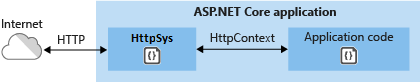

# HTTP.sys web server implementation in ASP.NET Core

By [Tom Dykstra](https://github.com/tdykstra), [Chris Ross](https://github.com/Tratcher), and [Luke Latham](https://github.com/guardrex)

[HTTP.sys](/iis/get-started/introduction-to-iis/introduction-to-iis-architecture#hypertext-transfer-protocol-stack-httpsys) is a [web server for ASP.NET Core](xref:fundamentals/servers) that only runs on Windows. HTTP.sys is an alternative to [Kestrel](xref:fundamentals/servers/kestrel) server and offers some features that Kestrel doesn't provide.

> [!IMPORTANT]
> HTTP.sys is incompatible with the [ASP.NET Core Module](xref:host-and-deploy/aspnet-core-module) and can't be used with IIS or IIS Express.

HTTP.sys supports the following features:

* [Windows Authentication](xref:security/authentication/windowsauth)
* Port sharing
* HTTPS with SNI
* HTTP/2 over TLS (Windows 10 or later)
* Direct file transmission
* Response caching
* WebSockets (Windows 8 or later)

Supported Windows versions:

* Windows 7 or later
* Windows Server 2008 R2 or later

[View or download sample code](https://github.com/aspnet/Docs/tree/master/aspnetcore/host-and-deploy/httpsys/sample) ([how to download](xref:index#how-to-download-a-sample))

## When to use HTTP.sys

HTTP.sys is useful for deployments where:

* There's a need to expose the server directly to the Internet without using IIS.

  

* An internal deployment requires a feature not available in Kestrel, such as [Windows Authentication](xref:security/authentication/windowsauth).

  

HTTP.sys is mature technology that protects against many types of attacks and provides the robustness, security, and scalability of a full-featured web server. IIS itself runs as an HTTP listener on top of HTTP.sys.

## HTTP/2 support

[HTTP/2](https://httpwg.org/specs/rfc7540.html) is enabled for ASP.NET Core apps if the following base requirements are met:

* Windows Server 2016/Windows 10 or later
* [Application-Layer Protocol Negotiation (ALPN)](https://tools.ietf.org/html/rfc7301#section-3) connection
* TLS 1.2 or later connection

::: moniker range=">= aspnetcore-2.2"

If an HTTP/2 connection is established, [HttpRequest.Protocol](xref:Microsoft.AspNetCore.Http.HttpRequest.Protocol*) reports `HTTP/2`.

::: moniker-end

::: moniker range="< aspnetcore-2.2"

If an HTTP/2 connection is established, [HttpRequest.Protocol](xref:Microsoft.AspNetCore.Http.HttpRequest.Protocol*) reports `HTTP/1.1`.

::: moniker-end

HTTP/2 is enabled by default. If an HTTP/2 connection isn't established, the connection falls back to HTTP/1.1. In a future release of Windows, HTTP/2 configuration flags will be available, including the ability to disable HTTP/2 with HTTP.sys.

## Kernel mode authentication with Kerberos

HTTP.sys delegates to kernel mode authentication with the Kerberos authentication protocol. User mode authentication isn't supported with Kerberos and HTTP.sys. The machine account must be used to decrypt the Kerberos token/ticket that's obtained from Active Directory and forwarded by the client to the server to authenticate the user. Register the Service Principal Name (SPN) for the host, not the user of the app.

## How to use HTTP.sys

### Configure the ASP.NET Core app to use HTTP.sys

1. A package reference in the project file isn't required when using the [Microsoft.AspNetCore.App metapackage](xref:fundamentals/metapackage-app) ([nuget.org](https://www.nuget.org/packages/Microsoft.AspNetCore.App/)) (ASP.NET Core 2.1 or later). When not using the `Microsoft.AspNetCore.App` metapackage, add a package reference to [Microsoft.AspNetCore.Server.HttpSys](https://www.nuget.org/packages/Microsoft.AspNetCore.Server.HttpSys/).

2. Call the [UseHttpSys](/dotnet/api/microsoft.aspnetcore.hosting.webhostbuilderhttpsysextensions.usehttpsys) extension method when building the web host, specifying any required [HTTP.sys options](/dotnet/api/microsoft.aspnetcore.server.httpsys.httpsysoptions):

   [!code-csharp[](httpsys/sample/Program.cs?name=snippet1&highlight=4-12)]

   Additional HTTP.sys configuration is handled through [registry settings](https://support.microsoft.com/help/820129/http-sys-registry-settings-for-windows).

   **HTTP.sys options**

   | Property | Description | Default |
   | -------- | ----------- | :-----: |
   | [AllowSynchronousIO](/dotnet/api/microsoft.aspnetcore.server.httpsys.httpsysoptions.allowsynchronousio) | Control whether synchronous input/output is allowed for the `HttpContext.Request.Body` and `HttpContext.Response.Body`. | `true` |
   | [Authentication.AllowAnonymous](/dotnet/api/microsoft.aspnetcore.server.httpsys.authenticationmanager.allowanonymous) | Allow anonymous requests. | `true` |
   | [Authentication.Schemes](/dotnet/api/microsoft.aspnetcore.server.httpsys.authenticationmanager.schemes) | Specify the allowed authentication schemes. May be modified at any time prior to disposing the listener. Values are provided by the [AuthenticationSchemes enum](/dotnet/api/microsoft.aspnetcore.server.httpsys.authenticationschemes): `Basic`, `Kerberos`, `Negotiate`, `None`, and `NTLM`. | `None` |
   | [EnableResponseCaching](/dotnet/api/microsoft.aspnetcore.server.httpsys.httpsysoptions.enableresponsecaching) | Attempt [kernel-mode](/windows-hardware/drivers/gettingstarted/user-mode-and-kernel-mode) caching for responses with eligible headers. The response may not include `Set-Cookie`, `Vary`, or `Pragma` headers. It must include a `Cache-Control` header that's `public` and either a `shared-max-age` or `max-age` value, or an `Expires` header. | `true` |
   | [MaxAccepts](/dotnet/api/microsoft.aspnetcore.server.httpsys.httpsysoptions.maxaccepts) | The maximum number of concurrent accepts. | 5 &times; [Environment.<br>ProcessorCount](/dotnet/api/system.environment.processorcount) |
   | [MaxConnections](/dotnet/api/microsoft.aspnetcore.server.httpsys.httpsysoptions.maxconnections) | The maximum number of concurrent connections to accept. Use `-1` for infinite. Use `null` to use the registry's machine-wide setting. | `null`<br>(unlimited) |
   | [MaxRequestBodySize](/dotnet/api/microsoft.aspnetcore.server.httpsys.httpsysoptions.maxrequestbodysize) | See the <a href="#maxrequestbodysize">MaxRequestBodySize</a> section. | 30000000 bytes<br>(~28.6 MB) |
   | [RequestQueueLimit](/dotnet/api/microsoft.aspnetcore.server.httpsys.httpsysoptions.requestqueuelimit) | The maximum number of requests that can be queued. | 1000 |
   | [ThrowWriteExceptions](/dotnet/api/microsoft.aspnetcore.server.httpsys.httpsysoptions.throwwriteexceptions) | Indicate if response body writes that fail due to client disconnects should throw exceptions or complete normally. | `false`<br>(complete normally) |
   | [Timeouts](/dotnet/api/microsoft.aspnetcore.server.httpsys.httpsysoptions.timeouts) | Expose the HTTP.sys [TimeoutManager](/dotnet/api/microsoft.aspnetcore.server.httpsys.timeoutmanager) configuration, which may also be configured in the registry. Follow the API links to learn more about each setting, including default values:<ul><li>[TimeoutManager.DrainEntityBody](/dotnet/api/microsoft.aspnetcore.server.httpsys.timeoutmanager.drainentitybody) &ndash; Time allowed for the HTTP Server API to drain the entity body on a Keep-Alive connection.</li><li>[TimeoutManager.EntityBody](/dotnet/api/microsoft.aspnetcore.server.httpsys.timeoutmanager.entitybody) &ndash; Time allowed for the request entity body to arrive.</li><li>[TimeoutManager.HeaderWait](/dotnet/api/microsoft.aspnetcore.server.httpsys.timeoutmanager.headerwait) &ndash; Time allowed for the HTTP Server API to parse the request header.</li><li>[TimeoutManager.IdleConnection](/dotnet/api/microsoft.aspnetcore.server.httpsys.timeoutmanager.idleconnection) &ndash; Time allowed for an idle connection.</li><li>[TimeoutManager.MinSendBytesPerSecond](/dotnet/api/microsoft.aspnetcore.server.httpsys.timeoutmanager.minsendbytespersecond) &ndash; The minimum send rate for the response.</li><li>[TimeoutManager.RequestQueue](/dotnet/api/microsoft.aspnetcore.server.httpsys.timeoutmanager.requestqueue) &ndash; Time allowed for the request to remain in the request queue before the app picks it up.</li></ul> |  |
   | [UrlPrefixes](/dotnet/api/microsoft.aspnetcore.server.httpsys.httpsysoptions.urlprefixes) | Specify the [UrlPrefixCollection](/dotnet/api/microsoft.aspnetcore.server.httpsys.urlprefixcollection) to register with HTTP.sys. The most useful is [UrlPrefixCollection.Add](/dotnet/api/microsoft.aspnetcore.server.httpsys.urlprefixcollection.add), which is used to add a prefix to the collection. These may be modified at any time prior to disposing the listener. |  |

   <a name="maxrequestbodysize"></a>
   **MaxRequestBodySize**

   The maximum allowed size of any request body in bytes. When set to `null`, the maximum request body size is unlimited. This limit has no effect on upgraded connections, which are always unlimited.

   The recommended method to override the limit in an ASP.NET Core MVC app for a single `IActionResult` is to use the [RequestSizeLimitAttribute](/dotnet/api/microsoft.aspnetcore.mvc.requestsizelimitattribute) attribute on an action method:

   ```csharp
   [RequestSizeLimit(100000000)]
   public IActionResult MyActionMethod()
   ```

   An exception is thrown if the app attempts to configure the limit on a request after the app has started reading the request. An `IsReadOnly` property can be used to indicate if the `MaxRequestBodySize` property is in a read-only state, meaning it's too late to configure the limit.

   If the app should override [MaxRequestBodySize](/dotnet/api/microsoft.aspnetcore.server.httpsys.httpsysoptions.maxrequestbodysize) per-request, use the [IHttpMaxRequestBodySizeFeature](/dotnet/api/microsoft.aspnetcore.http.features.ihttpmaxrequestbodysizefeature):

   [!code-csharp[](httpsys/sample/Startup.cs?name=snippet1&highlight=6-7)]

3. If using Visual Studio, make sure the app isn't configured to run IIS or IIS Express.

   In Visual Studio, the default launch profile is for IIS Express. To run the project as a console app, manually change the selected profile, as shown in the following screen shot:

   

### Configure Windows Server

1. If the app is a [framework-dependent deployment](/dotnet/core/deploying/#framework-dependent-deployments-fdd), install .NET Core, .NET Framework, or both (if the app is a .NET Core app targeting the .NET Framework).

   * **.NET Core** &ndash; If the app requires .NET Core, obtain and run the .NET Core installer from [.NET All Downloads](https://www.microsoft.com/net/download/all).
   * **.NET Framework** &ndash; If the app requires .NET Framework, see [.NET Framework: Installation guide](/dotnet/framework/install/) to find installation instructions. Install the required .NET Framework. The installer for the latest .NET Framework can be found at [.NET All Downloads](https://www.microsoft.com/net/download/all).

2. Configure URLs and ports for the app.

   By default, ASP.NET Core binds to `http://localhost:5000`. To configure URL prefixes and ports, options include using:

   * [UseUrls](/dotnet/api/microsoft.aspnetcore.hosting.hostingabstractionswebhostbuilderextensions.useurls)
   * `urls` command-line argument
   * `ASPNETCORE_URLS` environment variable
   * [UrlPrefixes](/dotnet/api/microsoft.aspnetcore.server.httpsys.httpsysoptions.urlprefixes)

   The following code example shows how to use [UrlPrefixes](/dotnet/api/microsoft.aspnetcore.server.httpsys.httpsysoptions.urlprefixes):

   [!code-csharp[](httpsys/sample/Program.cs?name=snippet1&highlight=11)]

   An advantage of `UrlPrefixes` is that an error message is generated immediately for improperly formatted prefixes.

   The settings in `UrlPrefixes` override `UseUrls`/`urls`/`ASPNETCORE_URLS` settings. Therefore, an advantage of `UseUrls`, `urls`, and the `ASPNETCORE_URLS` environment variable is that it's easier to switch between Kestrel and HTTP.sys. For more information on `UseUrls`, `urls`, and `ASPNETCORE_URLS`, see the [Host in ASP.NET Core](xref:fundamentals/host/index) topic.

   HTTP.sys uses the [HTTP Server API UrlPrefix string formats](https://msdn.microsoft.com/library/windows/desktop/aa364698.aspx).

   > [!WARNING]
   > Top-level wildcard bindings (`http://*:80/` and `http://+:80`) should **not** be used. Top-level wildcard bindings can open up your app to security vulnerabilities. This applies to both strong and weak wildcards. Use explicit host names rather than wildcards. Subdomain wildcard binding (for example, `*.mysub.com`) doesn't have this security risk if you control the entire parent domain (as opposed to `*.com`, which is vulnerable). See [rfc7230 section-5.4](https://tools.ietf.org/html/rfc7230#section-5.4) for more information.

3. Preregister URL prefixes to bind to HTTP.sys and set up x.509 certificates.

   If URL prefixes aren't preregistered in Windows, run the app with administrator privileges. The only exception is when binding to localhost using HTTP (not HTTPS) with a port number greater than 1024. In that case, administrator privileges aren't required.

   1. The built-in tool for configuring HTTP.sys is *netsh.exe*. *netsh.exe* is used to reserve URL prefixes and assign X.509 certificates. The tool requires administrator privileges.

      The following example shows the commands to reserve URL prefixes for ports 80 and 443:

      ```console
      netsh http add urlacl url=http://+:80/ user=Users
      netsh http add urlacl url=https://+:443/ user=Users
      ```

      The following example shows how to assign an X.509 certificate:

      ```console
      netsh http add sslcert ipport=0.0.0.0:443 certhash=MyCertHash_Here appid="{00000000-0000-0000-0000-000000000000}"
      ```

      Reference documentation for *netsh.exe*:

      * [Netsh Commands for Hypertext Transfer Protocol (HTTP)](https://technet.microsoft.com/library/cc725882.aspx)
      * [UrlPrefix Strings](https://msdn.microsoft.com/library/windows/desktop/aa364698.aspx)

   2. Create self-signed X.509 certificates, if required.

      [!INCLUDE [How to make an X.509 cert](~/includes/make-x509-cert.md)]

4. Open firewall ports to allow traffic to reach HTTP.sys. Use *netsh.exe* or [PowerShell cmdlets](https://technet.microsoft.com/library/jj554906).

## Proxy server and load balancer scenarios

For apps hosted by HTTP.sys that interact with requests from the Internet or a corporate network, additional configuration might be required when hosting behind proxy servers and load balancers. For more information, see [Configure ASP.NET Core to work with proxy servers and load balancers](xref:host-and-deploy/proxy-load-balancer).

## Additional resources

* [HTTP Server API](https://msdn.microsoft.com/library/windows/desktop/aa364510.aspx)
* [aspnet/HttpSysServer GitHub repository (source code)](https://github.com/aspnet/HttpSysServer/)
* <xref:fundamentals/host/index>
* <xref:test/troubleshoot>
