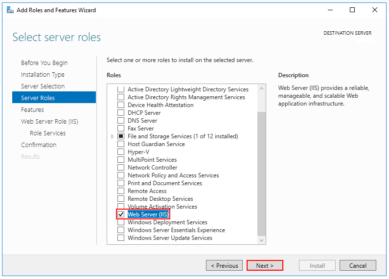
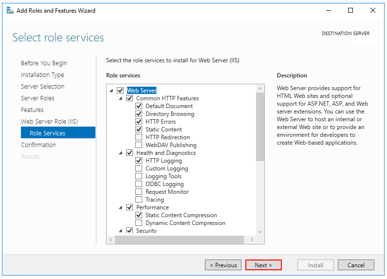
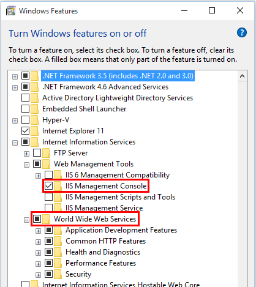
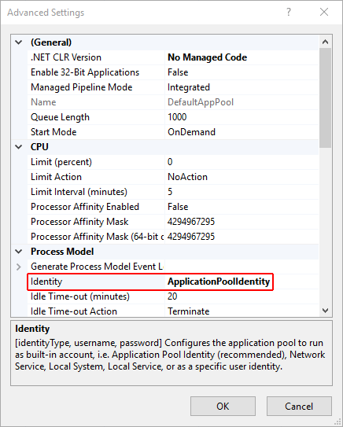
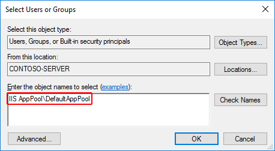
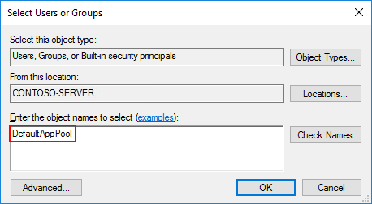
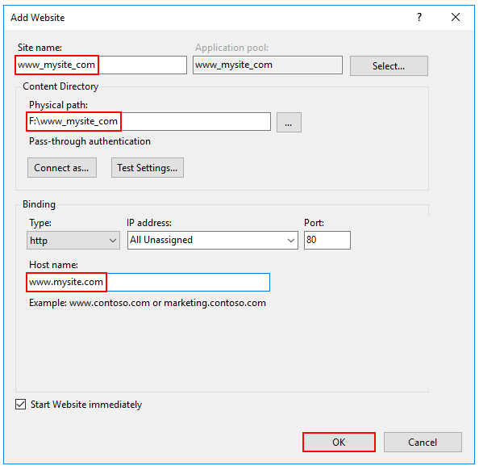
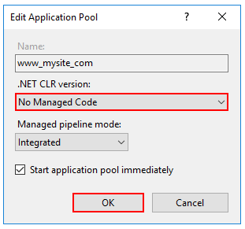

# Advanced configuration of the ASP.NET Core Module and IIS

This article covers advanced configuration options and scenarios for the ASP.NET Core Module and IIS.

## Modify the stack size

*Only applies when using the in-process hosting model.*

Configure the managed stack size using the `stackSize` setting in bytes in the `web.config` file. The default size is 1,048,576 bytes (1 MB). The following example changes the stack size to 2 MB (2,097,152 bytes):

```xml
<aspNetCore processPath="dotnet"
    arguments=".\MyApp.dll"
    stdoutLogEnabled="false"
    stdoutLogFile="\\?\%home%\LogFiles\stdout"
    hostingModel="inprocess">
  <handlerSettings>
    <handlerSetting name="stackSize" value="2097152" />
  </handlerSettings>
</aspNetCore>
```

## Proxy configuration uses HTTP protocol and a pairing token

*Only applies to out-of-process hosting.*

The proxy created between the ASP.NET Core Module and Kestrel uses the HTTP protocol. There's no risk of eavesdropping the traffic between the module and Kestrel from a location off of the server.

A pairing token is used to guarantee that the requests received by Kestrel were proxied by IIS and didn't come from some other source. The pairing token is created and set into an environment variable (`ASPNETCORE_TOKEN`) by the module. The pairing token is also set into a header (`MS-ASPNETCORE-TOKEN`) on every proxied request. IIS Middleware checks each request it receives to confirm that the pairing token header value matches the environment variable value. If the token values are mismatched, the request is logged and rejected. The pairing token environment variable and the traffic between the module and Kestrel aren't accessible from a location off of the server. Without knowing the pairing token value, an attacker can't submit requests that bypass the check in the IIS Middleware.

## ASP.NET Core Module with an IIS Shared Configuration

The ASP.NET Core Module installer runs with the privileges of the `TrustedInstaller` account. Because the local system account doesn't have modify permission for the share path used by the IIS Shared Configuration, the installer throws an access denied error when attempting to configure the module settings in the `applicationHost.config` file on the share.

When using an IIS Shared Configuration on the same machine as the IIS installation, run the ASP.NET Core Hosting Bundle installer with the `OPT_NO_SHARED_CONFIG_CHECK` parameter set to `1`:

```console
dotnet-hosting-{VERSION}.exe OPT_NO_SHARED_CONFIG_CHECK=1
```

When the path to the shared configuration isn't on the same machine as the IIS installation, follow these steps:

1. Disable the IIS Shared Configuration.
1. Run the installer.
1. Export the updated `applicationHost.config` file to the file share.
1. Re-enable the IIS Shared Configuration.

## Data protection

The [ASP.NET Core Data Protection stack](xref:security/data-protection/introduction) is used by several ASP.NET Core [middlewares](xref:fundamentals/middleware/index), including middleware used in authentication. Even if Data Protection APIs aren't called by user code, data protection should be configured with a deployment script or in user code to create a persistent cryptographic [key store](xref:security/data-protection/implementation/key-management). If data protection isn't configured, the keys are held in memory and discarded when the app restarts.

If the Data Protection key ring is stored in memory when the app restarts:

* All cookie-based authentication tokens are invalidated. 
* Users are required to sign in again on their next request. 
* Any data protected with the key ring can no longer be decrypted. This may include [CSRF tokens](xref:security/anti-request-forgery#aspnet-core-antiforgery-configuration) and [ASP.NET Core MVC TempData cookies](xref:fundamentals/app-state#tempdata).

To configure data protection under IIS to persist the key ring, use **one** of the following approaches:

* **Create Data Protection Registry keys**

  Data Protection keys used by ASP.NET Core apps are stored in the registry external to the apps. To persist the keys for a given app, create Registry keys for the app pool.

  For standalone, non-webfarm IIS installations, the [Data Protection Provision-AutoGenKeys.ps1 PowerShell script](https://github.com/dotnet/AspNetCore/blob/main/src/DataProtection/Provision-AutoGenKeys.ps1) can be used for each app pool used with an ASP.NET Core app. This script creates a Registry key in the HKLM registry that's accessible only to the worker process account of the app's app pool. Keys are encrypted at rest using DPAPI with a machine-wide key.

  In web farm scenarios, an app can be configured to use a UNC path to store its Data Protection key ring. By default, the keys aren't encrypted. Ensure that the file permissions for the network share are limited to the Windows account that the app runs under. An X509 certificate can be used to protect keys at rest. Consider a mechanism to allow users to upload certificates. Place certificates into the user's trusted certificate store and ensure they're available on all machines where the user's app runs. For more information, see <xref:security/data-protection/configuration/overview>.

* **Configure the IIS Application Pool to load the user profile**

  This setting is in the **Process Model** section under the **Advanced Settings** for the app pool. Set **Load User Profile** to `True`. When set to `True`, keys are stored in the user profile directory and protected using DPAPI with a key specific to the user account. Keys are persisted to the `%LOCALAPPDATA%/ASP.NET/DataProtection-Keys` folder.

  The app pool's [`setProfileEnvironment` attribute](/iis/configuration/system.applicationhost/applicationpools/add/processmodel#configuration) must also be enabled. The default value of `setProfileEnvironment` is `true`. In some scenarios (for example, Windows OS), `setProfileEnvironment` is set to `false`. If keys aren't stored in the user profile directory as expected:

  1. Navigate to the `%windir%/system32/inetsrv/config` folder.
  1. Open the `applicationHost.config` file.
  1. Locate the `<system.applicationHost><applicationPools><applicationPoolDefaults><processModel>` element.
  1. Confirm that the `setProfileEnvironment` attribute isn't present, which defaults the value to `true`, or explicitly set the attribute's value to `true`.

* **Use the file system as a key ring store**

  Adjust the app code to [use the file system as a key ring store](xref:security/data-protection/configuration/overview). Use an X509 certificate to protect the key ring and ensure the certificate is a trusted certificate. If the certificate is self-signed, place the certificate in the Trusted Root store.

  When using IIS in a web farm:

  * Use a file share that all machines can access.
  * Deploy an X509 certificate to each machine. Configure [Data Protection in code](xref:security/data-protection/configuration/overview).

* **Set a machine-wide policy for Data Protection**

  The Data Protection system has limited support for setting a default [machine-wide policy](xref:security/data-protection/configuration/machine-wide-policy) for all apps that consume the Data Protection APIs. For more information, see <xref:security/data-protection/introduction>.

## IIS configuration

**Windows Server operating systems**

Enable the **Web Server (IIS)** server role and establish role services.

1. Use the **Add Roles and Features** wizard from the **Manage** menu or the link in **Server Manager**. On the **Server Roles** step, check the box for **Web Server (IIS)**.

   

1. After the **Features** step, the **Role services** step loads for Web Server (IIS). Select the IIS role services desired or accept the default role services provided.

   

   **Windows Authentication (Optional)**  
   To enable Windows Authentication, expand the following nodes: **Web Server** > **Security**. Select the **Windows Authentication** feature. For more information, see [Windows Authentication `<windowsAuthentication>`](/iis/configuration/system.webServer/security/authentication/windowsAuthentication/) and [Configure Windows authentication](xref:security/authentication/windowsauth).

   **WebSockets (Optional)**  
   WebSockets is supported with ASP.NET Core 1.1 or later. To enable WebSockets, expand the following nodes: **Web Server** > **Application Development**. Select the **WebSocket Protocol** feature. For more information, see [WebSockets](xref:fundamentals/websockets).

1. Proceed through the **Confirmation** step to install the web server role and services. A server/IIS restart isn't required after installing the **Web Server (IIS)** role.

**Windows desktop operating systems**

Enable the **IIS Management Console** and **World Wide Web Services**.

1. Navigate to **Control Panel** > **Programs** > **Programs and Features** > **Turn Windows features on or off** (left side of the screen).

1. Open the **Internet Information Services** node. Open the **Web Management Tools** node.

1. Check the box for **IIS Management Console**.

1. Check the box for **World Wide Web Services**.

1. Accept the default features for **World Wide Web Services** or customize the IIS features.

   **Windows Authentication (Optional)**  
   To enable Windows Authentication, expand the following nodes: **World Wide Web Services** > **Security**. Select the **Windows Authentication** feature. For more information, see [Windows Authentication `<windowsAuthentication>`](/iis/configuration/system.webServer/security/authentication/windowsAuthentication/) and [Configure Windows authentication](xref:security/authentication/windowsauth).

   **WebSockets (Optional)**  
   WebSockets is supported with ASP.NET Core 1.1 or later. To enable WebSockets, expand the following nodes: **World Wide Web Services** > **Application Development Features**. Select the **WebSocket Protocol** feature. For more information, see [WebSockets](xref:fundamentals/websockets).

1. If the IIS installation requires a restart, restart the system.



## Virtual Directories

[IIS Virtual Directories](/iis/get-started/planning-your-iis-architecture/understanding-sites-applications-and-virtual-directories-on-iis#virtual-directories) aren't supported with ASP.NET Core apps. An app can be hosted as a [sub-application](#sub-applications).

## Sub-applications

An ASP.NET Core app can be hosted as an [IIS sub-application (sub-app)](/iis/get-started/planning-your-iis-architecture/understanding-sites-applications-and-virtual-directories-on-iis#applications). The sub-app's path becomes part of the root app's URL.

Static asset links within the sub-app should use tilde-slash (`~/`) notation. Tilde-slash notation triggers a [Tag Helper](xref:mvc/views/tag-helpers/intro) to prepend the sub-app's pathbase to the rendered relative link. For a sub-app at `/subapp_path`, an image linked with `src="~/image.png"` is rendered as `src="/subapp_path/image.png"`. The root app's Static File Middleware doesn't process the static file request. The request is processed by the sub-app's Static File Middleware.

If a static asset's `src` attribute is set to an absolute path (for example, `src="/image.png"`), the link is rendered without the sub-app's pathbase. The root app's Static File Middleware attempts to serve the asset from the root app's [web root](xref:fundamentals/index#web-root), which results in a *404 - Not Found* response unless the static asset is available from the root app.

To host an ASP.NET Core app as a sub-app under another ASP.NET Core app:

1. Establish an app pool for the sub-app. Set the **.NET CLR Version** to **No Managed Code** because the Core Common Language Runtime (CoreCLR) for .NET Core is booted to host the app in the worker process, not the desktop CLR (.NET CLR).

1. Add the root site in IIS Manager with the sub-app in a folder under the root site.

1. Right-click the sub-app folder in IIS Manager and select **Convert to Application**.

1. In the **Add Application** dialog, use the **Select** button for the **Application Pool** to assign the app pool that you created for the sub-app. Select **OK**.

The assignment of a separate app pool to the sub-app is a requirement when using the in-process hosting model.

For more information on the in-process hosting model and configuring the ASP.NET Core Module, see <xref:host-and-deploy/aspnet-core-module>.

## Application Pools

App pool isolation is determined by the hosting model:

* In-process hosting: Apps are required to run in separate app pools.
* Out-of-process hosting: We recommend isolating the apps from each other by running each app in its own app pool.

The IIS **Add Website** dialog defaults to a single app pool per app. When a **Site name** is provided, the text is automatically transferred to the **Application pool** textbox. A new app pool is created using the site name when the site is added.

## Application Pool Identity

An app pool identity account allows an app to run under a unique account without having to create and manage domains or local accounts. On IIS 8.0 or later, the IIS Admin Worker Process (WAS) creates a virtual account with the name of the new app pool and runs the app pool's worker processes under this account by default. In the IIS Management Console under **Advanced Settings** for the app pool, ensure that the **Identity** is set to use `ApplicationPoolIdentity`:



The IIS management process creates a secure identifier with the name of the app pool in the Windows Security System. Resources can be secured using this identity. However, this identity isn't a real user account and doesn't show up in the Windows User Management Console.

If the IIS worker process requires elevated access to the app, modify the Access Control List (ACL) for the directory containing the app:

1. Open Windows Explorer and navigate to the directory.

1. Right-click on the directory and select **Properties**.

1. Under the **Security** tab, select the **Edit** button and then the **Add** button.

1. Select the **Locations** button and make sure the system is selected.

1. Enter `IIS AppPool\{APP POOL NAME}` format, where the placeholder `{APP POOL NAME}` is the app pool name, in **Enter the object names to select** area. Select the **Check Names** button. For the *DefaultAppPool* check the names using `IIS AppPool\DefaultAppPool`. When the **Check Names** button is selected, a value of `DefaultAppPool` is indicated in the object names area. It isn't possible to enter the app pool name directly into the object names area. Use the `IIS AppPool\{APP POOL NAME}` format, where the placeholder `{APP POOL NAME}` is the app pool name, when checking for the object name.

   

1. Select **OK**.

   

1. Read &amp; execute permissions should be granted by default. Provide additional permissions as needed.

Access can also be granted at a command prompt using the **ICACLS** tool. Using the *DefaultAppPool* as an example, the following command is used:

```console
ICACLS C:\sites\MyWebApp /grant "IIS AppPool\DefaultAppPool":F
```

For more information, see the [icacls](/windows-server/administration/windows-commands/icacls) topic.

## HTTP/2 support

[HTTP/2](https://httpwg.org/specs/rfc7540.html) is supported with ASP.NET Core in the following IIS deployment scenarios:

* In-process
  * Windows Server 2016/Windows 10 or later; IIS 10 or later
  * TLS 1.2 or later connection
* Out-of-process
  * Windows Server 2016/Windows 10 or later; IIS 10 or later
  * Public-facing edge server connections use HTTP/2, but the reverse proxy connection to the [Kestrel server](xref:fundamentals/servers/kestrel) uses HTTP/1.1.
  * TLS 1.2 or later connection

For an in-process deployment when an HTTP/2 connection is established, [`HttpRequest.Protocol`](xref:Microsoft.AspNetCore.Http.HttpRequest.Protocol*) reports `HTTP/2`. For an out-of-process deployment when an HTTP/2 connection is established, [`HttpRequest.Protocol`](xref:Microsoft.AspNetCore.Http.HttpRequest.Protocol*) reports `HTTP/1.1`.

For more information on the in-process and out-of-process hosting models, see <xref:host-and-deploy/aspnet-core-module>.

HTTP/2 is enabled by default. Connections fall back to HTTP/1.1 if an HTTP/2 connection isn't established. For more information on HTTP/2 configuration with IIS deployments, see [HTTP/2 on IIS](/iis/get-started/whats-new-in-iis-10/http2-on-iis).

## CORS preflight requests

*This section only applies to ASP.NET Core apps that target the .NET Framework.*

For an ASP.NET Core app that targets the .NET Framework, OPTIONS requests aren't passed to the app by default in IIS. To learn how to configure the app's IIS handlers in `web.config` to pass OPTIONS requests, see [Enable cross-origin requests in ASP.NET Web API 2: How CORS Works](/aspnet/web-api/overview/security/enabling-cross-origin-requests-in-web-api#how-cors-works).

## Application Initialization Module and Idle Timeout

When hosted in IIS by the ASP.NET Core Module version 2:

* [Application Initialization Module](#application-initialization-module): App's hosted [in-process](xref:host-and-deploy/iis/in-process-hosting) or [out-of-process](xref:host-and-deploy/iis/out-of-process-hosting) can be configured to start automatically on a worker process restart or server restart.
* [Idle Timeout](#idle-timeout): App's hosted [in-process](xref:host-and-deploy/iis/in-process-hosting) can be configured not to time out during periods of inactivity.

### Application Initialization Module

*Applies to apps hosted in-process and out-of-process.*

[IIS Application Initialization](/iis/get-started/whats-new-in-iis-8/iis-80-application-initialization) is an IIS feature that sends an HTTP request to the app when the app pool starts or is recycled. The request triggers the app to start. By default, IIS issues a request to the app's root URL (`/`) to initialize the app (see the [additional resources](#application-initialization-module-and-idle-timeout-additional-resources) for more details on configuration).

Confirm that the IIS Application Initialization role feature in enabled:

On Windows 7 or later desktop systems when using IIS locally:

1. Navigate to **Control Panel** > **Programs** > **Programs and Features** > **Turn Windows features on or off** (left side of the screen).
1. Open **Internet Information Services** > **World Wide Web Services** > **Application Development Features**.
1. Select the checkbox for **Application Initialization**.

On Windows Server 2008 R2 or later:

1. Open the **Add Roles and Features Wizard**.
1. In the **Select role services** panel, open the **Application Development** node.
1. Select the checkbox for **Application Initialization**.

Use either of the following approaches to enable the Application Initialization Module for the site:

* Using IIS Manager:

  1. Select **Application Pools** in the **Connections** panel.
  1. Right-click the app's app pool in the list and select **Advanced Settings**.
  1. The default **Start Mode** is `OnDemand`. Set the **Start Mode** to `AlwaysRunning`. Select **OK**.
  1. Open the **Sites** node in the **Connections** panel.
  1. Right-click the app and select **Manage Website** > **Advanced Settings**.
  1. The default **Preload Enabled** setting is `False`. Set **Preload Enabled** to `True`. Select **OK**.

* Using `web.config`, add the `<applicationInitialization>` element with `doAppInitAfterRestart` set to `true` to the `<system.webServer>` elements in the app's `web.config` file:

  ```xml
  <?xml version="1.0" encoding="utf-8"?>
  <configuration>
    <location path="." inheritInChildApplications="false">
      <system.webServer>
        <applicationInitialization doAppInitAfterRestart="true" />
      </system.webServer>
    </location>
  </configuration>
  ```

### Idle Timeout

*Only applies to apps hosted in-process.*

To prevent the app from idling, set the app pool's idle timeout using IIS Manager:

1. Select **Application Pools** in the **Connections** panel.
1. Right-click the app's app pool in the list and select **Advanced Settings**.
1. The default **Idle Time-out (minutes)** is `20` minutes. Set the **Idle Time-out (minutes)** to `0` (zero). Select **OK**.
1. Recycle the worker process.

To prevent apps hosted [out-of-process](xref:host-and-deploy/iis/out-of-process-hosting) from timing out, use either of the following approaches:

* Ping the app from an external service in order to keep it running.
* If the app only hosts background services, avoid IIS hosting and use a [Windows Service to host the ASP.NET Core app](xref:host-and-deploy/windows-service).

### Application Initialization Module and Idle Timeout additional resources

* [IIS 8.0 Application Initialization](/iis/get-started/whats-new-in-iis-8/iis-80-application-initialization)
* [Application Initialization `<applicationInitialization>`](/iis/configuration/system.webserver/applicationinitialization/).
* [Process Model Settings for an Application Pool `<processModel>`](/iis/configuration/system.applicationhost/applicationpools/add/processmodel).

## Module, schema, and configuration file locations

### Module

**IIS (x86/amd64)**:

* `%windir%\System32\inetsrv\aspnetcore.dll`

* `%windir%\SysWOW64\inetsrv\aspnetcore.dll`

* `%ProgramFiles%\IIS\Asp.Net Core Module\V2\aspnetcorev2.dll`

* `%ProgramFiles(x86)%\IIS\Asp.Net Core Module\V2\aspnetcorev2.dll`

**IIS Express (x86/amd64)**:

* `%ProgramFiles%\IIS Express\aspnetcore.dll`

* `%ProgramFiles(x86)%\IIS Express\aspnetcore.dll`

* `%ProgramFiles%\IIS Express\Asp.Net Core Module\V2\aspnetcorev2.dll`

* `%ProgramFiles(x86)%\IIS Express\Asp.Net Core Module\V2\aspnetcorev2.dll`

### Schema

**IIS**

* `%windir%\System32\inetsrv\config\schema\aspnetcore_schema.xml`

* `%windir%\System32\inetsrv\config\schema\aspnetcore_schema_v2.xml`

**IIS Express**

* `%ProgramFiles%\IIS Express\config\schema\aspnetcore_schema.xml`

* `%ProgramFiles%\IIS Express\config\schema\aspnetcore_schema_v2.xml`

### Configuration

**IIS**

* `%windir%\System32\inetsrv\config\applicationHost.config`

**IIS Express**

* Visual Studio: `{APPLICATION ROOT}\.vs\config\applicationHost.config`

* *iisexpress.exe* CLI: `%USERPROFILE%\Documents\IISExpress\config\applicationhost.config`

The files can be found by searching for `aspnetcore` in the `applicationHost.config` file.

## Install Web Deploy when publishing with Visual Studio

When deploying apps to servers with [Web Deploy](/iis/install/installing-publishing-technologies/installing-and-configuring-web-deploy-on-iis-80-or-later), install the latest version of Web Deploy on the server. To install Web Deploy, use the [Web Platform Installer (WebPI)](https://www.microsoft.com/web/downloads/platform.aspx) or obtain an installer directly from the [Microsoft Download Center](https://www.microsoft.com/download/details.aspx?id=43717). The preferred method is to use WebPI. WebPI offers a standalone setup and a configuration for hosting providers.

## Create the IIS site

1. On the hosting system, create a folder to contain the app's published folders and files. In a following step, the folder's path is provided to IIS as the physical path to the app. For more information on an app's deployment folder and file layout, see <xref:host-and-deploy/directory-structure>.

1. In IIS Manager, open the server's node in the **Connections** panel. Right-click the **Sites** folder. Select **Add Website** from the contextual menu.

1. Provide a **Site name** and set the **Physical path** to the app's deployment folder. Provide the **Binding** configuration and create the website by selecting **OK**:

   

   > [!WARNING]
   > Top-level wildcard bindings (`http://*:80/` and `http://+:80`) should **not** be used. Top-level wildcard bindings can open up your app to security vulnerabilities. This applies to both strong and weak wildcards. Use explicit host names rather than wildcards. Subdomain wildcard binding (for example, `*.mysub.com`) doesn't have this security risk if you control the entire parent domain (as opposed to `*.com`, which is vulnerable). See [rfc7230 section-5.4](https://tools.ietf.org/html/rfc7230#section-5.4) for more information.

1. Under the server's node, select **Application Pools**.

1. Right-click the site's app pool and select **Basic Settings** from the contextual menu.

1. In the **Edit Application Pool** window, set the **.NET CLR version** to **No Managed Code**:

   

    ASP.NET Core runs in a separate process and manages the runtime. ASP.NET Core doesn't rely on loading the desktop CLR (.NET CLR). The Core Common Language Runtime (CoreCLR) for .NET Core is booted to host the app in the worker process. Setting the **.NET CLR version** to **No Managed Code** is optional but recommended.

   * For a 32-bit (x86) [self-contained deployment](/dotnet/core/deploying/#self-contained-deployments-scd) published with a 32-bit SDK that uses the in-process hosting model, enable the Application Pool for 32-bit. In IIS Manager, navigate to **Application Pools** in the **Connections** sidebar. Select the app's Application Pool. In the **Actions** sidebar, select **Advanced Settings**. Set **Enable 32-Bit Applications** to `True`. 

   * For a 64-bit (x64) [self-contained deployment](/dotnet/core/deploying/#self-contained-deployments-scd) that uses the in-process hosting model, disable the app pool for 32-bit (x86) processes. In IIS Manager, navigate to **Application Pools** in the **Connections** sidebar. Select the app's Application Pool. In the **Actions** sidebar, select **Advanced Settings**. Set **Enable 32-Bit Applications** to `False`. 

1. Confirm the process model identity has the proper permissions.

   If the default identity of the app pool (**Process Model** > **Identity**) is changed from **ApplicationPoolIdentity** to another identity, verify that the new identity has the required permissions to access the app's folder, database, and other required resources. For example, the app pool requires read and write access to folders where the app reads and writes files.

**Windows Authentication configuration (Optional)**  
For more information, see [Configure Windows authentication](xref:security/authentication/windowsauth).

 :::moniker range="= aspnetcore-7.0"

## Shadow copy

Shadow copying app assemblies to the [ASP.NET Core Module (ANCM)](xref:host-and-deploy/aspnet-core-module) for IIS can provide a better end user experience than stopping the app by deploying an [app offline file](xref:host-and-deploy/iis/app-offline).

When an ASP.NET Core app is running on Windows, the binaries are locked so that they can't be modified or replaced. Shadow copying enables the app assemblies to be updated while the app is running by making a copy of the assemblies.

Shadow copy isn't intended to enable zero-downtime deployment, so its expected that IIS will still recycle the app, and some requests may get an [503 Service Unavailable](https://developer.mozilla.org/docs/Web/HTTP/Status/503) response.  We recommend using a pattern like [blue-green deployments](https://www.martinfowler.com/bliki/BlueGreenDeployment.html) or [Azure deployment slots](/azure/app-service/deploy-best-practices#use-deployment-slots) for zero-downtime deployments. Shadow copy helps minimize downtime on deployments, but can't completely eliminate it.

Shadow copying is enabled by customizing the ANCM handler settings in `web.config`:

```
<?xml version="1.0" encoding="utf-8"?>
<configuration>
  <system.webServer>
    <handlers>
      <remove name="aspNetCore"/>
      <add name="aspNetCore" path="*" verb="*" modules="AspNetCoreModuleV2" resourceType="Unspecified"/>
    </handlers>
    <aspNetCore processPath="%LAUNCHER_PATH%" arguments="%LAUNCHER_ARGS%" stdoutLogEnabled="false" stdoutLogFile=".logsstdout">
      <handlerSettings>
        <handlerSetting name="enableShadowCopy" value="true" />
        <!-- Ensure that the IIS ApplicationPool identity has permission to this directory -->
        <handlerSetting name="shadowCopyDirectory" value="../ShadowCopyDirectory/" />
      </handlerSettings>
    </aspNetCore>
  </system.webServer>
</configuration>
```

:::moniker-end
