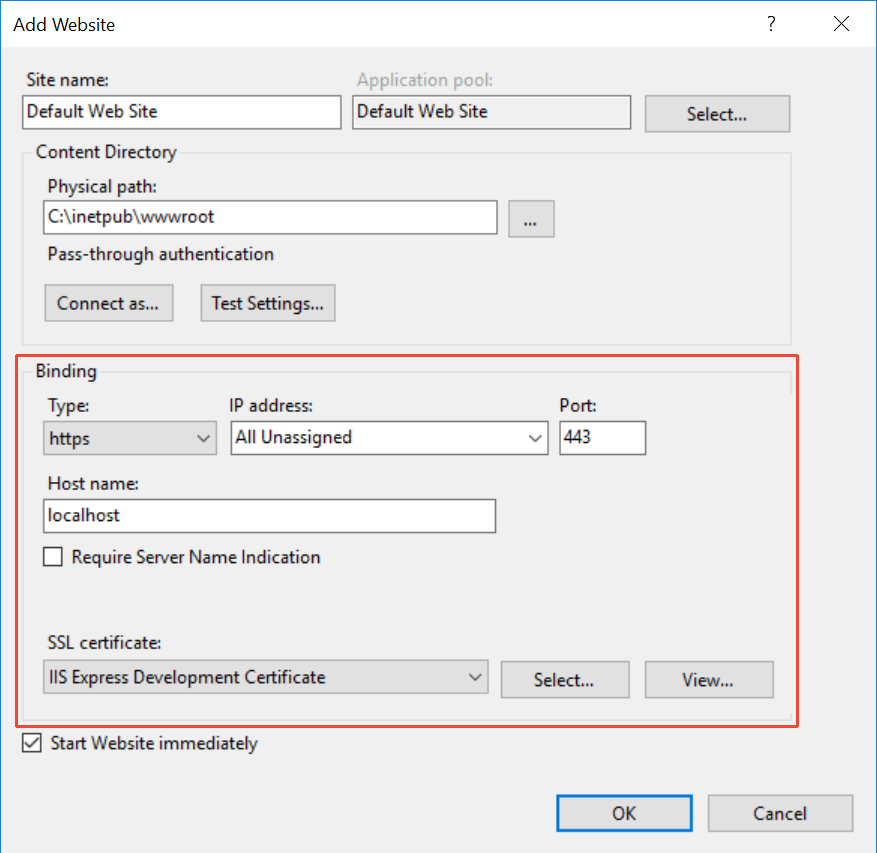
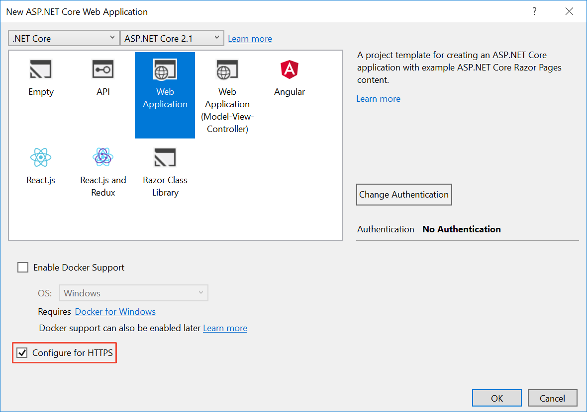
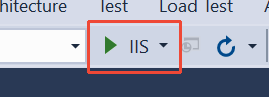

# Development-time IIS support in Visual Studio for ASP.NET Core

By [Sourabh Shirhatti](https://twitter.com/sshirhatti) and [Luke Latham](https://github.com/guardrex)

This article describes [Visual Studio](https://www.visualstudio.com/vs/) support for debugging ASP.NET Core apps running behind IIS on Windows Server. This topic walks through enabling this feature and setting up a project.

## Prerequisites

* [Visual Studio for Windows](https://www.microsoft.com/net/download/windows)
* **ASP.NET and web development** workload
* **.NET Core cross-platform development** workload
* X.509 security certificate

## Enable IIS

1. Navigate to **Control Panel** > **Programs** > **Programs and Features** > **Turn Windows features on or off** (left side of the screen).
1. Select the **Internet Information Services** check box.


The IIS installation may require a system restart.

## Configure IIS

IIS must have a website configured with the following:

* A host name that matches the app's launch profile URL host name.
* Binding for port 443 with an assigned certificate.

For example, the **Host name** for an added website is set to "localhost" (the launch profile will also use "localhost" later in this topic). The port is set to "443" (HTTPS). The **IIS Express Development Certificate** is assigned to the website, but any valid certificate works:



If the IIS installation already has a **Default Web Site** with a host name that matches the app's launch profile URL host name:

* Add a port binding for port 443 (HTTPS).
* Assign a valid certificate to the website.

## Enable development-time IIS support in Visual Studio

1. Launch the Visual Studio installer.
1. Select the **Development time IIS support** component. The component is listed as optional in the **Summary** panel for the **ASP.NET and web development** workload. The component installs the [ASP.NET Core Module](xref:host-and-deploy/aspnet-core-module), which is a native IIS module required to run ASP.NET Core apps with IIS.


## Configure the project

### HTTPS redirection

For a new project, select the check box to **Configure for HTTPS** in the **New ASP.NET Core Web Application** window:



In an existing project, use HTTPS Redirection Middleware in `Startup.Configure` by calling the [UseHttpsRedirection](/dotnet/api/microsoft.aspnetcore.builder.httpspolicybuilderextensions.usehttpsredirection) extension method:

```csharp
public void Configure(IApplicationBuilder app, IHostingEnvironment env)
{
    if (env.IsDevelopment())
    {
        app.UseDeveloperExceptionPage();
    }
    else
    {
        app.UseExceptionHandler("/Error");
        app.UseHsts();
    }

    app.UseHttpsRedirection();
    app.UseStaticFiles();
    app.UseCookiePolicy();

    app.UseMvc();
}
```

### IIS launch profile

Create a new launch profile to add development-time IIS support:

1. For **Profile**, select the **New** button. Name the profile "IIS" in the popup window. Select **OK** to create the profile.
1. For the **Launch** setting, select **IIS** from the list.
1. Select the check box for **Launch browser** and provide the endpoint URL. Use the HTTPS protocol. This example uses `https://localhost/WebApplication1`.
1. In the **Environment variables** section, select the **Add** button. Provide an environment variable with a key of `ASPNETCORE_ENVIRONMENT` and a value of `Development`.
1. In the **Web Server Settings** area, set the **App URL**. This example uses `https://localhost/WebApplication1`.
1. Save the profile.


Alternatively, manually add a launch profile to the [launchSettings.json](http://json.schemastore.org/launchsettings) file in the app:

```json
{
  "iisSettings": {
    "windowsAuthentication": false,
    "anonymousAuthentication": true,
    "iis": {
      "applicationUrl": "https://localhost/WebApplication1",
      "sslPort": 0
    }
  },
  "profiles": {
    "IIS": {
      "commandName": "IIS",
      "launchBrowser": true,
      "launchUrl": "https://localhost/WebApplication1",
      "environmentVariables": {
        "ASPNETCORE_ENVIRONMENT": "Development"
      }
    }
  }
}
```

## Run the project

In Visual Studio:

* Confirm that the build configuration drop-down list is set to **Debug**.
* Set the Run button to the **IIS** profile and select the button to start the app.



Visual Studio may prompt a restart if not running as an administrator. If prompted, restart Visual Studio.

If an untrusted development certificate is used, the browser may require you to create an exception for the untrusted certificate.

> [!NOTE]
> Debugging a Release build configuration with [Just My Code](/visualstudio/debugger/just-my-code) and compiler optimizations results in a degraded experience. For example, break points aren't hit.

## Additional resources

* [Host ASP.NET Core on Windows with IIS](xref:host-and-deploy/iis/index)
* [Introduction to ASP.NET Core Module](xref:host-and-deploy/aspnet-core-module)
* [ASP.NET Core Module configuration reference](xref:host-and-deploy/aspnet-core-module)
* [Enforce HTTPS](xref:security/enforcing-ssl)
