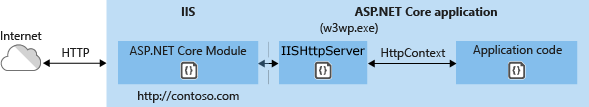

# In-process hosting with IIS and ASP.NET Core

:::moniker range=">= aspnetcore-6.0"

In-process hosting runs an ASP.NET Core app in the same process as its IIS worker process. In-process hosting provides improved performance over out-of-process hosting because requests aren't proxied over the loopback adapter, a network interface that returns outgoing network traffic back to the same machine.

The following diagram illustrates the relationship between IIS, the ASP.NET Core Module, and an app hosted in-process:



## Enable in-process hosting

Since ASP.NET Core 3.0, in-process hosting has been enabled by default for all app deployed to IIS.

To explicitly configure an app for in-process hosting, set the value of the `<AspNetCoreHostingModel>` property to `InProcess` in the project file (`.csproj`):

```xml
<PropertyGroup>
  <AspNetCoreHostingModel>InProcess</AspNetCoreHostingModel>
</PropertyGroup>
```

## General architecture

The general flow of a request is as follows:

1. A request arrives from the web to the kernel-mode HTTP.sys driver.
1. The driver routes the native request to IIS on the website's configured port, usually 80 (HTTP) or 443 (HTTPS).
1. The ASP.NET Core Module receives the native request and passes it to IIS HTTP Server (`IISHttpServer`). IIS HTTP Server is an in-process server implementation for IIS that converts the request from native to managed.

After the IIS HTTP Server processes the request:

1. The request is sent to the ASP.NET Core middleware pipeline.
1. The middleware pipeline handles the request and passes it on as an `HttpContext` instance to the app's logic.
1. The app's response is passed back to IIS through IIS HTTP Server.
1. IIS sends the response to the client that initiated the request.

`CreateDefaultBuilder` adds an <xref:Microsoft.AspNetCore.Hosting.Server.IServer> instance by calling the <xref:Microsoft.AspNetCore.Hosting.WebHostBuilderIISExtensions.UseIIS%2A> method to boot the [CoreCLR](/dotnet/standard/glossary#coreclr) and host the app inside of the IIS worker process (`w3wp.exe` or `iisexpress.exe`). Performance tests indicate that hosting a .NET Core app in-process delivers significantly higher request throughput compared to hosting the app out-of-process and proxying requests to [Kestrel](xref:fundamentals/servers/kestrel).

Apps published as a single file executable can't be loaded by the in-process hosting model.

## Application configuration

To configure IIS options, include a service configuration for <xref:Microsoft.AspNetCore.Builder.IISServerOptions> in `Program.cs`. The following example disables <xref:Microsoft.AspNetCore.Builder.IISServerOptions.AutomaticAuthentication%2A>:

[!code-csharp[](~/host-and-deploy/iis/in-process-hosting/6.0samples/Program.cs?highlight=17-20)]

| Option | Default | Setting |
| ------ | :-----: | ------- |
| `AutomaticAuthentication` | `true` | If `true`, IIS Server sets the `HttpContext.User` authenticated by [Windows Authentication](xref:security/authentication/windowsauth). If `false`, the server only provides an identity for `HttpContext.User` and responds to challenges when explicitly requested by the `AuthenticationScheme`. Windows Authentication must be enabled in IIS for `AutomaticAuthentication` to function. For more information, see [Windows Authentication](xref:security/authentication/windowsauth). |
| `AuthenticationDisplayName` | `null` | Sets the display name shown to users on login pages. |
| `AllowSynchronousIO` | `false` | Whether synchronous I/O is allowed for the `HttpContext.Request` and the `HttpContext.Response`. |
| `MaxRequestBodySize` | `30000000` | Gets or sets the max request body size for the `HttpRequest`. Note that IIS itself has the limit `maxAllowedContentLength` which will be processed before the `MaxRequestBodySize` set in the `IISServerOptions`. Changing the `MaxRequestBodySize` won't affect the `maxAllowedContentLength`. To increase `maxAllowedContentLength`, add an entry in the `web.config` to set `maxAllowedContentLength` to a higher value. For more details, see [Configuration](/iis/configuration/system.webServer/security/requestFiltering/requestLimits/#configuration). |

## Differences between in-process and out-of-process hosting

The following characteristics apply when hosting in-process:

* IIS HTTP Server (`IISHttpServer`) is used instead of [Kestrel](xref:fundamentals/servers/kestrel) server. For in-process, [`CreateDefaultBuilder`](xref:fundamentals/host/generic-host#default-builder-settings) calls <xref:Microsoft.AspNetCore.Hosting.WebHostBuilderIISExtensions.UseIIS%2A> to:

  * Register the `IISHttpServer`.
  * Configure the port and base path the server should listen on when running behind the ASP.NET Core Module.
  * Configure the host to capture startup errors.

* The [`requestTimeout` attribute](xref:host-and-deploy/iis/web-config#attributes-of-the-aspnetcore-element) doesn't apply to in-process hosting.

* Sharing an app pool among apps isn't supported. Use one app pool per app.

* The architecture (bitness) of the app and installed runtime (x64 or x86) must match the architecture of the app pool. For example, apps published for 32-bit (x86) must have 32-bit enabled for their IIS Application Pools. For more information, see the [Create the IIS site](xref:tutorials/publish-to-iis#create-the-iis-site) section.

* Client disconnects are detected. The [`HttpContext.RequestAborted`](xref:Microsoft.AspNetCore.Http.HttpContext.RequestAborted%2A) cancellation token is cancelled when the client disconnects.

* When hosting in-process, <xref:Microsoft.AspNetCore.Authentication.AuthenticationService.AuthenticateAsync%2A> isn't called internally to initialize a user. Therefore, an <xref:Microsoft.AspNetCore.Authentication.IClaimsTransformation> implementation used to transform claims after every authentication isn't activated by default. When transforming claims with an <xref:Microsoft.AspNetCore.Authentication.IClaimsTransformation> implementation, call <xref:Microsoft.Extensions.DependencyInjection.AuthenticationServiceCollectionExtensions.AddAuthentication%2A> to add authentication services:

[!code-csharp[](~/host-and-deploy/iis/in-process-hosting/6.0samples/Program.cs?highlight=22-23)]
  
* [Web Package (single-file) deployments](/aspnet/web-forms/overview/deployment/web-deployment-in-the-enterprise/deploying-web-packages) aren't supported.

:::moniker-end

:::moniker range=">= aspnetcore-8.0"

<a name="ihsrtf8"></a>

## Get timing information

See [Get detailed timing information with IHttpSysRequestTimingFeature](xref:fundamentals/servers/httpsys?view=aspnetcore-8.0&preserve-view=true#ihsrtf8).

:::moniker-end

:::moniker range="= aspnetcore-5.0"

In-process hosting runs an ASP.NET Core app in the same process as its IIS worker process. In-process hosting provides improved performance over out-of-process hosting because requests aren't proxied over the loopback adapter, a network interface that returns outgoing network traffic back to the same machine.

The following diagram illustrates the relationship between IIS, the ASP.NET Core Module, and an app hosted in-process:


## Enable in-process hosting

Since ASP.NET Core 3.0, in-process hosting has been enabled by default for all app deployed to IIS.

To explicitly configure an app for in-process hosting, set the value of the `<AspNetCoreHostingModel>` property to `InProcess` in the project file (`.csproj`):

```xml
<PropertyGroup>
  <AspNetCoreHostingModel>InProcess</AspNetCoreHostingModel>
</PropertyGroup>
```

## General architecture

The general flow of a request is as follows:

1. A request arrives from the web to the kernel-mode HTTP.sys driver.
1. The driver routes the native request to IIS on the website's configured port, usually 80 (HTTP) or 443 (HTTPS).
1. The ASP.NET Core Module receives the native request and passes it to IIS HTTP Server (`IISHttpServer`). IIS HTTP Server is an in-process server implementation for IIS that converts the request from native to managed.

After the IIS HTTP Server processes the request:

1. The request is sent to the ASP.NET Core middleware pipeline.
1. The middleware pipeline handles the request and passes it on as an `HttpContext` instance to the app's logic.
1. The app's response is passed back to IIS through IIS HTTP Server.
1. IIS sends the response to the client that initiated the request.

`CreateDefaultBuilder` adds an <xref:Microsoft.AspNetCore.Hosting.Server.IServer> instance by calling the <xref:Microsoft.AspNetCore.Hosting.WebHostBuilderIISExtensions.UseIIS%2A> method to boot the [CoreCLR](/dotnet/standard/glossary#coreclr) and host the app inside of the IIS worker process (`w3wp.exe` or `iisexpress.exe`). Performance tests indicate that hosting a .NET Core app in-process delivers significantly higher request throughput compared to hosting the app out-of-process and proxying requests to [Kestrel](xref:fundamentals/servers/kestrel).

Apps published as a single file executable can't be loaded by the in-process hosting model.

## Application configuration

To configure IIS options, include a service configuration for <xref:Microsoft.AspNetCore.Builder.IISServerOptions> in <xref:Microsoft.AspNetCore.Hosting.IStartup.ConfigureServices%2A>. The following example disables AutomaticAuthentication:

```csharp
services.Configure<IISServerOptions>(options => 
{
    options.AutomaticAuthentication = false;
});
```

| Option | Default | Setting |
| ------ | :-----: | ------- |
| `AutomaticAuthentication` | `true` | If `true`, IIS Server sets the `HttpContext.User` authenticated by [Windows Authentication](xref:security/authentication/windowsauth). If `false`, the server only provides an identity for `HttpContext.User` and responds to challenges when explicitly requested by the `AuthenticationScheme`. Windows Authentication must be enabled in IIS for `AutomaticAuthentication` to function. For more information, see [Windows Authentication](xref:security/authentication/windowsauth). |
| `AuthenticationDisplayName` | `null` | Sets the display name shown to users on login pages. |
| `AllowSynchronousIO` | `false` | Whether synchronous I/O is allowed for the `HttpContext.Request` and the `HttpContext.Response`. |
| `MaxRequestBodySize` | `30000000` | Gets or sets the max request body size for the `HttpRequest`. Note that IIS itself has the limit `maxAllowedContentLength` which will be processed before the `MaxRequestBodySize` set in the `IISServerOptions`. Changing the `MaxRequestBodySize` won't affect the `maxAllowedContentLength`. To increase `maxAllowedContentLength`, add an entry in the `web.config` to set `maxAllowedContentLength` to a higher value. For more details, see [Configuration](/iis/configuration/system.webServer/security/requestFiltering/requestLimits/#configuration). |

## Differences between in-process and out-of-process hosting

The following characteristics apply when hosting in-process:

* IIS HTTP Server (`IISHttpServer`) is used instead of [Kestrel](xref:fundamentals/servers/kestrel) server. For in-process, [`CreateDefaultBuilder`](xref:fundamentals/host/generic-host#default-builder-settings) calls <xref:Microsoft.AspNetCore.Hosting.WebHostBuilderIISExtensions.UseIIS%2A> to:

  * Register the `IISHttpServer`.
  * Configure the port and base path the server should listen on when running behind the ASP.NET Core Module.
  * Configure the host to capture startup errors.

* The [`requestTimeout` attribute](xref:host-and-deploy/iis/web-config#attributes-of-the-aspnetcore-element) doesn't apply to in-process hosting.

* Sharing an app pool among apps isn't supported. Use one app pool per app.

* The architecture (bitness) of the app and installed runtime (x64 or x86) must match the architecture of the app pool. For example, apps published for 32-bit (x86) must have 32-bit enabled for their IIS Application Pools. For more information, see the [Create the IIS site](xref:tutorials/publish-to-iis#create-the-iis-site) section.

* Client disconnects are detected. The [`HttpContext.RequestAborted`](xref:Microsoft.AspNetCore.Http.HttpContext.RequestAborted%2A) cancellation token is cancelled when the client disconnects.

* When hosting in-process, <xref:Microsoft.AspNetCore.Authentication.AuthenticationService.AuthenticateAsync%2A> isn't called internally to initialize a user. Therefore, an <xref:Microsoft.AspNetCore.Authentication.IClaimsTransformation> implementation used to transform claims after every authentication isn't activated by default. When transforming claims with an <xref:Microsoft.AspNetCore.Authentication.IClaimsTransformation> implementation, call <xref:Microsoft.Extensions.DependencyInjection.AuthenticationServiceCollectionExtensions.AddAuthentication%2A> to add authentication services:

  ```csharp
  public void ConfigureServices(IServiceCollection services)
  {
      services.AddTransient<IClaimsTransformation, ClaimsTransformer>();
      services.AddAuthentication(IISServerDefaults.AuthenticationScheme);
  }

  public void Configure(IApplicationBuilder app)
  {
      app.UseAuthentication();
  }
  ```
  
* [Web Package (single-file) deployments](/aspnet/web-forms/overview/deployment/web-deployment-in-the-enterprise/deploying-web-packages) aren't supported.

:::moniker-end