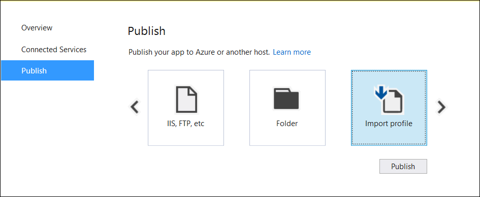
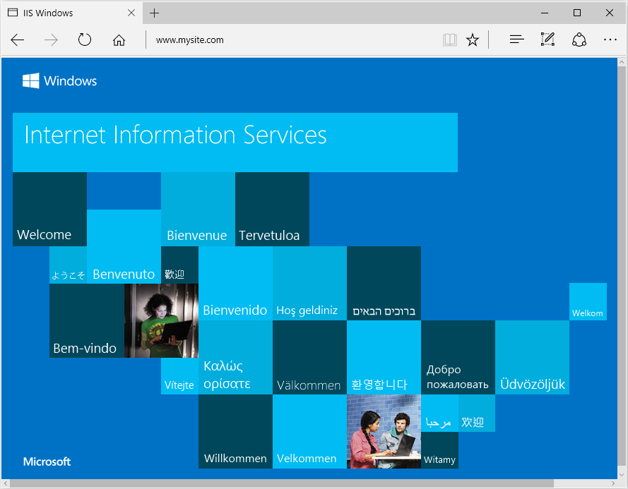

# Host ASP.NET Core on Windows with IIS

:::moniker range=">= aspnetcore-5.0"

Internet Information Services (IIS) is a flexible, secure and manageable Web Server for hosting web apps, including ASP.NET Core.

## Supported platforms

The following operating systems are supported:

* Windows 7 or later
* Windows Server 2012 R2 or later

Apps published for 32-bit (x86) or 64-bit (x64) deployment are supported. Deploy a 32-bit app with a 32-bit (x86) .NET Core SDK unless the app:

* Requires the larger virtual memory address space available to a 64-bit app.
* Requires the larger IIS stack size.
* Has 64-bit native dependencies.

## Install the ASP.NET Core Module/Hosting Bundle

Download the latest installer using the following link:

[Current .NET Core Hosting Bundle installer (direct download)](https://dotnet.microsoft.com/permalink/dotnetcore-current-windows-runtime-bundle-installer)

For more details instructions on how to install the ASP.NET Core Module, or installing different versions, see [Install the .NET Core Hosting Bundle](xref:host-and-deploy/iis/hosting-bundle).

To download previous versions of the hosting bundle, see [this GitHub issue](https://github.com/dotnet/AspNetCore.Docs/issues/28642).

## Get started

For getting started with hosting a website on IIS, see our [getting started guide](xref:tutorials/publish-to-iis).

For getting started with hosting a website on Azure App Services, see our [deploying to Azure App Service guide](xref:host-and-deploy/azure-apps/index).

## Configuration

For configuration guidance, see <xref:host-and-deploy/iis/advanced>.

## Deployment resources for IIS administrators

* [IIS documentation](/iis)
* [Getting Started with the IIS Manager in IIS](/iis/get-started/getting-started-with-iis/getting-started-with-the-iis-manager-in-iis-7-and-iis-8)
* [.NET Core application deployment](/dotnet/core/deploying/)
* <xref:host-and-deploy/aspnet-core-module>
* <xref:host-and-deploy/directory-structure>
* <xref:host-and-deploy/iis/modules>
* <xref:test/troubleshoot-azure-iis>
* <xref:host-and-deploy/azure-iis-errors-reference>

## Overlapped recycle

In general, we recommend using a pattern like [blue-green deployments](https://www.martinfowler.com/bliki/BlueGreenDeployment.html) for zero-downtime deployments. Features like Overlapped Recycle help, but don't guarantee that you can do a zero-downtime deployment. For more information, see [this GitHub issue](https://github.com/dotnet/aspnetcore/issues/10117).

## Optional client certificates

For information on apps that must protect a subset of the app with a certificate, see [Optional client certificates](xref:security/authentication/certauth#optional-client-certificates).

## Additional resources

* <xref:test/troubleshoot>
* <xref:index>
* [The Official Microsoft IIS Site](https://www.iis.net/)
* [Windows Server technical content library](/windows-server/windows-server)
* [HTTP/2 on IIS](/iis/get-started/whats-new-in-iis-10/http2-on-iis)
* <xref:host-and-deploy/iis/transform-webconfig>

:::moniker-end

:::moniker range=">= aspnetcore-3.0 < aspnetcore-5.0"

For a tutorial experience on publishing an ASP.NET Core app to an IIS server, see <xref:tutorials/publish-to-iis>.

[Install the .NET Core Hosting Bundle](#install-the-net-core-hosting-bundle)

## Supported operating systems

The following operating systems are supported:

* Windows 7 or later
* Windows Server 2012 R2 or later

[HTTP.sys server](xref:fundamentals/servers/httpsys) (formerly called WebListener) doesn't work in a reverse proxy configuration with IIS. Use the [Kestrel server](xref:fundamentals/servers/kestrel).

For information on hosting in Azure, see <xref:host-and-deploy/azure-apps/index>.

For troubleshooting guidance, see <xref:test/troubleshoot>.

## Supported platforms

Apps published for 32-bit (x86) or 64-bit (x64) deployment are supported. Deploy a 32-bit app with a 32-bit (x86) .NET Core SDK unless the app:

* Requires the larger virtual memory address space available to a 64-bit app.
* Requires the larger IIS stack size.
* Has 64-bit native dependencies.

Apps published for 32-bit (x86) must have 32-bit enabled for their IIS Application Pools. For more information, see the [Create the IIS site](#create-the-iis-site) section.

Use a 64-bit (x64) .NET Core SDK to publish a 64-bit app. A 64-bit runtime must be present on the host system.

## Hosting models

### In-process hosting model

Using in-process hosting, an ASP.NET Core app runs in the same process as its IIS worker process. In-process hosting provides improved performance over out-of-process hosting because requests aren't proxied over the loopback adapter, a network interface that returns outgoing network traffic back to the same machine. IIS handles process management with the [Windows Process Activation Service (WAS)](/iis/manage/provisioning-and-managing-iis/features-of-the-windows-process-activation-service-was).

The [ASP.NET Core Module](xref:host-and-deploy/aspnet-core-module):

* Performs app initialization.
  * Loads the [CoreCLR](/dotnet/standard/glossary#coreclr).
  * Calls `Program.Main`.
* Handles the lifetime of the IIS native request.

The following diagram illustrates the relationship between IIS, the ASP.NET Core Module, and an app hosted in-process:


1. A request arrives from the web to the kernel-mode HTTP.sys driver.
1. The driver routes the native request to IIS on the website's configured port, usually 80 (HTTP) or 443 (HTTPS).
1. The ASP.NET Core Module receives the native request and passes it to IIS HTTP Server (`IISHttpServer`). IIS HTTP Server is an in-process server implementation for IIS that converts the request from native to managed.

After the IIS HTTP Server processes the request:

1. The request is sent to the ASP.NET Core middleware pipeline.
1. The middleware pipeline handles the request and passes it on as an `HttpContext` instance to the app's logic.
1. The app's response is passed back to IIS through IIS HTTP Server.
1. IIS sends the response to the client that initiated the request.

In-process hosting is opt-in for existing apps. The ASP.NET Core web templates use the in-process hosting model.

`CreateDefaultBuilder` adds an <xref:Microsoft.AspNetCore.Hosting.Server.IServer> instance by calling the <xref:Microsoft.AspNetCore.Hosting.WebHostBuilderIISExtensions.UseIIS%2A> method to boot the [CoreCLR](/dotnet/standard/glossary#coreclr) and host the app inside of the IIS worker process (`w3wp.exe` or `iisexpress.exe`). Performance tests indicate that hosting a .NET Core app in-process delivers significantly higher request throughput compared to hosting the app out-of-process and proxying requests to [Kestrel](xref:fundamentals/servers/kestrel).

Apps published as a single file executable can't be loaded by the in-process hosting model.

### Out-of-process hosting model

Because ASP.NET Core apps run in a process separate from the IIS worker process, the ASP.NET Core Module handles process management. The module starts the process for the ASP.NET Core app when the first request arrives and restarts the app if it shuts down or crashes. This is essentially the same behavior as seen with apps that run in-process that are managed by the [Windows Process Activation Service (WAS)](/iis/manage/provisioning-and-managing-iis/features-of-the-windows-process-activation-service-was).

The following diagram illustrates the relationship between IIS, the ASP.NET Core Module, and an app hosted out-of-process:


1. Requests arrive from the web to the kernel-mode HTTP.sys driver.
1. The driver routes the requests to IIS on the website's configured port. The configured port is usually 80 (HTTP) or 443 (HTTPS).
1. The module forwards the requests to Kestrel on a random port for the app. The random port isn't 80 or 443.

<!-- make this a bullet list -->
The ASP.NET Core Module specifies the port via an environment variable at startup. The <xref:Microsoft.AspNetCore.Hosting.WebHostBuilderIISExtensions.UseIISIntegration%2A> extension configures the server to listen on `http://localhost:{PORT}`. Additional checks are performed, and requests that don't originate from the module are rejected. The module doesn't support HTTPS forwarding. Requests are forwarded over HTTP even if received by IIS over HTTPS.

After Kestrel picks up the request from the module, the request is forwarded into the ASP.NET Core middleware pipeline. The middleware pipeline handles the request and passes it on as an `HttpContext` instance to the app's logic. Middleware added by IIS Integration updates the scheme, remote IP, and pathbase to account for forwarding the request to Kestrel. The app's response is passed back to IIS, which forwards it back to the HTTP client that initiated the request.

For ASP.NET Core Module configuration guidance, see <xref:host-and-deploy/aspnet-core-module>.

For more information on hosting, see [Host in ASP.NET Core](xref:fundamentals/index#host).

## Application configuration

### Enable the IISIntegration components

When building a host in `CreateHostBuilder` (`Program.cs`), call <xref:Microsoft.Extensions.Hosting.Host.CreateDefaultBuilder%2A> to enable IIS integration:

```csharp
public static IHostBuilder CreateHostBuilder(string[] args) =>
    Host.CreateDefaultBuilder(args)
        ...
```

For more information on `CreateDefaultBuilder`, see <xref:fundamentals/host/generic-host#default-builder-settings>.

### IIS options

**In-process hosting model**

To configure IIS Server options, include a service configuration for <xref:Microsoft.AspNetCore.Builder.IISServerOptions> in <xref:Microsoft.AspNetCore.Hosting.IStartup.ConfigureServices%2A>. The following example disables AutomaticAuthentication:

```csharp
services.Configure<IISServerOptions>(options => 
{
    options.AutomaticAuthentication = false;
});
```

| Option                         | Default | Setting |
| ------------------------------ | :-----: | ------- |
| `AutomaticAuthentication`      | `true`  | If `true`, IIS Server sets the `HttpContext.User` authenticated by [Windows Authentication](xref:security/authentication/windowsauth). If `false`, the server only provides an identity for `HttpContext.User` and responds to challenges when explicitly requested by the `AuthenticationScheme`. Windows Authentication must be enabled in IIS for `AutomaticAuthentication` to function. For more information, see [Windows Authentication](xref:security/authentication/windowsauth). |
| `AuthenticationDisplayName`    | `null`  | Sets the display name shown to users on login pages. |
| `AllowSynchronousIO`           | `false` | Whether synchronous I/O is allowed for the `HttpContext.Request` and the `HttpContext.Response`. |
| `MaxRequestBodySize`           | `30000000`  | Gets or sets the max request body size for the `HttpRequest`. Note that IIS itself has the limit `maxAllowedContentLength` which will be processed before the `MaxRequestBodySize` set in the `IISServerOptions`. Changing the `MaxRequestBodySize` won't affect the `maxAllowedContentLength`. To increase `maxAllowedContentLength`, add an entry in the `web.config` to set `maxAllowedContentLength` to a higher value. For more details, see [Configuration](/iis/configuration/system.webServer/security/requestFiltering/requestLimits/#configuration). |

**Out-of-process hosting model**

To configure IIS options, include a service configuration for <xref:Microsoft.AspNetCore.Builder.IISOptions> in <xref:Microsoft.AspNetCore.Hosting.IStartup.ConfigureServices%2A>. The following example prevents the app from populating `HttpContext.Connection.ClientCertificate`:

```csharp
services.Configure<IISOptions>(options => 
{
    options.ForwardClientCertificate = false;
});
```

| Option                         | Default | Setting |
| ------------------------------ | :-----: | ------- |
| `AutomaticAuthentication`      | `true`  | If `true`, [IIS Integration Middleware](#enable-the-iisintegration-components) sets the `HttpContext.User` authenticated by [Windows Authentication](xref:security/authentication/windowsauth). If `false`, the middleware only provides an identity for `HttpContext.User` and responds to challenges when explicitly requested by the `AuthenticationScheme`. Windows Authentication must be enabled in IIS for `AutomaticAuthentication` to function. For more information, see the [Windows Authentication](xref:security/authentication/windowsauth) topic. |
| `AuthenticationDisplayName`    | `null`  | Sets the display name shown to users on login pages. |
| `ForwardClientCertificate`     | `true`  | If `true` and the `MS-ASPNETCORE-CLIENTCERT` request header is present, the `HttpContext.Connection.ClientCertificate` is populated. |

### Proxy server and load balancer scenarios

The [IIS Integration Middleware](#enable-the-iisintegration-components) and the ASP.NET Core Module are configured to forward the:

* Scheme (HTTP/HTTPS).
* Remote IP address where the request originated.

The [IIS Integration Middleware](#enable-the-iisintegration-components) configures Forwarded Headers Middleware.

Additional configuration might be required for apps hosted behind additional proxy servers and load balancers. For more information, see [Configure ASP.NET Core to work with proxy servers and load balancers](xref:host-and-deploy/proxy-load-balancer).

### `web.config` file

The `web.config` file configures the [ASP.NET Core Module](xref:host-and-deploy/aspnet-core-module). Creating, transforming, and publishing the `web.config` file is handled by an MSBuild target (`_TransformWebConfig`) when the project is published. This target is present in the Web SDK targets (`Microsoft.NET.Sdk.Web`). The SDK is set at the top of the project file:

```xml
<Project Sdk="Microsoft.NET.Sdk.Web">
```

If a `web.config` file isn't present in the project, the file is created with the correct `processPath` and `arguments` to configure the ASP.NET Core Module and moved to [published output](xref:host-and-deploy/directory-structure).

If a `web.config` file is present in the project, the file is transformed with the correct `processPath` and `arguments` to configure the ASP.NET Core Module and moved to published output. The transformation doesn't modify IIS configuration settings in the file.

The `web.config` file may provide additional IIS configuration settings that control active IIS modules. For information on IIS modules that are capable of processing requests with ASP.NET Core apps, see the [IIS modules](xref:host-and-deploy/iis/modules) topic.

To prevent the Web SDK from transforming the `web.config` file, use the `<IsTransformWebConfigDisabled>` property in the project file:

```xml
<PropertyGroup>
  <IsTransformWebConfigDisabled>true</IsTransformWebConfigDisabled>
</PropertyGroup>
```

When disabling the Web SDK from transforming the file, the `processPath` and `arguments` should be manually set by the developer. For more information, see <xref:host-and-deploy/aspnet-core-module>.

### `web.config` file location

In order to set up the [ASP.NET Core Module](xref:host-and-deploy/aspnet-core-module) correctly, the `web.config` file must be present at the [content root](xref:fundamentals/index#content-root) path (typically the app base path) of the deployed app. This is the same location as the website physical path provided to IIS. The `web.config` file is required at the root of the app to enable the publishing of multiple apps using Web Deploy.

Sensitive files exist on the app's physical path, such as `{ASSEMBLY}.runtimeconfig.json`, `{ASSEMBLY}.xml` (XML Documentation comments), and `{ASSEMBLY}.deps.json`, where the placeholder `{ASSEMBLY}` is the assembly name. When the `web.config` file is present and the site starts normally, IIS doesn't serve these sensitive files if they're requested. If the `web.config` file is missing, incorrectly named, or unable to configure the site for normal startup, IIS may serve sensitive files publicly.

**The `web.config` file must be present in the deployment at all times, correctly named, and able to configure the site for normal start up. Never remove the `web.config` file from a production deployment.**

### Transform web.config

If you need to transform `web.config` on publish, see <xref:host-and-deploy/iis/transform-webconfig>. You might need to transform `web.config` on publish to set environment variables based on the configuration, profile, or environment.

## IIS configuration

**Windows Server operating systems**

Enable the **Web Server (IIS)** server role and establish role services.

1. Use the **Add Roles and Features** wizard from the **Manage** menu or the link in **Server Manager**. On the **Server Roles** step, check the box for **Web Server (IIS)**.

   

1. After the **Features** step, the **Role services** step loads for Web Server (IIS). Select the IIS role services desired or accept the default role services provided.

   

   **Windows Authentication (Optional)**  
   To enable Windows Authentication, expand the following nodes: **Web Server** > **Security**. Select the **Windows Authentication** feature. For more information, see [Windows Authentication `<windowsAuthentication>`](/iis/configuration/system.webServer/security/authentication/windowsAuthentication/) and [Configure Windows authentication](xref:security/authentication/windowsauth).

   **WebSockets (Optional)**  
   WebSockets is supported with ASP.NET Core 1.1 or later. To enable WebSockets, expand the following nodes: **Web Server** > **Application Development**. Select the **WebSocket Protocol** feature. For more information, see [WebSockets](xref:fundamentals/websockets).

1. Proceed through the **Confirmation** step to install the web server role and services. A server/IIS restart isn't required after installing the **Web Server (IIS)** role.

**Windows desktop operating systems**

Enable the **IIS Management Console** and **World Wide Web Services**.

1. Navigate to **Control Panel** > **Programs** > **Programs and Features** > **Turn Windows features on or off** (left side of the screen).

1. Open the **Internet Information Services** node. Open the **Web Management Tools** node.

1. Check the box for **IIS Management Console**.

1. Check the box for **World Wide Web Services**.

1. Accept the default features for **World Wide Web Services** or customize the IIS features.

   **Windows Authentication (Optional)**  
   To enable Windows Authentication, expand the following nodes: **World Wide Web Services** > **Security**. Select the **Windows Authentication** feature. For more information, see [Windows Authentication \<windowsAuthentication>](/iis/configuration/system.webServer/security/authentication/windowsAuthentication/) and [Configure Windows authentication](xref:security/authentication/windowsauth).

   **WebSockets (Optional)**  
   WebSockets is supported with ASP.NET Core 1.1 or later. To enable WebSockets, expand the following nodes: **World Wide Web Services** > **Application Development Features**. Select the **WebSocket Protocol** feature. For more information, see [WebSockets](xref:fundamentals/websockets).

1. If the IIS installation requires a restart, restart the system.


## Install the .NET Core Hosting Bundle

Install the *.NET Core Hosting Bundle* on the hosting system. The bundle installs the .NET Core Runtime, .NET Core Library, and the [ASP.NET Core Module](xref:host-and-deploy/aspnet-core-module). The module allows ASP.NET Core apps to run behind IIS.

> [!IMPORTANT]
> If the Hosting Bundle is installed before IIS, the bundle installation must be repaired. Run the Hosting Bundle installer again after installing IIS.
>
> If the Hosting Bundle is installed after installing the 64-bit (x64) version of .NET Core, SDKs might appear to be missing ([No .NET Core SDKs were detected](xref:test/troubleshoot#no-net-core-sdks-were-detected)). To resolve the problem, see <xref:test/troubleshoot#missing-sdk-after-installing-the-net-core-hosting-bundle>.

### Direct download (current version)

Download the installer using the following link:

[Current .NET Core Hosting Bundle installer (direct download)](https://dotnet.microsoft.com/permalink/dotnetcore-current-windows-runtime-bundle-installer)

### Earlier versions of the installer

To obtain an earlier version of the installer:

1. Navigate to the [Download .NET Core](https://dotnet.microsoft.com/download/dotnet-core) page.
1. Select the desired .NET Core version.
1. In the **Run apps - Runtime** column, find the row of the .NET Core runtime version desired.
1. Download the installer using the **Hosting Bundle** link.

> [!WARNING]
> Some installers contain release versions that have reached their end of life (EOL) and are no longer supported by Microsoft. For more information, see the [support policy](https://dotnet.microsoft.com/platform/support/policy/dotnet-core).

### Install the Hosting Bundle

1. Run the installer on the server. The following parameters are available when running the installer from an administrator command shell:

   * `OPT_NO_ANCM=1`: Skip installing the ASP.NET Core Module.
   * `OPT_NO_RUNTIME=1`: Skip installing the .NET Core runtime. Used when the server only hosts [self-contained deployments (SCD)](/dotnet/core/deploying/#self-contained-deployments-scd).
   * `OPT_NO_SHAREDFX=1`: Skip installing the ASP.NET Shared Framework (ASP.NET runtime). Used when the server only hosts [self-contained deployments (SCD)](/dotnet/core/deploying/#self-contained-deployments-scd).
   * `OPT_NO_X86=1`: Skip installing x86 runtimes. Use this parameter when you know that you won't be hosting 32-bit apps. If there's any chance that you will host both 32-bit and 64-bit apps in the future, don't use this parameter and install both runtimes.
   * `OPT_NO_SHARED_CONFIG_CHECK=1`: Disable the check for using an IIS Shared Configuration when the shared configuration (`applicationHost.config`) is on the same machine as the IIS installation. *Only available for ASP.NET Core 2.2 or later Hosting Bundler installers.* For more information, see <xref:host-and-deploy/aspnet-core-module#aspnet-core-module-with-an-iis-shared-configuration>.
1. Restarting IIS picks up a change to the system PATH, which is an environment variable, made by the installer. To restart the web server, stop the Windows Process Activation Service (WAS) and then restart the World Wide Web Publishing Service (W3SVC). Restart the system **or** execute the following commands in an elevated command shell:

   ```console
   net stop was /y
   net start w3svc
   ```

ASP.NET Core doesn't adopt roll-forward behavior for patch releases of shared framework packages. After upgrading the shared framework by installing a new hosting bundle, restart the system **or** execute the following commands in an elevated command shell:

```console
net stop was /y
net start w3svc
```

> [!NOTE]
> For information on IIS Shared Configuration, see [ASP.NET Core Module with IIS Shared Configuration](xref:host-and-deploy/aspnet-core-module#aspnet-core-module-with-an-iis-shared-configuration).

## Install Web Deploy when publishing with Visual Studio

When deploying apps to servers with [Web Deploy](/iis/install/installing-publishing-technologies/installing-and-configuring-web-deploy-on-iis-80-or-later), install the latest version of Web Deploy on the server. To install Web Deploy, use the [Web Platform Installer (WebPI)](https://www.microsoft.com/web/downloads/platform.aspx) or obtain an installer directly from the [Microsoft Download Center](https://www.microsoft.com/download/details.aspx?id=43717). The preferred method is to use WebPI. WebPI offers a standalone setup and a configuration for hosting providers.

## Create the IIS site

1. On the hosting system, create a folder to contain the app's published folders and files. In a following step, the folder's path is provided to IIS as the physical path to the app. For more information on an app's deployment folder and file layout, see <xref:host-and-deploy/directory-structure>.

1. In IIS Manager, open the server's node in the **Connections** panel. Right-click the **Sites** folder. Select **Add Website** from the contextual menu.

1. Provide a **Site name** and set the **Physical path** to the app's deployment folder. Provide the **Binding** configuration and create the website by selecting **OK**:

   

   > [!WARNING]
   > Top-level wildcard bindings (`http://*:80/` and `http://+:80`) should **not** be used. Top-level wildcard bindings can open up your app to security vulnerabilities. This applies to both strong and weak wildcards. Use explicit host names rather than wildcards. Subdomain wildcard binding (for example, `*.mysub.com`) doesn't have this security risk if you control the entire parent domain (as opposed to `*.com`, which is vulnerable). See [RFC 9110: HTTP Semantics (Section 7.2: Host and :authority)](https://www.rfc-editor.org/rfc/rfc9110#field.host) for more information.

1. Under the server's node, select **Application Pools**.

1. Right-click the site's app pool and select **Basic Settings** from the contextual menu.

1. In the **Edit Application Pool** window, set the **.NET CLR version** to **No Managed Code**:

   

    ASP.NET Core runs in a separate process and manages the runtime. ASP.NET Core doesn't rely on loading the desktop CLR (.NET CLR). The Core Common Language Runtime (CoreCLR) for .NET Core is booted to host the app in the worker process. Setting the **.NET CLR version** to **No Managed Code** is optional but recommended.

1. *ASP.NET Core 2.2 or later*:

   * For a 32-bit (x86) [self-contained deployment](/dotnet/core/deploying/#self-contained-deployments-scd) published with a 32-bit SDK that uses the [in-process hosting model](#in-process-hosting-model), enable the Application Pool for 32-bit. In IIS Manager, navigate to **Application Pools** in the **Connections** sidebar. Select the app's Application Pool. In the **Actions** sidebar, select **Advanced Settings**. Set **Enable 32-Bit Applications** to `True`. 

   * For a 64-bit (x64) [self-contained deployment](/dotnet/core/deploying/#self-contained-deployments-scd) that uses the [in-process hosting model](#in-process-hosting-model), disable the app pool for 32-bit (x86) processes. In IIS Manager, navigate to **Application Pools** in the **Connections** sidebar. Select the app's Application Pool. In the **Actions** sidebar, select **Advanced Settings**. Set **Enable 32-Bit Applications** to `False`. 

1. Confirm the process model identity has the proper permissions.

   If the default identity of the app pool (**Process Model** > **Identity**) is changed from **ApplicationPoolIdentity** to another identity, verify that the new identity has the required permissions to access the app's folder, database, and other required resources. For example, the app pool requires read and write access to folders where the app reads and writes files.

**Windows Authentication configuration (Optional)**  
For more information, see [Configure Windows authentication](xref:security/authentication/windowsauth).

## Deploy the app

Deploy the app to the IIS **Physical path** folder that was established in the [Create the IIS site](#create-the-iis-site) section. [Web Deploy](/iis/publish/using-web-deploy/introduction-to-web-deploy) is the recommended mechanism for deployment, but several options exist for moving the app from the project's `publish` folder to the hosting system's deployment folder.

### Web Deploy with Visual Studio

See the [Visual Studio publish profiles for ASP.NET Core app deployment](xref:host-and-deploy/visual-studio-publish-profiles#publish-profiles) topic to learn how to create a publish profile for use with Web Deploy. If the hosting provider provides a Publish Profile or support for creating one, download their profile and import it using the Visual Studio **Publish** dialog:



### Web Deploy outside of Visual Studio

[Web Deploy](/iis/publish/using-web-deploy/introduction-to-web-deploy) can also be used outside of Visual Studio from the command line. For more information, see [Web Deployment Tool](/iis/publish/using-web-deploy/use-the-web-deployment-tool).

### Alternatives to Web Deploy

Use any of several methods to move the app to the hosting system, such as manual copy, [Xcopy](/windows-server/administration/windows-commands/xcopy), [Robocopy](/windows-server/administration/windows-commands/robocopy), or [PowerShell](/powershell/).

For more information on ASP.NET Core deployment to IIS, see the [Deployment resources for IIS administrators](#deployment-resources-for-iis-administrators) section.

## Browse the website

After the app is deployed to the hosting system, make a request to one of the app's public endpoints.

In the following example, the site is bound to an IIS **Host name** of `www.mysite.com` on **Port** `80`. A request is made to `http://www.mysite.com`:



## Locked deployment files

Files in the deployment folder are locked when the app is running. Locked files can't be overwritten during deployment. To release locked files in a deployment, stop the app pool using **one** of the following approaches:

* Use Web Deploy and reference `Microsoft.NET.Sdk.Web` in the project file. An `app_offline.htm` file is placed at the root of the web app directory. When the file is present, the ASP.NET Core Module gracefully shuts down the app and serves the `app_offline.htm` file during the deployment. For more information, see the [ASP.NET Core Module configuration reference](xref:host-and-deploy/aspnet-core-module#app_offlinehtm).
* Manually stop the app pool in the IIS Manager on the server.
* Use PowerShell to drop `app_offline.htm` (requires PowerShell 5 or later):

  ```powershell
  $pathToApp = 'PATH_TO_APP'

  # Stop the AppPool
  New-Item -Path $pathToApp app_offline.htm

  # Provide script commands here to deploy the app

  # Restart the AppPool
  Remove-Item -Path $pathToApp app_offline.htm
  ```

## Data protection

The [ASP.NET Core Data Protection stack](xref:security/data-protection/introduction) is used by several ASP.NET Core [middlewares](xref:fundamentals/middleware/index), including middleware used in authentication. Even if Data Protection APIs aren't called by user code, data protection should be configured with a deployment script or in user code to create a persistent cryptographic [key store](xref:security/data-protection/implementation/key-management). If data protection isn't configured, the keys are held in memory and discarded when the app restarts.

If the key ring is stored in memory when the app restarts:

* All cookie-based authentication tokens are invalidated. 
* Users are required to sign in again on their next request. 
* Any data protected with the key ring can no longer be decrypted. This may include [CSRF tokens](xref:security/anti-request-forgery#aspnet-core-antiforgery-configuration) and [ASP.NET Core MVC TempData cookies](xref:fundamentals/app-state#tempdata).

To configure data protection under IIS to persist the key ring, use **one** of the following approaches:

* **Create Data Protection Registry Keys**

  Data protection keys used by ASP.NET Core apps are stored in the registry external to the apps. To persist the keys for a given app, create registry keys for the app pool.

  For standalone, non-webfarm IIS installations, the [Data Protection Provision-AutoGenKeys.ps1 PowerShell script](https://github.com/dotnet/AspNetCore/blob/main/src/DataProtection/Provision-AutoGenKeys.ps1) can be used for each app pool used with an ASP.NET Core app. This script creates a registry key in the HKLM registry that's accessible only to the worker process account of the app's app pool. Keys are encrypted at rest using DPAPI with a machine-wide key.

  In web farm scenarios, an app can be configured to use a UNC path to store its data protection key ring. By default, the data protection keys aren't encrypted. Ensure that the file permissions for the network share are limited to the Windows account the app runs under. An X509 certificate can be used to protect keys at rest. Consider a mechanism to allow users to upload certificates: Place certificates into the user's trusted certificate store and ensure they're available on all machines where the user's app runs. See [Configure ASP.NET Core Data Protection](xref:security/data-protection/configuration/overview) for details.

* **Configure the IIS Application Pool to load the user profile**

  This setting is in the **Process Model** section under the **Advanced Settings** for the app pool. Set **Load User Profile** to `True`. When set to `True`, keys are stored in the user profile directory and protected using DPAPI with a key specific to the user account. Keys are persisted to the *%LOCALAPPDATA%/ASP.NET/DataProtection-Keys* folder.

  The app pool's [setProfileEnvironment attribute](/iis/configuration/system.applicationhost/applicationpools/add/processmodel#configuration) must also be enabled. The default value of `setProfileEnvironment` is `true`. In some scenarios (for example, Windows OS), `setProfileEnvironment` is set to `false`. If keys aren't stored in the user profile directory as expected:

  1. Navigate to the *%windir%/system32/inetsrv/config* folder.
  1. Open the *applicationHost.config* file.
  1. Locate the `<system.applicationHost><applicationPools><applicationPoolDefaults><processModel>` element.
  1. Confirm that the `setProfileEnvironment` attribute isn't present, which defaults the value to `true`, or explicitly set the attribute's value to `true`.

* **Use the file system as a key ring store**

  Adjust the app code to [use the file system as a key ring store](xref:security/data-protection/configuration/overview). Use an X509 certificate to protect the key ring and ensure the certificate is a trusted certificate. If the certificate is self-signed, place the certificate in the Trusted Root store.

  When using IIS in a web farm:

  * Use a file share that all machines can access.
  * Deploy an X509 certificate to each machine. Configure [data protection in code](xref:security/data-protection/configuration/overview).

* **Set a machine-wide policy for data protection**

  The data protection system has limited support for setting a default [machine-wide policy](xref:security/data-protection/configuration/machine-wide-policy) for all apps that consume the Data Protection APIs. For more information, see <xref:security/data-protection/introduction>.

## Virtual Directories

[IIS Virtual Directories](/iis/get-started/planning-your-iis-architecture/understanding-sites-applications-and-virtual-directories-on-iis#virtual-directories) aren't supported with ASP.NET Core apps. An app can be hosted as a [sub-application](#sub-applications).

## Sub-applications

An ASP.NET Core app can be hosted as an [IIS sub-application (sub-app)](/iis/get-started/planning-your-iis-architecture/understanding-sites-applications-and-virtual-directories-on-iis#applications). The sub-app's path becomes part of the root app's URL.

Static asset links within the sub-app should use tilde-slash (`~/`) notation. Tilde-slash notation triggers a [Tag Helper](xref:mvc/views/tag-helpers/intro) to prepend the sub-app's pathbase to the rendered relative link. For a sub-app at `/subapp_path`, an image linked with `src="~/image.png"` is rendered as `src="/subapp_path/image.png"`. The root app's Static File Middleware doesn't process the static file request. The request is processed by the sub-app's Static File Middleware.

If a static asset's `src` attribute is set to an absolute path (for example, `src="/image.png"`), the link is rendered without the sub-app's pathbase. The root app's Static File Middleware attempts to serve the asset from the root app's [web root](xref:fundamentals/index#web-root), which results in a *404 - Not Found* response unless the static asset is available from the root app.

To host an ASP.NET Core app as a sub-app under another ASP.NET Core app:

1. Establish an app pool for the sub-app. Set the **.NET CLR Version** to **No Managed Code** because the Core Common Language Runtime (CoreCLR) for .NET Core is booted to host the app in the worker process, not the desktop CLR (.NET CLR).

1. Add the root site in IIS Manager with the sub-app in a folder under the root site.

1. Right-click the sub-app folder in IIS Manager and select **Convert to Application**.

1. In the **Add Application** dialog, use the **Select** button for the **Application Pool** to assign the app pool that you created for the sub-app. Select **OK**.

The assignment of a separate app pool to the sub-app is a requirement when using the in-process hosting model.

For more information on the in-process hosting model and configuring the ASP.NET Core Module, see <xref:host-and-deploy/aspnet-core-module>.

## Configuration of IIS with web.config

IIS configuration is influenced by the `<system.webServer>` section of *web.config* for IIS scenarios that are functional for ASP.NET Core apps with the ASP.NET Core Module. For example, IIS configuration is functional for dynamic compression. If IIS is configured at the server level to use dynamic compression, the `<urlCompression>` element in the app's *web.config* file can disable it for an ASP.NET Core app.

For more information, see the following topics:

* [Configuration reference for \<system.webServer>](/iis/configuration/system.webServer/)
* <xref:host-and-deploy/aspnet-core-module>
* <xref:host-and-deploy/iis/modules>

To set environment variables for individual apps running in isolated app pools (supported for IIS 10.0 or later), see the *AppCmd.exe command* section of the [Environment Variables \<environmentVariables>](/iis/configuration/system.applicationHost/applicationPools/add/environmentVariables/#appcmdexe) topic in the IIS reference documentation.

### Sections that aren't used by ASP.NET Core

Configuration sections of ASP.NET apps in *web.config* aren't used by ASP.NET Core apps for configuration:

* `<system.web>`
* `<appSettings>`
* `<connectionStrings>`
* `<location>`

ASP.NET Core apps are configured using other configuration providers. For more information, see [Configuration](xref:fundamentals/configuration/index) and [.NET Core run-time configuration settings](/dotnet/core/run-time-config/)

## Application Pools

App pool isolation is determined by the hosting model:

* In-process hosting: Apps are required to run in separate app pools.
* Out-of-process hosting: We recommend isolating the apps from each other by running each app in its own app pool.

The IIS **Add Website** dialog defaults to a single app pool per app. When a **Site name** is provided, the text is automatically transferred to the **Application pool** textbox. A new app pool is created using the site name when the site is added.

## Application Pool Identity

An app pool identity account allows an app to run under a unique account without having to create and manage domains or local accounts. On IIS 8.0 or later, the IIS Admin Worker Process (WAS) creates a virtual account with the name of the new app pool and runs the app pool's worker processes under this account by default. In the IIS Management Console under **Advanced Settings** for the app pool, ensure that the **Identity** is set to use **ApplicationPoolIdentity**:


The IIS management process creates a secure identifier with the name of the app pool in the Windows Security System. Resources can be secured using this identity. However, this identity isn't a real user account and doesn't show up in the Windows User Management Console.

If the IIS worker process requires elevated access to the app, modify the Access Control List (ACL) for the directory containing the app:

1. Open Windows Explorer and navigate to the directory.

1. Right-click on the directory and select **Properties**.

1. Under the **Security** tab, select the **Edit** button and then the **Add** button.

1. Select the **Locations** button and make sure the system is selected.

1. Enter `IIS AppPool\{APP POOL NAME}`, where the placeholder `{APP POOL NAME}` is the app pool name, in **Enter the object names to select** area. Select the **Check Names** button. For the *DefaultAppPool* check the names using `IIS AppPool\DefaultAppPool`. When the **Check Names** button is selected, a value of `DefaultAppPool` is indicated in the object names area. It isn't possible to enter the app pool name directly into the object names area. Use the `IIS AppPool\{APP POOL NAME}` format, where the placeholder `{APP POOL NAME}` is the app pool name, when checking for the object name.

   

1. Select **OK**.

   

1. Read &amp; execute permissions should be granted by default. Provide additional permissions as needed.

Access can also be granted at a command prompt using the **ICACLS** tool. Using the `DefaultAppPool` as an example, the following command is used:

```console
ICACLS C:\sites\MyWebApp /grant "IIS AppPool\DefaultAppPool":F
```

For more information, see the [icacls](/windows-server/administration/windows-commands/icacls) topic.

## HTTP/2 support

[HTTP/2](https://httpwg.org/specs/rfc7540.html) is supported with ASP.NET Core in the following IIS deployment scenarios:

* In-process
  * Windows Server 2016/Windows 10 or later; IIS 10 or later
  * TLS 1.2 or later connection
* Out-of-process
  * Windows Server 2016/Windows 10 or later; IIS 10 or later
  * Public-facing edge server connections use HTTP/2, but the reverse proxy connection to the [Kestrel server](xref:fundamentals/servers/kestrel) uses HTTP/1.1.
  * TLS 1.2 or later connection

For an in-process deployment when an HTTP/2 connection is established, [`HttpRequest.Protocol`](xref:Microsoft.AspNetCore.Http.HttpRequest.Protocol*) reports `HTTP/2`. For an out-of-process deployment when an HTTP/2 connection is established, [`HttpRequest.Protocol`](xref:Microsoft.AspNetCore.Http.HttpRequest.Protocol*) reports `HTTP/1.1`.

For more information on the in-process and out-of-process hosting models, see <xref:host-and-deploy/aspnet-core-module>.

HTTP/2 is enabled by default. Connections fall back to HTTP/1.1 if an HTTP/2 connection isn't established. For more information on HTTP/2 configuration with IIS deployments, see [HTTP/2 on IIS](/iis/get-started/whats-new-in-iis-10/http2-on-iis).

## CORS preflight requests

*This section only applies to ASP.NET Core apps that target the .NET Framework.*

For an ASP.NET Core app that targets the .NET Framework, OPTIONS requests aren't passed to the app by default in IIS. To learn how to configure the app's IIS handlers in `web.config` to pass OPTIONS requests, see [Enable cross-origin requests in ASP.NET Web API 2: How CORS Works](/aspnet/web-api/overview/security/enabling-cross-origin-requests-in-web-api#how-cors-works).

## Application Initialization Module and Idle Timeout

When hosted in IIS by the ASP.NET Core Module version 2:

* [Application Initialization Module](#application-initialization-module): App's hosted [in-process](#in-process-hosting-model) or [out-of-process](#out-of-process-hosting-model) can be configured to start automatically on a worker process restart or server restart.
* [Idle Timeout](#idle-timeout): App's hosted [in-process](#in-process-hosting-model) can be configured not to timeout during periods of inactivity.

### Application Initialization Module

*Applies to apps hosted in-process and out-of-process.*

[IIS Application Initialization](/iis/get-started/whats-new-in-iis-8/iis-80-application-initialization) is an IIS feature that sends an HTTP request to the app when the app pool starts or is recycled. The request triggers the app to start. By default, IIS issues a request to the app's root URL (`/`) to initialize the app (see the [additional resources](#application-initialization-module-and-idle-timeout-additional-resources) for more details on configuration).

Confirm that the IIS Application Initialization role feature in enabled:

On Windows 7 or later desktop systems when using IIS locally:

1. Navigate to **Control Panel** > **Programs** > **Programs and Features** > **Turn Windows features on or off** (left side of the screen).
1. Open **Internet Information Services** > **World Wide Web Services** > **Application Development Features**.
1. Select the checkbox for **Application Initialization**.

On Windows Server 2008 R2 or later:

1. Open the **Add Roles and Features Wizard**.
1. In the **Select role services** panel, open the **Application Development** node.
1. Select the checkbox for **Application Initialization**.

Use either of the following approaches to enable the Application Initialization Module for the site:

* Using IIS Manager:

  1. Select **Application Pools** in the **Connections** panel.
  1. Right-click the app's app pool in the list and select **Advanced Settings**.
  1. The default **Start Mode** is **OnDemand**. Set the **Start Mode** to **AlwaysRunning**. Select **OK**.
  1. Open the **Sites** node in the **Connections** panel.
  1. Right-click the app and select **Manage Website** > **Advanced Settings**.
  1. The default **Preload Enabled** setting is **False**. Set **Preload Enabled** to **True**. Select **OK**.

* Using `web.config`, add the `<applicationInitialization>` element with `doAppInitAfterRestart` set to `true` to the `<system.webServer>` elements in the app's web.config` file:

  ```xml
  <?xml version="1.0" encoding="utf-8"?>
  <configuration>
    <location path="." inheritInChildApplications="false">
      <system.webServer>
        <applicationInitialization doAppInitAfterRestart="true" />
      </system.webServer>
    </location>
  </configuration>
  ```

### Idle Timeout

*Only applies to apps hosted in-process.*

To prevent the app from idling, set the app pool's idle timeout using IIS Manager:

1. Select **Application Pools** in the **Connections** panel.
1. Right-click the app's app pool in the list and select **Advanced Settings**.
1. The default **Idle Time-out (minutes)** is **20** minutes. Set the **Idle Time-out (minutes)** to **0** (zero). Select **OK**.
1. Recycle the worker process.

To prevent apps hosted [out-of-process](#out-of-process-hosting-model) from timing out, use either of the following approaches:

* Ping the app from an external service in order to keep it running.
* If the app only hosts background services, avoid IIS hosting and use a [Windows Service to host the ASP.NET Core app](xref:host-and-deploy/windows-service).

### Application Initialization Module and Idle Timeout additional resources

* [IIS 8.0 Application Initialization](/iis/get-started/whats-new-in-iis-8/iis-80-application-initialization)
* [Application Initialization \<applicationInitialization>](/iis/configuration/system.webserver/applicationinitialization/).
* [Process Model Settings for an Application Pool \<processModel>](/iis/configuration/system.applicationhost/applicationpools/add/processmodel).

## Deployment resources for IIS administrators

* [IIS documentation](/iis)
* [Getting Started with the IIS Manager in IIS](/iis/get-started/getting-started-with-iis/getting-started-with-the-iis-manager-in-iis-7-and-iis-8)
* [.NET Core application deployment](/dotnet/core/deploying/)
* <xref:host-and-deploy/aspnet-core-module>
* <xref:host-and-deploy/directory-structure>
* <xref:host-and-deploy/iis/modules>
* <xref:test/troubleshoot-azure-iis>
* <xref:host-and-deploy/azure-iis-errors-reference>

## Additional resources

* <xref:test/troubleshoot>
* <xref:index>
* [The Official Microsoft IIS Site](https://www.iis.net/)
* [Windows Server technical content library](/windows-server/windows-server)
* [HTTP/2 on IIS](/iis/get-started/whats-new-in-iis-10/http2-on-iis)
* <xref:host-and-deploy/iis/transform-webconfig>

:::moniker-end

:::moniker range="< aspnetcore-2.2"

For a tutorial experience on publishing an ASP.NET Core app to an IIS server, see <xref:tutorials/publish-to-iis>.

[Install the .NET Core Hosting Bundle](#install-the-net-core-hosting-bundle)

## Supported operating systems

The following operating systems are supported:

* Windows 7 or later
* Windows Server 2008 R2 or later

[HTTP.sys server](xref:fundamentals/servers/httpsys) (formerly called WebListener) doesn't work in a reverse proxy configuration with IIS. Use the [Kestrel server](xref:fundamentals/servers/kestrel).

For information on hosting in Azure, see <xref:host-and-deploy/azure-apps/index>.

For troubleshooting guidance, see <xref:test/troubleshoot>.

## Supported platforms

Apps published for 32-bit (x86) or 64-bit (x64) deployment are supported. Deploy a 32-bit app with a 32-bit (x86) .NET Core SDK unless the app:

* Requires the larger virtual memory address space available to a 64-bit app.
* Requires the larger IIS stack size.
* Has 64-bit native dependencies.

Use a 64-bit (x64) .NET Core SDK to publish a 64-bit app. A 64-bit runtime must be present on the host system.

ASP.NET Core ships with [Kestrel server](xref:fundamentals/servers/kestrel), a default, cross-platform HTTP server.

When using [IIS](/iis/get-started/introduction-to-iis/introduction-to-iis-architecture) or [IIS Express](/iis/extensions/introduction-to-iis-express/iis-express-overview), the app runs in a process separate from the IIS worker process (*out-of-process*) with the [Kestrel server](xref:fundamentals/servers/index#kestrel).

Because ASP.NET Core apps run in a process separate from the IIS worker process, the module handles process management. The module starts the process for the ASP.NET Core app when the first request arrives and restarts the app if it shuts down or crashes. This is essentially the same behavior as seen with apps that run in-process that are managed by the [Windows Process Activation Service (WAS)](/iis/manage/provisioning-and-managing-iis/features-of-the-windows-process-activation-service-was).

The following diagram illustrates the relationship between IIS, the ASP.NET Core Module, and an app hosted out-of-process:


Requests arrive from the web to the kernel-mode HTTP.sys driver. The driver routes the requests to IIS on the website's configured port, usually 80 (HTTP) or 443 (HTTPS). The module forwards the requests to Kestrel on a random port for the app, which isn't port 80 or 443.

The module specifies the port via an environment variable at startup, and the [IIS Integration Middleware](xref:host-and-deploy/iis/index#enable-the-iisintegration-components) configures the server to listen on `http://localhost:{port}`. Additional checks are performed, and requests that don't originate from the module are rejected. The module doesn't support HTTPS forwarding, so requests are forwarded over HTTP even if received by IIS over HTTPS.

After Kestrel picks up the request from the module, the request is pushed into the ASP.NET Core middleware pipeline. The middleware pipeline handles the request and passes it on as an `HttpContext` instance to the app's logic. Middleware added by IIS Integration updates the scheme, remote IP, and pathbase to account for forwarding the request to Kestrel. The app's response is passed back to IIS, which pushes it back out to the HTTP client that initiated the request.

`CreateDefaultBuilder` configures [Kestrel](xref:fundamentals/servers/kestrel) server as the web server and enables IIS Integration by configuring the base path and port for the [ASP.NET Core Module](xref:host-and-deploy/aspnet-core-module).

The ASP.NET Core Module generates a dynamic port to assign to the backend process. `CreateDefaultBuilder` calls the <xref:Microsoft.AspNetCore.Hosting.WebHostBuilderIISExtensions.UseIISIntegration%2A> method. `UseIISIntegration` configures Kestrel to listen on the dynamic port at the localhost IP address (`127.0.0.1`). If the dynamic port is 1234, Kestrel listens at `127.0.0.1:1234`. This configuration replaces other URL configurations provided by:

* `UseUrls`
* [Kestrel's Listen API](xref:fundamentals/servers/kestrel#endpoint-configuration)
* [Configuration](xref:fundamentals/configuration/index) (or [command-line --urls option](xref:fundamentals/host/web-host#override-configuration))

Calls to `UseUrls` or Kestrel's `Listen` API aren't required when using the module. If `UseUrls` or `Listen` is called, Kestrel listens on the port specified only when running the app without IIS.

For ASP.NET Core Module configuration guidance, see <xref:host-and-deploy/aspnet-core-module>.

For more information on hosting, see [Host in ASP.NET Core](xref:fundamentals/index#host).

## Application configuration

### Enable the IISIntegration components

When building a host in `CreateWebHostBuilder` (`Program.cs`), call <xref:Microsoft.AspNetCore.WebHost.CreateDefaultBuilder%2A> to enable IIS integration:

```csharp
public static IWebHostBuilder CreateWebHostBuilder(string[] args) =>
    WebHost.CreateDefaultBuilder(args)
        ...
```

For more information on `CreateDefaultBuilder`, see <xref:fundamentals/host/web-host#set-up-a-host>.

### IIS options

| Option                         | Default | Setting |
| ------------------------------ | :-----: | ------- |
| `AutomaticAuthentication`      | `true`  | If `true`, IIS Server sets the `HttpContext.User` authenticated by [Windows Authentication](xref:security/authentication/windowsauth). If `false`, the server only provides an identity for `HttpContext.User` and responds to challenges when explicitly requested by the `AuthenticationScheme`. Windows Authentication must be enabled in IIS for `AutomaticAuthentication` to function. For more information, see [Windows Authentication](xref:security/authentication/windowsauth). |
| `AuthenticationDisplayName`    | `null`  | Sets the display name shown to users on login pages. |

To configure IIS options, include a service configuration for <xref:Microsoft.AspNetCore.Builder.IISOptions> in <xref:Microsoft.AspNetCore.Hosting.IStartup.ConfigureServices*>. The following example prevents the app from populating `HttpContext.Connection.ClientCertificate`:

```csharp
services.Configure<IISOptions>(options => 
{
    options.ForwardClientCertificate = false;
});
```

| Option                         | Default | Setting |
| ------------------------------ | :-----: | ------- |
| `AutomaticAuthentication`      | `true`  | If `true`, [IIS Integration Middleware](#enable-the-iisintegration-components) sets the `HttpContext.User` authenticated by [Windows Authentication](xref:security/authentication/windowsauth). If `false`, the middleware only provides an identity for `HttpContext.User` and responds to challenges when explicitly requested by the `AuthenticationScheme`. Windows Authentication must be enabled in IIS for `AutomaticAuthentication` to function. For more information, see the [Windows Authentication](xref:security/authentication/windowsauth) topic. |
| `AuthenticationDisplayName`    | `null`  | Sets the display name shown to users on login pages. |
| `ForwardClientCertificate`     | `true`  | If `true` and the `MS-ASPNETCORE-CLIENTCERT` request header is present, the `HttpContext.Connection.ClientCertificate` is populated. |

### Proxy server and load balancer scenarios

The [IIS Integration Middleware](#enable-the-iisintegration-components), which configures Forwarded Headers Middleware, and the ASP.NET Core Module are configured to forward the scheme (HTTP/HTTPS) and the remote IP address where the request originated. Additional configuration might be required for apps hosted behind additional proxy servers and load balancers. For more information, see [Configure ASP.NET Core to work with proxy servers and load balancers](xref:host-and-deploy/proxy-load-balancer).

### web.config file

The *web.config* file configures the [ASP.NET Core Module](xref:host-and-deploy/aspnet-core-module). Creating, transforming, and publishing the *web.config* file is handled by an MSBuild target (`_TransformWebConfig`) when the project is published. This target is present in the Web SDK targets (`Microsoft.NET.Sdk.Web`). The SDK is set at the top of the project file:

```xml
<Project Sdk="Microsoft.NET.Sdk.Web">
```

If a *web.config* file isn't present in the project, the file is created with the correct *processPath* and *arguments* to configure the ASP.NET Core Module and moved to [published output](xref:host-and-deploy/directory-structure).

If a *web.config* file is present in the project, the file is transformed with the correct *processPath* and *arguments* to configure the ASP.NET Core Module and moved to published output. The transformation doesn't modify IIS configuration settings in the file.

The *web.config* file may provide additional IIS configuration settings that control active IIS modules. For information on IIS modules that are capable of processing requests with ASP.NET Core apps, see the [IIS modules](xref:host-and-deploy/iis/modules) topic.

To prevent the Web SDK from transforming the *web.config* file, use the **\<IsTransformWebConfigDisabled>** property in the project file:

```xml
<PropertyGroup>
  <IsTransformWebConfigDisabled>true</IsTransformWebConfigDisabled>
</PropertyGroup>
```

When disabling the Web SDK from transforming the file, the *processPath* and *arguments* should be manually set by the developer. For more information, see <xref:host-and-deploy/aspnet-core-module>.

### web.config file location

In order to set up the [ASP.NET Core Module](xref:host-and-deploy/aspnet-core-module) correctly, the *web.config* file must be present at the [content root](xref:fundamentals/index#content-root) path (typically the app base path) of the deployed app. This is the same location as the website physical path provided to IIS. The *web.config* file is required at the root of the app to enable the publishing of multiple apps using Web Deploy.

Sensitive files exist on the app's physical path, such as *\<assembly>.runtimeconfig.json*, *\<assembly>.xml* (XML Documentation comments), and *\<assembly>.deps.json*. When the *web.config* file is present and the site starts normally, IIS doesn't serve these sensitive files if they're requested. If the *web.config* file is missing, incorrectly named, or unable to configure the site for normal startup, IIS may serve sensitive files publicly.

**The *web.config* file must be present in the deployment at all times, correctly named, and able to configure the site for normal start up. Never remove the *web.config* file from a production deployment.**

### Transform web.config

If you need to transform *web.config* on publish (for example, set environment variables based on the configuration, profile, or environment), see <xref:host-and-deploy/iis/transform-webconfig>.

## IIS configuration

**Windows Server operating systems**

Enable the **Web Server (IIS)** server role and establish role services.

1. Use the **Add Roles and Features** wizard from the **Manage** menu or the link in **Server Manager**. On the **Server Roles** step, check the box for **Web Server (IIS)**.

   

1. After the **Features** step, the **Role services** step loads for Web Server (IIS). Select the IIS role services desired or accept the default role services provided.

   

   **Windows Authentication (Optional)**  
   To enable Windows Authentication, expand the following nodes: **Web Server** > **Security**. Select the **Windows Authentication** feature. For more information, see [Windows Authentication \<windowsAuthentication>](/iis/configuration/system.webServer/security/authentication/windowsAuthentication/) and [Configure Windows authentication](xref:security/authentication/windowsauth).

   **WebSockets (Optional)**  
   WebSockets is supported with ASP.NET Core 1.1 or later. To enable WebSockets, expand the following nodes: **Web Server** > **Application Development**. Select the **WebSocket Protocol** feature. For more information, see [WebSockets](xref:fundamentals/websockets).

1. Proceed through the **Confirmation** step to install the web server role and services. A server/IIS restart isn't required after installing the **Web Server (IIS)** role.

**Windows desktop operating systems**

Enable the **IIS Management Console** and **World Wide Web Services**.

1. Navigate to **Control Panel** > **Programs** > **Programs and Features** > **Turn Windows features on or off** (left side of the screen).

1. Open the **Internet Information Services** node. Open the **Web Management Tools** node.

1. Check the box for **IIS Management Console**.

1. Check the box for **World Wide Web Services**.

1. Accept the default features for **World Wide Web Services** or customize the IIS features.

   **Windows Authentication (Optional)**  
   To enable Windows Authentication, expand the following nodes: **World Wide Web Services** > **Security**. Select the **Windows Authentication** feature. For more information, see [Windows Authentication \<windowsAuthentication>](/iis/configuration/system.webServer/security/authentication/windowsAuthentication/) and [Configure Windows authentication](xref:security/authentication/windowsauth).

   **WebSockets (Optional)**  
   WebSockets is supported with ASP.NET Core 1.1 or later. To enable WebSockets, expand the following nodes: **World Wide Web Services** > **Application Development Features**. Select the **WebSocket Protocol** feature. For more information, see [WebSockets](xref:fundamentals/websockets).

1. If the IIS installation requires a restart, restart the system.


## Install the .NET Core Hosting Bundle

Install the *.NET Core Hosting Bundle* on the hosting system. The bundle installs the .NET Core Runtime, .NET Core Library, and the [ASP.NET Core Module](xref:host-and-deploy/aspnet-core-module). The module allows ASP.NET Core apps to run behind IIS.

> [!IMPORTANT]
> If the Hosting Bundle is installed before IIS, the bundle installation must be repaired. Run the Hosting Bundle installer again after installing IIS.
>
> If the Hosting Bundle is installed after installing the 64-bit (x64) version of .NET Core, SDKs might appear to be missing ([No .NET Core SDKs were detected](xref:test/troubleshoot#no-net-core-sdks-were-detected)). To resolve the problem, see <xref:test/troubleshoot#missing-sdk-after-installing-the-net-core-hosting-bundle>.

### Download

1. Navigate to the [Download .NET Core](https://dotnet.microsoft.com/download/dotnet-core) page.
1. Select the desired .NET Core version.
1. In the **Run apps - Runtime** column, find the row of the .NET Core runtime version desired.
1. Download the installer using the **Hosting Bundle** link.

> [!WARNING]
> Some installers contain release versions that have reached their end of life (EOL) and are no longer supported by Microsoft. For more information, see the [support policy](https://dotnet.microsoft.com/platform/support/policy/dotnet-core).

### Install the Hosting Bundle

1. Run the installer on the server. The following parameters are available when running the installer from an administrator command shell:

   * `OPT_NO_ANCM=1`: Skip installing the ASP.NET Core Module.
   * `OPT_NO_RUNTIME=1`: Skip installing the .NET Core runtime. Used when the server only hosts [self-contained deployments (SCD)](/dotnet/core/deploying/#self-contained-deployments-scd).
   * `OPT_NO_SHAREDFX=1`: Skip installing the ASP.NET Shared Framework (ASP.NET runtime). Used when the server only hosts [self-contained deployments (SCD)](/dotnet/core/deploying/#self-contained-deployments-scd).
   * `OPT_NO_X86=1`: Skip installing x86 runtimes. Use this parameter when you know that you won't be hosting 32-bit apps. If there's any chance that you will host both 32-bit and 64-bit apps in the future, don't use this parameter and install both runtimes.
   * `OPT_NO_SHARED_CONFIG_CHECK=1`: Disable the check for using an IIS Shared Configuration when the shared configuration (*applicationHost.config*) is on the same machine as the IIS installation. *Only available for ASP.NET Core 2.2 or later Hosting Bundler installers.* For more information, see <xref:host-and-deploy/aspnet-core-module#aspnet-core-module-with-an-iis-shared-configuration>.
1. Restart the system or execute the following commands in a command shell:

   ```console
   net stop was /y
   net start w3svc
   ```
   Restarting IIS picks up a change to the system PATH, which is an environment variable, made by the installer.

It isn't necessary to manually stop individual sites in IIS when installing the Hosting Bundle. Hosted apps (IIS sites) restart when IIS restarts. Apps start up again when they receive their first request, including from the [Application Initialization Module](#application-initialization-module-and-idle-timeout).

ASP.NET Core adopts roll-forward behavior for patch releases of shared framework packages. When apps hosted by IIS restart with IIS, the apps load with the latest patch releases of their referenced packages when they receive their first request. If IIS isn't restarted, apps restart and exhibit roll-forward behavior when their worker processes are recycled and they receive their first request.

> [!NOTE]
> For information on IIS Shared Configuration, see [ASP.NET Core Module with IIS Shared Configuration](xref:host-and-deploy/aspnet-core-module#aspnet-core-module-with-an-iis-shared-configuration).

## Install Web Deploy when publishing with Visual Studio

When deploying apps to servers with [Web Deploy](/iis/install/installing-publishing-technologies/installing-and-configuring-web-deploy-on-iis-80-or-later), install the latest version of Web Deploy on the server. To install Web Deploy, use the [Web Platform Installer (WebPI)](https://www.microsoft.com/web/downloads/platform.aspx) or obtain an installer directly from the [Microsoft Download Center](https://www.microsoft.com/download/details.aspx?id=43717). The preferred method is to use WebPI. WebPI offers a standalone setup and a configuration for hosting providers.

## Create the IIS site

1. On the hosting system, create a folder to contain the app's published folders and files. In a following step, the folder's path is provided to IIS as the physical path to the app. For more information on an app's deployment folder and file layout, see <xref:host-and-deploy/directory-structure>.

1. In IIS Manager, open the server's node in the **Connections** panel. Right-click the **Sites** folder. Select **Add Website** from the contextual menu.

1. Provide a **Site name** and set the **Physical path** to the app's deployment folder. Provide the **Binding** configuration and create the website by selecting **OK**:

   

   > [!WARNING]
   > Top-level wildcard bindings (`http://*:80/` and `http://+:80`) should **not** be used. Top-level wildcard bindings can open up your app to security vulnerabilities. This applies to both strong and weak wildcards. Use explicit host names rather than wildcards. Subdomain wildcard binding (for example, `*.mysub.com`) doesn't have this security risk if you control the entire parent domain (as opposed to `*.com`, which is vulnerable). See [RFC 9110: HTTP Semantics (Section 7.2: Host and :authority)](https://www.rfc-editor.org/rfc/rfc9110#field.host) for more information.

1. Under the server's node, select **Application Pools**.

1. Right-click the site's app pool and select **Basic Settings** from the contextual menu.

1. In the **Edit Application Pool** window, set the **.NET CLR version** to **No Managed Code**:

   

    ASP.NET Core runs in a separate process and manages the runtime. ASP.NET Core doesn't rely on loading the desktop CLR (.NET CLR)&mdash;the Core Common Language Runtime (CoreCLR) for .NET Core is booted to host the app in the worker process. Setting the **.NET CLR version** to **No Managed Code** is optional but recommended.

1. *ASP.NET Core 2.2 or later*: For a 64-bit (x64) [self-contained deployment](/dotnet/core/deploying/#self-contained-deployments-scd) that uses the [in-process hosting model](#in-process-hosting-model), disable the app pool for 32-bit (x86) processes.

   In the **Actions** sidebar of IIS Manager > **Application Pools**, select **Set Application Pool Defaults** or **Advanced Settings**. Locate **Enable 32-Bit Applications** and set the value to `False`. This setting doesn't affect apps deployed for [out-of-process hosting](xref:host-and-deploy/aspnet-core-module#out-of-process-hosting-model).

1. Confirm the process model identity has the proper permissions.

   If the default identity of the app pool (**Process Model** > **Identity**) is changed from **ApplicationPoolIdentity** to another identity, verify that the new identity has the required permissions to access the app's folder, database, and other required resources. For example, the app pool requires read and write access to folders where the app reads and writes files.

**Windows Authentication configuration (Optional)**  
For more information, see [Configure Windows authentication](xref:security/authentication/windowsauth).

## Deploy the app

Deploy the app to the IIS **Physical path** folder that was established in the [Create the IIS site](#create-the-iis-site) section. [Web Deploy](/iis/publish/using-web-deploy/introduction-to-web-deploy) is the recommended mechanism for deployment, but several options exist for moving the app from the project's *publish* folder to the hosting system's deployment folder.

### Web Deploy with Visual Studio

See the [Visual Studio publish profiles for ASP.NET Core app deployment](xref:host-and-deploy/visual-studio-publish-profiles#publish-profiles) topic to learn how to create a publish profile for use with Web Deploy. If the hosting provider provides a Publish Profile or support for creating one, download their profile and import it using the Visual Studio **Publish** dialog:


### Web Deploy outside of Visual Studio

[Web Deploy](/iis/publish/using-web-deploy/introduction-to-web-deploy) can also be used outside of Visual Studio from the command line. For more information, see [Web Deployment Tool](/iis/publish/using-web-deploy/use-the-web-deployment-tool).

### Alternatives to Web Deploy

Use any of several methods to move the app to the hosting system, such as manual copy, [Xcopy](/windows-server/administration/windows-commands/xcopy), [Robocopy](/windows-server/administration/windows-commands/robocopy), or [PowerShell](/powershell/).

For more information on ASP.NET Core deployment to IIS, see the [Deployment resources for IIS administrators](#deployment-resources-for-iis-administrators) section.

## Browse the website

After the app is deployed to the hosting system, make a request to one of the app's public endpoints.

In the following example, the site is bound to an IIS **Host name** of `www.mysite.com` on **Port** `80`. A request is made to `http://www.mysite.com`:


## Locked deployment files

Files in the deployment folder are locked when the app is running. Locked files can't be overwritten during deployment. To release locked files in a deployment, stop the app pool using **one** of the following approaches:

* Use Web Deploy and reference `Microsoft.NET.Sdk.Web` in the project file. An `app_offline.htm` file is placed at the root of the web app directory. When the file is present, the ASP.NET Core Module gracefully shuts down the app and serves the `app_offline.htm` file during the deployment. For more information, see the [ASP.NET Core Module configuration reference](xref:host-and-deploy/aspnet-core-module#app_offlinehtm).
* Manually stop the app pool in the IIS Manager on the server.
* Use PowerShell to drop `app_offline.htm` (requires PowerShell 5 or later):

  ```powershell
  $pathToApp = 'PATH_TO_APP'

  # Stop the AppPool
  New-Item -Path $pathToApp app_offline.htm

  # Provide script commands here to deploy the app

  # Restart the AppPool
  Remove-Item -Path $pathToApp app_offline.htm

  ```

## Data protection

The [ASP.NET Core Data Protection stack](xref:security/data-protection/introduction) is used by several ASP.NET Core [middlewares](xref:fundamentals/middleware/index), including middleware used in authentication. Even if Data Protection APIs aren't called by user code, data protection should be configured with a deployment script or in user code to create a persistent cryptographic [key store](xref:security/data-protection/implementation/key-management). If data protection isn't configured, the keys are held in memory and discarded when the app restarts.

If the key ring is stored in memory when the app restarts:

* All cookie-based authentication tokens are invalidated. 
* Users are required to sign in again on their next request. 
* Any data protected with the key ring can no longer be decrypted. This may include [CSRF tokens](xref:security/anti-request-forgery#aspnet-core-antiforgery-configuration) and [ASP.NET Core MVC TempData cookies](xref:fundamentals/app-state#tempdata).

To configure data protection under IIS to persist the key ring, use **one** of the following approaches:

* **Create Data Protection Registry Keys**

  Data protection keys used by ASP.NET Core apps are stored in the registry external to the apps. To persist the keys for a given app, create registry keys for the app pool.

  For standalone, non-webfarm IIS installations, the [Data Protection Provision-AutoGenKeys.ps1 PowerShell script](https://github.com/dotnet/AspNetCore/blob/main/src/DataProtection/Provision-AutoGenKeys.ps1) can be used for each app pool used with an ASP.NET Core app. This script creates a registry key in the HKLM registry that's accessible only to the worker process account of the app's app pool. Keys are encrypted at rest using DPAPI with a machine-wide key.

  In web farm scenarios, an app can be configured to use a UNC path to store its data protection key ring. By default, the data protection keys aren't encrypted. Ensure that the file permissions for the network share are limited to the Windows account the app runs under. An X509 certificate can be used to protect keys at rest. Consider a mechanism to allow users to upload certificates: Place certificates into the user's trusted certificate store and ensure they're available on all machines where the user's app runs. See [Configure ASP.NET Core Data Protection](xref:security/data-protection/configuration/overview) for details.

* **Configure the IIS Application Pool to load the user profile**

  This setting is in the **Process Model** section under the **Advanced Settings** for the app pool. Set **Load User Profile** to `True`. When set to `True`, keys are stored in the user profile directory and protected using DPAPI with a key specific to the user account. Keys are persisted to the *%LOCALAPPDATA%/ASP.NET/DataProtection-Keys* folder.

  The app pool's [setProfileEnvironment attribute](/iis/configuration/system.applicationhost/applicationpools/add/processmodel#configuration) must also be enabled. The default value of `setProfileEnvironment` is `true`. In some scenarios (for example, Windows OS), `setProfileEnvironment` is set to `false`. If keys aren't stored in the user profile directory as expected:

  1. Navigate to the *%windir%/system32/inetsrv/config* folder.
  1. Open the *applicationHost.config* file.
  1. Locate the `<system.applicationHost><applicationPools><applicationPoolDefaults><processModel>` element.
  1. Confirm that the `setProfileEnvironment` attribute isn't present, which defaults the value to `true`, or explicitly set the attribute's value to `true`.

* **Use the file system as a key ring store**

  Adjust the app code to [use the file system as a key ring store](xref:security/data-protection/configuration/overview). Use an X509 certificate to protect the key ring and ensure the certificate is a trusted certificate. If the certificate is self-signed, place the certificate in the Trusted Root store.

  When using IIS in a web farm:

  * Use a file share that all machines can access.
  * Deploy an X509 certificate to each machine. Configure [data protection in code](xref:security/data-protection/configuration/overview).

* **Set a machine-wide policy for data protection**

  The data protection system has limited support for setting a default [machine-wide policy](xref:security/data-protection/configuration/machine-wide-policy) for all apps that consume the Data Protection APIs. For more information, see <xref:security/data-protection/introduction>.

## Virtual Directories

[IIS Virtual Directories](/iis/get-started/planning-your-iis-architecture/understanding-sites-applications-and-virtual-directories-on-iis#virtual-directories) aren't supported with ASP.NET Core apps. An app can be hosted as a [sub-application](#sub-applications).

## Sub-applications

An ASP.NET Core app can be hosted as an [IIS sub-application (sub-app)](/iis/get-started/planning-your-iis-architecture/understanding-sites-applications-and-virtual-directories-on-iis#applications). The sub-app's path becomes part of the root app's URL.

A sub-app shouldn't include the ASP.NET Core Module as a handler. If the module is added as a handler in a sub-app's *web.config* file, a *500.19 Internal Server Error* referencing the faulty config file is received when attempting to browse the sub-app.

The following example shows a published *web.config* file for an ASP.NET Core sub-app:

```xml
<?xml version="1.0" encoding="utf-8"?>
<configuration>
  <system.webServer>
    <aspNetCore processPath="dotnet" 
      arguments=".\MyApp.dll" 
      stdoutLogEnabled="false" 
      stdoutLogFile=".\logs\stdout" />
  </system.webServer>
</configuration>
```

When hosting a non-ASP.NET Core sub-app underneath an ASP.NET Core app, explicitly remove the inherited handler in the sub-app's *web.config* file:

```xml
<?xml version="1.0" encoding="utf-8"?>
<configuration>
  <system.webServer>
    <handlers>
      <remove name="aspNetCore" />
    </handlers>
    <aspNetCore processPath="dotnet" 
      arguments=".\MyApp.dll" 
      stdoutLogEnabled="false" 
      stdoutLogFile=".\logs\stdout" />
  </system.webServer>
</configuration>
```

Static asset links within the sub-app should use tilde-slash (`~/`) notation. Tilde-slash notation triggers a [Tag Helper](xref:mvc/views/tag-helpers/intro) to prepend the sub-app's pathbase to the rendered relative link. For a sub-app at `/subapp_path`, an image linked with `src="~/image.png"` is rendered as `src="/subapp_path/image.png"`. The root app's Static File Middleware doesn't process the static file request. The request is processed by the sub-app's Static File Middleware.

If a static asset's `src` attribute is set to an absolute path (for example, `src="/image.png"`), the link is rendered without the sub-app's pathbase. The root app's Static File Middleware attempts to serve the asset from the root app's [web root](xref:fundamentals/index#web-root), which results in a *404 - Not Found* response unless the static asset is available from the root app.

To host an ASP.NET Core app as a sub-app under another ASP.NET Core app:

1. Establish an app pool for the sub-app. Set the **.NET CLR Version** to **No Managed Code** because the Core Common Language Runtime (CoreCLR) for .NET Core is booted to host the app in the worker process, not the desktop CLR (.NET CLR).

1. Add the root site in IIS Manager with the sub-app in a folder under the root site.

1. Right-click the sub-app folder in IIS Manager and select **Convert to Application**.

1. In the **Add Application** dialog, use the **Select** button for the **Application Pool** to assign the app pool that you created for the sub-app. Select **OK**.

The assignment of a separate app pool to the sub-app is a requirement when using the in-process hosting model.

For more information on the in-process hosting model and configuring the ASP.NET Core Module, see <xref:host-and-deploy/aspnet-core-module>.

## Configuration of IIS with web.config

IIS configuration is influenced by the `<system.webServer>` section of *web.config* for IIS scenarios that are functional for ASP.NET Core apps with the ASP.NET Core Module. For example, IIS configuration is functional for dynamic compression. If IIS is configured at the server level to use dynamic compression, the `<urlCompression>` element in the app's *web.config* file can disable it for an ASP.NET Core app.

For more information, see the following topics:

* [Configuration reference for \<system.webServer>](/iis/configuration/system.webServer/)
* <xref:host-and-deploy/aspnet-core-module>
* <xref:host-and-deploy/iis/modules>

To set environment variables for individual apps running in isolated app pools (supported for IIS 10.0 or later), see the *AppCmd.exe command* section of the [Environment Variables \<environmentVariables>](/iis/configuration/system.applicationHost/applicationPools/add/environmentVariables/#appcmdexe) topic in the IIS reference documentation.

### Sections that aren't used by ASP.NET Core

Configuration sections of ASP.NET 4.x apps in *web.config* aren't used by ASP.NET Core apps for configuration:

* `<system.web>`
* `<appSettings>`
* `<connectionStrings>`
* `<location>`

ASP.NET Core apps are configured using other configuration providers. For more information, see [Configuration](xref:fundamentals/configuration/index).

## Application Pools

When hosting multiple websites on a server, we recommend isolating the apps from each other by running each app in its own app pool. The IIS **Add Website** dialog defaults to this configuration. When a **Site name** is provided, the text is automatically transferred to the **Application pool** textbox. A new app pool is created using the site name when the site is added.

## Application Pool Identity

An app pool identity account allows an app to run under a unique account without having to create and manage domains or local accounts. On IIS 8.0 or later, the IIS Admin Worker Process (WAS) creates a virtual account with the name of the new app pool and runs the app pool's worker processes under this account by default. In the IIS Management Console under **Advanced Settings** for the app pool, ensure that the **Identity** is set to use **ApplicationPoolIdentity**:


The IIS management process creates a secure identifier with the name of the app pool in the Windows Security System. Resources can be secured using this identity. However, this identity isn't a real user account and doesn't show up in the Windows User Management Console.

If the IIS worker process requires elevated access to the app, modify the Access Control List (ACL) for the directory containing the app:

1. Open Windows Explorer and navigate to the directory.

1. Right-click on the directory and select **Properties**.

1. Under the **Security** tab, select the **Edit** button and then the **Add** button.

1. Select the **Locations** button and make sure the system is selected.

1. Enter **IIS AppPool\\<app_pool_name>** in **Enter the object names to select** area. Select the **Check Names** button. For the *DefaultAppPool* check the names using **IIS AppPool\DefaultAppPool**. When the **Check Names** button is selected, a value of **DefaultAppPool** is indicated in the object names area. It isn't possible to enter the app pool name directly into the object names area. Use the **IIS AppPool\\<app_pool_name>** format when checking for the object name.

   

1. Select **OK**.

   

1. Read &amp; execute permissions should be granted by default. Provide additional permissions as needed.

Access can also be granted at a command prompt using the **ICACLS** tool. Using the *DefaultAppPool* as an example, the following command is used:

```console
ICACLS C:\sites\MyWebApp /grant "IIS AppPool\DefaultAppPool":F
```

For more information, see the [icacls](/windows-server/administration/windows-commands/icacls) topic.

## HTTP/2 support

[HTTP/2](https://httpwg.org/specs/rfc7540.html) is supported for out-of-process deployments that meet the following base requirements:

* Windows Server 2016/Windows 10 or later; IIS 10 or later
* Public-facing edge server connections use HTTP/2, but the reverse proxy connection to the [Kestrel server](xref:fundamentals/servers/kestrel) uses HTTP/1.1.
* Target framework: Not applicable to out-of-process deployments, since the HTTP/2 connection is handled entirely by IIS.
* TLS 1.2 or later connection

If an HTTP/2 connection is established, [HttpRequest.Protocol](xref:Microsoft.AspNetCore.Http.HttpRequest.Protocol*) reports `HTTP/1.1`.

HTTP/2 is enabled by default. Connections fall back to HTTP/1.1 if an HTTP/2 connection isn't established. For more information on HTTP/2 configuration with IIS deployments, see [HTTP/2 on IIS](/iis/get-started/whats-new-in-iis-10/http2-on-iis).

## CORS preflight requests

*This section only applies to ASP.NET Core apps that target the .NET Framework.*

For an ASP.NET Core app that targets the .NET Framework, OPTIONS requests aren't passed to the app by default in IIS. To learn how to configure the app's IIS handlers in *web.config* to pass OPTIONS requests, see [Enable cross-origin requests in ASP.NET Web API 2: How CORS Works](/aspnet/web-api/overview/security/enabling-cross-origin-requests-in-web-api#how-cors-works).

## Deployment resources for IIS administrators

* [IIS documentation](/iis)
* [Getting Started with the IIS Manager in IIS](/iis/get-started/getting-started-with-iis/getting-started-with-the-iis-manager-in-iis-7-and-iis-8)
* [.NET Core application deployment](/dotnet/core/deploying/)
* <xref:host-and-deploy/aspnet-core-module>
* <xref:host-and-deploy/directory-structure>
* <xref:host-and-deploy/iis/modules>
* <xref:test/troubleshoot-azure-iis>
* <xref:host-and-deploy/azure-iis-errors-reference>

## Additional resources

* <xref:tutorials/publish-to-iis>
* <xref:test/troubleshoot>
* <xref:index>
* [The Official Microsoft IIS Site](https://www.iis.net/)
* [Windows Server technical content library](/windows-server/windows-server)
* [HTTP/2 on IIS](/iis/get-started/whats-new-in-iis-10/http2-on-iis)
* <xref:host-and-deploy/iis/transform-webconfig>

:::moniker-end
