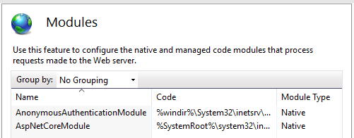

# Using IIS Modules with ASP.NET Core

By [Luke Latham](https://github.com/guardrex)

ASP.NET Core applications are hosted by IIS in a reverse proxy configuration. Some of the native IIS modules and all of the IIS managed modules aren't available to process requests for ASP.NET Core apps. In many cases, ASP.NET Core offers an alternative to the features of IIS native and managed modules.

## Native Modules

Module | .NET Core Active | ASP.NET Core Option
--- | :---: | ---
**Anonymous Authentication**<br>`AnonymousAuthenticationModule` | Yes | 
**Basic Authentication**<br>`BasicAuthenticationModule` | Yes | 
**Client Certification Mapping Authentication**<br>`CertificateMappingAuthenticationModule` | Yes | 
**CGI**<br>`CgiModule` | No | 
**Configuration Validation**<br>`ConfigurationValidationModule` | Yes | 
**HTTP Errors**<br>`CustomErrorModule` | No | [Status Code Pages Middleware](xref:fundamentals/error-handling#configuring-status-code-pages)
**Custom Logging**<br>`CustomLoggingModule` | Yes | 
**Default Document**<br>`DefaultDocumentModule` | No | [Default Files Middleware](xref:fundamentals/static-files#serve-a-default-document)
**Digest Authentication**<br>`DigestAuthenticationModule` | Yes | 
**Directory Browsing**<br>`DirectoryListingModule` | No | [Directory Browsing Middleware](xref:fundamentals/static-files#enable-directory-browsing)
**Dynamic Compression**<br>`DynamicCompressionModule` | Yes | [Response Compression Middleware](xref:performance/response-compression)
**Tracing**<br>`FailedRequestsTracingModule` | Yes | [ASP.NET Core Logging](xref:fundamentals/logging/index#the-tracesource-provider)
**File Caching**<br>`FileCacheModule` | No | [Response Caching Middleware](xref:performance/caching/middleware)
**HTTP Caching**<br>`HttpCacheModule` | No | [Response Caching Middleware](xref:performance/caching/middleware)
**HTTP Logging**<br>`HttpLoggingModule` | Yes | [ASP.NET Core Logging](xref:fundamentals/logging/index)<br>Implementations: [elmah.io](https://github.com/elmahio/Elmah.Io.Extensions.Logging), [Loggr](https://github.com/imobile3/Loggr.Extensions.Logging), [NLog](https://github.com/NLog/NLog.Extensions.Logging), [Serilog](https://github.com/serilog/serilog-extensions-logging)
**HTTP Redirection**<br>`HttpRedirectionModule` | Yes | [URL Rewriting Middleware](xref:fundamentals/url-rewriting)
**IIS Client Certificate Mapping Authentication**<br>`IISCertificateMappingAuthenticationModule` | Yes | 
**IP and Domain Restrictions**<br>`IpRestrictionModule` | Yes | 
**ISAPI Filters**<br>`IsapiFilterModule` | Yes | [Middleware](xref:fundamentals/middleware)
**ISAPI**<br>`IsapiModule` | Yes | [Middleware](xref:fundamentals/middleware)
**Protocol Support**<br>`ProtocolSupportModule` | Yes | 
**Request Filtering**<br>`RequestFilteringModule` | Yes | [URL Rewriting Middleware `IRule`](xref:fundamentals/url-rewriting#irule-based-rule)
**Request Monitor**<br>`RequestMonitorModule` | Yes | 
**URL Rewriting**<br>`RewriteModule` | Yes† | [URL Rewriting Middleware](xref:fundamentals/url-rewriting)
**Server Side Includes**<br>`ServerSideIncludeModule` | No | 
**Static Compression**<br>`StaticCompressionModule` | No | [Response Compression Middleware](xref:performance/response-compression)
**Static Content**<br>`StaticFileModule` | No | [Static File Middleware](xref:fundamentals/static-files)
**Token Caching**<br>`TokenCacheModule` | Yes | 
**URI Caching**<br>`UriCacheModule` | Yes | 
**URL Authorization**<br>`UrlAuthorizationModule` | Yes | [ASP.NET Core Identity](xref:security/authentication/identity)
**Windows Authentication**<br>`WindowsAuthenticationModule` | Yes | 

†The URL Rewrite Module's `isFile` and `isDirectory` don't work with ASP.NET Core apps due to the changes in [directory structure](xref:host-and-deploy/directory-structure).

## Managed Modules

Module | .NET Core Active | ASP.NET Core Option
--- | :---: | ---
AnonymousIdentification | No | 
DefaultAuthentication | No | 
FileAuthorization | No | 
FormsAuthentication | No | [Cookie Authentication Middleware](xref:security/authentication/cookie)
OutputCache | No | [Response Caching Middleware](xref:performance/caching/middleware)
Profile | No | 
RoleManager | No | 
ScriptModule-4.0 | No | 
Session | No | [Session Middleware](xref:fundamentals/app-state)
UrlAuthorization | No | 
UrlMappingsModule | No | [URL Rewriting Middleware](xref:fundamentals/url-rewriting)
UrlRoutingModule-4.0 | No | [ASP.NET Core  Identity](xref:security/authentication/identity)
WindowsAuthentication | No | 

## IIS Manager application changes

Using IIS Manager to configure settings, the *web.config* file of the app is changed. If deploying an app and including *web.config*, any changes made with IIS Manger are overwritten by the deployed *web.config* file. If changes are made to the server's *web.config* file, copy the updated *web.config* file to the local project immediately.

## Disabling IIS modules

If an IIS module is configured at the server level that must be disabled for an app, an addition to the app's *web.config* file can disable the module. Either leave the module in place and deactivate it using a configuration setting (if available) or remove the module from the app.

### Module deactivation

Many modules offer a configuration setting that allows them to be disabled them without removing them from the app. This is the simplest and quickest way to deactivate a module. For example if wishing to disable the IIS URL Rewrite Module, use the `<httpRedirect>` element as shown below. For more information on disabling modules with configuration settings, follow the links in the *Child Elements* section of [IIS `<system.webServer>`](https://docs.microsoft.com/iis/configuration/system.webServer/).

```xml
<configuration>
  <system.webServer>
     <httpRedirect enabled="false" />
  </system.webServer>
</configuration>
```

### Module removal

If opting to remove a module with a setting in *web.config*, unlock the module and unlock the `<modules>` section of *web.config* first. The steps are outlined below:

1. Unlock the module at the server level. Click on the IIS server in the IIS Manager **Connections** sidebar. Open the **Modules** in the **IIS** area. Click on the module in the list. In the **Actions** sidebar on the right, click **Unlock**. Unlock as many modules as are planned to remove from *web.config* later.

2. Deploy the app without a `<modules>` section in *web.config*. If an app is deployed with a *web.config* containing the `<modules>` section without having unlocked the section first in the IIS Manager, the Configuration Manager throws an exception when attempting to unlock the section. Therefore, deploy the app without a `<modules>` section.

3. Unlock the `<modules>` section of *web.config*. In the **Connections** sidebar, click the website in **Sites**. In the **Management** area, open the **Configuration Editor**. Use the navigation controls to select the `system.webServer/modules` section. In the **Actions** sidebar on the right, click to **Unlock** the section.

4. At this point, a `<modules>` section can be added to the *web.config* file with a `<remove>` element to remove the module from the app. Multiple `<remove>` elements can be added to remove multiple modules. Don't forget that if *web.config* changes are made on the server to make them immediately in the project locally. Removing a module this way won't affect the use of the module with other apps on the server.

  ```xml
  <configuration> 
    <system.webServer> 
      <modules> 
        <remove name="MODULE_NAME" /> 
      </modules> 
    </system.webServer> 
  </configuration>
  ```

For an IIS installation with the default modules installed, use the following `<module>` section to remove the default modules.

```xml
<modules>
  <remove name="CustomErrorModule" />
  <remove name="DefaultDocumentModule" />
  <remove name="DirectoryListingModule" />
  <remove name="HttpCacheModule" />
  <remove name="HttpLoggingModule" />
  <remove name="ProtocolSupportModule" />
  <remove name="RequestFilteringModule" />
  <remove name="StaticCompressionModule" /> 
  <remove name="StaticFileModule" /> 
</modules>
```

An IIS module can also be removed with *Appcmd.exe*. Provide the `MODULE_NAME` and `APPLICATION_NAME` in the command shown below:

```console
Appcmd.exe delete module MODULE_NAME /app.name:APPLICATION_NAME
```

Here's how to remove the `DynamicCompressionModule` from the Default Web Site:

```console
%windir%\system32\inetsrv\appcmd.exe delete module DynamicCompressionModule /app.name:"Default Web Site"
```

## Minimum module configuration

The only modules required to run an ASP.NET Core app are the Anonymous Authentication Module and the ASP.NET Core Module.



## Additional resources

* [Host on Windows with IIS](xref:host-and-deploy/iis/index)
* [IIS Modules Overview](https://docs.microsoft.com/iis/get-started/introduction-to-iis/iis-modules-overview)
* [Customizing IIS 7.0 Roles and Modules](https://technet.microsoft.com/library/cc627313.aspx)
* [IIS `<system.webServer>`](https://docs.microsoft.com/iis/configuration/system.webServer/)
