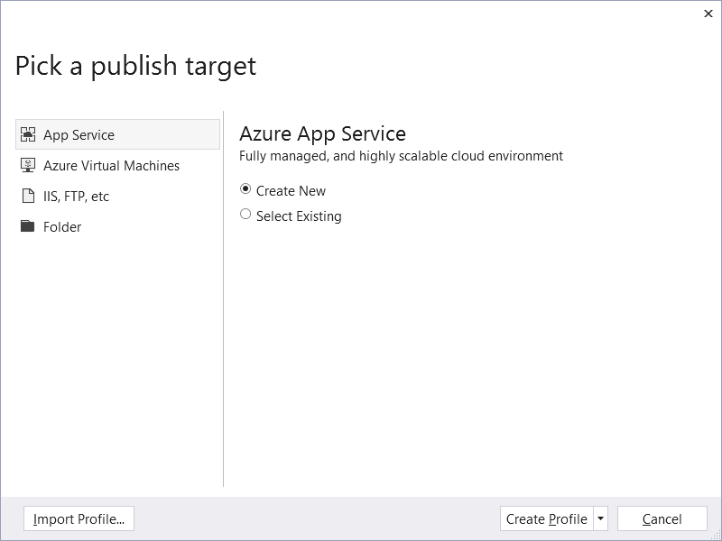
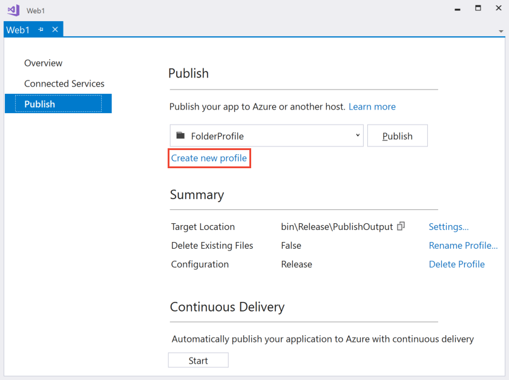

# Visual Studio publish profiles for ASP.NET Core app deployment

By [Sayed Ibrahim Hashimi](https://github.com/sayedihashimi) and [Rick Anderson](https://twitter.com/RickAndMSFT)

::: moniker range="<= aspnetcore-1.1"

For the 1.1 version of this topic, download [Visual Studio publish profiles for ASP.NET Core app deployment (version 1.1, PDF)](https://webpifeed.blob.core.windows.net/webpifeed/Partners/VS_Publish_Profiles_1.1.pdf).

::: moniker-end

This document focuses on using Visual Studio 2017 or later to create and use publish profiles. The publish profiles created with Visual Studio can be run from MSBuild and Visual Studio. See [Publish an ASP.NET Core web app to Azure App Service using Visual Studio](xref:tutorials/publish-to-azure-webapp-using-vs) for instructions on publishing to Azure.

The following project file was created with the command `dotnet new mvc`:

::: moniker range=">= aspnetcore-2.2"

```xml
<Project Sdk="Microsoft.NET.Sdk.Web">

  <PropertyGroup>
    <TargetFramework>netcoreapp2.2</TargetFramework>
  </PropertyGroup>

  <ItemGroup>
    <PackageReference Include="Microsoft.AspNetCore.App" />
  </ItemGroup>

</Project>
```

::: moniker-end

::: moniker range="< aspnetcore-2.2"

```xml
<Project Sdk="Microsoft.NET.Sdk.Web">

  <PropertyGroup>
    <TargetFramework>netcoreapp2.1</TargetFramework>
  </PropertyGroup>

  <ItemGroup>
    <PackageReference Include="Microsoft.AspNetCore.App" />
  </ItemGroup>

</Project>
```

::: moniker-end

The `<Project>` element's `Sdk` attribute accomplishes the following tasks:

* Imports the properties file from *$(MSBuildSDKsPath)\Microsoft.NET.Sdk.Web\Sdk\Sdk.Props* at the beginning.
* Imports the targets file from *$(MSBuildSDKsPath)\Microsoft.NET.Sdk.Web\Sdk\Sdk.targets* at the end.

The default location for `MSBuildSDKsPath` (with Visual Studio 2017 Enterprise) is the *%programfiles(x86)%\Microsoft Visual Studio\2017\Enterprise\MSBuild\Sdks* folder.

The `Microsoft.NET.Sdk.Web` SDK depends on:

* *Microsoft.NET.Sdk.Web.ProjectSystem*
* *Microsoft.NET.Sdk.Publish*

Which causes the following properties and targets to be imported:

* *$(MSBuildSDKsPath)\Microsoft.NET.Sdk.Web.ProjectSystem\Sdk\Sdk.Props*
* *$(MSBuildSDKsPath)\Microsoft.NET.Sdk.Web.ProjectSystem\Sdk\Sdk.targets*
* *$(MSBuildSDKsPath)\Microsoft.NET.Sdk.Publish\Sdk\Sdk.Props*
* *$(MSBuildSDKsPath)\Microsoft.NET.Sdk.Publish\Sdk\Sdk.targets*

Publish targets import the right set of targets based on the publish method used.

When MSBuild or Visual Studio loads a project, the following high-level actions occur:

* Build project
* Compute files to publish
* Publish files to destination

## Compute project items

When the project is loaded, the project items (files) are computed. The `item type` attribute determines how the file is processed. By default, *.cs* files are included in the `Compile` item list. Files in the `Compile` item list are compiled.

The `Content` item list contains files that are published in addition to the build outputs. By default, files matching the pattern `wwwroot/**` are included in the `Content` item. The `wwwroot/\*\*` [globbing pattern](https://gruntjs.com/configuring-tasks#globbing-patterns) matches all files in the *wwwroot* folder **and** subfolders. To explicitly add a file to the publish list, add the file directly in the *.csproj* file as shown in [Include Files](#include-files).

When selecting the **Publish** button in Visual Studio or when publishing from the command line:

* The properties/items are computed (the files that are needed to build).
* **Visual Studio only**: NuGet packages are restored. (Restore needs to be explicit by the user on the CLI.)
* The project builds.
* The publish items are computed (the files that are needed to publish).
* The project is published (the computed files are copied to the publish destination).

When an ASP.NET Core project references `Microsoft.NET.Sdk.Web` in the project file, an *app_offline.htm* file is placed at the root of the web app directory. When the file is present, the ASP.NET Core Module gracefully shuts down the app and serves the *app_offline.htm* file during the deployment. For more information, see the [ASP.NET Core Module configuration reference](xref:host-and-deploy/aspnet-core-module#app_offlinehtm).

## Basic command-line publishing

Command-line publishing works on all .NET Core-supported platforms and doesn't require Visual Studio. In the samples below, the [dotnet publish](/dotnet/core/tools/dotnet-publish) command is run from the project directory (which contains the *.csproj* file). If not in the project folder, explicitly pass in the project file path. For example:

```console
dotnet publish C:\Webs\Web1
```

Run the following commands to create and publish a web app:

```console
dotnet new mvc
dotnet publish
```

The [dotnet publish](/dotnet/core/tools/dotnet-publish) command produces output similar to the following:

```console
C:\Webs\Web1>dotnet publish
Microsoft (R) Build Engine version 15.3.409.57025 for .NET Core
Copyright (C) Microsoft Corporation. All rights reserved.

  Web1 -> C:\Webs\Web1\bin\Debug\netcoreapp2.0\Web1.dll
  Web1 -> C:\Webs\Web1\bin\Debug\netcoreapp2.0\publish\
```

The default publish folder is `bin\$(Configuration)\netcoreapp<version>\publish`. The default for `$(Configuration)` is *Debug*. In the preceding sample, the `<TargetFramework>` is `netcoreapp2.0`.

`dotnet publish -h` displays help information for publish.

The following command specifies a `Release` build and the publishing directory:

```console
dotnet publish -c Release -o C:\MyWebs\test
```

The [dotnet publish](/dotnet/core/tools/dotnet-publish) command calls MSBuild, which invokes the `Publish` target. Any parameters passed to `dotnet publish` are passed to MSBuild. The `-c` parameter maps to the `Configuration` MSBuild property. The `-o` parameter maps to `OutputPath`.

MSBuild properties can be passed using either of the following formats:

* `p:<NAME>=<VALUE>`
* `/p:<NAME>=<VALUE>`

The following command publishes a `Release` build to a network share:

`dotnet publish -c Release /p:PublishDir=//r8/release/AdminWeb`

The network share is specified with forward slashes (*//r8/*) and works on all .NET Core supported platforms.

Confirm that the published app for deployment isn't running. Files in the *publish* folder are locked when the app is running. Deployment can't occur because locked files can't be copied.

## Publish profiles

This section uses Visual Studio 2017 or later to create a publishing profile. Once the profile is created, publishing from Visual Studio or the command line is available.

Publish profiles can simplify the publishing process, and any number of profiles can exist. Create a publish profile in Visual Studio by choosing one of the following paths:

* Right-click the project in Solution Explorer and select **Publish**.
* Select **Publish {PROJECT NAME}** from the **Build** menu.

The **Publish** tab of the app capacities page is displayed. If the project lacks a publish profile, the following page is displayed:



When **Folder** is selected, specify a folder path to store the published assets. The default folder is *bin\Release\PublishOutput*. Click the **Create Profile** button to finish.

Once a publish profile is created, the **Publish** tab changes. The newly created profile appears in a drop-down list. Click **Create new profile** to create another new profile.



The Publish wizard supports the following publish targets:

* Azure App Service
* Azure Virtual Machines
* IIS, FTP, etc. (for any web server)
* Folder
* Import Profile

For more information, see [What publishing options are right for me](/visualstudio/ide/not-in-toc/web-publish-options).

When creating a publish profile with Visual Studio, a *Properties/PublishProfiles/{PROFILE NAME}.pubxml* MSBuild file is created. The *.pubxml* file is a MSBuild file and contains publish configuration settings. This file can be changed to customize the build and publish process. This file is read by the publishing process. `<LastUsedBuildConfiguration>` is special because it's a global property and shouldn't be in any file that's imported in the build. See [MSBuild: how to set the configuration property](http://sedodream.com/2012/10/27/MSBuildHowToSetTheConfigurationProperty.aspx) for more information.

When publishing to an Azure target, the *.pubxml* file contains your Azure subscription identifier. With that target type, adding this file to source control is discouraged. When publishing to a non-Azure target, it's safe to check in the *.pubxml* file.

Sensitive information (like the publish password) is encrypted on a per user/machine level. It's stored in the *Properties/PublishProfiles/{PROFILE NAME}.pubxml.user* file. Because this file can store sensitive information, it shouldn't be checked into source control.

For an overview of how to publish a web app on ASP.NET Core, see [Host and deploy](xref:host-and-deploy/index). The MSBuild tasks and targets necessary to publish an ASP.NET Core app are open-source at https://github.com/aspnet/websdk.

`dotnet publish` can use folder, MSDeploy, and [Kudu](https://github.com/projectkudu/kudu/wiki) publish profiles:

Folder (works cross-platform):

```console
dotnet publish WebApplication.csproj /p:PublishProfile=<FolderProfileName>
```

MSDeploy (currently this only works in Windows since MSDeploy isn't cross-platform):

```console
dotnet publish WebApplication.csproj /p:PublishProfile=<MsDeployProfileName> /p:Password=<DeploymentPassword>
```

MSDeploy package (currently this only works in Windows since MSDeploy isn't cross-platform):

```console
dotnet publish WebApplication.csproj /p:PublishProfile=<MsDeployPackageProfileName>
```

In the preceding samples, **don't** pass `deployonbuild` to `dotnet publish`.

For more information, see [Microsoft.NET.Sdk.Publish](https://github.com/aspnet/websdk#microsoftnetsdkpublish).

`dotnet publish` supports Kudu APIs to publish to Azure from any platform. Visual Studio publish supports the Kudu APIs, but it's supported by WebSDK for cross-platform publish to Azure.

Add a publish profile to the *Properties/PublishProfiles* folder with the following content:

```xml
<Project>
  <PropertyGroup>
    <PublishProtocol>Kudu</PublishProtocol>
    <PublishSiteName>nodewebapp</PublishSiteName>
    <UserName>username</UserName>
    <Password>password</Password>
  </PropertyGroup>
</Project>
```

Run the following command to zip up the publish contents and publish it to Azure using the Kudu APIs:

```console
dotnet publish /p:PublishProfile=Azure /p:Configuration=Release
```

Set the following MSBuild properties when using a publish profile:

* `DeployOnBuild=true`
* `PublishProfile={PUBLISH PROFILE}`

When publishing with a profile named *FolderProfile*, either of the commands below can be executed:

* `dotnet build /p:DeployOnBuild=true /p:PublishProfile=FolderProfile`
* `msbuild      /p:DeployOnBuild=true /p:PublishProfile=FolderProfile`

When invoking [dotnet build](/dotnet/core/tools/dotnet-build), it calls `msbuild` to run the build and publish process. Calling either `dotnet build` or `msbuild` is equivalent when passing in a folder profile. When calling MSBuild directly on Windows, the .NET Framework version of MSBuild is used. MSDeploy is currently limited to Windows machines for publishing. Calling `dotnet build` on a non-folder profile invokes MSBuild, and MSBuild uses MSDeploy on non-folder profiles. Calling `dotnet build` on a non-folder profile invokes MSBuild (using MSDeploy) and results in a failure (even when running on a Windows platform). To publish with a non-folder profile, call MSBuild directly.

The following folder publish profile was created with Visual Studio and publishes to a network share:

```xml
<?xml version="1.0" encoding="utf-8"?>
<!--
This file is used by the publish/package process of your Web project.
You can customize the behavior of this process by editing this 
MSBuild file.
-->
<Project ToolsVersion="4.0" xmlns="http://schemas.microsoft.com/developer/msbuild/2003">
  <PropertyGroup>
    <WebPublishMethod>FileSystem</WebPublishMethod>
    <PublishProvider>FileSystem</PublishProvider>
    <LastUsedBuildConfiguration>Release</LastUsedBuildConfiguration>
    <LastUsedPlatform>Any CPU</LastUsedPlatform>
    <SiteUrlToLaunchAfterPublish />
    <LaunchSiteAfterPublish>True</LaunchSiteAfterPublish>
    <ExcludeApp_Data>False</ExcludeApp_Data>
    <PublishFramework>netcoreapp1.1</PublishFramework>
    <ProjectGuid>c30c453c-312e-40c4-aec9-394a145dee0b</ProjectGuid>
    <publishUrl>\\r8\Release\AdminWeb</publishUrl>
    <DeleteExistingFiles>False</DeleteExistingFiles>
  </PropertyGroup>
</Project>
```

Note `<LastUsedBuildConfiguration>` is set to `Release`. When publishing from Visual Studio, the `<LastUsedBuildConfiguration>` configuration property value is set using the value when the publish process is started. The `<LastUsedBuildConfiguration>` configuration property is special and shouldn't be overridden in an imported MSBuild file. This property can be overridden from the command line.

Using the .NET Core CLI:

```console
dotnet build -c Release /p:DeployOnBuild=true /p:PublishProfile=FolderProfile
```

Using MSBuild:

```console
msbuild /p:Configuration=Release /p:DeployOnBuild=true /p:PublishProfile=FolderProfile
```

## Publish to an MSDeploy endpoint from the command line

The following example uses an ASP.NET Core web app created by Visual Studio named *AzureWebApp*. An Azure Apps publish profile is added with Visual Studio. For more information on how to create a profile, see the [Publish profiles](#publish-profiles) section.

To deploy the app using a publish profile, execute the `msbuild` command from a Visual Studio **Developer Command Prompt**. The command prompt is available in the *Visual Studio* folder of the **Start** menu on the Windows taskbar. For easier access, you can add the command prompt to the **Tools** menu in Visual Studio. For more information, see [Developer Command Prompt for Visual Studio](/dotnet/framework/tools/developer-command-prompt-for-vs#run-the-command-prompt-from-inside-visual-studio).

MSBuild uses the following command syntax:

```console
msbuild {PATH} 
    /p:DeployOnBuild=true 
    /p:PublishProfile={PROFILE} 
    /p:Username={USERNAME} 
    /p:Password={PASSWORD}
```

* {PATH} &ndash; Path to the app's project file.
* {PROFILE} &ndash; Name of the publish profile.
* {USERNAME} &ndash; MSDeploy username. The {USERNAME} can be found in the publish profile.
* {PASSWORD} &ndash; MSDeploy password. Obtain the {PASSWORD} from the *{PROFILE}.PublishSettings* file. Download the *.PublishSettings* file from either:
  * Solution Explorer: Select **View** > **Cloud Explorer**. Connect with your Azure subscription. Open **App Services**. Right-click the app. Select **Download Publish Profile**.
  * Azure portal: Select **Get publish profile** in the web app's **Overview** panel.

The following example uses a publish profile named *AzureWebApp - Web Deploy*:

```console
msbuild "AzureWebApp.csproj" 
    /p:DeployOnBuild=true 
    /p:PublishProfile="AzureWebApp - Web Deploy" 
    /p:Username="$AzureWebApp" 
    /p:Password=".........."
```

A publish profile can also be used with the .NET Core CLI [dotnet msbuild](/dotnet/core/tools/dotnet-msbuild) command from a Windows command prompt:

```console
dotnet msbuild "AzureWebApp.csproj"
    /p:DeployOnBuild=true 
    /p:PublishProfile="AzureWebApp - Web Deploy" 
    /p:Username="$AzureWebApp" 
    /p:Password=".........."
```

> [!NOTE]
> The [dotnet msbuild](/dotnet/core/tools/dotnet-msbuild) command is available cross-platform and can compile ASP.NET Core apps on macOS and Linux. However, MSBuild on macOS and Linux isn't capable of deploying an app to Azure or other MSDeploy endpoint. MSDeploy is only available on Windows.

## Exclude files

When publishing ASP.NET Core web apps, the build artifacts and contents of the *wwwroot* folder are included. `msbuild` supports [globbing patterns](https://gruntjs.com/configuring-tasks#globbing-patterns). For example, the following `<Content>` element excludes all text (*.txt*) files from the *wwwroot/content* folder and all its subfolders.

```xml
<ItemGroup>
  <Content Update="wwwroot/content/**/*.txt" CopyToPublishDirectory="Never" />
</ItemGroup>
```

The preceding markup can be added to a publish profile or the *.csproj* file. When added to the *.csproj* file, the rule is added to all publish profiles in the project.

The following `<MsDeploySkipRules>` element excludes all files from the *wwwroot/content* folder:

```xml
<ItemGroup>
  <MsDeploySkipRules Include="CustomSkipFolder">
    <ObjectName>dirPath</ObjectName>
    <AbsolutePath>wwwroot\\content</AbsolutePath>
  </MsDeploySkipRules>
</ItemGroup>
```

`<MsDeploySkipRules>` won't delete the *skip* targets from the deployment site. `<Content>` targeted files and folders are deleted from the deployment site. For example, suppose a deployed web app had the following files:

* *Views/Home/About1.cshtml*
* *Views/Home/About2.cshtml*
* *Views/Home/About3.cshtml*

If the following `<MsDeploySkipRules>` elements are added, those files wouldn't be deleted on the deployment site.

```xml
<ItemGroup>
  <MsDeploySkipRules Include="CustomSkipFile">
    <ObjectName>filePath</ObjectName>
    <AbsolutePath>Views\\Home\\About1.cshtml</AbsolutePath>
  </MsDeploySkipRules>

  <MsDeploySkipRules Include="CustomSkipFile">
    <ObjectName>filePath</ObjectName>
    <AbsolutePath>Views\\Home\\About2.cshtml</AbsolutePath>
  </MsDeploySkipRules>

  <MsDeploySkipRules Include="CustomSkipFile">
    <ObjectName>filePath</ObjectName>
    <AbsolutePath>Views\\Home\\About3.cshtml</AbsolutePath>
  </MsDeploySkipRules>
</ItemGroup>
```

The preceding `<MsDeploySkipRules>` elements prevent the *skipped* files from being deployed. It won't delete those files once they're deployed.

The following `<Content>` element deletes the targeted files at the deployment site:

```xml
<ItemGroup>
  <Content Update="Views/Home/About?.cshtml" CopyToPublishDirectory="Never" />
</ItemGroup>
```

Using command-line deployment with the preceding `<Content>` element yields the following output:

```console
MSDeployPublish:
  Starting Web deployment task from source: manifest(C:\Webs\Web1\obj\Release\netcoreapp1.1\PubTmp\Web1.SourceManifest.
  xml) to Destination: auto().
  Deleting file (Web11112\Views\Home\About1.cshtml).
  Deleting file (Web11112\Views\Home\About2.cshtml).
  Deleting file (Web11112\Views\Home\About3.cshtml).
  Updating file (Web11112\web.config).
  Updating file (Web11112\Web1.deps.json).
  Updating file (Web11112\Web1.dll).
  Updating file (Web11112\Web1.pdb).
  Updating file (Web11112\Web1.runtimeconfig.json).
  Successfully executed Web deployment task.
  Publish Succeeded.
Done Building Project "C:\Webs\Web1\Web1.csproj" (default targets).
```

## Include files

The following markup includes an *images* folder outside the project directory to the *wwwroot/images* folder of the publish site:

```xml
<ItemGroup>
  <_CustomFiles Include="$(MSBuildProjectDirectory)/../images/**/*" />
  <DotnetPublishFiles Include="@(_CustomFiles)">
    <DestinationRelativePath>wwwroot/images/%(RecursiveDir)%(Filename)%(Extension)</DestinationRelativePath>
  </DotnetPublishFiles>
</ItemGroup>
```

The markup can be added to the *.csproj* file or the publish profile. If it's added to the *.csproj* file, it's included in each publish profile in the project.

The following highlighted markup shows how to:

* Copy a file from outside the project into the *wwwroot* folder.
* Exclude the *wwwroot\Content* folder.
* Exclude *Views\Home\About2.cshtml*.

```xml
<?xml version="1.0" encoding="utf-8"?>
<!--
This file is used by the publish/package process of your Web project.
You can customize the behavior of this process by editing this 
MSBuild file.
-->
<Project ToolsVersion="4.0" xmlns="http://schemas.microsoft.com/developer/msbuild/2003">
  <PropertyGroup>
    <WebPublishMethod>FileSystem</WebPublishMethod>
    <PublishProvider>FileSystem</PublishProvider>
    <LastUsedBuildConfiguration>Release</LastUsedBuildConfiguration>
    <LastUsedPlatform>Any CPU</LastUsedPlatform>
    <SiteUrlToLaunchAfterPublish />
    <LaunchSiteAfterPublish>True</LaunchSiteAfterPublish>
    <ExcludeApp_Data>False</ExcludeApp_Data>
    <PublishFramework />
    <ProjectGuid>afa9f185-7ce0-4935-9da1-ab676229d68a</ProjectGuid>
    <publishUrl>bin\Release\PublishOutput</publishUrl>
    <DeleteExistingFiles>False</DeleteExistingFiles>
  </PropertyGroup>
  <ItemGroup>
    <ResolvedFileToPublish Include="..\ReadMe2.MD">
      <RelativePath>wwwroot\ReadMe2.MD</RelativePath>
    </ResolvedFileToPublish>

    <Content Update="wwwroot\Content\**\*" CopyToPublishDirectory="Never" />
    <Content Update="Views\Home\About2.cshtml" CopyToPublishDirectory="Never" />

  </ItemGroup>
</Project>
```

See the [WebSDK Readme](https://github.com/aspnet/websdk) for more deployment samples.

## Run a target before or after publishing

The built-in `BeforePublish` and `AfterPublish` targets execute a target before or after the publish target. Add the following elements to the publish profile to log console messages both before and after publishing:

```xml
<Target Name="CustomActionsBeforePublish" BeforeTargets="BeforePublish">
    <Message Text="Inside BeforePublish" Importance="high" />
  </Target>
  <Target Name="CustomActionsAfterPublish" AfterTargets="AfterPublish">
    <Message Text="Inside AfterPublish" Importance="high" />
</Target>
```

## Publish to a server using an untrusted certificate

Add the `<AllowUntrustedCertificate>` property with a value of `True` to the publish profile:

```xml
<PropertyGroup>
  <AllowUntrustedCertificate>True</AllowUntrustedCertificate>
</PropertyGroup>
```

## The Kudu service

To view the files in an Azure App Service web app deployment, use the [Kudu service](https://github.com/projectkudu/kudu/wiki/Accessing-the-kudu-service). Append the `scm` token to the web app name. For example:

| URL                                    | Result       |
| -------------------------------------- | ------------ |
| `http://mysite.azurewebsites.net/`     | Web App      |
| `http://mysite.scm.azurewebsites.net/` | Kudu service |

Select the [Debug Console](https://github.com/projectkudu/kudu/wiki/Kudu-console) menu item to view, edit, delete, or add files.

## Additional resources

* [Web Deploy](https://www.iis.net/downloads/microsoft/web-deploy) (MSDeploy) simplifies deployment of web apps and websites to IIS servers.
* [https://github.com/aspnet/websdk](https://github.com/aspnet/websdk/issues): File issues and request features for deployment.
* [Publish an ASP.NET Web App to an Azure VM from Visual Studio](/azure/virtual-machines/windows/publish-web-app-from-visual-studio)
