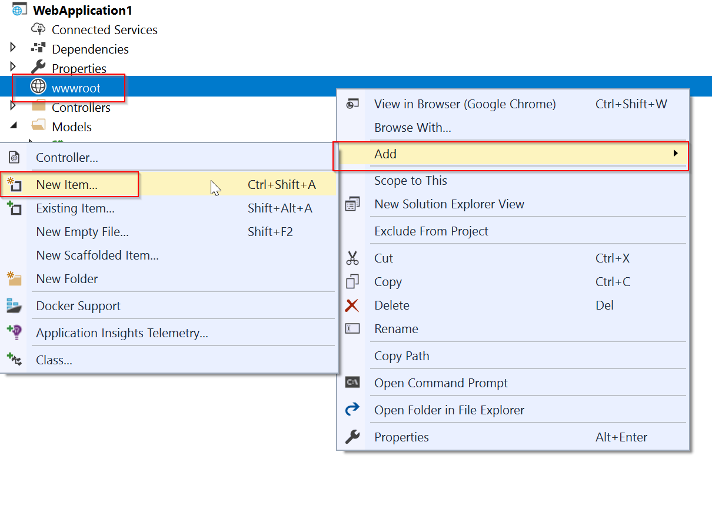
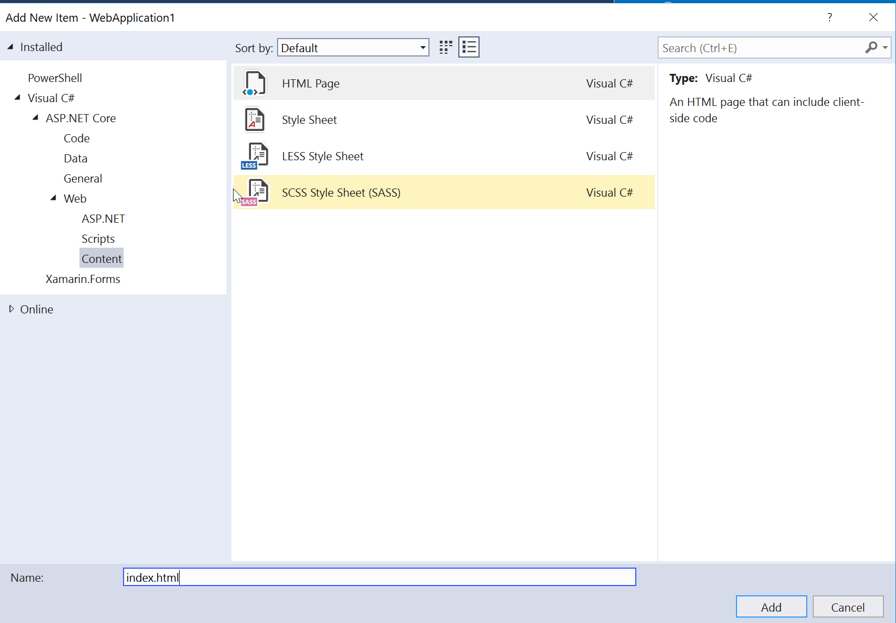
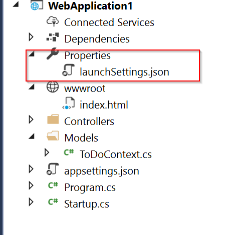

## Call the Web API with jQuery

In this section, an HTML page is added that uses jQuery to call the Web API. jQuery initiates the request and updates the page with the details from the API's response. To Add an HTML page in ASP.NET Core, the **ApplicationBuilder** needs to be configured to use static files and to use the default files used on the web. For more information on this, see [Work with static files in ASP.NET Core](xref:fundamentals/static-files).

```csharp
        public void Configure(IApplicationBuilder app, IHostingEnvironment env)
        {
            if (env.IsDevelopment())
            {
                app.UseDeveloperExceptionPage();
            }
            app.UseDefaultFiles();
            app.UseStaticFiles();

            app.UseMvc();
        }
```

In this example, adding a simple `index.html` page in the wwwroot of the project is all that is needed.





   Add an HTML page with the following:

[!code-html[Main](samples/sample3.html)]

One additional step to that may be needed when testing this HTML page locally is to change the Launch Settings for the ASP.NET Core project. That can be done by opening **launchSettings.json** that is in the Properties section of the project.



Removing the `launchUrl` variable will force the application to open to the root at launch, which will be `index.html`.

```json
{
  "iisSettings": {
    "windowsAuthentication": false,
    "anonymousAuthentication": true,
    "iisExpress": {
      "applicationUrl": "http://localhost:1277/",
      "sslPort": 0
    }
  },
  "profiles": {
    "IIS Express": {
      "commandName": "IISExpress",
      "launchBrowser": true,
      "environmentVariables": {
        "ASPNETCORE_ENVIRONMENT": "Development"
      }
    },
    "WebApplication1": {
      "commandName": "Project",
      "launchBrowser": true,
      "environmentVariables": {
        "ASPNETCORE_ENVIRONMENT": "Development"
      },
      "applicationUrl": "http://localhost:1278/"
    }
  }
}
```

There are several ways to get jQuery. In the preceding snippet, the library is loaded from a CDN. This sample is a complete CRUD Example of calling the Api with jQuery. There are additional features in this sample to make the experience richer. Below are explanations around the calls to the Api.

### Get a list of ToDos

To get a list of ToDos, send an HTTP GET request to &quot;/api/todo&quot;.

The jQuery [ajax](http://api.jquery.com/jquery.ajax/) function sends an AJAX request to the API, which returns JSON representing an object or array. This function can handle all forms of Http interaction, sending an Http request to the specified `url`. Here `GET` is used as `type`. The `success` option specifies a callback function that is called if the request succeeds. In the callback, the DOM is updated with the ToDo information.

[!code-javascript[Main](samples/sample4.html)]

### Add a ToDo

To add a ToDo, send an HTTP POST request to &quot;/api/todo/&quot;, where the request body contains a ToDo object. The [ajax](http://api.jquery.com/jquery.ajax/) in this case is using `POST` to call the Api. For `POST` and `PUT`, a body is sent in the request, which represents the data sent to the Api. Since the Api is expecting a JSON body, the `accepts` and `contentType` options are set tpo `application/json` to specify how the data is being sent. Lastly, the data is converted to a JSON object using [`JSON.stringify()`](https://developer.mozilla.org/en-US/docs/Web/JavaScript/Reference/Global_Objects/JSON/stringify). If the Api returns a success, we call the above mentioned getData() function to update our table.

[!code-javascript[Main](samples/sample5.js)]

### Update a ToDo

Updating a ToDo is very similar to adding one, since both rely on a body to be added to the request. The only real difference between the two in this case is that the `url` changes to add the **id** of the item, and the `type` is `PUT`.

[!code-javascript[Main](samples/sample6.js)]

### Delete a ToDo

Deleting a ToDo is done by setting the `type` on the ajax call to `DELETE` and specifing the item's id in the url.

[!code-javascript[Main](samples/sample6.js)]