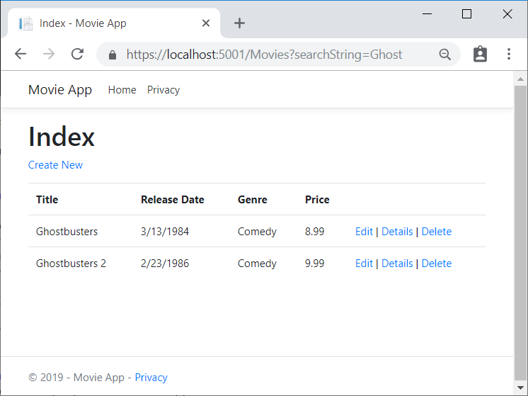
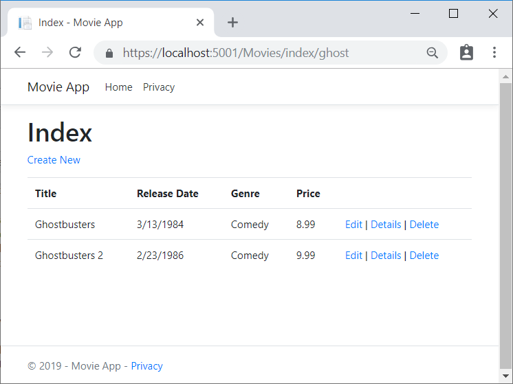
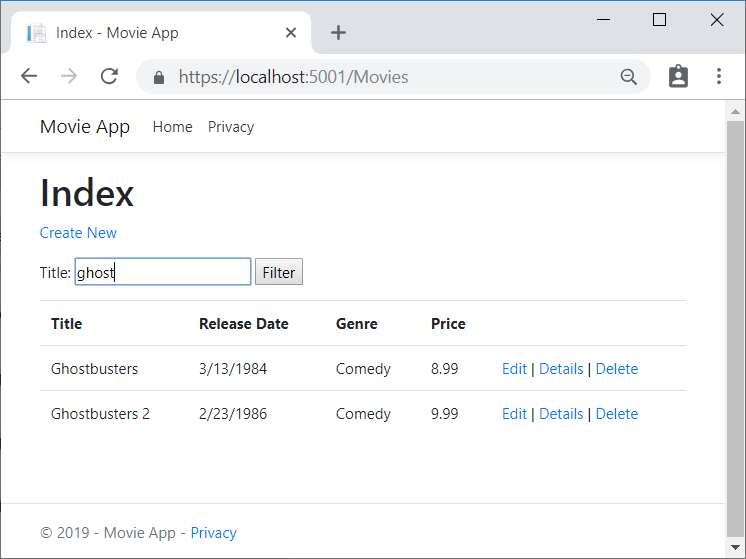
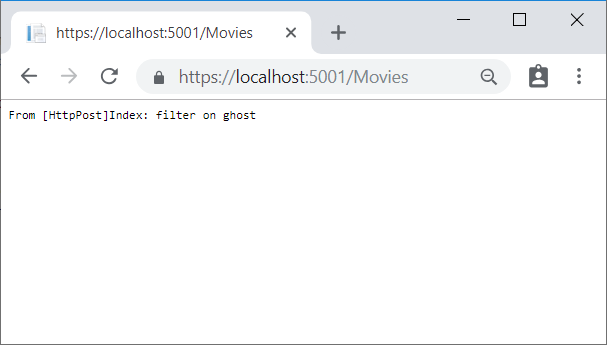
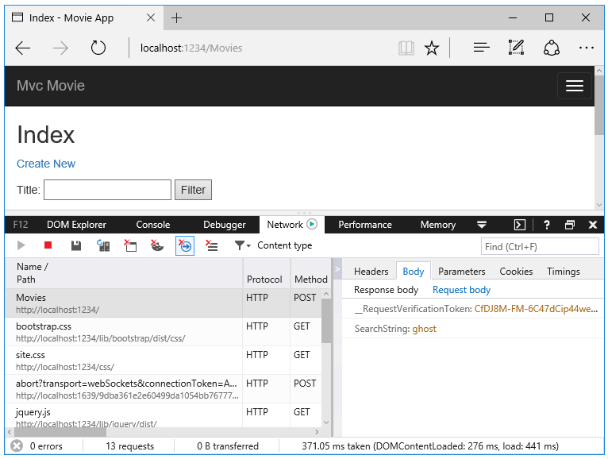

<!--
[!code-html[Main](../../tutorials/first-mvc-app/start-mvc/sample/MvcMovie/Views/Shared/_Layout.cshtml?highlight=7,31)]

[!code-csharp[Main](../../tutorials/first-mvc-app/start-mvc/sample/MvcMovie/Controllers/MoviesController.cs?name=snippet_1stSearch)]

[!code-csharp[Main](../../tutorials/first-mvc-app/start-mvc/sample/MvcMovie/Controllers/MoviesController.cs?name=snippet_SearchNull)]

[!code-csharp[Main](../../tutorials/first-mvc-app/start-mvc/sample/MvcMovie/Startup.cs?highlight=5&name=snippet_1)]

--> 

The previous `Index` method:

[!code-csharp[Main](../../tutorials/first-mvc-app/start-mvc/sample/MvcMovie/Controllers/MoviesController.cs?highlight=1,8&name=snippet_1stSearch)]

The updated `Index` method with `id` parameter:

[!code-csharp[Main](../../tutorials/first-mvc-app/start-mvc/sample/MvcMovie/Controllers/MoviesController.cs?highlight=1,8&name=snippet_SearchID)]

You can now pass the search title as route data (a URL segment) instead of as a query string value.

However, you can't expect users to modify the URL every time they want to search for a movie. So now you'll add UI to help them filter movies. If you changed the signature of the `Index` method to test how to pass the route-bound `ID` parameter, change it back so that it takes a parameter named `searchString`:

[!code-csharp[Main](../../tutorials/first-mvc-app/start-mvc/sample/MvcMovie/Controllers/MoviesController.cs?highlight=1&name=snippet_1stSearch)]

Open the *Views/Movies/Index.cshtml* file, and add the `<form>` markup highlighted below:

[!code-HTML[Main](../../tutorials/first-mvc-app/start-mvc/sample/MvcMovie/Views/Movies/IndexForm1.cshtml?highlight=10-16&range=4-21)]

The HTML `<form>` tag uses the [Form Tag Helper](../../mvc/views/working-with-forms.md), so when you submit the form, the filter string is posted to the `Index` action of the movies controller. Save your changes and then test the filter.

There's no `[HttpPost]` overload of the `Index` method as you might expect. You don't need it, because the method isn't changing the state of the app, just filtering data.

You could add the following `[HttpPost] Index` method.

[!code-csharp[Main](../../tutorials/first-mvc-app/start-mvc/sample/MvcMovie/Controllers/MoviesController.cs?highlight=1&name=snippet_SearchPost)]

The `notUsed` parameter is used to create an overload for the `Index` method. We'll talk about that later in the tutorial.

If you add this method, the action invoker would match the `[HttpPost] Index` method, and the `[HttpPost] Index` method would run as shown in the image below.

However, even if you add this `[HttpPost]` version of the `Index` method, there's a limitation in how this has all been implemented. Imagine that you want to bookmark a particular search or you want to send a link to friends that they can click in order to see the same filtered list of movies. Notice that the URL for the HTTP POST request is the same as the URL for the GET request (localhost:xxxxx/Movies/Index) -- there's no search information in the URL. The search string information is sent to the server as a [form field value](https://developer.mozilla.org/docs/Learn/HTML/Forms/Sending_and_retrieving_form_data). You can verify that with the browser Developer tools or the excellent [Fiddler tool](http://www.telerik.com/fiddler). The image below shows the Chrome browser Developer tools:

You can see the search parameter and [XSRF](../../security/anti-request-forgery.md) token in the request body. Note, as mentioned in the previous tutorial, the [Form Tag Helper](../../mvc/views/working-with-forms.md) generates an [XSRF](../../security/anti-request-forgery.md) anti-forgery token. We're not modifying data, so we don't need to validate the token in the controller method.

Because the search parameter is in the request body and not the URL, you can't capture that search information to bookmark or share with others. We'll fix this by specifying the request should be `HTTP GET`.
