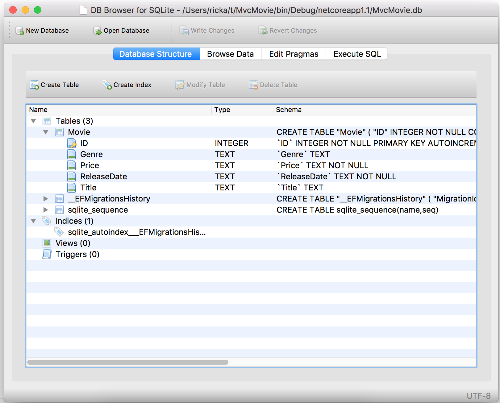

# Working with SQLite in an ASP.NET Core MVC project

By [Rick Anderson](https://twitter.com/RickAndMSFT)

The `MvcMovieContext` object handles the task of connecting to the database and mapping `Movie` objects to database records. The database context is registered with the [Dependency Injection](xref:fundamentals/dependency-injection) container in the `ConfigureServices` method in the *Startup.cs* file:

[!code-csharp[Main](../../tutorials/first-mvc-app-xplat/start-mvc/sample/MvcMovie/Startup.cs?name=snippet2&highlight=6-8)]

## SQLite

The [SQLite](https://www.sqlite.org/) website states:

> SQLite is a self-contained, high-reliability, embedded, full-featured, public-domain, SQL database engine. SQLite is the most used database engine in the world.

There are many third party tools you can download to manage and view a SQLite database. The image below is from [DB Browser for SQLite](http://sqlitebrowser.org/). If you have a favorite SQLite tool, leave a comment on what you like about it.



## Seed the database

Create a new class named `SeedData` in the *Models* folder. Replace the generated code with the following:

[!code-csharp[Main](../../tutorials/first-mvc-app/start-mvc/sample/MvcMovie/Models/SeedData.cs?name=snippet_1)]

If there are any movies in the DB, the seed initializer returns.

```csharp
if (context.Movie.Any())
{
    return;   // DB has been seeded.
}
```

<a name="si"></a>
### Add the seed initializer

Add the seed initializer to the `Main` method in the *Program.cs* file:

[!code-csharp[Main](../../tutorials/first-mvc-app/start-mvc/sample/MvcMovie/Program.cs?highlight=6,16-32)]

### Test the app

Delete all the records in the DB (So the seed method will run). Stop and start the app to seed the database.
   
The app shows the seeded data.


