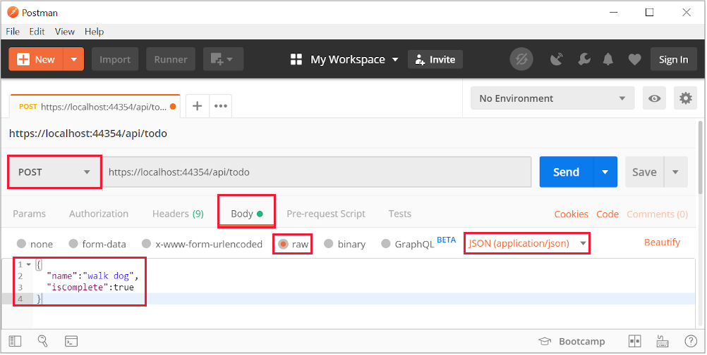
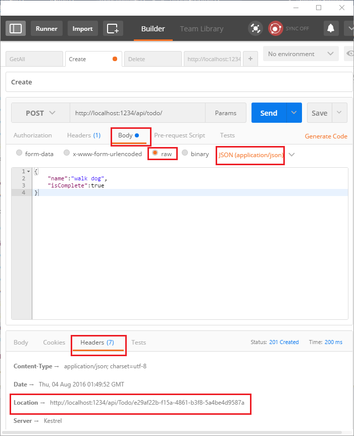
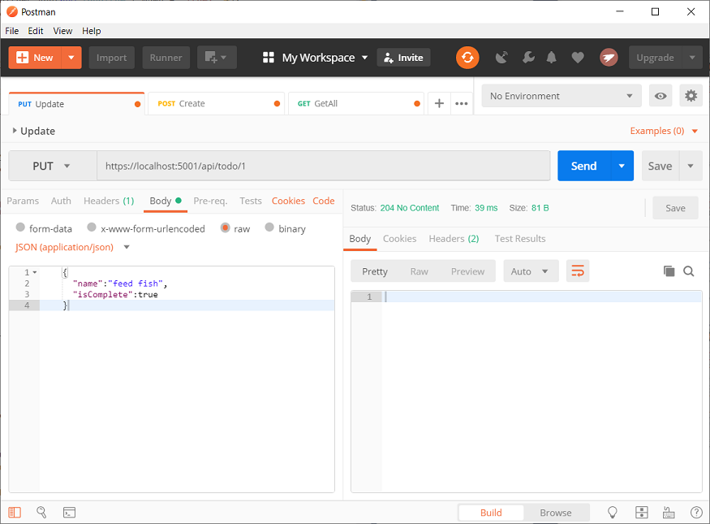
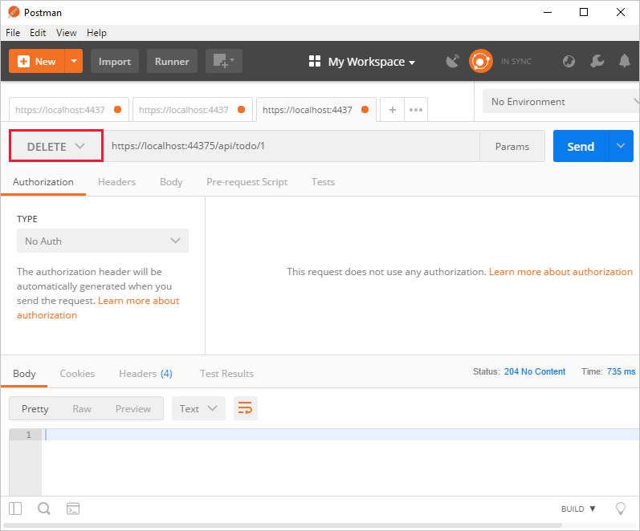

## Implement the other CRUD operations

We'll add `Create`, `Update`, and `Delete` methods to the controller. These are variations on a theme, so I'll just show the code and highlight the main differences. Build the project after adding or changing code.

### Create

[!code-csharp[Main](../../tutorials/first-web-api/sample/TodoApi/Controllers/TodoController.cs?name=snippet_Create)]

This is an HTTP POST method, indicated by the [`[HttpPost]`](https://docs.microsoft.com/aspnet/core/api) attribute. The [`[FromBody]`](https://docs.microsoft.com/aspnet/core/api) attribute tells MVC to get the value of the to-do item from the body of the HTTP request.

The `CreatedAtRoute` method returns a 201 response, which is the standard response for an HTTP POST method that creates a new resource on the server. `CreatedAtRoute` also adds a Location header to the response. The Location header specifies the URI of the newly created to-do item. See [10.2.2 201 Created](http://www.w3.org/Protocols/rfc2616/rfc2616-sec10.html).

### Use Postman to send a Create request



* Set the HTTP method to `POST`
* Select the **Body** radio button
* Select the **raw** radio button
* Set the type to JSON
* In the key-value editor, enter a Todo item such as 

```json
{
	"name":"walk dog",
	"isComplete":true
}
```

* Select **Send**

* Select the Headers tab in the lower pane and copy the **Location** header:



You can use the Location header URI to access the resource you just created. Recall the `GetById` method created the `"GetTodo"` named route:

```csharp
[HttpGet("{id}", Name = "GetTodo")]
public IActionResult GetById(long id)
```

### Update

[!code-csharp[Main](../../tutorials/first-web-api/sample/TodoApi/Controllers/TodoController.cs?name=snippet_Update)]

`Update` is similar to `Create`, but uses HTTP PUT. The response is [204 (No Content)](http://www.w3.org/Protocols/rfc2616/rfc2616-sec9.html). According to the HTTP spec, a PUT request requires the client to send the entire updated entity, not just the deltas. To support partial updates, use HTTP PATCH.



### Delete

[!code-csharp[Main](../../tutorials/first-web-api/sample/TodoApi/Controllers/TodoController.cs?name=snippet_Delete)]

The response is [204 (No Content)](http://www.w3.org/Protocols/rfc2616/rfc2616-sec9.html).


