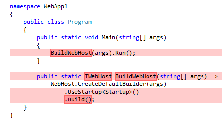
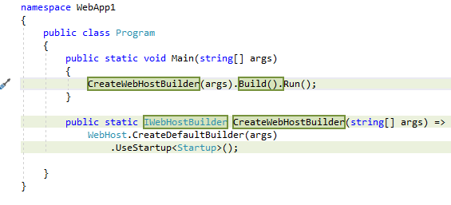

# Migrate from ASP.NET Core 2.0 to 2.1

By [Rick Anderson](https://twitter.com/RickAndMSFT)

See [What's new in ASP.NET Core 2.1](xref:aspnetcore-2.1) for an overview of the new features in ASP.NET Core 2.1.

This article:

* Covers the basics of migrating an ASP.NET Core 2.0 app to 2.1.
* Provides an overview of the changes to the ASP.NET Core web application templates.

A quick way to get an overview of the changes in 2.1 is to:

* Create an ASP.NET Core 2.0 web app named WebApp1.
* Commit the WebApp1 in a source control system.
* Delete WebApp1 and create an ASP.NET Core 2.1 web app named WebApp1 in the same place.
* Review the changes in the 2.1 version.

This article provides an overview on migration to ASP.NET Core 2.1. It doesn't contain a complete list of all changes needed to migrate to version 2.1. Some projects might require more steps depending on the options selected when the project was created and modifications made to the project.

## Update the project file to use 2.1 versions

Update the project file:

* Change the target framework to .NET Core 2.1 by updating the project file to `<TargetFramework>netcoreapp2.1</TargetFramework>`.
* Replace the package reference for `Microsoft.AspNetCore.All` with a package reference for `Microsoft.AspNetCore.App`. You may need to add dependencies that were removed from `Microsoft.AspNetCore.All`. For more information, see <xref:fundamentals/metapackage#migrate> and <xref:fundamentals/metapackage-app>.
* Remove the "Version" attribute on the package reference to `Microsoft.AspNetCore.App`. Projects that use `<Project Sdk="Microsoft.NET.Sdk.Web">` don't need to set the version. The version is implied by the target framework and selected to best match the way ASP.NET Core 2.1 works. For more information, see the [Rules for projects targeting the shared framework](#rules-for-projects-targeting-the-shared-framework) section.
* For apps that target the .NET Framework, update each package reference to 2.1.
* Remove references to **&lt;DotNetCliToolReference&gt;** elements for the following packages. These tools are bundled by default in the .NET Core CLI and don't need to be installed separately.
  * Microsoft.DotNet.Watcher.Tools (`dotnet watch`)
  * Microsoft.EntityFrameworkCore.Tools.DotNet (`dotnet ef`)
  * Microsoft.Extensions.Caching.SqlConfig.Tools  (`dotnet sql-cache`)
  * Microsoft.Extensions.SecretManager.Tools (`dotnet user-secrets`)
* Optional: you can remove the **&lt;DotNetCliToolReference&gt;** element for `Microsoft.VisualStudio.Web.CodeGeneration.Tools`. You can replace this tool with a globally installed version by running `dotnet tool install -g dotnet-aspnet-codegenerator`.
* For 2.1, a [Razor Class Library](xref:razor-pages/ui-class) is the recommended solution to distribute Razor files. If your app uses embedded views, or otherwise relies on runtime compilation of Razor files, add `<CopyRefAssembliesToPublishDirectory>true</CopyRefAssembliesToPublishDirectory>` to a `<PropertyGroup>` in your project file.

The following markup shows the template-generated 2.0 project file:

[!code-xml]

The following markup shows the template-generated 2.1 project file:

[!code-xml]

## Rules for projects targeting the shared framework

A *shared framework* is a set of assemblies (*.dll* files) that are not in the app's folders. The shared framework must be installed on the machine to run the app. For more information, see [The shared framework](https://natemcmaster.com/blog/2018/08/29/netcore-primitives-2/).

ASP.NET Core 2.1 includes the following shared frameworks:

* [Microsoft.AspNetCore.App](xref:fundamentals/metapackage-app)
* [Microsoft.AspNetCore.All](xref:fundamentals/metapackage)

The version specified by the package reference is the *minimum required* version. For example, a project referencing the 2.1.1 versions of these packages won't run on a machine with only the 2.1.0 runtime installed.

Known issues for projects targeting a shared framework:

* The .NET Core 2.1.300 SDK (first included in Visual Studio 15.6) set the implicit version of  `Microsoft.AspNetCore.App` to 2.1.0 which caused conflicts with Entity Framework Core 2.1.1. The recommended solution is to upgrade the .NET Core SDK to 2.1.301 or later. For more information, see [Packages that share dependencies with Microsoft.AspNetCore.App cannot reference patch versions](https://github.com/aspnet/Universe/issues/1180).
* All projects that must use `Microsoft.AspNetCore.All` or `Microsoft.AspNetCore.App` should add a package reference for the package in the project file, even if they contain a project reference to another project using `Microsoft.AspNetCore.All` or `Microsoft.AspNetCore.App`.

  Example:

  * `MyApp` has a package reference to `Microsoft.AspNetCore.App`.
  * `MyApp.Tests` has a project reference to `MyApp.csproj`.

  Add a package reference for `Microsoft.AspNetCore.App` to `MyApp.Tests`. For more information, see [Integration testing is hard to set up and may break on shared framework servicing](https://github.com/dotnet/aspnetcore/issues/3156).

## Update to the 2.1 Docker images

In ASP.NET Core 2.1, the Docker images migrated to the [dotnet/dotnet-docker GitHub repository](https://github.com/dotnet/dotnet-docker). The following table shows the Docker image and tag changes:

|2.0      |2.1      |
|---------|---------|
|microsoft/aspnetcore:2.0        |microsoft/dotnet:2.1-aspnetcore-runtime |
|microsoft/aspnetcore-build:2.0  |microsoft/dotnet:2.1-sdk |

Change the `FROM` lines in your *Dockerfile* to use the new image names and tags in the preceding table's 2.1 column. For more information, see [Migrating from aspnetcore docker repos to dotnet](https://github.com/aspnet/Announcements/issues/298).

## Changes to take advantage of the new code-based idioms that are recommended in ASP.NET Core 2.1

### Changes to Main

The following images show the changes made to the templated generated `Program.cs` file.

The preceding image shows the 2.0 version with the deletions in red.

The following image shows the 2.1 code. The code in green replaced the 2.0 version:

The following code shows the 2.1 version of `Program.cs`:

[!code-csharp]

The new `Main` replaces the call to `BuildWebHost` with <xref:Microsoft.AspNetCore.Mvc.Testing.WebApplicationFactory%601.CreateWebHostBuilder%2A>. <xref:Microsoft.AspNetCore.Hosting.IWebHostBuilder> was added to support a new [integration test infrastructure](xref:test/integration-tests).

### Changes to Startup

The following code shows the changes to 2.1 template generated code. All changes are newly added code, except that `UseBrowserLink` has been removed:

[!code-csharp]

The preceding code changes are detailed in:

* [GDPR support in ASP.NET Core](xref:security/gdpr) for `CookiePolicyOptions` and `UseCookiePolicy`.
* [HTTP Strict Transport Security Protocol (HSTS)](xref:security/enforcing-ssl#http-strict-transport-security-protocol-hsts) for `UseHsts`.
* [Require HTTPS](xref:security/enforcing-ssl#require-https) for `UseHttpsRedirection`.
* [SetCompatibilityVersion](xref:mvc/compatibility-version) for `SetCompatibilityVersion(CompatibilityVersion.Version_2_1)`.

## Changes to authentication code

ASP.NET Core 2.1 provides [ASP.NET Core Identity](xref:security/authentication/identity) as a [Razor Class Library](xref:razor-pages/ui-class) (RCL).

The default 2.1 Identity UI doesn't currently provide significant new features over the 2.0 version. Replacing Identity with the RCL package is optional. The advantages to replacing the template generated Identity code with the RCL version include:

* Many files are moved out of your source tree.
* Any bug fixes or new features to Identity are included in the [Microsoft.AspNetCore.App metapackage](xref:fundamentals/metapackage-app). You automatically get the updated Identity when `Microsoft.AspNetCore.App` is updated.

If you've made non-trivial changes to the template generated Identity code:

* The preceding advantages probably do **not** justify converting to the RCL version.
* You can keep your ASP.NET Core 2.0 Identity code, it's fully supported.

Identity 2.1 exposes endpoints with the `Identity` area. For example, the follow table shows examples of Identity endpoints that change from 2.0 to 2.1:

| 2.0 URL         | 2.1 URL |
| --------------- | ------------ |
| /Account/Login  | /Identity/Account/Login |
| /Account/Logout | /Identity/Account/Logout |
| /Account/Manage | /Identity/Account/Manage |

Applications that have code using Identity and replace 2.0 Identity UI with the 2.1 Identity Library need to take into account Identity URLs have `/Identity` segment prepended to the URIs. One way to handle the new Identity endpoints is to set up redirects, for example from `/Account/Login` to `/Identity/Account/Login`.

### Update Identity to version 2.1

The following options are available to update Identity to 2.1.

* Use the Identity UI 2.0 code with no changes. Using Identity UI 2.0 code is fully supported. This is a good approach when significant changes have been made to the generated Identity code.
* Delete your existing Identity 2.0 code and [Scaffold Identity](xref:security/authentication/scaffold-identity) into your project. Your project will use the [ASP.NET Core Identity](xref:security/authentication/identity) [Razor Class Library](xref:razor-pages/ui-class). You can generate code and UI for any of the Identity UI code that you modified. Apply your code changes to the newly scaffolded UI code.
* Delete your existing Identity 2.0 code and [Scaffold Identity](xref:security/authentication/scaffold-identity) into your project with the option to **Override all files**.

### Replace Identity 2.0 UI with the Identity 2.1 Razor Class Library

This section outlines the steps to replace the ASP.NET Core 2.0 template generated Identity code with the [ASP.NET Core Identity](xref:security/authentication/identity) [Razor Class Library](xref:razor-pages/ui-class). The following steps are for a Razor Pages project, but the approach for an MVC project is similar.

* Verify the [project file is updated to use 2.1 versions](#update-the-project-file-to-use-21-versions)
* Delete the following folders and all the files in them:
  * *Controllers*
  * *Pages/Account/*
  * *Extensions*
* Build the project.
* [Scaffold Identity](xref:security/authentication/scaffold-identity) into your project:
  * Select the projects exiting *\_Layout.cshtml* file.
  * Select the **+** icon on the right side of the **Data context class**. Accept the default name.
  * Select **Add** to create a new Data context class. Creating a new data context is required for to scaffold. You remove the new data context in the next section.

### Update after scaffolding Identity

* Delete the Identity scaffolder generated `IdentityDbContext` derived class in the *Areas/Identity/Data/* folder.
* Delete `Areas/Identity/IdentityHostingStartup.cs`.
* Update the *\_LoginPartial.cshtml* file:
  * Move *Pages/\_LoginPartial.cshtml* to *Pages/Shared/\_LoginPartial.cshtml*.
  * Add `asp-area="Identity"` to the form and anchor links.
  * Update the `<form />` element to `<form asp-area="Identity" asp-page="/Account/Logout" asp-route-returnUrl="@Url.Page("/Index", new { area = "" })" method="post" id="logoutForm" class="navbar-right">`.

  The following code shows the updated *\_LoginPartial.cshtml* file:

  [!code-cshtml]

Update `ConfigureServices` with the following code:

[!code-csharp]

## Changes to Razor Pages projects Razor files

### The layout file

* Move *Pages/\_Layout.cshtml* to *Pages/Shared/\_Layout.cshtml*
* In *Areas/Identity/Pages/\_ViewStart.cshtml*, change `Layout = "/Pages/_Layout.cshtml"` to `Layout = "/Pages/Shared/_Layout.cshtml"`.
* The *\_Layout.cshtml* file has the following changes:

  * `<partial name="_CookieConsentPartial" />` is added. For more information, see [GDPR support in ASP.NET Core](xref:security/gdpr).
  * jQuery changes from 2.2.0 to 3.3.1.

### \_ValidationScriptsPartial.cshtml

* *Pages/\_ValidationScriptsPartial.cshtml* moves to *Pages/Shared/\_ValidationScriptsPartial.cshtml*.
* *jquery.validate/1.14.0* changes to *jquery.validate/1.17.0*.

### New files

The following files are added:

* `Privacy.cshtml`
* `Privacy.cshtml.cs`

See [GDPR support in ASP.NET Core](xref:security/gdpr) for information on the preceding files.

## Changes to MVC projects Razor files

### The layout file

The `Layout.cshtml` file has the following changes:

* `<partial name="_CookieConsentPartial" />` is added.
* jQuery changes from 2.2.0 to 3.3.1

### \_ValidationScriptsPartial.cshtml

*jquery.validate/1.14.0* changes to *jquery.validate/1.17.0*

### New files and action methods

The following are added:

* `Views/Home/Privacy.cshtml`
* The `Privacy` action method is added to the Home controller.

See [GDPR support in ASP.NET Core](xref:security/gdpr) for information on the preceding files.

## Changes to the launchSettings.json file

As ASP.NET Core apps now use HTTPS by default, the `Properties/launchSettings.json` file has changed.

The following JSON shows the earlier 2.0 template-generated `launchSettings.json` file:

[!code-json]

The following JSON shows the new 2.1 template-generated `launchSettings.json` file:

[!code-json]

For more information, see <xref:security/enforcing-ssl>.

## Breaking changes

### FileResult Range header

<xref:Microsoft.AspNetCore.Mvc.FileResult> no longer processes the [Accept-Ranges](https://developer.mozilla.org/docs/Web/HTTP/Headers/Accept-Ranges) header by default. To enable the `Accept-Ranges` header, set <xref:Microsoft.AspNetCore.Mvc.FileResult.EnableRangeProcessing> to `true`.

### ControllerBase.File and PhysicalFile Range header

The following <xref:Microsoft.AspNetCore.Mvc.ControllerBase> methods no longer processes the [Accept-Ranges](https://developer.mozilla.org/docs/Web/HTTP/Headers/Accept-Ranges) header by default:

* Overloads of <xref:Microsoft.AspNetCore.Mvc.ControllerBase.File%2A?displayProperty=nameWithType>
* <xref:Microsoft.AspNetCore.Mvc.ControllerBase.PhysicalFile%2A?displayProperty=nameWithType>

To enable the `Accept-Ranges` header, set the `EnableRangeProcessing` parameter to `true`.

## ASP.NET Core Module (ANCM)

[!INCLUDE]

## Additional changes

* [SetCompatibilityVersion](xref:mvc/compatibility-version)
* [Libuv transport configuration](xref:fundamentals/servers/kestrel#libuv-transport-configuration)
