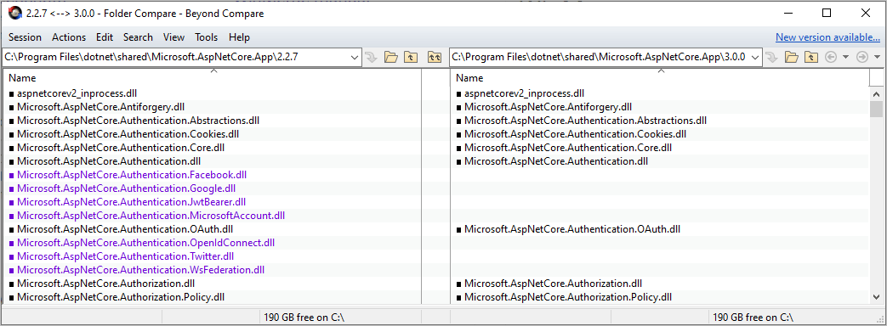
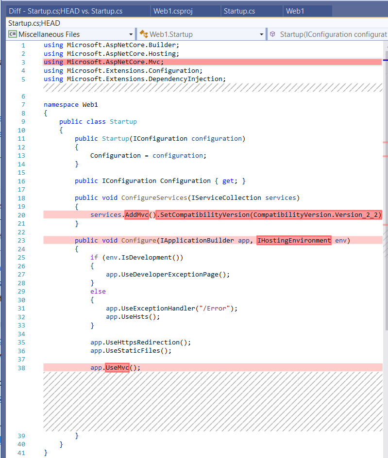
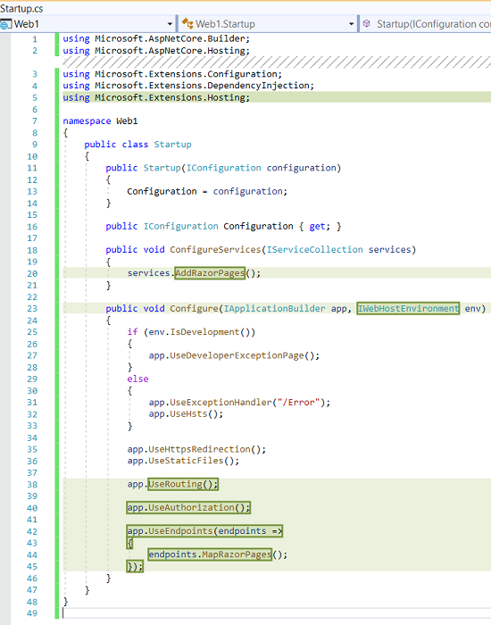

# Migrate from ASP.NET Core 2.2 to 3.0

By [Scott Addie](https://github.com/scottaddie) and [Rick Anderson](https://twitter.com/RickAndMSFT)

This article explains how to update an existing ASP.NET Core 2.2 project to ASP.NET Core 3.0. It might be helpful to create a new ASP.NET Core 3.0 project to:

* Compare with the ASP.NET Core 2.2 code.
* Copy the relevant changes to your ASP.NET Core 3.0 project.

## Prerequisites

# [Visual Studio](#tab/visual-studio)

[!INCLUDE[](~/includes/net-core-prereqs-vs-3.0.md)]

# [Visual Studio Code](#tab/visual-studio-code)

[!INCLUDE[](~/includes/net-core-prereqs-vsc-3.0.md)]

# [Visual Studio for Mac](#tab/visual-studio-mac)

[!INCLUDE[](~/includes/net-core-prereqs-mac-3.0.md)]

---

## Update .NET Core SDK version in global.json

If your solution relies upon a [global.json](/dotnet/core/tools/global-json) file to target a specific .NET Core SDK version, update its `version` property to the 3.0 version installed on your machine:

```json
{
  "sdk": {
    "version": "3.0.100"
  }
}
```

## Update the project file

### Update the Target Framework

ASP.NET Core 3.0 and later only run on .NET Core. Set the [Target Framework Moniker (TFM)](/dotnet/standard/frameworks) to `netcoreapp3.0`:

[!code-xml[](22-to-30/samples/Web1.csproj?highlight=4)]

### Remove obsolete package references

A large number of NuGet packages aren't produced for ASP.NET Core 3.0. Such package references should be removed from your project file. Consider the following project file for an ASP.NET Core 2.2 web app:

```xml
<Project Sdk="Microsoft.NET.Sdk.Web">

  <PropertyGroup>
    <TargetFramework>netcoreapp2.2</TargetFramework>
    <AspNetCoreHostingModel>InProcess</AspNetCoreHostingModel>
  </PropertyGroup>

  <ItemGroup>
    <PackageReference Include="Microsoft.AspNetCore.App"/>
    <PackageReference Include="Microsoft.AspNetCore.Razor.Design" Version="2.2.0" PrivateAssets="All" />
  </ItemGroup>

</Project>
```

The updated project file for ASP.NET Core 3.0:

[!code-xml[](22-to-30/samples/Web1.csproj?highlight=4)]

The updated ASP.NET Core 3.0 project file:

* In the `<PropertyGroup>`:
  * Updates the TFM to `netcoreapp3.0`
  * Removes the `<AspNetCoreHostingModel>` element. For more information, see [In-process hosting model](#in-process-hosting-model) in this document.

* In the `<ItemGroup>`:
  * `Microsoft.AspNetCore.App` is removed. For more information, see [Framework reference](#framework-reference) in this document.
  * `Microsoft.AspNetCore.Razor.Design` is removed and in the following list of packages no longer being produced.

To see the full list of packages that are no longer produced, select the following expand list:

<details>
    <summary>Click to expand the list of packages no longer being produced</summary>
    <ul>
        <li>Microsoft.AspNetCore</li>
        <li>Microsoft.AspNetCore.All</li>
        <li>Microsoft.AspNetCore.App</li>
        <li>Microsoft.AspNetCore.Antiforgery</li>
        <li>Microsoft.AspNetCore.Authentication</li>
        <li>Microsoft.AspNetCore.Authentication.Abstractions</li>
        <li>Microsoft.AspNetCore.Authentication.Cookies</li>
        <li>Microsoft.AspNetCore.Authentication.Core</li>
        <li>Microsoft.AspNetCore.Authentication.OAuth</li>
        <li>Microsoft.AspNetCore.Authorization.Policy</li>
        <li>Microsoft.AspNetCore.CookiePolicy</li>
        <li>Microsoft.AspNetCore.Cors</li>
        <li>Microsoft.AspNetCore.Diagnostics</li>
        <li>Microsoft.AspNetCore.Diagnostics.HealthChecks</li>
        <li>Microsoft.AspNetCore.HostFiltering</li>
        <li>Microsoft.AspNetCore.Hosting</li>
        <li>Microsoft.AspNetCore.Hosting.Abstractions</li>
        <li>Microsoft.AspNetCore.Hosting.Server.Abstractions</li>
        <li>Microsoft.AspNetCore.Http</li>
        <li>Microsoft.AspNetCore.Http.Abstractions</li>
        <li>Microsoft.AspNetCore.Http.Connections</li>
        <li>Microsoft.AspNetCore.Http.Extensions</li>
        <li>Microsoft.AspNetCore.HttpOverrides</li>
        <li>Microsoft.AspNetCore.HttpsPolicy</li>
        <li>Microsoft.AspNetCore.Identity</li>
        <li>Microsoft.AspNetCore.Localization</li>
        <li>Microsoft.AspNetCore.Localization.Routing</li>
        <li>Microsoft.AspNetCore.Mvc</li>
        <li>Microsoft.AspNetCore.Mvc.Abstractions</li>
        <li>Microsoft.AspNetCore.Mvc.Analyzers</li>
        <li>Microsoft.AspNetCore.Mvc.ApiExplorer</li>
        <li>Microsoft.AspNetCore.Mvc.Api.Analyzers</li>
        <li>Microsoft.AspNetCore.Mvc.Core</li>
        <li>Microsoft.AspNetCore.Mvc.Cors</li>
        <li>Microsoft.AspNetCore.Mvc.DataAnnotations</li>
        <li>Microsoft.AspNetCore.Mvc.Formatters.Json</li>
        <li>Microsoft.AspNetCore.Mvc.Formatters.Xml</li>
        <li>Microsoft.AspNetCore.Mvc.Localization</li>
        <li>Microsoft.AspNetCore.Mvc.Razor</li>
        <li>Microsoft.AspNetCore.Mvc.Razor.ViewCompilation</li>
        <li>Microsoft.AspNetCore.Mvc.RazorPages</li>
        <li>Microsoft.AspNetCore.Mvc.TagHelpers</li>
        <li>Microsoft.AspNetCore.Mvc.ViewFeatures</li>
        <li>Microsoft.AspNetCore.Razor</li>
        <li>Microsoft.AspNetCore.Razor.Runtime</li>
        <li>Microsoft.AspNetCore.Razor.Design</li>
        <li>Microsoft.AspNetCore.ResponseCaching</li>
        <li>Microsoft.AspNetCore.ResponseCaching.Abstractions</li>
        <li>Microsoft.AspNetCore.ResponseCompression</li>
        <li>Microsoft.AspNetCore.Rewrite</li>
        <li>Microsoft.AspNetCore.Routing</li>
        <li>Microsoft.AspNetCore.Routing.Abstractions</li>
        <li>Microsoft.AspNetCore.Server.HttpSys</li>
        <li>Microsoft.AspNetCore.Server.IIS</li>
        <li>Microsoft.AspNetCore.Server.IISIntegration</li>
        <li>Microsoft.AspNetCore.Server.Kestrel</li>
        <li>Microsoft.AspNetCore.Server.Kestrel.Core</li>
        <li>Microsoft.AspNetCore.Server.Kestrel.Https</li>
        <li>Microsoft.AspNetCore.Server.Kestrel.Transport.Abstractions</li>
        <li>Microsoft.AspNetCore.Server.Kestrel.Transport.Sockets</li>
        <li>Microsoft.AspNetCore.Session</li>
        <li>Microsoft.AspNetCore.SignalR</li>
        <li>Microsoft.AspNetCore.SignalR.Core</li>
        <li>Microsoft.AspNetCore.StaticFiles</li>
        <li>Microsoft.AspNetCore.WebSockets</li>
        <li>Microsoft.AspNetCore.WebUtilities</li>
        <li>Microsoft.Net.Http.Headers</li>
    </ul>
</details>

### Review breaking changes

[Review breaking changes](#break)

### Framework reference

Features of ASP.NET Core that were available through one of the packages listed above are available as part of the `Microsoft.AspNetCore.App` shared framework. The *shared framework* is the set of assemblies (*.dll* files) that are installed on the machine and includes a runtime component and a targeting pack. For more information, see [The shared framework](https://natemcmaster.com/blog/2018/08/29/netcore-primitives-2/).

* Projects that target the `Microsoft.NET.Sdk.Web` SDK implicitly reference the `Microsoft.AspNetCore.App` framework.

  No additional references are required for these projects:

  ```xml
  <Project Sdk="Microsoft.NET.Sdk.Web">
    <PropertyGroup>
      <TargetFramework>netcoreapp3.0</TargetFramework>
    </PropertyGroup>
      ...
  </Project>
  ```

* Projects that target `Microsoft.NET.Sdk` or `Microsoft.NET.Sdk.Razor` SDK, should add an explicit `FrameworkReference` to `Microsoft.AspNetCore.App`:

  ```xml
  <Project Sdk="Microsoft.NET.Sdk.Razor">
    <PropertyGroup>
      <TargetFramework>netcoreapp3.0</TargetFramework>
    </PropertyGroup>

    <ItemGroup>
      <FrameworkReference Include="Microsoft.AspNetCore.App" />
    </ItemGroup>
      ...
  </Project>
  ```

#### Framework-dependent builds using Docker

Framework-dependent builds of console apps that use a package that depends on the ASP.NET Core [shared framework](https://natemcmaster.com/blog/2018/08/29/netcore-primitives-2/) may give the following runtime error:

```console
It was not possible to find any compatible framework version
The specified framework 'Microsoft.AspNetCore.App', version '3.0.0' was not found.
  - No frameworks were found.
```

`Microsoft.AspNetCore.App` is the shared framework containing the ASP.NET Core runtime and is only present on the `dotnet/core/aspnet` Docker image. The 3.0 SDK reduces the size of framework-dependent builds using ASP.NET Core by not including duplicate copies of libraries that are available in the shared framework. This is a potential savings of up to 18 MB, but it requires that the ASP.NET Core runtime be present / installed to run the app.

To determine if the app has a dependency (either direct or indirect) on the ASP.NET Core shared framework, examine the `runtimeconfig.json` file generated during a build/publish of your app. The following JSON file shows a dependency on the ASP.NET Core shared framework:

```json
{
  "runtimeOptions": {
    "tfm": "netcoreapp3.0",
    "framework": {
      "name": "Microsoft.AspNetCore.App",
      "version": "3.0.0"
    },
    "configProperties": {
      "System.GC.Server": true
    }
  }
}
```

If your app is using Docker, use a base image that includes ASP.NET Core 3.0. For example, `docker pull mcr.microsoft.com/dotnet/core/aspnet:3.0`.

### Add package references for removed assemblies

ASP.NET Core 3.0 removes some assemblies that were previously part of the `Microsoft.AspNetCore.App` package reference. To visualize which assemblies were removed, compare the two shared framework folders. For example, a comparison of versions 2.2.7 and 3.0.0:



To continue using features provided by the removed assemblies, reference the 3.0 versions of the corresponding packages:

* A template-generated web app with **Individual User Accounts** requires adding the following packages:

  [!code-xml[](22-to-30/samples/WebFull.csproj?highlight=9-13)]

* [Microsoft.EntityFrameworkCore](https://www.nuget.org/packages/Microsoft.EntityFrameworkCore)

  For more information on referencing the database provider-specific package, see [Database Providers](/ef/core/providers/index).

* Identity UI

  Support for [Identity UI](xref:security/authentication/identity) can be added by referencing the [Microsoft.AspNetCore.Identity.UI](https://www.nuget.org/packages/Microsoft.AspNetCore.Identity.UI) package.

* SPA Services

  * [Microsoft.AspNetCore.SpaServices](https://www.nuget.org/packages/Microsoft.AspNetCore.SpaServices)
  * [Microsoft.AspNetCore.SpaServices.Extensions](https://www.nuget.org/packages/Microsoft.AspNetCore.SpaServices.Extensions)

* Authentication: Support for third-party authentication flows are available as NuGet packages:

  * Facebook OAuth ([Microsoft.AspNetCore.Authentication.Facebook](https://www.nuget.org/packages/Microsoft.AspNetCore.Authentication.Facebook))
  * Google OAuth ([Microsoft.AspNetCore.Authentication.Google](https://www.nuget.org/packages/Microsoft.AspNetCore.Authentication.Google))
  * Microsoft Account authentication ([Microsoft.AspNetCore.Authentication.MicrosoftAccount](https://www.nuget.org/packages/Microsoft.AspNetCore.Authentication.MicrosoftAccount))
  * OpenID Connect authentication ([Microsoft.AspNetCore.Authentication.OpenIdConnect](https://www.nuget.org/packages/Microsoft.AspNetCore.Authentication.OpenIdConnect))
  * OpenID Connect bearer token ([Microsoft.AspNetCore.Authentication.JwtBearer](https://www.nuget.org/packages/Microsoft.AspNetCore.Authentication.JwtBearer))
  * Twitter OAuth ([Microsoft.AspNetCore.Authentication.Twitter](https://www.nuget.org/packages/Microsoft.AspNetCore.Authentication.Twitter))
  * WsFederation authentication ([Microsoft.AspNetCore.Authentication.WsFederation](https://www.nuget.org/packages/Microsoft.AspNetCore.Authentication.WsFederation))

* Formatting and content negotiation support for `System.Net.HttpClient`: The [Microsoft.AspNet.WebApi.Client](https://www.nuget.org/packages/Microsoft.AspNet.WebApi.Client/) NuGet package provides useful extensibility to `System.Net.HttpClient` with APIs such as `ReadAsAsync` and `PostJsonAsync`. However, this package depends on `Newtonsoft.Json`, not `System.Text.Json`. That means, for example, that serialization property names specified by `JsonPropertyNameAttribute` (`System.Text.Json`) are ignored. There's a newer NuGet package that contains similar extension methods but uses `System.Text.Json`: [System.Net.Http.Json](https://www.nuget.org/packages/System.Net.Http.Json).

* Razor runtime compilation: Support for runtime compilation of Razor views and pages is now part of [Microsoft.AspNetCore.Mvc.Razor.RuntimeCompilation](https://www.nuget.org/packages/Microsoft.AspNetCore.Mvc.Razor.RuntimeCompilation).

* MVC `Newtonsoft.Json` (Json.NET) support: Support for using MVC with `Newtonsoft.Json` is now part of [`Microsoft.AspNetCore.Mvc.NewtonsoftJson`](https://www.nuget.org/packages/Microsoft.AspNetCore.Mvc.NewtonsoftJson).

## Startup changes

The following image shows the deleted and changed lines in an ASP.NET Core 2.2 Razor Pages Web app:



In the preceding image, deleted code is shown in red. The deleted code doesn't show cookie options code, which was deleted prior to comparing the files.

The following image shows the added and changed lines in an ASP.NET Core 3.0 Razor Pages Web app:



In the preceding image, added code is shown in green. For information on the following changes:

* `services.AddMvc` to `services.AddRazorPages`, see [MVC service registration](#mvc-service-registration) in this document.
* `CompatibilityVersion`, see <xref:mvc/compatibility-version>.
* `IHostingEnvironment` to `IWebHostEnvironment`, see [this GitHub announcement](https://github.com/dotnet/AspNetCore/issues/7749).
* `app.UseAuthorization` was added to the templates to show the order authorization middleware must be added. If the app doesn't use authorization, you can safely remove the call to `app.UseAuthorization`.
* `app.UseEndpoints`, see [Razor Pages](#razor-pages) or [Migrate Startup.Configure](#migrate-startupconfigure) in this document.

### Analyzer support

Projects that target `Microsoft.NET.Sdk.Web` implicitly reference analyzers previously shipped as part of the [Microsoft.AspNetCore.Mvc.Analyzers](https://www.nuget.org/packages/Microsoft.AspNetCore.Mvc.Analyzers/) package. No additional references are required to enable these.

If your app uses [API analyzers](xref:web-api/advanced/analyzers) previously shipped using the [Microsoft.AspNetCore.Mvc.Api.Analyzers](https://www.nuget.org/packages/Microsoft.AspNetCore.Mvc.Api.Analyzers/) package, edit your project file to reference the analyzers shipped as part of the .NET Core Web SDK:

```xml
<Project Sdk="Microsoft.NET.Sdk.Web">
    <PropertyGroup>
        <TargetFramework>netcoreapp3.0</TargetFramework>
        <IncludeOpenAPIAnalyzers>true</IncludeOpenAPIAnalyzers>
    </PropertyGroup>

    ...
</Project>
```

### Razor Class Library

Razor Class Library projects that provide UI components for MVC must set the `AddRazorSupportForMvc` property in the project file:

```xml
<PropertyGroup>
  <AddRazorSupportForMvc>true</AddRazorSupportForMvc>
</PropertyGroup>
```

### In-process hosting model

Projects default to the [in-process hosting model](xref:host-and-deploy/aspnet-core-module#in-process-hosting-model) in ASP.NET Core 3.0 or later. You may optionally remove the `<AspNetCoreHostingModel>` property in the project file if its value is `InProcess`.

## Kestrel

### Configuration

Migrate Kestrel configuration to the [web host builder](#hostb) provided by `ConfigureWebHostDefaults` (`Program.cs`):

```csharp
public static IHostBuilder CreateHostBuilder(string[] args) =>
    Host.CreateDefaultBuilder(args)
        .ConfigureWebHostDefaults(webBuilder =>
        {
            webBuilder.ConfigureKestrel(serverOptions =>
            {
                // Set properties and call methods on options
            })
            .UseStartup<Startup>();
        });
```

If the app creates the host manually with `ConfigureWebHost` instead of `ConfigureWebHostDefaults`, call `UseKestrel` on the web host builder:

```csharp
public static void Main(string[] args)
{
    var host = new HostBuilder()
        .UseContentRoot(Directory.GetCurrentDirectory())
        .ConfigureWebHost(webBuilder =>
        {
            webBuilder.UseKestrel(serverOptions =>
            {
                // Set properties and call methods on options
            })
            .UseIISIntegration()
            .UseStartup<Startup>();
        })
        .Build();

    host.Run();
}
```

### Connection Middleware replaces Connection Adapters

Connection Adapters (`Microsoft.AspNetCore.Server.Kestrel.Core.Adapter.Internal.IConnectionAdapter`) have been removed from Kestrel. Replace Connection Adapters with Connection Middleware. Connection Middleware is similar to HTTP Middleware in the ASP.NET Core pipeline but for lower-level connections. HTTPS and connection logging:

* Have been moved from Connection Adapters to Connection Middleware.
* These extension methods work as in previous versions of ASP.NET Core. 

For more information, see [the TlsFilterConnectionHandler example in the ListenOptions.Protocols section of the Kestrel article](../fundamentals/servers/kestrel.md#listenoptionsprotocols).

### Transport abstractions moved and made public

The Kestrel transport layer has been exposed as a public interface in `Connections.Abstractions`. As part of these updates:

* `Microsoft.AspNetCore.Server.Kestrel.Transport.Abstractions` and associated types have been removed.
* <xref:Microsoft.AspNetCore.Server.Kestrel.KestrelServerOptions.NoDelay> was moved from <xref:Microsoft.AspNetCore.Server.Kestrel.Core.ListenOptions> to the transport options.
* `Microsoft.AspNetCore.Server.Kestrel.Transport.Abstractions.Internal.SchedulingMode` was removed from <xref:Microsoft.AspNetCore.Server.Kestrel.KestrelServerOptions>.

For more information, see the following GitHub resources:

* [Client/server networking abstractions (dotnet/AspNetCore #10308)](https://github.com/dotnet/AspNetCore/issues/10308)
* [Implement new bedrock listener abstraction and re-plat Kestrel on top (dotnet/AspNetCore #10321)](https://github.com/dotnet/AspNetCore/pull/10321)

### Kestrel Request trailer headers

For apps that target earlier versions of ASP.NET Core:

* Kestrel adds HTTP/1.1 chunked trailer headers into the request headers collection.
* Trailers are available after the request body is read to the end.

This causes some concerns about ambiguity between headers and trailers, so the trailers have been moved to a new collection (`RequestTrailerExtensions`) in 3.0.

HTTP/2 request trailers are:

* Not available in ASP.NET Core 2.2.
* Available in 3.0 as `RequestTrailerExtensions`.

New request extension methods are present to access these trailers. As with HTTP/1.1, trailers are available after the request body is read to the end.

For the 3.0 release, the following `RequestTrailerExtensions` methods are available:

* `GetDeclaredTrailers`: Gets the request `Trailer` header that lists which trailers to expect after the body.
* `SupportsTrailers`: Indicates if the request supports receiving trailer headers.
* `CheckTrailersAvailable`: Checks if the request supports trailers and if they're available to be read. This check doesn't assume that there are trailers to read. There might be no trailers to read even if `true` is returned by this method.
* `GetTrailer`: Gets the requested trailing header from the response. Check `SupportsTrailers` before calling `GetTrailer`, or a <xref:System.NotSupportedException> may occur if the request doesn't support trailing headers.

For more information, see [Put request trailers in a separate collection (dotnet/AspNetCore #10410)](https://github.com/dotnet/AspNetCore/pull/10410).

### AllowSynchronousIO disabled

`AllowSynchronousIO` enables or disables synchronous I/O APIs, such as `HttpRequest.Body.Read`, `HttpResponse.Body.Write`, and `Stream.Flush`. These APIs are a source of thread starvation leading to app crashes. In 3.0, `AllowSynchronousIO` is disabled by default. For more information, see [the Synchronous I/O section in the Kestrel article](../fundamentals/servers/kestrel.md#synchronous-io).

If synchronous I/O is needed, it can be enabled by configuring the `AllowSynchronousIO` option on the server being used (when calling `ConfigureKestrel`, for example, if using Kestrel). Note that servers (Kestrel, HttpSys, TestServer, etc.) all have their own `AllowSynchronousIO` option that won't affect other servers. Synchronous I/O can be enabled for all servers on a per-request basis using the `IHttpBodyControlFeature.AllowSynchronousIO` option:

```csharp
var syncIOFeature = HttpContext.Features.Get<IHttpBodyControlFeature>();

if (syncIOFeature != null)
{
    syncIOFeature.AllowSynchronousIO = true;
}
```

If you have trouble with <xref:System.IO.TextWriter> implementations or other streams that call synchronous APIs in [Dispose](/dotnet/standard/garbage-collection/implementing-dispose), call the new <xref:System.IO.Stream.DisposeAsync%2A> API instead.

For more information, see [[Announcement] AllowSynchronousIO disabled in all servers (dotnet/AspNetCore #7644)](https://github.com/dotnet/AspNetCore/issues/7644).

### Output formatter buffering

[Newtonsoft.Json](https://www.newtonsoft.com/json), <xref:System.Xml.Serialization.XmlSerializer>, and <xref:System.Runtime.Serialization.DataContractSerializer> based output formatters only support synchronous serialization. To allow these formatters to work with the [AllowSynchronousIO](https://github.com/dotnet/aspnetcore/issues/7644) restrictions of the server, MVC buffers the output of these formatters before writing to disk. As a result of buffering, MVC will include the Content-Length header when responding using these formatters.

<xref:System.Text.Json> supports asynchronous serialization and consequently the `System.Text.Json` based formatter does not buffer. Consider using this formatter for improved performance.

To disable buffering, applications can configure <xref:Microsoft.AspNetCore.Mvc.MvcOptions.SuppressOutputFormatterBuffering> in their startup:

```csharp
services.AddControllers(options => options.SuppressOutputFormatterBuffering = true)
```

Note that this may result in the application throwing a runtime exception if `AllowSynchronousIO` isn't also configured.

### Microsoft.AspNetCore.Server.Kestrel.Https assembly removed

In ASP.NET Core 2.1, the contents of *Microsoft.AspNetCore.Server.Kestrel.Https.dll* were moved to *Microsoft.AspNetCore.Server.Kestrel.Core.dll*. This was a non-breaking update using `TypeForwardedTo` attributes. For 3.0, the empty *Microsoft.AspNetCore.Server.Kestrel.Https.dll* assembly and the NuGet package have been removed.

Libraries referencing [Microsoft.AspNetCore.Server.Kestrel.Https](https://www.nuget.org/packages/Microsoft.AspNetCore.Server.Kestrel.Https) should update ASP.NET Core dependencies to 2.1 or later.

Apps and libraries targeting ASP.NET Core 2.1 or later should remove any direct references to the [Microsoft.AspNetCore.Server.Kestrel.Https](https://www.nuget.org/packages/Microsoft.AspNetCore.Server.Kestrel.Https) package.

<a id="jsonnet-support"></a>

## Newtonsoft.Json (Json.NET) support

As part of the work to [improve the ASP.NET Core shared framework](https://blogs.msdn.microsoft.com/webdev/2018/10/29/a-first-look-at-changes-coming-in-asp-net-core-3-0/), [Newtonsoft.Json (Json.NET)](https://www.newtonsoft.com/json/help/html/Introduction.htm) has been removed from the ASP.NET Core shared framework.

The default JSON serializer for ASP.NET Core is now <xref:System.Text.Json>, which is new in .NET Core 3.0. Consider using `System.Text.Json` when possible. It's high-performance and doesn't require an additional library dependency. However, since `System.Text.Json` is new, it might currently be missing features that your app needs. For more information, see [How to migrate from Newtonsoft.Json to System.Text.Json](/dotnet/standard/serialization/system-text-json-migrate-from-newtonsoft-how-to).

### Use Newtonsoft.Json in an ASP.NET Core 3.0 SignalR project

* Install the [Microsoft.AspNetCore.SignalR.Protocols.NewtonsoftJson](https://www.nuget.org/packages/Microsoft.AspNetCore.SignalR.Protocols.NewtonsoftJson) NuGet package.

* On the client, chain an `AddNewtonsoftJsonProtocol` method call to the `HubConnectionBuilder` instance:

  ```csharp
  new HubConnectionBuilder()
      .WithUrl("/chathub")
      .AddNewtonsoftJsonProtocol(...)
      .Build();
  ```

* On the server, chain an `AddNewtonsoftJsonProtocol` method call to the `AddSignalR` method call in `Startup.ConfigureServices`:

  ```csharp
  services.AddSignalR()
      .AddNewtonsoftJsonProtocol(...);
  ```

### Use Newtonsoft.Json in an ASP.NET Core 3.0 MVC project

* Install the [`Microsoft.AspNetCore.Mvc.NewtonsoftJson`](https://nuget.org/packages/Microsoft.AspNetCore.Mvc.NewtonsoftJson) package.

* Update `Startup.ConfigureServices` to call `AddNewtonsoftJson`.

  ```csharp
  services.AddMvc()
      .AddNewtonsoftJson();
  ```

  `AddNewtonsoftJson` is compatible with the new MVC service registration methods:

  * `AddRazorPages`
  * `AddControllersWithViews`
  * `AddControllers`

  ```csharp
  services.AddControllers()
      .AddNewtonsoftJson();
  ```

  `Newtonsoft.Json` settings can be set in the call to `AddNewtonsoftJson`:

  ```csharp
  services.AddMvc()
      .AddNewtonsoftJson(options =>
             options.SerializerSettings.ContractResolver =
                new CamelCasePropertyNamesContractResolver());
  ```

  **Note:** If the `AddNewtonsoftJson` method isn't available, make sure that you installed the [`Microsoft.AspNetCore.Mvc.NewtonsoftJson`](https://nuget.org/packages/Microsoft.AspNetCore.Mvc.NewtonsoftJson) package. A common error is to install the [Newtonsoft.Json](https://www.nuget.org/packages/Newtonsoft.Json/) package instead of the [`Microsoft.AspNetCore.Mvc.NewtonsoftJson`](https://nuget.org/packages/Microsoft.AspNetCore.Mvc.NewtonsoftJson) package.

For more information, see [Add Newtonsoft.Json-based JSON format support](xref:web-api/advanced/formatting#add-newtonsoftjson-based-json-format-support).

## MVC service registration

ASP.NET Core 3.0 adds new options for registering MVC scenarios inside `Startup.ConfigureServices`.

Three new top-level extension methods related to MVC scenarios on `IServiceCollection` are available. Templates use these new methods instead of `AddMvc`. However, `AddMvc` continues to behave as it has in previous releases.

The following example adds support for controllers and API-related features, but not views or pages. The API template uses this code:

```csharp
public void ConfigureServices(IServiceCollection services)
{
    services.AddControllers();
}
```

The following example adds support for controllers, API-related features, and views, but not pages. The Web Application (MVC) template uses this code:

```csharp
public void ConfigureServices(IServiceCollection services)
{
    services.AddControllersWithViews();
}
```

The following example adds support for Razor Pages and minimal controller support. The Web Application template uses this code:

```csharp
public void ConfigureServices(IServiceCollection services)
{
    services.AddRazorPages();
}
```

The new methods can also be combined. The following example is equivalent to calling `AddMvc` in ASP.NET Core 2.2:

```csharp
public void ConfigureServices(IServiceCollection services)
{
    services.AddControllersWithViews();
    services.AddRazorPages();
}
```

## Routing startup code

If an app calls `UseMvc` or `UseSignalR`, migrate the app to [Endpoint Routing](xref:fundamentals/routing) if possible. To improve Endpoint Routing compatibility with previous versions of MVC, we've reverted some of the changes in URL generation introduced in ASP.NET Core 2.2. If you experienced problems using Endpoint Routing in 2.2, expect improvements in ASP.NET Core 3.0 with the following exceptions:

* If the app implements `IRouter` or inherits from `Route`, use [DynamicRouteValuesTransformer](https://github.com/dotnet/AspNetCore.Docs/issues/12997) as the replacement.
* If the app directly accesses `RouteData.Routers` inside MVC to parse URLs, you can replace this with use of [LinkParser.ParsePathByEndpointName](xref:Microsoft.AspNetCore.Routing.LinkParserEndpointNameAddressExtensions.ParsePathByEndpointName*). 
  * Define the route with a route name.
  * Use `LinkParser.ParsePathByEndpointName` and pass in the desired route name.

Endpoint Routing supports the same route pattern syntax and route pattern authoring features as `IRouter`. Endpoint Routing supports `IRouteConstraint`. Endpoint routing supports `[Route]`, `[HttpGet]`, and the other MVC routing attributes.

For most applications, only `Startup` requires changes.

### Migrate Startup.Configure

General advice:

* Add `UseRouting`.
* If the app calls `UseStaticFiles`, place `UseStaticFiles` **before** `UseRouting`.
* If the app uses authentication/authorization features such as `AuthorizePage` or `[Authorize]`, place the call to `UseAuthentication` and `UseAuthorization`: **after**, `UseRouting` and `UseCors`, but before `UseEndpoints`:

  ```csharp
  public void Configure(IApplicationBuilder app)
  {
    ...

    app.UseStaticFiles();

    app.UseRouting();
    app.UseCors();

    app.UseAuthentication();
    app.UseAuthorization();

    app.UseEndpoints(endpoints => {
       endpoints.MapControllers();
    });
  ```

* Replace `UseMvc` or `UseSignalR` with `UseEndpoints`.
* If the app uses [CORS](xref:security/cors) scenarios, such as `[EnableCors]`, place the call to `UseCors` before any other middleware that use CORS (for example, place `UseCors` before `UseAuthentication`, `UseAuthorization`, and `UseEndpoints`).
* Replace `IHostingEnvironment` with `IWebHostEnvironment` and add a `using` statement for the <xref:Microsoft.AspNetCore.Hosting?displayProperty=fullName> namespace.
* Replace `IApplicationLifetime` with <xref:Microsoft.Extensions.Hosting.IHostApplicationLifetime> (<xref:Microsoft.Extensions.Hosting?displayProperty=fullName> namespace).
* Replace `EnvironmentName` with <xref:Microsoft.Extensions.Hosting.Environments> (<xref:Microsoft.Extensions.Hosting?displayProperty=fullName> namespace).

The following code is an example of `Startup.Configure` in a typical ASP.NET Core 2.2 app:

```csharp
public void Configure(IApplicationBuilder app)
{
    ...

    app.UseStaticFiles();

    app.UseAuthentication();

    app.UseSignalR(hubs =>
    {
        hubs.MapHub<ChatHub>("/chat");
    });

    app.UseMvc(routes =>
    {
        routes.MapRoute("default", "{controller=Home}/{action=Index}/{id?}");
    });
}
```

After updating the previous `Startup.Configure` code:

```csharp
public void Configure(IApplicationBuilder app)
{
    ...

    app.UseStaticFiles();

    app.UseRouting();

    app.UseCors();

    app.UseAuthentication();
    app.UseAuthorization();

    app.UseEndpoints(endpoints =>
    {
        endpoints.MapHub<ChatHub>("/chat");
        endpoints.MapControllerRoute("default", "{controller=Home}/{action=Index}/{id?}");
    });
}
```

> [!WARNING]
> For most apps, calls to `UseAuthentication`, `UseAuthorization`, and `UseCors` must appear between the calls to `UseRouting` and `UseEndpoints` to be effective.

### Health Checks

Health Checks use endpoint routing with the Generic Host. In `Startup.Configure`, call `MapHealthChecks` on the endpoint builder with the endpoint URL or relative path:

```csharp
app.UseEndpoints(endpoints =>
{
    endpoints.MapHealthChecks("/health");
});
```

Health Checks endpoints can:

* Specify one or more permitted hosts/ports.
* Require authorization.
* Require CORS.

For more information, see <xref:host-and-deploy/health-checks>.

### Security middleware guidance

Support for authorization and CORS is unified around the [middleware](xref:fundamentals/middleware/index) approach. This allows use of the same middleware and functionality across these scenarios. An updated authorization middleware is provided in this release, and CORS Middleware is enhanced so that it can understand the attributes used by MVC controllers.

#### CORS

Previously, CORS could be difficult to configure. Middleware was provided for use in some use cases, but MVC filters were intended to be used **without** the middleware in other use cases. With ASP.NET Core 3.0, we recommend that all apps that require CORS use the CORS Middleware in tandem with Endpoint Routing. `UseCors` can be provided with a default policy, and `[EnableCors]` and `[DisableCors]` attributes can be used to override the default policy where required.

In the following example:

* CORS is enabled for all endpoints with the `default` named policy.
* The `MyController` class disables CORS with the `[DisableCors]` attribute.

```csharp
public void Configure(IApplicationBuilder app)
{
    ...

    app.UseRouting();

    app.UseCors("default");

    app.UseEndpoints(endpoints =>
    {
        endpoints.MapDefaultControllerRoute();
    });
}

[DisableCors]
public class MyController : ControllerBase
{
    ...
}
```

#### Authorization

In earlier versions of ASP.NET Core, authorization support was provided via the `[Authorize]` attribute. Authorization middleware wasn't available. In ASP.NET Core 3.0, authorization middleware is required. We recommend placing the ASP.NET Core Authorization Middleware (`UseAuthorization`) immediately after `UseAuthentication`. The Authorization Middleware can also be configured with a default policy, which can be overridden.

In ASP.NET Core 3.0 or later, `UseAuthorization` is called in `Startup.Configure`, and the following `HomeController` requires a signed in user:

```csharp
public void Configure(IApplicationBuilder app)
{
    ...

    app.UseRouting();

    app.UseAuthentication();
    app.UseAuthorization();

    app.UseEndpoints(endpoints =>
    {
        endpoints.MapDefaultControllerRoute();
    });
}

public class HomeController : Controller
{
    [Authorize]
    public IActionResult BuyWidgets()
    {
        ...
    }
}
```

When using endpoint routing, we recommend against configuring <xref:Microsoft.AspNetCore.Mvc.Authorization.AuthorizeFilter> and instead relying on the Authorization middleware.  If the app uses an `AuthorizeFilter` as a global filter in MVC, we recommend refactoring the code to provide a policy in the call to `AddAuthorization`.

The `DefaultPolicy` is initially configured to require authentication, so no additional configuration is required. In the following example, MVC endpoints are marked as `RequireAuthorization` so that all requests must be authorized based on the `DefaultPolicy`. However, the `HomeController` allows access without the user signing into the app due to `[AllowAnonymous]`:

```csharp
public void Configure(IApplicationBuilder app)
{
    ...

    app.UseRouting();

    app.UseAuthentication();
    app.UseAuthorization();

    app.UseEndpoints(endpoints =>
    {
        endpoints.MapDefaultControllerRoute().RequireAuthorization();
    });
}

[AllowAnonymous]
public class HomeController : Controller
{
    ...
}
```

### Authorization for specific endpoints

Authorization can also be configured for specific classes of endpoints. The following code is an example of converting an MVC app that configured a global `AuthorizeFilter` to an app with a specific policy requiring authorization:

[!code-csharp[](22-to-30/samples/Startup.cs?name=snippet&highlight=8-9,21-22,26-27,53-54)]

Policies can also be customized. The `DefaultPolicy` is configured to require authentication:

[!code-csharp[](22-to-30/samples/Startup2.cs?name=snippet&highlight=21-26,52)]

[!code-csharp[](22-to-30/samples/HomeController.cs?name=snippet)]

Alternatively, all endpoints can be configured to require authorization without `[Authorize]` or `RequireAuthorization` by configuring a `FallbackPolicy`. The `FallbackPolicy` is different from the `DefaultPolicy`. The `DefaultPolicy` is triggered by `[Authorize]` or `RequireAuthorization`, while the `FallbackPolicy` is triggered when no other policy is set. `FallbackPolicy` is initially configured to allow requests without authorization.

The following example is the same as the preceding `DefaultPolicy` example but uses the `FallbackPolicy` to always require authentication on all endpoints except when `[AllowAnonymous]` is specified:

```csharp
public void ConfigureServices(IServiceCollection services)
{
    ...

    services.AddAuthorization(options =>
    {
        options.FallbackPolicy = new AuthorizationPolicyBuilder()
          .RequireAuthenticatedUser()
          .Build();
    });
}

public void Configure(IApplicationBuilder app)
{
    ...

    app.UseRouting();

    app.UseAuthentication();
    app.UseAuthorization();

    app.UseEndpoints(endpoints =>
    {
        endpoints.MapDefaultControllerRoute();
    });
}

[AllowAnonymous]
public class HomeController : Controller
{
    ...
}
```

Authorization by middleware works without the framework having any specific knowledge of authorization. For instance, [health checks](xref:host-and-deploy/health-checks) has no specific knowledge of authorization, but health checks can have a configurable authorization policy applied by the middleware.

Additionally, each endpoint can customize its authorization requirements. In the following example, `UseAuthorization` processes authorization with the `DefaultPolicy`, but the `/healthz` health check endpoint requires an `admin` user:

```csharp
public void Configure(IApplicationBuilder app)
{
    ...

    app.UseRouting();

    app.UseAuthentication();
    app.UseAuthorization();

    app.UseEndpoints(endpoints =>
    {
        endpoints
            .MapHealthChecks("/healthz")
            .RequireAuthorization(new AuthorizeAttribute(){ Roles = "admin", });
    });
}
```

Protection is implemented for some scenarios. Endpoints Middleware throws an exception if an authorization or CORS policy is skipped due to missing middleware. Analyzer support to provide additional feedback about misconfiguration is in progress.

#### Custom authorization handlers

If the app uses custom [authorization handlers](xref:security/authorization/policies#security-authorization-policies-based-authorization-handler), endpoint routing passes a different resource type to handlers than MVC. Handlers that expect the authorization handler context resource to be of type <xref:Microsoft.AspNetCore.Mvc.Filters.AuthorizationFilterContext> (the resource type [provided by MVC filters](xref:security/authorization/policies#access-mvc-request-context-in-handlers)) will need to be updated to handle resources of type <xref:Microsoft.AspNetCore.Routing.RouteEndpoint> (the resource type given to authorization handlers by endpoint routing).

MVC still uses `AuthorizationFilterContext` resources, so if the app uses MVC authorization filters along with endpoint routing authorization, it may be necessary to handle both types of resources.

### SignalR

Mapping of SignalR hubs now takes place inside `UseEndpoints`.

Map each hub with `MapHub`. As in previous versions, each hub is explicitly listed.

In the following example, support for the `ChatHub` SignalR hub is added:

```csharp
public void Configure(IApplicationBuilder app)
{
    ...

    app.UseRouting();

    app.UseEndpoints(endpoints =>
    {
        endpoints.MapHub<ChatHub>();
    });
}
```

There is a new option for controlling message size limits from clients. For example, in `Startup.ConfigureServices`:

```csharp
services.AddSignalR(hubOptions =>
{
    hubOptions.MaximumReceiveMessageSize = 32768;
});
```

In ASP.NET Core 2.2, you could set the `TransportMaxBufferSize` and that would effectively control the maximum message size. In ASP.NET Core 3.0, that option now only controls the maximum size before backpressure is observed.

#### SignalR assemblies in shared framework

ASP.NET Core SignalR server-side assemblies are now installed with the .NET Core SDK. For more information, see [Remove obsolete package references](#remove-obsolete-package-references) in this document.

### MVC controllers

Mapping of controllers now takes place inside `UseEndpoints`.

Add `MapControllers` if the app uses attribute routing. Since routing includes support for many frameworks in ASP.NET Core 3.0 or later, adding attribute-routed controllers is opt-in.

Replace the following:

* `MapRoute` with `MapControllerRoute`
* `MapAreaRoute` with `MapAreaControllerRoute`

Since routing now includes support for more than just MVC, the terminology has changed to make these methods clearly state what they do. Conventional routes such as `MapControllerRoute`/`MapAreaControllerRoute`/`MapDefaultControllerRoute` are applied in the order that they're added. Place more specific routes (such as routes for an area) first.

In the following example:

* `MapControllers` adds support for attribute-routed controllers.
* `MapAreaControllerRoute` adds a conventional route for controllers in an area.
* `MapControllerRoute` adds a conventional route for controllers.

```csharp
public void Configure(IApplicationBuilder app)
{
    ...

    app.UseRouting();

    app.UseEndpoints(endpoints =>
    {
        endpoints.MapControllers();
        endpoints.MapAreaControllerRoute(
            "admin",
            "admin",
            "Admin/{controller=Home}/{action=Index}/{id?}");
        endpoints.MapControllerRoute(
            "default", "{controller=Home}/{action=Index}/{id?}");
    });
}
```

#### Async suffix removal from controller action names

In ASP.NET Core 3.0, ASP.NET Core MVC removes the `Async` suffix from controller action names. Both routing and link generation are impacted by this new default. For example:

```csharp
public class ProductsController : Controller
{
    public async Task<IActionResult> ListAsync()
    {
        var model = await _dbContext.Products.ToListAsync();
        return View(model);
    }
}
```

Prior to ASP.NET Core 3.0:

* The preceding action could be accessed at the *Products/ListAsync* route.
* Link generation required specifying the `Async` suffix. For example:

    ```cshtml
    <a asp-controller="Products" asp-action="ListAsync">List</a>
    ```

In ASP.NET Core 3.0:

* The preceding action can be accessed at the *Products/List* route.
* Link generation doesn't require specifying the `Async` suffix. For example:

    ```cshtml
    <a asp-controller="Products" asp-action="List">List</a>
    ```

This change doesn't affect names specified using the [`[ActionName]`](xref:Microsoft.AspNetCore.Mvc.ActionNameAttribute) attribute. The default behavior can be disabled with the following code in `Startup.ConfigureServices`:

```csharp
services.AddMvc(options =>
    options.SuppressAsyncSuffixInActionNames = false);
```

#### Changes to link generation

There are some differences in link generation (using `Url.Link` and similar APIs, for example). These include:

* By default, when using endpoint routing, casing of route parameters in generated URIs is not necessarily preserved. This behavior can be controlled with the `IOutboundParameterTransformer` interface.
* Generating a URI for an invalid route (a controller/action or page that doesn't exist) will produce an empty string under endpoint routing instead of producing an invalid URI.
* Ambient values (route parameters from the current context) are not automatically used in link generation with endpoint routing. Previously, when generating a link to another action (or page), unspecified route values would be inferred from the *current* routes ambient values. When using endpoint routing, all route parameters must be specified explicitly during link generation.

### Razor Pages

Mapping Razor Pages now takes place inside `UseEndpoints`.

Add `MapRazorPages` if the app uses Razor Pages. Since Endpoint Routing includes support for many frameworks, adding Razor Pages is now opt-in.

In the following `Startup.Configure` method, `MapRazorPages` adds support for Razor Pages:

```csharp
public void Configure(IApplicationBuilder app)
{
    ...

    app.UseRouting();

    app.UseEndpoints(endpoints =>
    {
        endpoints.MapRazorPages();
    });
}
```

### Use MVC without Endpoint Routing

Using MVC via `UseMvc` or `UseMvcWithDefaultRoute` in ASP.NET Core 3.0 requires an explicit opt-in inside `Startup.ConfigureServices`. This is required because MVC must know whether it can rely on the authorization and CORS Middleware during initialization. An analyzer is provided that warns if the app attempts to use an unsupported configuration.

If the app requires legacy `IRouter` support, disable `EnableEndpointRouting` using any of the following approaches in `Startup.ConfigureServices`:

```csharp
services.AddMvc(options => options.EnableEndpointRouting = false);
```

```csharp
services.AddControllers(options => options.EnableEndpointRouting = false);
```

```csharp
services.AddControllersWithViews(options => options.EnableEndpointRouting = false);
```

```csharp
services.AddRazorPages().AddMvcOptions(options => options.EnableEndpointRouting = false);
```

### Health checks

Health checks can be used as a *router-ware* with Endpoint Routing.

Add `MapHealthChecks` to use health checks with Endpoint Routing. The `MapHealthChecks` method accepts arguments similar to `UseHealthChecks`. The advantage of using `MapHealthChecks` over `UseHealthChecks` is the ability to apply authorization and to have greater fine-grained control over the matching policy.

In the following example, `MapHealthChecks` is called for a health check endpoint at `/healthz`:

```csharp
public void Configure(IApplicationBuilder app)
{
    ...

    app.UseRouting();

    app.UseEndpoints(endpoints =>
    {
        endpoints.MapHealthChecks("/healthz", new HealthCheckOptions() { });
    });
}
```

<a name="hostb"></a>

## HostBuilder replaces WebHostBuilder

The ASP.NET Core 3.0 templates use [Generic Host](xref:fundamentals/host/generic-host). Previous versions used [Web Host](xref:fundamentals/host/web-host). The following code shows the ASP.NET Core 3.0 template generated `Program` class:

[!code-csharp[](22-to-30/samples/Program.cs?name=snippet)]

The following code shows the ASP.NET Core 2.2 template-generated `Program` class:

[!code-csharp[](22-to-30/samples/Program2.2.cs?name=snippet)]

<xref:Microsoft.AspNetCore.Hosting.IWebHostBuilder> remains in 3.0 and is the type of the `webBuilder` seen in the preceding code sample. <xref:Microsoft.AspNetCore.Hosting.WebHostBuilder> will be deprecated in a future release and replaced by `HostBuilder`.

The most significant change from `WebHostBuilder` to `HostBuilder` is in [dependency injection (DI)](xref:fundamentals/dependency-injection). When using `HostBuilder`, you can only inject the following into `Startup`'s constructor:

* <xref:Microsoft.Extensions.Configuration.IConfiguration>
* <xref:Microsoft.Extensions.Hosting.IHostEnvironment>
* <xref:Microsoft.AspNetCore.Hosting.IWebHostEnvironment>

The `HostBuilder` DI constraints:

* Enable the DI container to be built only one time.
* Avoids the resulting object lifetime issues like resolving multiple instances of singletons.

For more information, see [Avoiding Startup service injection in ASP.NET Core 3](https://andrewlock.net/avoiding-startup-service-injection-in-asp-net-core-3/).

## AddAuthorization moved to a different assembly

The ASP.NET Core 2.2 and lower `AddAuthorization` methods in *Microsoft.AspNetCore.Authorization.dll*:

* Have been renamed `AddAuthorizationCore`.
* Have been moved to *Microsoft.AspNetCore.Authorization.Policy.dll*.

Apps that are using both *Microsoft.AspNetCore.Authorization.dll* and *Microsoft.AspNetCore.Authorization.Policy.dll* aren't impacted.

Apps that are not using *Microsoft.AspNetCore.Authorization.Policy.dll* should do one of the following:

* Add a reference to *Microsoft.AspNetCore.Authorization.Policy.dll*. This approach works for most apps and is all that is required.
* Switch to using `AddAuthorizationCore`

For more information, see [Breaking change in `AddAuthorization(o =>`) overload lives in a different assembly #386](https://github.com/aspnet/Announcements/issues/386).

## Identity UI

Identity UI updates for ASP.NET Core 3.0:

* Add a package reference to [Microsoft.AspNetCore.Identity.UI](https://nuget.org/packages/Microsoft.AspNetCore.Identity.UI).
* Apps that don't use Razor Pages must call `MapRazorPages`. See [Razor Pages](#razor-pages) in this document.
* Bootstrap 4 is the default UI framework. Set an `IdentityUIFrameworkVersion` project property to change the default. For more information, see [this GitHub announcement](https://github.com/aspnet/Announcements/issues/380).

## SignalR

The SignalR JavaScript client has changed from `@aspnet/signalr` to `@microsoft/signalr`. To react to this change, change the references in `package.json` files, `require` statements, and ECMAScript `import` statements.

### System.Text.Json is the default protocol

`System.Text.Json` is now the default Hub protocol used by both the client and server.

In `Startup.ConfigureServices`, call `AddJsonProtocol` to set serializer options.

**Server:**

```csharp
services.AddSignalR(...)
        .AddJsonProtocol(options =>
        {
            options.PayloadSerializerOptions.WriteIndented = false;
        })
```

**Client:**

```csharp
new HubConnectionBuilder()
    .WithUrl("/chathub")
    .AddJsonProtocol(options =>
    {
        options.PayloadSerializerOptions.WriteIndented = false;
    })
    .Build();
```

### Switch to Newtonsoft.Json

If you're using [features of Newtonsoft.Json that aren't supported in System.Text.Json](/dotnet/standard/serialization/system-text-json-migrate-from-newtonsoft-how-to), you can switch back to `Newtonsoft.Json`. See [Use Newtonsoft.Json in an ASP.NET Core 3.0 SignalR project](#use-newtonsoftjson-in-an-aspnet-core-30-signalr-project) earlier in this article.

## Redis distributed caches

The [Microsoft.Extensions.Caching.Redis](https://www.nuget.org/packages/Microsoft.Extensions.Caching.Redis) package isn't available for ASP.NET Core 3.0 or later apps. Replace the package reference with [Microsoft.Extensions.Caching.StackExchangeRedis](https://www.nuget.org/packages/Microsoft.Extensions.Caching.StackExchangeRedis). For more information, see <xref:performance/caching/distributed>.

## Opt in to runtime compilation

Prior to ASP.NET Core 3.0, runtime compilation of views was an implicit feature of the framework. Runtime compilation supplements build-time compilation of views. It allows the framework to compile Razor views and pages (`.cshtml` files) when the files are modified, without having to rebuild the entire app. This feature supports the scenario of making a quick edit in the IDE and refreshing the browser to view the changes.

In ASP.NET Core 3.0, runtime compilation is an opt-in scenario. Build-time compilation is the only mechanism for view compilation that's enabled by default. The runtime relies on Visual Studio or [dotnet-watch](xref:tutorials/dotnet-watch) in Visual Studio Code to rebuild the project when it detects changes to `.cshtml` files. In Visual Studio, changes to `.cs`, `.cshtml`, or `.razor` files in the project being run (<kbd>Ctrl+F5</kbd>), but not debugged (<kbd>F5</kbd>), trigger recompilation of the project.

To enable runtime compilation in your ASP.NET Core 3.0 project:

1. Install the [Microsoft.AspNetCore.Mvc.Razor.RuntimeCompilation](https://www.nuget.org/packages/Microsoft.AspNetCore.Mvc.Razor.RuntimeCompilation) NuGet package.
1. Update `Startup.ConfigureServices` to call `AddRazorRuntimeCompilation`:

    For ASP.NET Core MVC, use the following code:

    ```csharp
    services.AddControllersWithViews()
        .AddRazorRuntimeCompilation(...);
    ```
 
    For ASP.NET Core Razor Pages, use the following code:
 
    ```csharp
    services.AddRazorPages()
        .AddRazorRuntimeCompilation(...);
    ```
 
The sample at https://github.com/aspnet/samples/tree/main/samples/aspnetcore/mvc/runtimecompilation shows an example of enabling runtime compilation conditionally in Development environments.

For more information on Razor file compilation, see <xref:mvc/views/view-compilation>.

## Migrate libraries via multi-targeting

Libraries often need to support multiple versions of ASP.NET Core. Most libraries that were compiled against previous versions of ASP.NET Core should continue working without issues. The following conditions require the app to be cross-compiled:

* The library relies on a feature that has a binary [breaking change](#breaking-api-changes).
* The library wants to take advantage of new features in ASP.NET Core 3.0. 

For example:

```xml
<Project Sdk="Microsoft.NET.Sdk">
  <PropertyGroup>
    <TargetFrameworks>netcoreapp3.0;netstandard2.0</TargetFrameworks>
  </PropertyGroup>

  <ItemGroup Condition="'$(TargetFramework)' == 'netcoreapp3.0'">
    <FrameworkReference Include="Microsoft.AspNetCore.App" />
  </ItemGroup>

  <ItemGroup Condition="'$(TargetFramework)' == 'netstandard2.0'">
    <PackageReference Include="Microsoft.AspNetCore" Version="2.1.0" />
  </ItemGroup>
</Project>
```

Use `#ifdefs` to enable ASP.NET Core 3.0-specific APIs:

```csharp
var webRootFileProvider =
#if NETCOREAPP3_0
    GetRequiredService<IWebHostEnvironment>().WebRootFileProvider;
#elif NETSTANDARD2_0
    GetRequiredService<IHostingEnvironment>().WebRootFileProvider;
#else
#error unknown target framework
#endif
```

For more information on using ASP.NET Core APIs in a class library, see <xref:fundamentals/target-aspnetcore>.

## Miscellaneous changes

The validation system in .NET Core 3.0 and later treats non-nullable parameters or bound properties as if they had a `[Required]` attribute. For more information, see [[Required] attribute](xref:mvc/models/validation?view=aspnetcore-3.1#required-attribute).

### Publish

Delete the *bin* and *obj* folders in the project directory.

## TestServer

For apps that use <xref:Microsoft.AspNetCore.TestHost.TestServer> directly with the [Generic Host](xref:fundamentals/host/web-host), create the `TestServer` on an <xref:Microsoft.AspNetCore.Hosting.IWebHostBuilder> in <xref:Microsoft.Extensions.Hosting.GenericHostWebHostBuilderExtensions.ConfigureWebHost%2A>:

```csharp
[Fact]
public async Task GenericCreateAndStartHost_GetTestServer()
{
    using var host = await new HostBuilder()
        .ConfigureWebHost(webBuilder =>
        {
            webBuilder
                .UseTestServer()
                .Configure(app => { });
        })
    .StartAsync();

    var response = await host.GetTestServer().CreateClient().GetAsync("/");

    Assert.Equal(HttpStatusCode.NotFound, response.StatusCode);
}
```

<a name="break"></a>

## Breaking API changes

Review breaking changes:

* [Complete list of breaking changes in the ASP.NET Core 3.0 release](https://github.com/aspnet/Announcements/issues?page=1&q=is%3Aissue+is%3Aopen+label%3A%22Breaking+change%22+label%3A3.0.0)
* [Breaking API changes in Antiforgery, CORS, Diagnostics, MVC, and Routing](https://github.com/aspnet/Announcements/issues/387). This list includes breaking changes for compatibility switches.
* For a summary of 2.2-to-3.0 breaking changes across .NET Core, ASP.NET Core, and Entity Framework Core, see [Breaking changes for migration from version 2.2 to 3.0](/dotnet/core/compatibility/2.2-3.0).

## Endpoint routing with catch-all parameter

[!INCLUDE[](~/includes/catchall.md)]

## .NET Core 3.0 on Azure App Service

The rollout of .NET Core to Azure App Service is finished. .NET Core 3.0 is available in all Azure App Service datacenters.

## ASP.NET Core Module (ANCM)

[!INCLUDE[](~/includes/hosting-bundle.md)]
