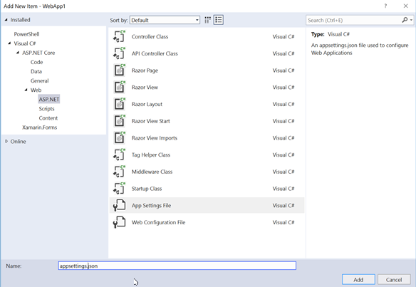

# Migrate configuration to ASP.NET Core

By [Steve Smith](https://ardalis.com/) and [Scott Addie](https://scottaddie.com)

In the previous article, we began to [migrate an ASP.NET MVC project to ASP.NET Core MVC](xref:migration/mvc). In this article, we migrate configuration.

[View or download sample code](https://github.com/dotnet/AspNetCore.Docs/tree/main/aspnetcore/migration/configuration/samples) ([how to download](xref:index#how-to-download-a-sample))

## Setup configuration

ASP.NET Core no longer uses the *Global.asax* and *web.config* files that previous versions of ASP.NET utilized. In the earlier versions of ASP.NET, application startup logic was placed in an `Application_StartUp` method within *Global.asax*. Later, in ASP.NET MVC, a `Startup.cs` file was included in the root of the project; and, it was called when the application started. ASP.NET Core has adopted this approach completely by placing all startup logic in the `Startup.cs` file.

The *web.config* file has also been replaced in ASP.NET Core. Configuration itself can now be configured, as part of the application startup procedure described in `Startup.cs`. Configuration can still utilize XML files, but typically ASP.NET Core projects will place configuration values in a JSON-formatted file, such as `appsettings.json`. ASP.NET Core's configuration system can also easily access environment variables, which can provide a [more secure and robust location](xref:security/app-secrets) for environment-specific values. This is especially true for secrets like connection strings and API keys that shouldn't be checked into source control. See [Configuration](xref:fundamentals/configuration/index) to learn more about configuration in ASP.NET Core.

For this article, we are starting with the partially migrated ASP.NET Core project from [the previous article](xref:migration/mvc). To setup configuration, add the following constructor and property to the `Startup.cs` file located in the root of the project:

[!code-csharp[](configuration/samples/WebApp1/src/WebApp1/Startup.cs?range=11-16)]

Note that at this point, the `Startup.cs` file won't compile, as we still need to add the following `using` statement:

```csharp
using Microsoft.Extensions.Configuration;
```

Add an `appsettings.json` file to the root of the project using the appropriate item template:



## Migrate configuration settings from web.config

Our ASP.NET MVC project included the required database connection string in *web.config*, in the `<connectionStrings>` element. In our ASP.NET Core project, we are going to store this information in the `appsettings.json` file. Open `appsettings.json`, and note that it already includes the following:

[!code-json[](../migration/configuration/samples/WebApp1/src/WebApp1/appsettings.json?highlight=4)]

In the highlighted line depicted above, change the name of the database from **_CHANGE_ME** to the name of your database.

## Summary

ASP.NET Core places all startup logic for the application in a single file, in which the necessary services and dependencies can be defined and configured. It replaces the *web.config* file with a flexible configuration feature that can leverage a variety of file formats, such as JSON, as well as environment variables.
