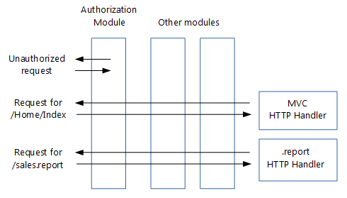
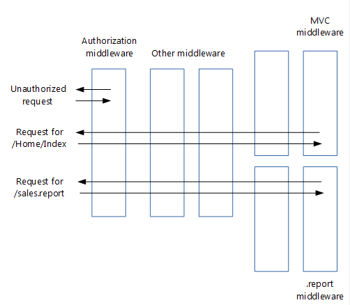

# Migrate HTTP handlers to ASP.NET Core middleware

This article shows how to migrate existing ASP.NET [HTTP handlers from system.webserver](/iis/configuration/system.webserver/) to ASP.NET Core [middleware](xref:fundamentals/middleware/index).

## Handlers revisited

Before proceeding to ASP.NET Core middleware, let's first recap how HTTP handlers work:



**Handlers are:**

* Classes that implement <xref:System.Web.IHttpHandler>

* Used to handle requests with a given file name or extension, such as *.report*

* [Configured](/iis/configuration/system.webserver/handlers/) in *Web.config*

## From handlers to middleware

**Middleware are simpler than HTTP handlers:**

* Handlers, *Web.config* (except for IIS configuration) and the application life cycle are gone

* The roles of handlers have been taken over by middleware

* Middleware are configured using code rather than in *Web.config*

:::moniker range=">= aspnetcore-3.0"

* [Pipeline branching](xref:fundamentals/middleware/index#branch-the-middleware-pipeline) lets you send requests to specific middleware, based on not only the URL but also on request headers, query strings, etc.

:::moniker-end
:::moniker range="< aspnetcore-3.0"

* [Pipeline branching](xref:fundamentals/middleware/index#branch-the-middleware-pipeline) lets you send requests to specific middleware, based on not only the URL but also on request headers, query strings, etc.

:::moniker-end

**Middleware are very similar to handlers:**

* Able to create their own HTTP response



## Migrating handler code to middleware

An HTTP handler looks something like this:

[!code-csharp[](./sample/Asp.Net4/Asp.Net4/HttpHandlers/ReportHandler.cs?highlight=5,7,13,14,15,16)]

In your ASP.NET Core project, you would translate this to a middleware similar to this:

[!code-csharp[](./sample/Asp.Net.Core/Middleware/ReportHandlerMiddleware.cs?highlight=7,9,13,20,21,22,23,40,42,44)]

This middleware is very similar to the middleware corresponding to modules. The only real difference is that here there's no call to `_next.Invoke(context)`. That makes sense, because the handler is at the end of the request pipeline, so there will be no next middleware to invoke.

## Migrating handler insertion into the request pipeline

Configuring an HTTP handler is done in *Web.config* and looks something like this:

[!code-xml[](./sample/Asp.Net4/Asp.Net4/Web.config?highlight=6&range=1-3,32,46-48,50,101)]

You could convert this by adding your new handler middleware to the request pipeline in your `Startup` class, similar to middleware converted from modules. The problem with that approach is that it would send all requests to your new handler middleware. However, you only want requests with a given extension to reach your middleware. That would give you the same functionality you had with your HTTP handler.

One solution is to branch the pipeline for requests with a given extension, using the `MapWhen` extension method. You do this in the same `Configure` method where you add the other middleware:

[!code-csharp[](./sample/Asp.Net.Core/Startup.cs?name=snippet_Configure&highlight=27-34)]

`MapWhen` takes these parameters:

1. A lambda that takes the `HttpContext` and returns `true` if the request should go down the branch. This means you can branch requests not just based on their extension, but also on request headers, query string parameters, etc.

2. A lambda that takes an `IApplicationBuilder` and adds all the middleware for the branch. This means you can add additional middleware to the branch in front of your handler middleware.

Middleware added to the pipeline before the branch will be invoked on all requests; the branch will have no impact on them.

For additional details, see the [middleware documentation](xref:fundamentals/middleware/index) for additional ways to use middleware to replace your usage of handlers. 

## Migrating to the new HttpContext

The `Invoke` method in your middleware takes a parameter of type `HttpContext`:

```csharp
public async Task Invoke(HttpContext context)
```

`HttpContext` has significantly changed in ASP.NET Core. For detailed information on how to translate the most commonly used properties of `System.Web.HttpContext` to the new `Microsoft.AspNetCore.Http.HttpContext`, see [Migrate from ASP.NET Framework HttpContext to ASP.NET Core](http-context.md).

## Additional resources

* [HTTP Handlers and HTTP Modules Overview](/iis/configuration/system.webserver/)
* [Application Startup](xref:fundamentals/startup)
* [Middleware](xref:fundamentals/middleware/index)
* [Migrate from ASP.NET Framework HttpContext to ASP.NET Core](http-context.md)
