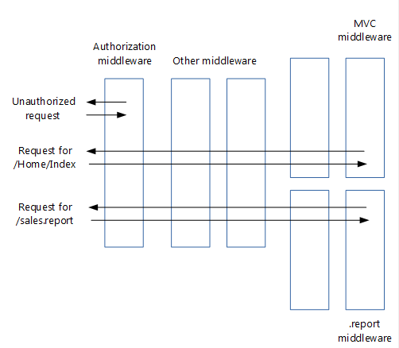

# Migrate HTTP modules to ASP.NET Core middleware

This article shows how to migrate existing ASP.NET [HTTP modules from system.webserver](/iis/configuration/system.webserver/) to ASP.NET Core [middleware](xref:fundamentals/middleware/index).

## Modules revisited

Before proceeding to ASP.NET Core middleware, let's first recap how HTTP modules work:

**Modules are:**

* Classes that implement <xref:System.Web.IHttpModule>

* Invoked for every request

* Able to short-circuit (stop further processing of a request)

* Able to add to the HTTP response, or create their own

* [Configured](/iis/configuration/system.webserver/modules/) in *Web.config*

**The order in which modules process incoming requests is determined by:**

1. A series events fired by ASP.NET, such as <xref:System.Web.HttpApplication.BeginRequest> and <xref:System.Web.HttpApplication.AuthenticateRequest>. For a complete list, see <xref:System.Web.HttpApplication?displayProperty=fullName>. Each module can create a handler for one or more events.

2. For the same event, the order in which they're configured in *Web.config*.

In addition to modules, you can add handlers for the life cycle events to your `Global.asax.cs` file. These handlers run after the handlers in the configured modules.

## From modules to middleware

**Middleware are simpler than HTTP modules:**

* Modules, `Global.asax.cs`, *Web.config* (except for IIS configuration) and the application life cycle are gone

* The roles of modules have been taken over by middleware

* Middleware are configured using code rather than in *Web.config*

:::moniker range=">= aspnetcore-3.0"

* [Pipeline branching](xref:fundamentals/middleware/index#branch-the-middleware-pipeline) lets you send requests to specific middleware, based on not only the URL but also on request headers, query strings, etc.

:::moniker-end
:::moniker range="< aspnetcore-3.0"

* [Pipeline branching](xref:fundamentals/middleware/index#branch-the-middleware-pipeline) lets you send requests to specific middleware, based on not only the URL but also on request headers, query strings, etc.

:::moniker-end

**Middleware are very similar to modules:**

* Invoked in principle for every request

* Able to short-circuit a request, by [not passing the request to the next middleware](#http-modules-shortcircuiting-middleware)

* Able to create their own HTTP response

**Middleware and modules are processed in a different order:**

* Order of middleware is based on the order in which they're inserted into the request pipeline, while order of modules is mainly based on <xref:System.Web.HttpApplication?displayProperty=fullName> events.

* Order of middleware for responses is the reverse from that for requests, while order of modules is the same for requests and responses

* See [Create a middleware pipeline with IApplicationBuilder](xref:fundamentals/middleware/index#create-a-middleware-pipeline-with-iapplicationbuilder)

Note how in the image above, the authentication middleware short-circuited the request.

## Migrating module code to middleware

An existing HTTP module will look similar to this:

[!code-csharp]

As shown in the [Middleware](xref:fundamentals/middleware/index) page, an ASP.NET Core middleware is a class that exposes an `Invoke` method taking an `HttpContext` and returning a `Task`. Your new middleware will look like this:

[!code-csharp]

The preceding middleware template was taken from the section on [writing middleware](xref:fundamentals/middleware/write).

The *MyMiddlewareExtensions* helper class makes it easier to configure your middleware in your `Startup` class. The `UseMyMiddleware` method adds your middleware class to the request pipeline. Services required by the middleware get injected in the middleware's constructor.

Your module might terminate a request, for example if the user isn't authorized:

[!code-csharp]

A middleware handles this by not calling `Invoke` on the next middleware in the pipeline. Keep in mind that this doesn't fully terminate the request, because previous middlewares will still be invoked when the response makes its way back through the pipeline.

[!code-csharp]

When you migrate your module's functionality to your new middleware, you may find that your code doesn't compile because the `HttpContext` class has significantly changed in ASP.NET Core. See [Migrate from ASP.NET Framework HttpContext to ASP.NET Core](http-context.md) to learn how to migrate to the new ASP.NET Core HttpContext.

## Migrating module insertion into the request pipeline

HTTP modules are typically added to the request pipeline using *Web.config*:

[!code-xml]

Convert this by [adding your new middleware](xref:fundamentals/middleware/index#create-a-middleware-pipeline-with-iapplicationbuilder) to the request pipeline in your `Startup` class:

[!code-csharp]

The exact spot in the pipeline where you insert your new middleware depends on the event that it handled as a module (`BeginRequest`, `EndRequest`, etc.) and its order in your list of modules in *Web.config*.

As previously stated, there's no application life cycle in ASP.NET Core and the order in which responses are processed by middleware differs from the order used by modules. This could make your ordering decision more challenging.

If ordering becomes a problem, you could split your module into multiple middleware components that can be ordered independently.

## Loading middleware options using the options pattern

Some modules have configuration options that are stored in *Web.config*. However, in ASP.NET Core a new configuration model is used in place of *Web.config*.

The new [configuration system](xref:fundamentals/configuration/index) gives you these options to solve this:

* Directly inject the options into the middleware, as shown in the [next section](#loading-middleware-options-through-direct-injection).

* Use the [options pattern](xref:fundamentals/configuration/options):

1. Create a class to hold your middleware options, for example:

   [!code-csharp]

2. Store the option values

   The configuration system allows you to store option values anywhere you want. However, most sites use `appsettings.json`, so we'll take that approach:

   [!code-json]

   *MyMiddlewareOptionsSection* here is a section name. It doesn't have to be the same as the name of your options class.

3. Associate the option values with the options class

    The options pattern uses ASP.NET Core's dependency injection framework to associate the options type (such as `MyMiddlewareOptions`) with a `MyMiddlewareOptions` object that has the actual options.

    Update your `Startup` class:

   1. If you're using `appsettings.json`, add it to the configuration builder in the `Startup` constructor:

      [!code-csharp]

   2. Configure the options service:

      [!code-csharp]

   3. Associate your options with your options class:

      [!code-csharp]

4. Inject the options into your middleware constructor. This is similar to injecting options into a controller.

   [!code-csharp]

   The [UseMiddleware](#http-modules-usemiddleware) extension method that adds your middleware to the `IApplicationBuilder` takes care of dependency injection.

   This isn't limited to `IOptions` objects. Any other object that your middleware requires can be injected this way.

## Loading middleware options through direct injection

The options pattern has the advantage that it creates loose coupling between options values and their consumers. Once you've associated an options class with the actual options values, any other class can get access to the options through the dependency injection framework. There's no need to pass around options values.

This breaks down though if you want to use the same middleware twice, with different options. For example an authorization middleware used in different branches allowing different roles. You can't associate two different options objects with the one options class.

The solution is to get the options objects with the actual options values in your `Startup` class and pass those directly to each instance of your middleware.

1. Add a second key to `appsettings.json`

   To add a second set of options to the `appsettings.json` file, use a new key to uniquely identify it:

   [!code-json]

2. Retrieve options values and pass them to middleware. The `Use...` extension method (which adds your middleware to the pipeline) is a logical place to pass in the option values: 

   [!code-csharp]

3. Enable middleware to take an options parameter. Provide an overload of the `Use...` extension method (that takes the options parameter and passes it to `UseMiddleware`). When `UseMiddleware` is called with parameters, it passes the parameters to your middleware constructor when it instantiates the middleware object.

   [!code-csharp]

   Note how this wraps the options object in an `OptionsWrapper` object. This implements `IOptions`, as expected by the middleware constructor.

## Additional resources

* [HTTP Handlers and HTTP Modules Overview](/iis/configuration/system.webserver/)
* [Configuration](xref:fundamentals/configuration/index)
* [Application Startup](xref:fundamentals/startup)
* [Middleware](xref:fundamentals/middleware/index)
* [Migrate from ASP.NET Framework HttpContext to ASP.NET Core](http-context.md)
