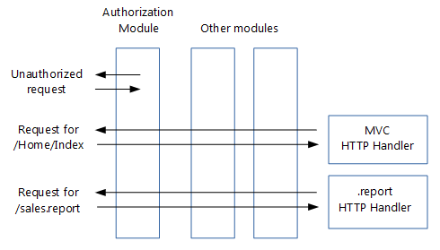

# Migrate HTTP handlers and modules to ASP.NET Core middleware

This article shows how to migrate existing ASP.NET [HTTP modules and handlers from system.webserver](/iis/configuration/system.webserver/) to ASP.NET Core [middleware](xref:fundamentals/middleware/index).

## Modules and handlers revisited

Before proceeding to ASP.NET Core middleware, let's first recap how HTTP modules and handlers work:



**Handlers are:**

* Classes that implement <xref:System.Web.IHttpHandler>

* Used to handle requests with a given file name or extension, such as *.report*

* [Configured](/iis/configuration/system.webserver/handlers/) in *Web.config*

**Modules are:**

* Classes that implement <xref:System.Web.IHttpModule>

* Invoked for every request

* Able to short-circuit (stop further processing of a request)

* Able to add to the HTTP response, or create their own

* [Configured](/iis/configuration/system.webserver/modules/) in *Web.config*

**The order in which modules process incoming requests is determined by:**

1. A series events fired by ASP.NET, such as <xref:System.Web.HttpApplication.BeginRequest> and <xref:System.Web.HttpApplication.AuthenticateRequest>. For a complete list, see <xref:System.Web.HttpApplication?displayProperty=fullName>. Each module can create a handler for one or more events.

2. For the same event, the order in which they're configured in *Web.config*.

In addition to modules, you can add handlers for the life cycle events to your `Global.asax.cs` file. These handlers run after the handlers in the configured modules.

## From handlers and modules to middleware

**Middleware are simpler than HTTP modules and handlers:**

* Modules, handlers, `Global.asax.cs`, *Web.config* (except for IIS configuration) and the application life cycle are gone

* The roles of both modules and handlers have been taken over by middleware

* Middleware are configured using code rather than in *Web.config*

:::moniker range=">= aspnetcore-3.0"

* [Pipeline branching](xref:fundamentals/middleware/index#branch-the-middleware-pipeline) lets you send requests to specific middleware, based on not only the URL but also on request headers, query strings, etc.

:::moniker-end
:::moniker range="< aspnetcore-3.0"

* [Pipeline branching](xref:fundamentals/middleware/index#branch-the-middleware-pipeline) lets you send requests to specific middleware, based on not only the URL but also on request headers, query strings, etc.

:::moniker-end

**Middleware are very similar to modules:**

* Invoked in principle for every request

* Able to short-circuit a request, by [not passing the request to the next middleware](#http-modules-shortcircuiting-middleware)

* Able to create their own HTTP response

**Middleware and modules are processed in a different order:**

* Order of middleware is based on the order in which they're inserted into the request pipeline, while order of modules is mainly based on <xref:System.Web.HttpApplication?displayProperty=fullName> events.

* Order of middleware for responses is the reverse from that for requests, while order of modules is the same for requests and responses

* See [Create a middleware pipeline with IApplicationBuilder](xref:fundamentals/middleware/index#create-a-middleware-pipeline-with-iapplicationbuilder)


Note how in the image above, the authentication middleware short-circuited the request.

## Migrating module code to middleware

An existing HTTP module will look similar to this:

[!code-csharp[](../migration/http-modules/sample/Asp.Net4/Asp.Net4/Modules/MyModule.cs?highlight=6,8,24,31)]

As shown in the [Middleware](xref:fundamentals/middleware/index) page, an ASP.NET Core middleware is a class that exposes an `Invoke` method taking an `HttpContext` and returning a `Task`. Your new middleware will look like this:

<a name="http-modules-usemiddleware"></a>

[!code-csharp[](../migration/http-modules/sample/Asp.Net.Core/Middleware/MyMiddleware.cs?highlight=9,13,20,24,28,30,32)]

The preceding middleware template was taken from the section on [writing middleware](xref:fundamentals/middleware/write).

The *MyMiddlewareExtensions* helper class makes it easier to configure your middleware in your `Startup` class. The `UseMyMiddleware` method adds your middleware class to the request pipeline. Services required by the middleware get injected in the middleware's constructor.

<a name="http-modules-shortcircuiting-middleware"></a>

Your module might terminate a request, for example if the user isn't authorized:

[!code-csharp[](../migration/http-modules/sample/Asp.Net4/Asp.Net4/Modules/MyTerminatingModule.cs?highlight=9,10,11,12,13&name=snippet_Terminate)]

A middleware handles this by not calling `Invoke` on the next middleware in the pipeline. Keep in mind that this doesn't fully terminate the request, because previous middlewares will still be invoked when the response makes its way back through the pipeline.

[!code-csharp[](../migration/http-modules/sample/Asp.Net.Core/Middleware/MyTerminatingMiddleware.cs?highlight=7,8&name=snippet_Terminate)]

When you migrate your module's functionality to your new middleware, you may find that your code doesn't compile because the `HttpContext` class has significantly changed in ASP.NET Core. [Later on](#migrating-to-the-new-httpcontext), you'll see how to migrate to the new ASP.NET Core HttpContext.

## Migrating module insertion into the request pipeline

HTTP modules are typically added to the request pipeline using *Web.config*:

[!code-xml[](../migration/http-modules/sample/Asp.Net4/Asp.Net4/Web.config?highlight=6&range=1-3,32-33,36,43,50,101)]

Convert this by [adding your new middleware](xref:fundamentals/middleware/index#create-a-middleware-pipeline-with-iapplicationbuilder) to the request pipeline in your `Startup` class:

[!code-csharp[](../migration/http-modules/sample/Asp.Net.Core/Startup.cs?name=snippet_Configure&highlight=16)]

The exact spot in the pipeline where you insert your new middleware depends on the event that it handled as a module (`BeginRequest`, `EndRequest`, etc.) and its order in your list of modules in *Web.config*.

As previously stated, there's no application life cycle in ASP.NET Core and the order in which responses are processed by middleware differs from the order used by modules. This could make your ordering decision more challenging.

If ordering becomes a problem, you could split your module into multiple middleware components that can be ordered independently.

## Migrating handler code to middleware

An HTTP handler looks something like this:

[!code-csharp[](../migration/http-modules/sample/Asp.Net4/Asp.Net4/HttpHandlers/ReportHandler.cs?highlight=5,7,13,14,15,16)]

In your ASP.NET Core project, you would translate this to a middleware similar to this:

[!code-csharp[](../migration/http-modules/sample/Asp.Net.Core/Middleware/ReportHandlerMiddleware.cs?highlight=7,9,13,20,21,22,23,40,42,44)]

This middleware is very similar to the middleware corresponding to modules. The only real difference is that here there's no call to `_next.Invoke(context)`. That makes sense, because the handler is at the end of the request pipeline, so there will be no next middleware to invoke.

## Migrating handler insertion into the request pipeline

Configuring an HTTP handler is done in *Web.config* and looks something like this:

[!code-xml[](../migration/http-modules/sample/Asp.Net4/Asp.Net4/Web.config?highlight=6&range=1-3,32,46-48,50,101)]

You could convert this by adding your new handler middleware to the request pipeline in your `Startup` class, similar to middleware converted from modules. The problem with that approach is that it would send all requests to your new handler middleware. However, you only want requests with a given extension to reach your middleware. That would give you the same functionality you had with your HTTP handler.

One solution is to branch the pipeline for requests with a given extension, using the `MapWhen` extension method. You do this in the same `Configure` method where you add the other middleware:

[!code-csharp[](../migration/http-modules/sample/Asp.Net.Core/Startup.cs?name=snippet_Configure&highlight=27-34)]

`MapWhen` takes these parameters:

1. A lambda that takes the `HttpContext` and returns `true` if the request should go down the branch. This means you can branch requests not just based on their extension, but also on request headers, query string parameters, etc.

2. A lambda that takes an `IApplicationBuilder` and adds all the middleware for the branch. This means you can add additional middleware to the branch in front of your handler middleware.

Middleware added to the pipeline before the branch will be invoked on all requests; the branch will have no impact on them.

## Loading middleware options using the options pattern

Some modules and handlers have configuration options that are stored in *Web.config*. However, in ASP.NET Core a new configuration model is used in place of *Web.config*.

The new [configuration system](xref:fundamentals/configuration/index) gives you these options to solve this:

* Directly inject the options into the middleware, as shown in the [next section](#loading-middleware-options-through-direct-injection).

* Use the [options pattern](xref:fundamentals/configuration/options):

1. Create a class to hold your middleware options, for example:

   [!code-csharp[](http-modules/sample/Asp.Net.Core/Middleware/MyMiddlewareWithParams.cs?name=snippet_Options)]

2. Store the option values

   The configuration system allows you to store option values anywhere you want. However, most sites use `appsettings.json`, so we'll take that approach:

   [!code-json[](http-modules/sample/Asp.Net.Core/appsettings.json?range=1,14-18)]

   *MyMiddlewareOptionsSection* here is a section name. It doesn't have to be the same as the name of your options class.

3. Associate the option values with the options class

    The options pattern uses ASP.NET Core's dependency injection framework to associate the options type (such as `MyMiddlewareOptions`) with a `MyMiddlewareOptions` object that has the actual options.

    Update your `Startup` class:

   1. If you're using `appsettings.json`, add it to the configuration builder in the `Startup` constructor:

      [!code-csharp[](../migration/http-modules/sample/Asp.Net.Core/Startup.cs?name=snippet_Ctor&highlight=5-6)]

   2. Configure the options service:

      [!code-csharp[](../migration/http-modules/sample/Asp.Net.Core/Startup.cs?name=snippet_ConfigureServices&highlight=4)]

   3. Associate your options with your options class:

      [!code-csharp[](../migration/http-modules/sample/Asp.Net.Core/Startup.cs?name=snippet_ConfigureServices&highlight=6-8)]

4. Inject the options into your middleware constructor. This is similar to injecting options into a controller.

   [!code-csharp[](../migration/http-modules/sample/Asp.Net.Core/Middleware/MyMiddlewareWithParams.cs?name=snippet_MiddlewareWithParams&highlight=4,7,10,15-16)]

   The [UseMiddleware](#http-modules-usemiddleware) extension method that adds your middleware to the `IApplicationBuilder` takes care of dependency injection.

   This isn't limited to `IOptions` objects. Any other object that your middleware requires can be injected this way.

## Loading middleware options through direct injection

The options pattern has the advantage that it creates loose coupling between options values and their consumers. Once you've associated an options class with the actual options values, any other class can get access to the options through the dependency injection framework. There's no need to pass around options values.

This breaks down though if you want to use the same middleware twice, with different options. For example an authorization middleware used in different branches allowing different roles. You can't associate two different options objects with the one options class.

The solution is to get the options objects with the actual options values in your `Startup` class and pass those directly to each instance of your middleware.

1. Add a second key to `appsettings.json`

   To add a second set of options to the `appsettings.json` file, use a new key to uniquely identify it:

   [!code-json[](http-modules/sample/Asp.Net.Core/appsettings.json?range=1,10-18&highlight=2-5)]

2. Retrieve options values and pass them to middleware. The `Use...` extension method (which adds your middleware to the pipeline) is a logical place to pass in the option values: 

   [!code-csharp[](http-modules/sample/Asp.Net.Core/Startup.cs?name=snippet_Configure&highlight=20-23)]

3. Enable middleware to take an options parameter. Provide an overload of the `Use...` extension method (that takes the options parameter and passes it to `UseMiddleware`). When `UseMiddleware` is called with parameters, it passes the parameters to your middleware constructor when it instantiates the middleware object.

   [!code-csharp[](../migration/http-modules/sample/Asp.Net.Core/Middleware/MyMiddlewareWithParams.cs?name=snippet_Extensions&highlight=9-14)]

   Note how this wraps the options object in an `OptionsWrapper` object. This implements `IOptions`, as expected by the middleware constructor.

## Migrating to the new HttpContext

You saw earlier that the `Invoke` method in your middleware takes a parameter of type `HttpContext`:

```csharp
public async Task Invoke(HttpContext context)
```

`HttpContext` has significantly changed in ASP.NET Core. This section shows how to translate the most commonly used properties of <xref:System.Web.HttpContext?displayProperty=fullName> to the new `Microsoft.AspNetCore.Http.HttpContext`.

### HttpContext

**HttpContext.Items** translates to:

[!code-csharp[](http-modules/sample/Asp.Net.Core/Middleware/HttpContextDemoMiddleware.cs?name=snippet_Items)]

**Unique request ID (no System.Web.HttpContext counterpart)**

Gives you a unique id for each request. Very useful to include in your logs.

[!code-csharp[](http-modules/sample/Asp.Net.Core/Middleware/HttpContextDemoMiddleware.cs?name=snippet_Trace)]

### HttpContext.Request

**HttpContext.Request.HttpMethod** translates to:

[!code-csharp[](http-modules/sample/Asp.Net.Core/Middleware/HttpContextDemoMiddleware.cs?name=snippet_Method)]

**HttpContext.Request.QueryString** translates to:

[!code-csharp[](http-modules/sample/Asp.Net.Core/Middleware/HttpContextDemoMiddleware.cs?name=snippet_Query)]

**HttpContext.Request.Url** and **HttpContext.Request.RawUrl** translate to:

[!code-csharp[](http-modules/sample/Asp.Net.Core/Middleware/HttpContextDemoMiddleware.cs?name=snippet_Url)]

**HttpContext.Request.IsSecureConnection** translates to:

[!code-csharp[](http-modules/sample/Asp.Net.Core/Middleware/HttpContextDemoMiddleware.cs?name=snippet_Secure)]

**HttpContext.Request.UserHostAddress** translates to:

[!code-csharp[](http-modules/sample/Asp.Net.Core/Middleware/HttpContextDemoMiddleware.cs?name=snippet_Host)]

**HttpContext.Request.Cookies** translates to:

[!code-csharp[](http-modules/sample/Asp.Net.Core/Middleware/HttpContextDemoMiddleware.cs?name=snippet_Cookies)]

**HttpContext.Request.RequestContext.RouteData** translates to:

[!code-csharp[](http-modules/sample/Asp.Net.Core/Middleware/HttpContextDemoMiddleware.cs?name=snippet_Route)]

**HttpContext.Request.Headers** translates to:

[!code-csharp[](http-modules/sample/Asp.Net.Core/Middleware/HttpContextDemoMiddleware.cs?name=snippet_Headers)]

**HttpContext.Request.UserAgent** translates to:

[!code-csharp[](http-modules/sample/Asp.Net.Core/Middleware/HttpContextDemoMiddleware.cs?name=snippet_Agent)]

**HttpContext.Request.UrlReferrer** translates to:

[!code-csharp[](http-modules/sample/Asp.Net.Core/Middleware/HttpContextDemoMiddleware.cs?name=snippet_Referrer)]

**HttpContext.Request.ContentType** translates to:

[!code-csharp[](http-modules/sample/Asp.Net.Core/Middleware/HttpContextDemoMiddleware.cs?name=snippet_Type)]

**HttpContext.Request.Form** translates to:

[!code-csharp[](http-modules/sample/Asp.Net.Core/Middleware/HttpContextDemoMiddleware.cs?name=snippet_Form)]

> [!WARNING]
> Read form values only if the content sub type is *x-www-form-urlencoded* or *form-data*.

**HttpContext.Request.InputStream** translates to:

[!code-csharp[](http-modules/sample/Asp.Net.Core/Middleware/HttpContextDemoMiddleware.cs?name=snippet_Input)]

> [!WARNING]
> Use this code only in a handler type middleware, at the end of a pipeline.
>
>You can read the raw body as shown above only once per request. Middleware trying to read the body after the first read will read an empty body.
>
>This doesn't apply to reading a form as shown earlier, because that's done from a buffer.

### HttpContext.Response

**HttpContext.Response.Status** and **HttpContext.Response.StatusDescription** translate to:

[!code-csharp[](http-modules/sample/Asp.Net.Core/Middleware/HttpContextDemoMiddleware.cs?name=snippet_Status)]

**HttpContext.Response.ContentEncoding** and **HttpContext.Response.ContentType** translate to:

[!code-csharp[](http-modules/sample/Asp.Net.Core/Middleware/HttpContextDemoMiddleware.cs?name=snippet_RespType)]

**HttpContext.Response.ContentType** on its own also translates to:

[!code-csharp[](http-modules/sample/Asp.Net.Core/Middleware/HttpContextDemoMiddleware.cs?name=snippet_RespTypeOnly)]

**HttpContext.Response.Output** translates to:

[!code-csharp[](http-modules/sample/Asp.Net.Core/Middleware/HttpContextDemoMiddleware.cs?name=snippet_Output)]

**HttpContext.Response.TransmitFile**

Serving up a file is discussed in <xref:fundamentals/request-features>.

**HttpContext.Response.Headers**

Sending response headers is complicated by the fact that if you set them after anything has been written to the response body, they will not be sent.

The solution is to set a callback method that will be called right before writing to the response starts. This is best done at the start of the `Invoke` method in your middleware. It's this callback method that sets your response headers.

The following code sets a callback method called `SetHeaders`:

```csharp
public async Task Invoke(HttpContext httpContext)
{
    // ...
    httpContext.Response.OnStarting(SetHeaders, state: httpContext);
```

The `SetHeaders` callback method would look like this:

[!code-csharp[](http-modules/sample/Asp.Net.Core/Middleware/HttpContextDemoMiddleware.cs?name=snippet_SetHeaders)]

**HttpContext.Response.Cookies**

Cookies travel to the browser in a *Set-Cookie* response header. As a result, sending cookies requires the same callback as used for sending response headers:

```csharp
public async Task Invoke(HttpContext httpContext)
{
    // ...
    httpContext.Response.OnStarting(SetCookies, state: httpContext);
    httpContext.Response.OnStarting(SetHeaders, state: httpContext);
```

The `SetCookies` callback method would look like the following:

[!code-csharp[](http-modules/sample/Asp.Net.Core/Middleware/HttpContextDemoMiddleware.cs?name=snippet_SetCookies)]

## Additional resources

* [HTTP Handlers and HTTP Modules Overview](/iis/configuration/system.webserver/)
* [Configuration](xref:fundamentals/configuration/index)
* [Application Startup](xref:fundamentals/startup)
* [Middleware](xref:fundamentals/middleware/index)
