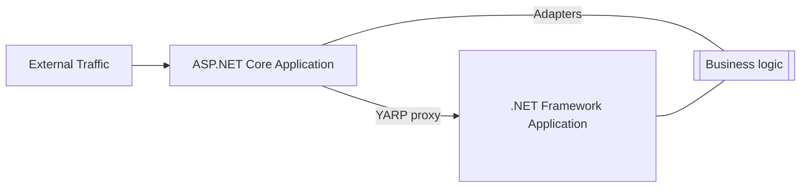

# Incremental ASP.NET to ASP.NET Core migration

Migrating an app from ASP.NET Framework to ASP.NET Core is a non-trivial for the majority of large production apps. These apps have often grown organically over time, incorporating new technologies as they become available and are often composed of many legacy decisions. This article provide guidance and links to tools for migrating ASP.NET Framework apps to ASP.NET Core with as little change as possible.

One of the larger challenges is the pervasive use of <xref:System.Web.HttpContext> throughout a code base. Without the incremental approach and tools, a large scale rewrite was required to remove the `System.Web.HttpContext` dependency. The adapters in [dotnet/systemweb-adapters](https://github.com/dotnet/systemweb-adapters)
] provide a set of runtime helpers to access the types ASP.NET Framework code is expecting but in a way that works using ASP.NET Core with minimal changes.

A complete migration may take considerable effort depending on the size of the app. In order to continue deploying an app to production while working on migrating, the best pattern is to follow is the [Strangler Fig pattern](/azure/architecture/patterns/strangler-fig). The Strangler Fig pattern allows for continual development on the old system with an incremental approach to moving forward. This document describes how to apply the Strangler Fig pattern to an ASP.NET app migrating towards ASP.NET Core.

To jump into the process, please see the `[Getting Started](getting_started.md)` guide.

## App migration to ASP.NET Core

Before starting the migration, the app targets ASP.NET Framework and runs on Windows with its supporting libraries:

Migration starts by introducing a new app based on ASP.NET Core that becomes the entry point. Incoming requests go to the ASP.NET Core app, which either handles the request or proxies the request to the .NET Framework Application via [YARP](https://microsoft.github.io/reverse-proxy/)

* Requests that have a matching route are returned by the ASP.NET Core app.
* If the ASP.NET Core app contains a route that matches the request, 

* If the core app cannot match a route, it will proxy the request onto the .NET Framework app via [YARP](https://microsoft.github.io/reverse-proxy/) and serve a response as the app has already been doing. Majority of code will continue to be in the .NET Framework app, but the core app is now set up to start migrating routes to:

In order to start moving over business logic that relies on `HttpContext`, the libraries need to be built against `Microsoft.AspNetCore.SystemWebAdapters`. This allows libraries to be built against .NET Framework, .NET Core, or .NET Standard 2.0. This will ensure that the libraries are using surface area that is available on both ASP.NET and ASP.NET Core:

At this point, the journey is to focus on moving routes over one at a time. This could be WebAPI or MVC controllers (or even a single method from a controller), ASPX pages, handlers, or some other implementation of a route. If the route is available in the core app, it will then be matched and served from there.

During this process, additional service and infrastructure will be identified that must be moved, in some way, to run on .NET Core. Some options include (listed in order of maintainability):

1. Duplicate the code
2. Link the code in the new project
3. Move the code to shared libraries

Over time, the core app will start processing more of the routes served than the .NET Framework app:

During this process, you may have the route in both the ASP.NET Core and the ASP.NET Framework apps. This could allow you to perform some A/B testing to ensure functionality is as expected.

Once the .NET Framework Application is no longer needed, it may be removed:

At this point, the app as a whole is running on the ASP.NET Core app stack, but is still using the adapters from this repo. At this point, the goal will be to remove the use of the adapters until the app is relying solely on the ASP.NET Core app framework:

## System.Web Adapters

The `Microsoft.AspNetCore.SystemWebAdapters` is a collection of runtime helpers that will facilitate using old core written against `System.Web` while moving onto ASP.NET Core.

The heart of the library is support for `System.Web.HttpContext`. This attempts to provide compatible behavior for what is found running on ASP.NET to expedite moving onto ASP.NET Core. There are a number of behaviors that ASP.NET provided that incur a performance cost if enabled on ASP.NET Core so must be opted into.
<!--
For examples of scenarios where this is useful, see [here](adapters.md).

For guidance around usage, please see [here](usage_guidance.md).
-->