# Migrate from ASP.NET Framework to ASP.NET Core

This guide helps you migrate your ASP.NET Framework application to ASP.NET Core. ASP.NET Core is the modern, cross-platform web framework for .NET that offers improved performance, better tooling, and access to the latest web development features.

## Choose Your Migration Approach

The right migration approach depends on your application's complexity, timeline, and constraints:

### 🔄 Incremental Migration (Recommended for Most Apps)

**Best for:**
- Large, complex applications with extensive business logic
- Production applications that cannot afford extended downtime  
- Teams transitioning to ASP.NET Core gradually
- Applications with tight coupling to ASP.NET Framework APIs

**How it works:**
- Set up ASP.NET Core app as a proxy using [YARP](https://dotnet.github.io/yarp/)
- Gradually migrate routes from Framework to Core
- Use System.Web adapters to minimize code changes
- Maintain production deployments throughout migration

> [!TIP]
> The incremental approach follows the [Strangler Fig pattern](/azure/architecture/patterns/strangler-fig), allowing you to migrate piece by piece while keeping your application running in production.

**Get started:** [Incremental Migration Overview](xref:migration/incremental/overview)

### 🔧 Full Migration

**Best for:**
- Smaller applications with limited complexity
- Green-field rewrites where you want to modernize architecture
- Applications with minimal ASP.NET Framework-specific dependencies
- Long maintenance windows available

**How it works:**
- Create new ASP.NET Core project from scratch
- Port code and functionality systematically
- Replace ASP.NET Framework patterns with ASP.NET Core equivalents
- Test and deploy complete new application

**Get started:** [Full Migration Guide](xref:migration/full-migration/planning)

## Migration Decision Tree

```mermaid
flowchart TD
    A[ASP.NET Framework App] --> B{Application Size}
    
    B -->|Large/Complex| C{Production Constraints}
    B -->|Small/Medium| D{Team Experience}
    
    C -->|Can't afford downtime| E[Incremental Migration ✅]
    C -->|Maintenance window available| F{Framework Dependencies}
    
    D -->|New to ASP.NET Core| G[Consider Incremental]
    D -->|Experienced team| H[Full Migration or Incremental]
    
    F -->|Heavy System.Web usage| E
    F -->|Minimal dependencies| I[Full Migration ✅]
    
    G --> E
    H --> J[Choose based on timeline]
    J --> E
    J --> I
```

## Technology-Specific Guidance

### ASP.NET MVC and Web API
- **Incremental:** [MVC/Web API Incremental Migration](xref:migration/incremental/mvc-webapi)
- **Full Migration:** [MVC/Web API Full Migration](xref:migration/full-migration/mvc-webapi)

> [!NOTE]
> Most MVC and Web API applications benefit from the incremental approach, especially when using dependency injection, custom filters, or extensive business logic.

### ASP.NET Web Forms
- **Incremental:** [Web Forms Incremental Migration](xref:migration/incremental/web-forms)  
- **Full Migration:** [Web Forms to Razor Pages/MVC](xref:migration/full-migration/web-forms)

> [!IMPORTANT]
> Web Forms applications often require significant architectural changes. The incremental approach can help you migrate gradually while learning ASP.NET Core patterns.

### Custom HTTP Modules and Handlers
- **Incremental:** [HTTP Modules with System.Web Adapters](xref:migration/incremental/http-modules)
- **Full Migration:** [HTTP Modules to Middleware](xref:migration/full-migration/http-modules)

## Common Migration Scenarios

### Authentication and Authorization
Both migration approaches need to handle authentication:
- **Incremental:** [Share authentication between Framework and Core](xref:migration/incremental/authentication)
- **Full Migration:** [Migrate to ASP.NET Core Identity](xref:migration/full-migration/identity)

### Session State
Session state requires special handling:
- **Incremental:** [Share session state across applications](xref:migration/incremental/session-state)
- **Full Migration:** [Migrate to ASP.NET Core session](xref:migration/full-migration/session-state)

### Configuration
- **Incremental:** Use both Web.config and appsettings.json during transition
- **Full Migration:** [Complete configuration migration](xref:migration/full-migration/configuration)

## Planning Your Migration

Before starting any migration approach:

1. **Assess Your Application**
   - Identify ASP.NET Framework dependencies
   - Evaluate third-party library compatibility
   - Analyze authentication and session requirements

2. **Prepare Your Environment**
   - Upgrade supporting libraries to .NET Standard 2.0 when possible  
   - Set up development and testing environments for ASP.NET Core
   - Plan deployment and rollback strategies

3. **Consider Migration Tools**
   - [.NET Upgrade Assistant](https://marketplace.visualstudio.com/items?itemName=ms-dotnettools.upgradeassistant) for automated assistance
   - [.NET Portability Analyzer](https://docs.microsoft.com/dotnet/standard/analyzers/portability-analyzer) for compatibility assessment

## Success Stories and Examples

- [Example migration of eShop to ASP.NET Core](/dotnet/architecture/porting-existing-aspnet-apps/example-migration-eshop)
- [Tooling for Incremental ASP.NET Core Migrations (Video)](https://www.youtube.com/watch?v=P96l0pDNVpM)

## Additional Resources

### Version-Specific Upgrades
If you're already on ASP.NET Core and need to upgrade versions:
- [ASP.NET Core 5.0 to 6.0](xref:migration/50-to-60)
- [ASP.NET Core 6.0 to 7.0](xref:migration/60-70)  
- [ASP.NET Core 7.0 to 8.0](xref:migration/70-80)

### Reference Documentation
- [Breaking Changes Reference](xref:migration/reference/breaking-changes)
- [Compatibility Guide](xref:migration/reference/compatibility)
- [Migration Troubleshooting](xref:migration/reference/troubleshooting)

---

## Next Steps

Choose your migration approach and get started:

- **Ready for incremental migration?** → [Incremental Migration Overview](xref:migration/incremental/overview)
- **Planning a full migration?** → [Full Migration Planning Guide](xref:migration/full-migration/planning)
- **Need help deciding?** → [Migration Assessment Checklist](xref:migration/planning/assessment)
