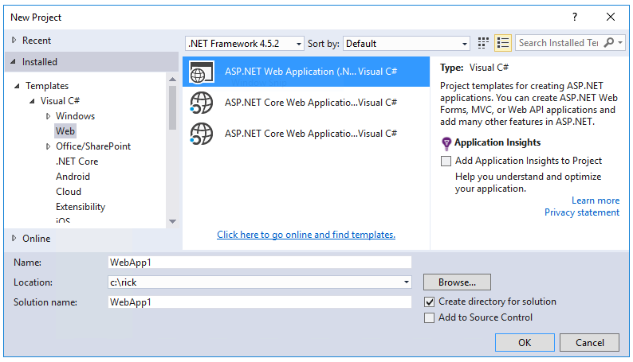
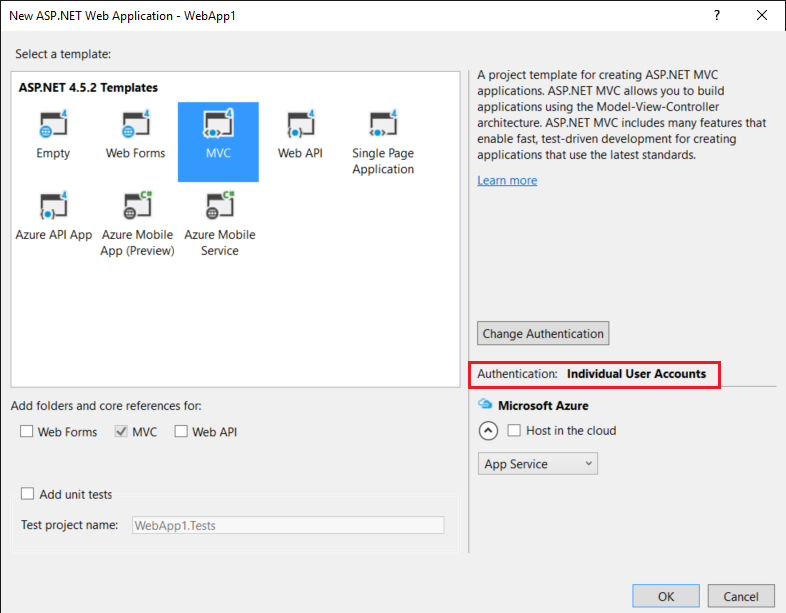
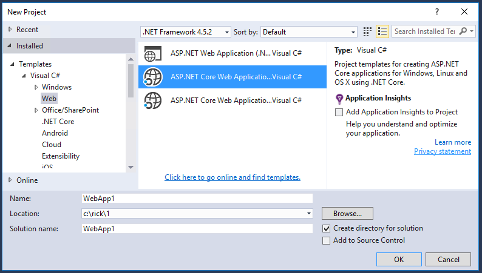
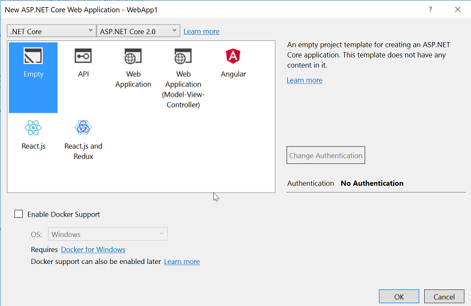
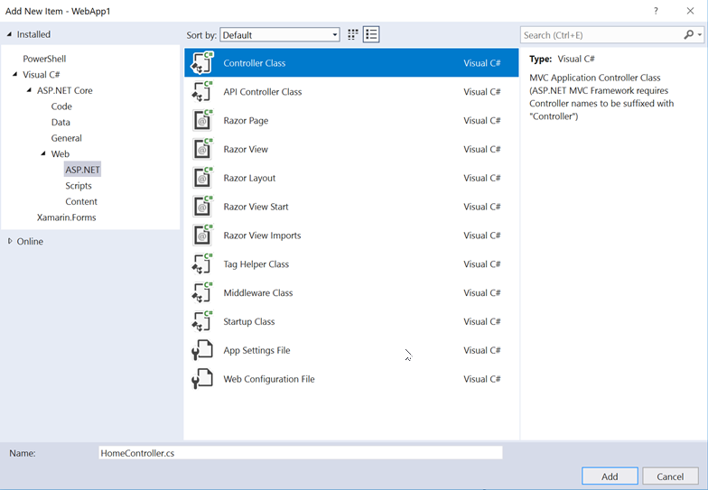
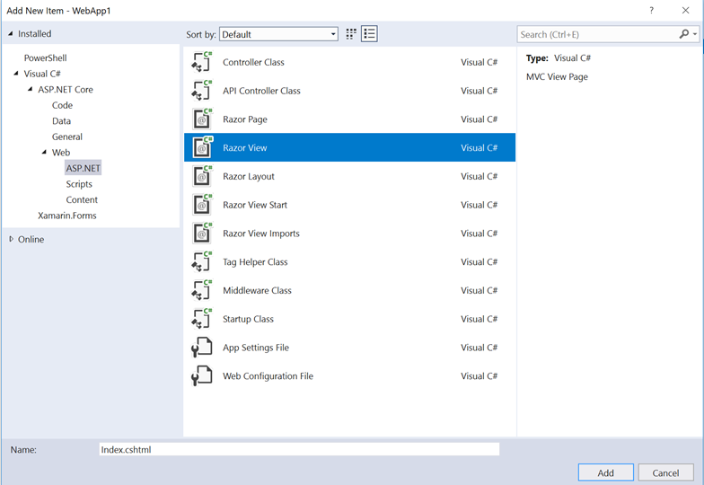
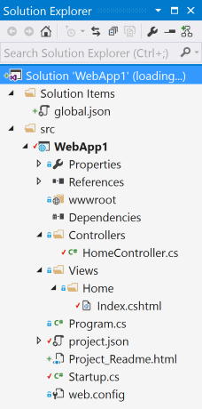
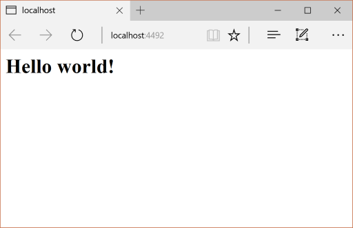
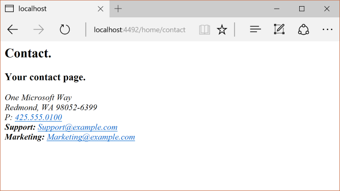

# Migrate from ASP.NET MVC to ASP.NET Core MVC

:::moniker range=">= aspnetcore-3.0"

This article shows how to start migrating an ASP.NET MVC project to [ASP.NET Core MVC](xref:mvc/overview). In the process, it highlights related changes from ASP.NET MVC.

Migrating from ASP.NET MVC is a multi-step process. This article covers:

* Initial setup.
* Basic controllers and views.
* Static content.
* Client-side dependencies.

For migrating configuration and Identity code, see [Migrate configuration to ASP.NET Core](xref:migration/configuration) and [Migrate Authentication and Identity to ASP.NET Core](xref:migration/identity).

## Prerequisites

[!INCLUDE [prerequisites](../includes/net-core-prereqs-vs-3.1.md)]

## Create the starter ASP.NET MVC project

Create an example ASP.NET MVC project in Visual Studio to migrate:

1. From the **File** menu, select **New** > **Project**.
1. Select **ASP.NET Web Application (.NET Framework)** and then select **Next**.
1. Name the project *WebApp1* so the namespace matches the ASP.NET Core project created in the next step. Select **Create**.
1. Select **MVC**, and then select **Create**.

## Create the ASP.NET Core project

Create a new solution with a new ASP.NET Core project to migrate to:

1. Launch a second instance of Visual Studio.
1. From the **File** menu, select **New** > **Project**.
1. Select **ASP.NET Core Web Application** and then select **Next**.
1. In the **Configure your new project** dialog, Name the project *WebApp1*.
1. Set the location to a different directory than the previous project to use the same project name. Using the same namespace makes it easier to copy code between the two projects. Select **Create**.
1. In the **Create a new ASP.NET Core Web Application** dialog, confirm that **.NET Core** and **ASP.NET Core 3.1** are selected. Select the **Web Application (Model-View-Controller)** project template, and select **Create**.

## Configure the ASP.NET Core site to use MVC

In ASP.NET Core 3.0 and later projects, .NET Framework is no longer a supported target framework. Your project must target .NET Core. The ASP.NET Core shared framework, which includes MVC, is part of the .NET Core runtime installation. The shared framework is automatically referenced when using the `Microsoft.NET.Sdk.Web` SDK in the project file:

```xml
<Project Sdk="Microsoft.NET.Sdk.Web">
```

For more information, see [Framework reference](xref:migration/22-to-30#framework-reference).

In ASP.NET Core, the `Startup` class:

* Replaces *Global.asax*.
* Handles all app startup tasks.

For more information, see <xref:fundamentals/startup>.

In the ASP.NET Core project, open the `Startup.cs` file:

[!code-csharp[](mvc/samples/3.x/Startup.cs?highlight=13,30,32&name=snippet)]

ASP.NET Core apps must opt in to framework features with middleware. The previous template-generated code adds the following services and middleware:

* The <xref:Microsoft.Extensions.DependencyInjection.MvcServiceCollectionExtensions.AddControllersWithViews%2A> extension method registers MVC service support for controllers, API-related features, and views. For more information on MVC service registration options, see [MVC service registration](xref:migration/22-to-30#mvc-service-registration)
* The <xref:Microsoft.AspNetCore.Builder.StaticFileExtensions.UseStaticFiles%2A> extension method adds the static file handler `Microsoft.AspNetCore.StaticFiles`. The `UseStaticFiles` extension method must be called before `UseRouting`. For more information, see <xref:fundamentals/static-files>.
* The <xref:Microsoft.AspNetCore.Builder.EndpointRoutingApplicationBuilderExtensions.UseRouting%2A> extension method adds routing. For more information, see <xref:fundamentals/routing>.

This existing configuration includes what is needed to migrate the example ASP.NET MVC project. For more information on ASP.NET Core middleware options, see <xref:fundamentals/startup>.

## Migrate controllers and views

In the ASP.NET Core project, a new empty controller class and view class would be added to serve as placeholders using the same names as the controller and view classes in any ASP.NET MVC project to migrate from.

The ASP.NET Core *WebApp1* project already includes a minimal example controller and view by the same name as the ASP.NET MVC project. So those will serve as placeholders for the ASP.NET MVC controller and views to be migrated from the ASP.NET MVC *WebApp1* project.

1. Copy the methods from the ASP.NET MVC `HomeController` to replace the new ASP.NET Core `HomeController` methods. There's no need to change the return type of the action methods. The ASP.NET MVC built-in template's controller action method return type is <xref:System.Web.Mvc.ActionResult>; in ASP.NET Core MVC, the action methods return `IActionResult` instead. `ActionResult` implements `IActionResult`.
1. In the ASP.NET Core project, right-click the *Views/Home* directory, select **Add** > **Existing Item**.
1. In the **Add Existing Item** dialog, navigate to the ASP.NET MVC *WebApp1* project's *Views/Home* directory.
1. Select the `About.cshtml`, `Contact.cshtml`, and `Index.cshtml` Razor view files, then select **Add**, replacing the existing files.

For more information, see <xref:mvc/controllers/actions> and <xref:mvc/views/overview>.

## Test each method

Each controller endpoint can be tested, however, layout and styles are covered later in the document.

1. Run the ASP.NET Core app.
1. Invoke the rendered views from the browser on the running ASP.NET Core app by replacing the current port number with the port number used in the ASP.NET Core project. For example, `https://localhost:44375/home/about`.

## Migrate static content

In ASP.NET MVC 5 and earlier, static content was hosted from the web project's root directory and was intermixed with server-side files. In ASP.NET Core, static files are stored within the project's [web root](xref:fundamentals/index#web-root) directory. The default directory is *{content root}/wwwroot*, but it can be changed. For more information, see [Static files in ASP.NET Core](xref:fundamentals/static-files#serve-static-files).

Copy the static content from the ASP.NET MVC *WebApp1* project to the *wwwroot* directory in the ASP.NET Core *WebApp1* project:

1. In the ASP.NET Core project, right-click the *wwwroot* directory, select **Add** > **Existing Item**.
1. In the **Add Existing Item** dialog, navigate to the ASP.NET MVC *WebApp1* project.
1. Select the *favicon.ico* file, then select **Add**, replacing the existing file.

## Migrate the layout files

Copy the ASP.NET MVC project layout files to the ASP.NET Core project:

1. In the ASP.NET Core project, right-click the *Views* directory, select **Add** > **Existing Item**.
1. In the **Add Existing Item** dialog, navigate to the ASP.NET MVC *WebApp1* project's *Views* directory.
1. Select the `_ViewStart.cshtml` file then select **Add**.

Copy the ASP.NET MVC project shared layout files to the ASP.NET Core project:

1. In the ASP.NET Core project, right-click the *Views/Shared* directory, select **Add** > **Existing Item**.
1. In the **Add Existing Item** dialog, navigate to the ASP.NET MVC *WebApp1* project's *Views/Shared* directory.
1. Select the `_Layout.cshtml` file, then select **Add**, replacing the existing file.

In the ASP.NET Core project, open the `_Layout.cshtml` file. Make the following changes to match the completed code shown below:

Update the Bootstrap CSS inclusion to match the completed code below:

1. Replace `@Styles.Render("~/Content/css")` with a `<link>` element to load `bootstrap.css` (see below).
1. Remove `@Scripts.Render("~/bundles/modernizr")`.

The completed replacement markup for Bootstrap CSS inclusion:

```html
<link rel="stylesheet"
    href="https://maxcdn.bootstrapcdn.com/bootstrap/3.3.7/css/bootstrap.min.css"
    integrity="sha384-BVYiiSIFeK1dGmJRAkycuHAHRg32OmUcww7on3RYdg4Va+PmSTsz/K68vbdEjh4u"
    crossorigin="anonymous">
```

Update the jQuery and Bootstrap JavaScript inclusion to match the completed code below:

1. Replace `@Scripts.Render("~/bundles/jquery")` with a `<script>` element (see below).
1. Replace `@Scripts.Render("~/bundles/bootstrap")` with a `<script>` element (see below).

The completed replacement markup for jQuery and Bootstrap JavaScript inclusion:

```html
<script src="https://code.jquery.com/jquery-3.3.1.min.js"></script>
<script src="https://maxcdn.bootstrapcdn.com/bootstrap/3.3.7/js/bootstrap.min.js"
    integrity="sha384-Tc5IQib027qvyjSMfHjOMaLkfuWVxZxUPnCJA7l2mCWNIpG9mGCD8wGNIcPD7Txa" crossorigin="anonymous"></script>
```

The updated `_Layout.cshtml` file is shown below:

[!code-cshtml[](mvc/samples/3.x/Views/Shared/_Layout.cshtml?highlight=7-10,40-42)]

View the site in the browser. It should render with the expected styles in place.

## Configure bundling and minification

ASP.NET Core is compatible with several open-source bundling and minification solutions such as [WebOptimizer](https://github.com/ligershark/WebOptimizer) and other similar libraries. ASP.NET Core doesn't provide a native bundling and minification solution. For information on configuring bundling and minification, see [Bundling and Minification](xref:client-side/bundling-and-minification).

## Solve HTTP 500 errors

There are many problems that can cause an HTTP 500 error message that contains no information on the source of the problem. For example, if the `Views/_ViewImports.cshtml` file contains a namespace that doesn't exist in the project, an HTTP 500 error is generated. By default in ASP.NET Core apps, the `UseDeveloperExceptionPage` extension is added to the `IApplicationBuilder` and executed when the environment is *Development*. This is detailed in the following code:

[!code-csharp[](mvc/samples/3.x/Startup.cs?highlight=17-21&name=snippet)]

ASP.NET Core converts unhandled exceptions into HTTP 500 error responses. Normally, error details aren't included in these responses to prevent disclosure of potentially sensitive information about the server. For more information, see [Developer Exception Page](xref:fundamentals/error-handling#developer-exception-page).

## Next steps

* <xref:migration/identity>

## Additional resources

* <xref:blazor/index>
* <xref:mvc/views/tag-helpers/intro>

:::moniker-end

:::moniker range="= aspnetcore-2.2"

This article shows how to start migrating an ASP.NET MVC project to [ASP.NET Core MVC](xref:mvc/overview) 2.2. In the process, it highlights many of the things that have changed from ASP.NET MVC. Migrating from ASP.NET MVC is a multi-step process. This article covers:

* Initial setup
* Basic controllers and views
* Static content
* Client-side dependencies.

For migrating configuration and Identity code, see <xref:migration/configuration> and <xref:migration/identity>.

> [!NOTE]
> The version numbers in the samples might not be current, update the projects accordingly.

## Create the starter ASP.NET MVC project

To demonstrate the upgrade, we'll start by creating an ASP.NET MVC app. Create it with the name *WebApp1* so the namespace matches the ASP.NET Core project created in the next step.





*Optional:* Change the name of the Solution from *WebApp1* to *Mvc5*. Visual Studio displays the new solution name (*Mvc5*), which makes it easier to tell this project from the next project.

## Create the ASP.NET Core project

Create a new *empty* ASP.NET Core web app with the same name as the previous project (*WebApp1*) so the namespaces in the two projects match. Having the same namespace makes it easier to copy code between the two projects. Create this project in a different directory than the previous project to use the same name.





* *Optional:* Create a new ASP.NET Core app using the *Web Application* project template. Name the project *WebApp1*, and select an authentication option of **Individual User Accounts**. Rename this app to *FullAspNetCore*. Creating this project saves time in the conversion. The end result can be viewed in the template-generated code, code can be copied to the conversion project, or compared with the template-generated project.

## Configure the site to use MVC

* When targeting .NET Core, the [Microsoft.AspNetCore.App metapackage](xref:fundamentals/metapackage-app) is referenced by default. This package contains packages commonly used by MVC apps. If targeting .NET Framework, package references must be listed individually in the project file.

`Microsoft.AspNetCore.Mvc` is the ASP.NET Core MVC framework. `Microsoft.AspNetCore.StaticFiles` is the static file handler. ASP.NET Core apps explicitly opt in for middleware, such as for serving static files. For more information, see [Static files](xref:fundamentals/static-files).

* Open the `Startup.cs` file and change the code to match the following:

[!code-csharp[](mvc/samples/2.x/Startup.cs?highlight=7,20-25&name=snippet)]

The <xref:Microsoft.AspNetCore.Builder.StaticFileExtensions.UseStaticFiles*> extension method adds the static file handler. For more information, see [Application Startup](xref:fundamentals/startup) and [Routing](xref:fundamentals/routing).

## Add a controller and view

In this section, a minimal controller and view are added to serve as placeholders for the ASP.NET MVC controller and views migrated in the next section.

* Add a *Controllers* directory.

* Add a **Controller Class** named `HomeController.cs` to the *Controllers* directory.



* Add a *Views* directory.

* Add a *Views/Home* directory.

* Add a **Razor View** named `Index.cshtml` to the *Views/Home* directory.



The project structure is shown below:



Replace the contents of the `Views/Home/Index.cshtml` file with the following markup:

```html
<h1>Hello world!</h1>
```

Run the app.



For more information, see [Controllers](xref:mvc/controllers/actions) and [Views](xref:mvc/views/overview).

The following functionality requires migration from the example ASP.NET MVC project to the ASP.NET Core project:

* client-side content (CSS, fonts, and scripts)

* controllers

* views

* models

* bundling

* filters

* Log in/out, Identity (This is done in the next tutorial.)

## Controllers and views

* Copy each of the methods from the ASP.NET MVC `HomeController` to the new `HomeController`. In ASP.NET MVC, the built-in template's controller action method return type is <xref:System.Web.Mvc.ActionResult>; in ASP.NET Core MVC, the action methods return `IActionResult` instead. `ActionResult` implements `IActionResult`, so there's no need to change the return type of the action methods.

* Copy the `About.cshtml`, `Contact.cshtml`, and `Index.cshtml` Razor view files from the ASP.NET MVC project to the ASP.NET Core project.

## Test each method

The layout file and styles have not been migrated yet, so the rendered views only contain the content in the view files. The layout file generated links for the `About` and `Contact` views will not be available yet.

Invoke the rendered views from the browser on the running ASP.NET core app by replacing the current port number with the port number used in the ASP.NET core project. For example: `https://localhost:44375/home/about`.



Note the lack of styling and menu items. The styling will be fixed in the next section.

## Static content

In ASP.NET MVC 5 and earlier, static content was hosted from the root of the web project and was intermixed with server-side files. In ASP.NET Core, static content is hosted in the *wwwroot* directory. Copy the static content from the ASP.NET MVC app to the *wwwroot* directory in the ASP.NET Core project. In this sample conversion:

* Copy the *favicon.ico* file from the ASP.NET MVC project to the *wwwroot* directory in the ASP.NET Core project.

The ASP.NET MVC project uses [Bootstrap](https://getbootstrap.com/) for its styling and stores the Bootstrap files in the *Content* and *Scripts* directories. The template, which generated the ASP.NET MVC project, references Bootstrap in the layout file (`Views/Shared/_Layout.cshtml`). The `bootstrap.js` and `bootstrap.css` files could be copied from the ASP.NET MVC project to the *wwwroot* directory in the new project. Instead, this document adds support for Bootstrap (and other client-side libraries) using CDNs, in the next section.

## Migrate the layout file

* Copy the `_ViewStart.cshtml` file from the ASP.NET MVC project's *Views* directory into the ASP.NET Core project's *Views* directory. The `_ViewStart.cshtml` file has not changed in ASP.NET Core MVC.

* Create a *Views/Shared* directory.

* *Optional:* Copy `_ViewImports.cshtml` from the *FullAspNetCore* MVC project's *Views* directory into the ASP.NET Core project's *Views* directory. Remove any namespace declaration in the `_ViewImports.cshtml` file. The `_ViewImports.cshtml` file provides namespaces for all the view files and brings in [Tag Helpers](xref:mvc/views/tag-helpers/intro). Tag Helpers are used in the new layout file. The `_ViewImports.cshtml` file is new for ASP.NET Core.

* Copy the `_Layout.cshtml` file from the ASP.NET MVC project's *Views/Shared* directory into the ASP.NET Core project's *Views/Shared* directory.

Open `_Layout.cshtml` file and make the following changes (the completed code is shown below):

* Replace `@Styles.Render("~/Content/css")` with a `<link>` element to load `bootstrap.css` (see below).

* Remove `@Scripts.Render("~/bundles/modernizr")`.

* Comment out the `@Html.Partial("_LoginPartial")` line (surround the line with `@*...*@`). For more information, see [Migrate Authentication and Identity to ASP.NET Core](xref:migration/identity)

* Replace `@Scripts.Render("~/bundles/jquery")` with a `<script>` element (see below).

* Replace `@Scripts.Render("~/bundles/bootstrap")` with a `<script>` element (see below).

The replacement markup for Bootstrap CSS inclusion:

```html
<link rel="stylesheet"
    href="https://maxcdn.bootstrapcdn.com/bootstrap/3.3.7/css/bootstrap.min.css"
    integrity="sha384-BVYiiSIFeK1dGmJRAkycuHAHRg32OmUcww7on3RYdg4Va+PmSTsz/K68vbdEjh4u"
    crossorigin="anonymous">
```

The replacement markup for jQuery and Bootstrap JavaScript inclusion:

```html
<script src="https://code.jquery.com/jquery-3.3.1.min.js"></script>
<script src="https://maxcdn.bootstrapcdn.com/bootstrap/3.3.7/js/bootstrap.min.js"
    integrity="sha384-Tc5IQib027qvyjSMfHjOMaLkfuWVxZxUPnCJA7l2mCWNIpG9mGCD8wGNIcPD7Txa" crossorigin="anonymous"></script>
```

The updated `_Layout.cshtml` file is shown below:

[!code-cshtml[](mvc/samples/2.x/Views/Shared/_Layout.cshtml?highlight=7-10,29,41-44)]

View the site in the browser. It should now load correctly, with the expected styles in place.

* *Optional:* Try using the new layout file. Copy the layout file from the *FullAspNetCore* project. The new layout file uses [Tag Helpers](xref:mvc/views/tag-helpers/intro) and has other improvements.

## Configure bundling and minification

For information about how to configure bundling and minification, see [Bundling and Minification](xref:client-side/bundling-and-minification).

## Solve HTTP 500 errors

There are many problems that can cause an HTTP 500 error messages that contain no information on the source of the problem. For example, if the `Views/_ViewImports.cshtml` file contains a namespace that doesn't exist in the project, a HTTP 500 error is generated. By default in ASP.NET Core apps, the `UseDeveloperExceptionPage` extension is added to the `IApplicationBuilder` and executed when the configuration is *Development*. See an example in the following code:

[!code-csharp[](mvc/samples/2.x/Startup.cs?highlight=11-15&name=snippet)]

ASP.NET Core converts unhandled exceptions into HTTP 500 error responses. Normally, error details aren't included in these responses to prevent disclosure of potentially sensitive information about the server. For more information, see [Developer Exception Page](xref:fundamentals/error-handling#developer-exception-page).

## Additional resources

* <xref:blazor/index>
* <xref:mvc/views/tag-helpers/intro>

:::moniker-end

:::moniker range="<= aspnetcore-2.1"

This article shows how to start migrating an ASP.NET MVC project to [ASP.NET Core MVC](xref:mvc/overview) 2.1. In the process, it highlights many of the things that have changed from ASP.NET MVC. Migrating from ASP.NET MVC is a multi-step process. This article covers:

* Initial setup
* Basic controllers and views
* Static content
* Client-side dependencies.

For migrating configuration and Identity code, see [Migrate configuration to ASP.NET Core](xref:migration/configuration) and [Migrate Authentication and Identity to ASP.NET Core](xref:migration/identity).

> [!NOTE]
> The version numbers in the samples might not be current, update the projects accordingly.

## Create the starter ASP.NET MVC project

To demonstrate the upgrade, we'll start by creating an ASP.NET MVC app. Create it with the name *WebApp1* so the namespace matches the ASP.NET Core project created in the next step.


*Optional:* Change the name of the Solution from *WebApp1* to *Mvc5*. Visual Studio displays the new solution name (*Mvc5*), which makes it easier to tell this project from the next project.

## Create the ASP.NET Core project

Create a new *empty* ASP.NET Core web app with the same name as the previous project (*WebApp1*) so the namespaces in the two projects match. Having the same namespace makes it easier to copy code between the two projects. Create this project in a different directory than the previous project to use the same name.


* *Optional:* Create a new ASP.NET Core app using the *Web Application* project template. Name the project *WebApp1*, and select an authentication option of **Individual User Accounts**. Rename this app to *FullAspNetCore*. Creating this project saves time in the conversion. The end result can be viewed in the template-generated code, code can be copied to the conversion project, or compared with the template-generated project.

## Configure the site to use MVC

* When targeting .NET Core, the [Microsoft.AspNetCore.App metapackage](xref:fundamentals/metapackage-app) is referenced by default. This package contains packages commonly used by MVC apps. If targeting .NET Framework, package references must be listed individually in the project file.

`Microsoft.AspNetCore.Mvc` is the ASP.NET Core MVC framework. `Microsoft.AspNetCore.StaticFiles` is the static file handler. ASP.NET Core apps explicitly opt in for middleware, such as for serving static files. For more information, see [Static files](xref:fundamentals/static-files).

* Open the `Startup.cs` file and change the code to match the following:

[!code-csharp[](mvc/samples/2.x/Startup.cs?highlight=7,20-25&name=snippet)]

The <xref:Microsoft.AspNetCore.Builder.StaticFileExtensions.UseStaticFiles*> extension method adds the static file handler. The `UseMvc` extension method adds routing. For more information, see [Application Startup](xref:fundamentals/startup) and [Routing](xref:fundamentals/routing).

## Add a controller and view

In this section, a minimal controller and view are added to serve as placeholders for the ASP.NET MVC controller and views migrated in the next section.

* Add a *Controllers* directory.

* Add a **Controller Class** named `HomeController.cs` to the *Controllers* directory.


* Add a *Views* directory.

* Add a *Views/Home* directory.

* Add a **Razor View** named `Index.cshtml` to the *Views/Home* directory.


The project structure is shown below:


Replace the contents of the `Views/Home/Index.cshtml` file with the following markup:

```html
<h1>Hello world!</h1>
```

Run the app.


For more information, see [Controllers](xref:mvc/controllers/actions) and [Views](xref:mvc/views/overview).

The following functionality requires migration from the example ASP.NET MVC project to the ASP.NET Core project:

* client-side content (CSS, fonts, and scripts)

* controllers

* views

* models

* bundling

* filters

* Log in/out, Identity (This is done in the next tutorial.)

## Controllers and views

* Copy each of the methods from the ASP.NET MVC `HomeController` to the new `HomeController`. In ASP.NET MVC, the built-in template's controller action method return type is <xref:System.Web.Mvc.ActionResult>; in ASP.NET Core MVC, the action methods return `IActionResult` instead. `ActionResult` implements `IActionResult`, so there's no need to change the return type of the action methods.

* Copy the `About.cshtml`, `Contact.cshtml`, and `Index.cshtml` Razor view files from the ASP.NET MVC project to the ASP.NET Core project.

## Test each method

The layout file and styles have not been migrated yet, so the rendered views only contain the content in the view files. The layout file generated links for the `About` and `Contact` views will not be available yet.

* Invoke the rendered views from the browser on the running ASP.NET core app by replacing the current port number with the port number used in the ASP.NET core project. For example: `https://localhost:44375/home/about`.


Note the lack of styling and menu items. The styling will be fixed in the next section.

## Static content

In ASP.NET MVC 5 and earlier, static content was hosted from the root of the web project and was intermixed with server-side files. In ASP.NET Core, static content is hosted in the *wwwroot* directory. Copy the static content from the ASP.NET MVC app to the *wwwroot* directory in the ASP.NET Core project. In this sample conversion:

* Copy the *favicon.ico* file from the ASP.NET MVC project to the *wwwroot* directory in the ASP.NET Core project.

The ASP.NET MVC project uses [Bootstrap](https://getbootstrap.com/) for its styling and stores the Bootstrap files in the *Content* and *Scripts* directories. The template, which generated the ASP.NET MVC project, references Bootstrap in the layout file (`Views/Shared/_Layout.cshtml`). The `bootstrap.js` and `bootstrap.css` files could be copied from the ASP.NET MVC project to the *wwwroot* directory in the new project. Instead, this document adds support for Bootstrap (and other client-side libraries) using CDNs, in the next section.

## Migrate the layout file

* Copy the `_ViewStart.cshtml` file from the ASP.NET MVC project's *Views* directory into the ASP.NET Core project's *Views* directory. The `_ViewStart.cshtml` file has not changed in ASP.NET Core MVC.

* Create a *Views/Shared* directory.

* *Optional:* Copy `_ViewImports.cshtml` from the *FullAspNetCore* MVC project's *Views* directory into the ASP.NET Core project's *Views* directory. Remove any namespace declaration in the `_ViewImports.cshtml` file. The `_ViewImports.cshtml` file provides namespaces for all the view files and brings in [Tag Helpers](xref:mvc/views/tag-helpers/intro). Tag Helpers are used in the new layout file. The `_ViewImports.cshtml` file is new for ASP.NET Core.

* Copy the `_Layout.cshtml` file from the ASP.NET MVC project's *Views/Shared* directory into the ASP.NET Core project's *Views/Shared* directory.

Open `_Layout.cshtml` file and make the following changes (the completed code is shown below):

* Replace `@Styles.Render("~/Content/css")` with a `<link>` element to load `bootstrap.css` (see below).

* Remove `@Scripts.Render("~/bundles/modernizr")`.

* Comment out the `@Html.Partial("_LoginPartial")` line (surround the line with `@*...*@`). For more information, see [Migrate Authentication and Identity to ASP.NET Core](xref:migration/identity)

* Replace `@Scripts.Render("~/bundles/jquery")` with a `<script>` element (see below).

* Replace `@Scripts.Render("~/bundles/bootstrap")` with a `<script>` element (see below).

The replacement markup for Bootstrap CSS inclusion:

```html
<link rel="stylesheet"
    href="https://maxcdn.bootstrapcdn.com/bootstrap/3.3.7/css/bootstrap.min.css"
    integrity="sha384-BVYiiSIFeK1dGmJRAkycuHAHRg32OmUcww7on3RYdg4Va+PmSTsz/K68vbdEjh4u"
    crossorigin="anonymous">
```

The replacement markup for jQuery and Bootstrap JavaScript inclusion:

```html
<script src="https://code.jquery.com/jquery-3.3.1.min.js"></script>
<script src="https://maxcdn.bootstrapcdn.com/bootstrap/3.3.7/js/bootstrap.min.js"
    integrity="sha384-Tc5IQib027qvyjSMfHjOMaLkfuWVxZxUPnCJA7l2mCWNIpG9mGCD8wGNIcPD7Txa" crossorigin="anonymous"></script>
```

The updated `_Layout.cshtml` file is shown below:

[!code-cshtml[](mvc/samples/2.x/Views/Shared/_Layout.cshtml?highlight=7-10,29,41-44)]

View the site in the browser. It should now load correctly, with the expected styles in place.

* *Optional:* Try using the new layout file. Copy the layout file from the *FullAspNetCore* project. The new layout file uses [Tag Helpers](xref:mvc/views/tag-helpers/intro) and has other improvements.

## Configure bundling and minification

For information about how to configure bundling and minification, see [Bundling and Minification](xref:client-side/bundling-and-minification).

## Solve HTTP 500 errors

There are many problems that can cause an HTTP 500 error messages that contain no information on the source of the problem. For example, if the `Views/_ViewImports.cshtml` file contains a namespace that doesn't exist in the project, a HTTP 500 error is generated. By default in ASP.NET Core apps, the `UseDeveloperExceptionPage` extension is added to the `IApplicationBuilder` and executed when the configuration is *Development*. See an example in the following code:

[!code-csharp[](mvc/samples/2.x/Startup.cs?highlight=11-15&name=snippet)]

ASP.NET Core converts unhandled exceptions into HTTP 500 error responses. Normally, error details aren't included in these responses to prevent disclosure of potentially sensitive information about the server. For more information, see [Developer Exception Page](xref:fundamentals/error-handling#developer-exception-page).

## Additional resources

* <xref:blazor/index>
* <xref:mvc/views/tag-helpers/intro>

:::moniker-end
