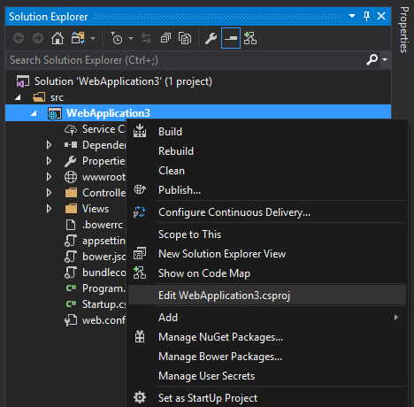

# Migrating From ASP.NET to ASP.NET Core 2.0

By [Isaac Levin](https://isaaclevin.com)

This article acts as a reference guide for migrating ASP.NET Framework Applications (MVC or Web Api) to ASP.Net Core 2.0 (MVC or Web Api). Here you will find initial instructions helpful in moving your .Net proper applications to Core 2.0. Additional articles cover migrating configuration and identity code found in many ASP.NET MVC projects.

> [!IMPORTANT]
> This topic uses a Preview Version of Visual Studio in order to complete it's steps. Please ensure that you have installed [Visual Studio 2017 Preview version 15.3](https://www.visualstudio.com/vs/preview/) before preceeding.

## Useful Links
* [Porting Libraries to .Net Core](https://docs.microsoft.com/en-us/dotnet/core/porting/libraries)

## Key package changes
* Common assemblies and core equivalent (table or mapping diagram)
* Assemblies not supported in Core


## Net Standard
In previous versions of .Net Framework we would use [Portable Class Libraries](https://docs.microsoft.com/en-us/dotnet/standard/cross-platform/cross-platform-development-with-the-portable-class-library) to make applications cross-platform compatible. .Net Standard is the new thinking to the PCL concept, and ASP.Net Core uses .Net Standard to obtain it's standard set of Apis. With every new version of .Net Standard, more Apis will be added to the fold. The major benefit to this for ASP.Net Core, is the inclusion of the [NETStandard.Library](https://github.com/dotnet/standard/blob/master/netstandard/pkg/NETStandard.Library.dependencies.props) metapackage that will be referenced in `.csproj` upon creation of the project. So in the past when your `.csproj` would have multiple references to essential components of the Framework, when creating a new project in ASP.Net Core, the `.csproj` will only have one reference

````
  <ItemGroup>
    <PackageReference Include="Microsoft.AspNetCore.All" Version="2.0.0-preview2-final" />
  </ItemGroup>
  ````
  
  This package contains many commonly used assemblies that would otherwise need to be referenced individually
> [!NOTE]
> For a more in-depth reference to .Net Standard, read [.Net Standard](https://docs.microsoft.com/en-us/dotnet/standard/net-standard)

## Project structure differences
With ASP.Net Core the structure of `.csproj` has changed. Most notably we no longer have to include files within the `.csproj` for them to be considered part of the project. This reduces the risk of merge conflicts when working on large teams as different features may been to add different files and conflict resolution isn't that great with XML. Also there are no more references to other projects using Guids, which adds more readability to the file in general. In my opinion however, the most interesting change is that we can now edit the `.csproj` without unloading it in Visual Studio



The process that ASP.Net Core uses to load your application has changed as well. In previous versions of .Net Framework, the entry point was Global.asax so we would load our routes, filters and register areas within there

[!code-csharp[Main](samples/sample6.cs)]

This couples our application and the server it is deployed to in a way that interferes with our implementation. In an effort to decouple, [OWIN](http://owin.org/) was introduced to provide a cleaner way to use multiple frameworks together. This framework provides a pipeline so we can add a-la cart modules to our pipeline at our leisure and needs. The hosting environment takes a `Startup` function to set up everything. That function registers a set of Middleware with the application. For each request, the application calls each of the the middleware components with the head pointer of a linked list to an existing set of handlers. Each middleware can add one or more handlers to the request handling pipeline by returning a reference to the handler that will be the new head of the list. Each handler is responsible for remembering and invoking the next handler in the list. Now the entry point to your application is `Startup` and you no longer have a dependency on `Global.asax`. When using OWIN with .Net Framework, you could have something like this as a pipeline.

[!code-csharp[Main](samples/sample7.cs)]

This configures your default routes, and defaults to XmlSerialization over Json. From here you could continue to add other Middleware to this pipeline as you see fit to satisfy your application's needs (loading services, configuration settings, static files, etc).

Dot Net Core uses a similar approach but no longer relies on OWIN to handle the entry, instead that is done through `Program.cs` Main method (similar to Console Applcations) and Startup is loaded through there.

[!code-csharp[Main](samples/sample8.cs)]

`Startup` must include a Configure method and inside Configure we can add whatever Middleware to the pipeline we need. In the following example from the default web site template, several extension methods are used to configure the pipeline with support for [BrowserLink](http://vswebessentials.com/features/browserlink), error pages, static files, ASP.NET MVC, and Identity.

[!code-csharp[Main](../common/samples/WebApplication1/Startup.cs?highlight=8,9,10,14,17,19,21&start=58&end=84)]

Now we have a decoupled relationship between our host and our application which gives us the flexibility to move to a differnet platform in the future (One of the Key Positives of using Dot Net Core)

> [!NOTE]
> For a more in-depth reference to .Net Core Startup and Middleware, please read [Startup in ASP.Net Core](https://docs.microsoft.com/en-us/aspnet/core/fundamentals/startup)

## Storing Configurations
Since the earliest versions of .Net Framework, developers have needed to store settings that could change depending on the environment they were deployed to or other factors. The most common practice was to store all AppSettings in a section of your Web.config file called `<appSettings>`. 

[!code-csharp[Main](samples/sample1.cs)]

And you would read those settings using the `ConfigurationManager.AppSettings` collection in the `System.Configuration` namespace

[!code-csharp[Main](samples/sample2.cs)]

In ASP.Net Core, we hold configurations for our applications in any file and load them as part of Middleware Bootstrapping. The default file for this is `appSettings.json`

[!code-csharp[Main](samples/sample3.cs)]

And loading this file into an instance of `IConfigurationRoot` inside your application is done in `Startup.cs` 

[!code-csharp[Main](samples/sample4.cs)]

And then you read from `Configuration` to get the values of your settings

[!code-csharp[Main](samples/sample5.cs)]

There are extensions to this to make the process more robust, such as using Dependency Injection to load a service with these values, which would give you a strongly-typed set of Configurations.

> [!NOTE]
> For a more in-depth reference to .Net Core Configuration, please read [Configuration in ASP.Net Core](https://docs.microsoft.com/en-us/aspnet/core/fundamentals/configuration)

## DI first class citizen
One very important factor in building large, scalable applications is to have loosely coupled components and services. The Dependency Injection Pattern is one that takes away the inner dependency that one class my have on another (an MVC Controller relationship with an Entity Framework Context is an often used used example. Dependency Injection is also very useful because it allows a developer to better test units of work in a manner that is easy to comprehend. There are more reasons to implement Dependency Injection in your applications, and now Dependency Injection is included when building .Net Core 2.0 Applications.

In .Net Framework Applications, developers often rely on an external package to configure Dependecy Injection, one notable package being [Unity](https://github.com/unitycontainer/unity), provided by Microsoft Patterns & Practices. 

One example of setting up Dependency Injection with Unity is implementing IDependencyResolver that wraps a Unity Container

[!code-csharp[Main](../../aspnet/web-api/overview/advanced/dependency-injection/samples/sample8.cs)]

Then you create an instance of your UnityContainer, register your service and set the dependency resolver of HttpConfiguration to new instance of UnityResolver for your container

[!code-csharp[Main](../../aspnet/web-api/overview/advanced/dependency-injection/samples/sample9.cs)]

Now you can inject IProductRepository anywhere you need to

[!code-csharp[Main](../../aspnet/web-api/overview/advanced/dependency-injection/samples/sample5.cs)]

It isn't much work, but it is work regardless. Now that Dependency Injection is included with .Net Core, all that is required is adding your service in the `ConfigureServices` section of `Startup.cs`

[!code-csharp[Main](samples/sample.cs)]

That is it, you now can inject your repository anywhere like before. This process is now streamlined and reduces complexity as well as dependencies on external packages.
> [!NOTE]
> For a more in-depth reference to .Net Core and Dependecy Injection, please read Steve Smith and Scott Addie's article on Dependecy [Injection in ASP.Net Core](https://docs.microsoft.com/en-us/aspnet/core/fundamentals/dependency-injection#replacing-the-default-services-container)

## Static file / wwwroot
One essential part of web development is the ability to serve files that are "static" or in better terms, not built code to the browser. The most common examples of static files are HTML, CSS, Javascript and images and they are used by every website on the internet. We need to be able to save these files in the published location of our application (or CDN) and reference these files to load onto the browser. This process has changed in Dot Net Core wheras in previous versions of the .Net Framework, you could store your static files basically anywhere, and reference them in your view like regular html (with the path to the asset provided). 

In Dot Net Core, we store our static files in `web root` (<content root>/wwwroot) and loading them into the pipeline using the `UseStaticFiles` extension from `Statup.Configure`. Be sure to include the NuGet package "Microsoft.AspNetCore.StaticFiles" in your application.

[!code-csharp[Main](../fundamentals/static-files/sample/StartupStaticFiles.cs?highlight=3&name=snippet1)]

Doing this allows all your assets in the wwwroot folder accessible to the browser at a location such as

`http://<app>/images/<imageFileName>` (This example has an image folder in wwwroot and that folder has images in it)

> [!NOTE]
> For a more in-depth reference to .Net Core and serving Static Files, please read [Introduction to working with static files in ASP.NET Core](https://docs.microsoft.com/en-us/aspnet/core/fundamentals/static-files)
