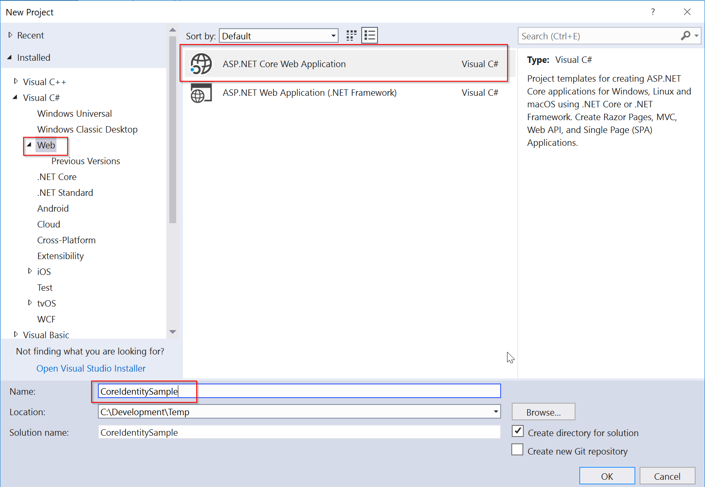
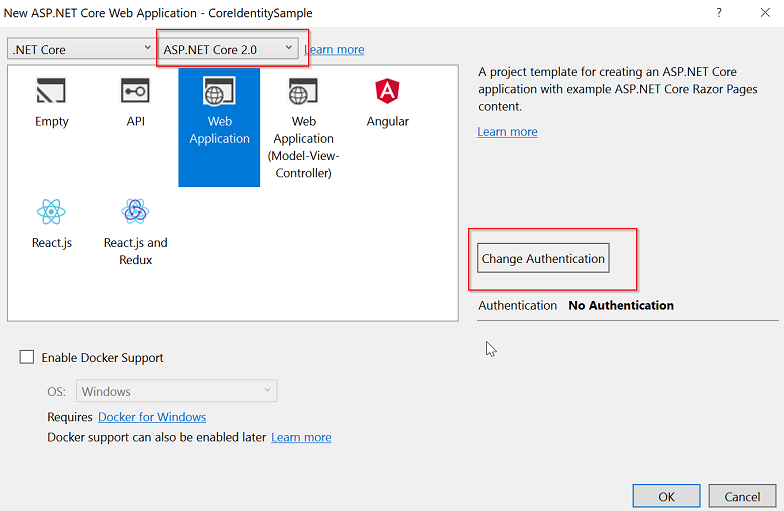
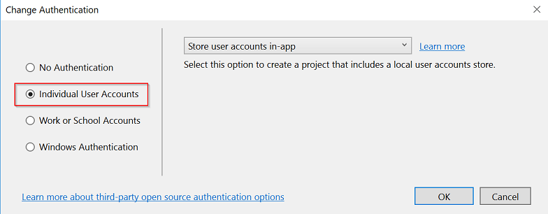
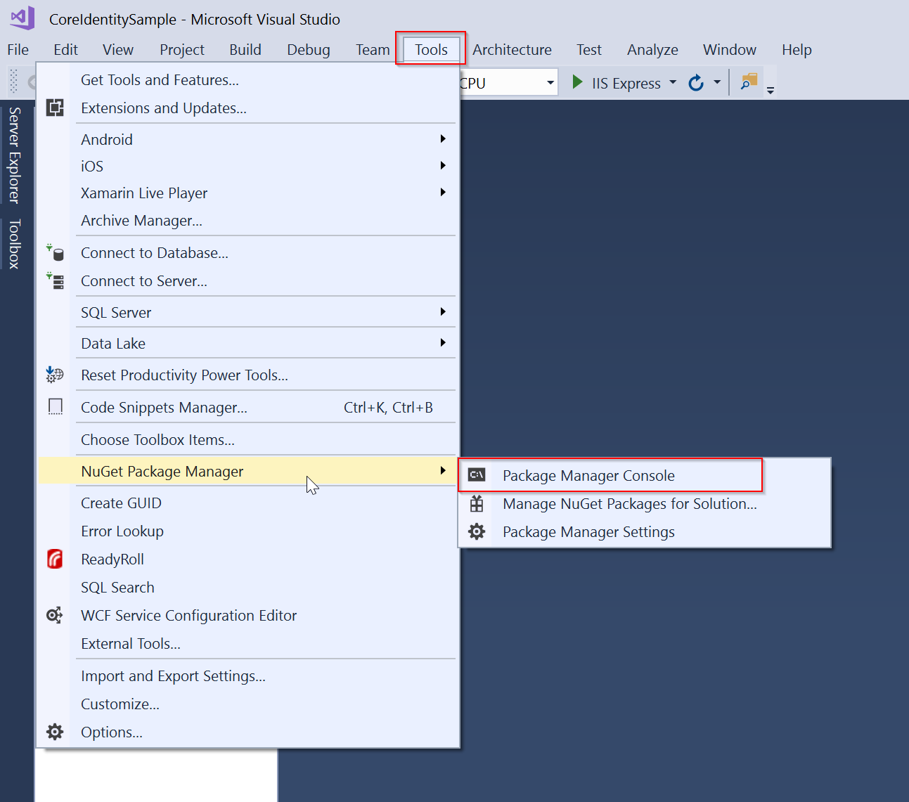

# Migrate from ASP.NET Membership Authentication to ASP.NET Core 2.0 Identity

By [Isaac Levin](https://isaaclevin.com)

This article serves as a reference guide for migrating the database schema for ASP.NET applications using Membership Authentication to to ASP.NET Core 2 Identity.

## Prerequisites

**Note:** This document provides the steps needed to migrate the database schema for ASP.NET Membership-based Applications to the database schema used for ASP.NET Core Identity. For more information about migrating from ASP.NET Membership-based Authentication to ASP.NET Identity, see [Migrating an Existing Website from SQL Membership to ASP.NET Identity](../../../aspnet/identity/overview/migrations/migrating-an-existing-website-from-sql-membership-to-aspnet-identity.md). For more information about ASP.NET Core 2 Identity, see [Introduction to Identity on ASP.NET Core](xref:security/authentication/identity)

## Review of Membership Schema

Prior to ASP.NET 2.0, developers were tasked with creating the entire Authentication and Authorization process for thier applications. With ASP.NET 2.0, Membership was introduced, providing a boilerplate solution to handling Security within ASP.NET Applicaitons. Developers were now able to bootstrap a schema into a SQL Server database with the [aspnet_regsql.exe](https://msdn.microsoft.com/library/ms229862.aspx) command. After running this command, the following tables were created in the database.

  

For existing applications to be migrated to ASP.NET Core 2 Identity, the data in these tables will need to be migrated to the tables used by the new Identity schema.

## ASP.NET Core Identity 2 Schema

For developers new to ASP.NET Core 2, it is highly reccommended to review the documentation starting at [Introduction to ASP.NET Core](xref:index). ASP.NET Core 2 follows the [Identity](../../../aspnet/identity/index) principle introduced in ASP.NET 4.5. Though the princible is shared, the implementation between the frameworks is different, even between versions of ASP.NET Core (see [Migrate authentication and Identity to ASP.NET Core 2.0](xref:migration/1x-to-2x/index)).

The fastest way to view the schema for ASP.NET Core 2 Identity is to create a new ASP.NET Core 2 Application using Visual Studio 2017.

* From Visual Studio **File** menu, select **New** > **Project**
* Create a new ASP.NET Core Web Application. Name the project **CoreIdentitySample**.

    

* Select **ASP.NET Core 2.0** in the dropdown, and then select **Web Application** (this will create a [Razor Pages Application](xref:mvc/razor-pages/index)). Before clicking **OK**, click **Change Authentication**

    

* Choose **Individual User Accounts** for the Identity templates. Finally, click **OK**, than **OK**. Visual Studio will create a project using the Core Identity template.

    

ASP.NET Core 2 Identity uses [Entity Framework Core](https://docs.microsoft.com/ef/core) to interact with the database that holds the Authentication data. In order for the newly created application to work, there needs to be a database to store this data. After creating a new application, the fastest way to inspect the schema in a database environment is to Migrate the Entity Framework Code First Schema to a database hosted either locally or elsewhere. Please review the documentation specified above for more information if interested. To create a database with the Identity Core Schema, run the following command `Package Manager Console`, which is located in **Tools** > **Nuget Package Manager** > **Package Manager Console**

   

Package Manager Console allows us to run Entity Framework commands inside of Visual Studio. The command to create a database in this context is `Update-Database`.

**Note**: Entity Framework commands use the connection string for the database specified in **appsettings.json**. The below connection string targets a database in *localhost* called *asp-net-core-identity*. In this setting, Entity Framework is configured to use the **DefaultConnection** connection string.

````json
{
  "ConnectionStrings": {
    "DefaultConnection": "Server=localhost;Database=aspnet-core-identity;Trusted_Connection=True;MultipleActiveResultSets=true"
  }
}
````

This command will "Seed" the database specified with the schema and any data needed for intialization of the application. The following image is the table structure that is created with the above steps.

   

## Migrating the Schema

Observing the table structure for both Membership and Core Identity shows there are subtle differences in the table names, and upon further investigation, the fields on said tables is different as well. The pattern has changed substantially for Authentication/Authorization with ASP.NET and ASP.NET Core applications. The key objects that are still used with Identity are **Users** and **Roles**. Here are mapping table for **Users**, **Roles** and **UserRoles**.

### Users

| **Identity(AspNetUsers)** |   | **Membership(aspnet_Users/aspnet_Membership)** ||
| --- | --- | --- | --- | --- | --- |
| **Field Name** | **Type**  |   **Field Name** | **Type**  |
|Id | string | aspnet_Users.UserId | string
|UserName | string | aspnet_Users.UserName | string
|Email | string | aspnet_Membership.Email | string
|NormalizedUserName | string | aspnet_Users.LoweredUserName | string
|NormalizedEmail | string | aspnet_Membership.LoweredEmail | string
|PhoneNumber | string | aspnet_Users.MobileAlias | string
|LockoutEnabled | bit | aspnet_Membership.IsLockedOut | bit

**Note**: Not all the fields are one-to-one relationships from Membership to Identity Core. The above table takes the default Membership User Schema and maps it to Identity Core Schema. If there are other custom fields that were used for Membership, those will need to be mapped manually. In this mapping, there is no map for Passwords, as both password criteria and Password Salts will not migrate between the two. **It is reccommended to leave the password blank and notify the user they will need to reset thier password.** LockoutEnd in Core Identity should be set to some date in the future if the user is locked out(this will be shown in the migration script).

## Roles

| **Identity(AspNetRoles)** |   | **Membership(aspnet_Roles)** ||
| --- | --- | --- | --- | --- | --- |
| **Field Name** | **Type**  |   **Field Name** | **Type**  |
|Id | string | RoleId | string
|Name | string | RoleName | string
|NormalizedName | string | LoweredRoleName | string

## User Roles

| **Identity(AspNetUserRoles)** |   | **Membership(aspnet_UsersInRoles)** ||
| --- | --- | --- | --- | --- | --- |
| **Field Name** | **Type**  |   **Field Name** | **Type**  |
|RoleId | string | RoleId | string
|UserId | string | UserId | string

Using the above mapping, putting together a migration script for Users and Roles is much easier. The below example assumes you have two databases on a database server; one that contains the existing ASP.NET Membership schema and data, and the other that was created using steps described earlier. Comments are included inline for more details

````sql
-- THIS SCRIPT WILL NEED TO BE RUN FROM THE CONTEXT OF THE MEMBERSHIP DB
BEGIN TRANSACTION MigrateUsersAndRoles
USING aspnetdb

-- INSERT USERS
INSERT INTO coreidentity.dbo.aspnetusers
            (id,
             username,
             normalizedusername,
             passwordhash,
             securitystamp,
             emailconfirmed,
             phonenumber,
             phonenumberconfirmed,
             twofactorenabled,
             lockoutend,
             lockoutenabled,
             accessfailedcount,
             email,
             normalizedemail)
SELECT aspnet_users.userid,
       aspnet_users.username,
       aspnet_users.loweredusername
       "", --Creates an empty password since passwords do not map between the two schemas
       NewID(), -- Security Stamp is a token used to verify the state of an account and is subject to change at any time. Due to this it should be intialized as a new ID
       1, --EmailConfirmed is set when a new user is created and confirmed via email. Users must have this set during migration to ensure they are able to reset passwords.
       aspnet_users.mobilealias,
       CASE
         WHEN aspnet_membership.mobilealias = null THEN 0
         ELSE 1
       END, --
       0, --More than likely Two Factor Authentication was not setup in Membership for users so setting as false
       CASE
         WHEN aspnet_membership.islockedout = 1 THEN Dateadd(year, 1000,
                                                     Sysutcdatetime())
         ELSE NULL
       END, -- setting lockout date to time in the future (1000 years)
       aspnet_membership.islockedout,
       0, --AccessFailedAccount is used to track failed logins. This is stored in membership in multiple columns. Setting to 0 arbitrarily.
       aspnet_membership.email,
       aspnet_membership.normalizedemail
FROM   aspnet_users
       LEFT OUTER JOIN aspnet_membership
                    ON aspnet_membership.applicationid =
                       aspnet_users.applicationid
                       AND aspnet_users.userid = aspnet_membership.userid
       LEFT OUTER JOIN coreidentity.dbo.aspnetusers
                    ON aspnet_membership.userid = aspnetusers.id
WHERE  aspnetusers.id IS NULL

-- INSERT ROLES

INSERT INTO coreIdentity.aspnetroles(id,name)
SELECT roleId,rolename
FROM aspnet_roles;

-- INSERT USER ROLES

INSERT INTO coreidentity.aspnetuserroles(userid,roleid)
SELECT userid,roleid
FROM aspnet_usersinroles;

IF @@ERROR <> 0
  BEGIN
    ROLLBACK TRANSACTION MigrateUsersAndRoles
    RETURN
  END

COMMIT TRANSACTION MigrateUsersAndRoles
`````

After completion of this script, the Identity Core Application created earlier will be populated with Membership users. Users will need to change thier password in order to login as mentioned above.

**Note**: If the Membership system had users with usernames that did not match thier email address, there will need to be changes made to the Application created earlier to accommodate this. The default template expects UserName and Email to be the same, so in situations where they are different, the login process will be need to be modified to use UserName instead of Email.

* In the `PageModel` of the Login Page, located **Pages** > **Account** > **Login.cshtml.cs**
* Remove the `[EmailAddress]` Attribute from *Email*, and rename it *UserName*(this will require a change wherever EmailAddress is mentioned, in the *View* and *PageModel*)
* The result should look like the following

 

## Next Steps

In this tutorial we showed how to port users from SQL membership to ASP.NET Core 2 Identity. For more information regarding Core 2 Identity, please refer to [Introduction to Identity](xref:security/authentication/identity)