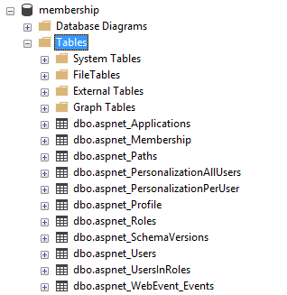
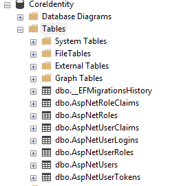
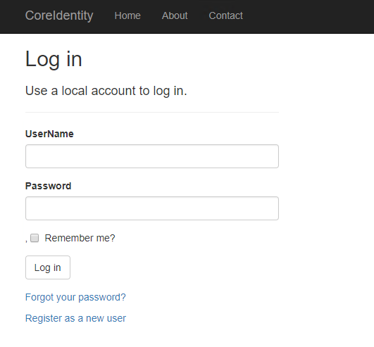

# Migrate from ASP.NET Membership authentication to ASP.NET Core 2.0 Identity

By [Isaac Levin](https://isaaclevin.com)

This article demonstrates migrating the database schema for ASP.NET apps using Membership authentication to ASP.NET Core 2.0 Identity.

> [!NOTE]
> This document provides the steps needed to migrate the database schema for ASP.NET Membership-based apps to the database schema used for ASP.NET Core Identity. For more information about migrating from ASP.NET Membership-based authentication to ASP.NET Identity, see [Migrate an existing app from SQL Membership to ASP.NET Identity](/aspnet/identity/overview/migrations/migrating-an-existing-website-from-sql-membership-to-aspnet-identity). For more information about ASP.NET Core Identity, see [Introduction to Identity on ASP.NET Core](xref:security/authentication/identity).

## Review of Membership schema

Prior to ASP.NET 2.0, developers were tasked with creating the entire authentication and authorization process for their apps. With ASP.NET 2.0, Membership was introduced, providing a boilerplate solution to handling security within ASP.NET apps. Developers were now able to bootstrap a schema into a SQL Server database with the ASP.NET SQL Server Registration Tool (`Aspnet_regsql.exe`) (no longer supported). After running this command, the following tables were created in the database.



To migrate existing apps to ASP.NET Core 2.0 Identity, the data in these tables needs to be migrated to the tables used by the new Identity schema.

## ASP.NET Core Identity 2.0 schema

ASP.NET Core 2.0 follows the [Identity](/aspnet/identity/index) principle introduced in ASP.NET 4.5. Though the principle is shared, the implementation between the frameworks is different, even between versions of ASP.NET Core (see [Migrate authentication and Identity to ASP.NET Core 2.0](xref:migration/1x-to-2x/index)).

The fastest way to view the schema for ASP.NET Core 2.0 Identity is to create a new ASP.NET Core 2.0 app. Follow these steps in Visual Studio 2017:

1. Select **File** > **New** > **Project**.
1. Create a new **ASP.NET Core Web Application** project named *CoreIdentitySample*.
1. Select **ASP.NET Core 2.0** in the dropdown and then select **Web Application**. This template produces a [Razor Pages](xref:razor-pages/index) app. Before clicking **OK**, click **Change Authentication**.
1. Choose **Individual User Accounts** for the Identity templates. Finally, click **OK**, then **OK**. Visual Studio creates a project using the ASP.NET Core Identity template.
1. Select **Tools** > **NuGet Package Manager** > **Package Manager Console** to open the **Package Manager Console** (PMC) window.
1. Navigate to the project root in PMC, and run the [Entity Framework (EF) Core](/ef/core) `Update-Database` command.

    ASP.NET Core 2.0 Identity uses EF Core to interact with the database storing the authentication data. In order for the newly created app to work, there needs to be a database to store this data. After creating a new app, the fastest way to inspect the schema in a database environment is to create the database using [EF Core Migrations](/ef/core/managing-schemas/migrations/). This process creates a database, either locally or elsewhere, which mimics that schema. Review the preceding documentation for more information.

    EF Core commands use the connection string for the database specified in `appsettings.json`. The following connection string targets a database on *localhost* named *asp-net-core-identity*. In this setting, EF Core is configured to use the `DefaultConnection` connection string.

    ```json
    {
      "ConnectionStrings": {
        "DefaultConnection": "Server=localhost;Database=aspnet-core-identity;Trusted_Connection=True;MultipleActiveResultSets=true"
      }
    }
    ```

1. Select **View** > **SQL Server Object Explorer**. Expand the node corresponding to the database name specified in the `ConnectionStrings:DefaultConnection` property of `appsettings.json`.

    The `Update-Database` command created the database specified with the schema and any data needed for app initialization. The following image depicts the table structure that's created with the preceding steps.

    

## Migrate the schema

There are subtle differences in the table structures and fields for both Membership and ASP.NET Core Identity. The pattern has changed substantially for authentication/authorization with ASP.NET and ASP.NET Core apps. The key objects that are still used with Identity are *Users* and *Roles*. Here are mapping tables for *Users*, *Roles*, and *UserRoles*.

### Users

|Identity<br>(`dbo.AspNetUsers`) column  |Type     |Membership<br>(`dbo.aspnet_Users` / `dbo.aspnet_Membership`) column|Type      |
|-------------------------------------------|-----------------------------------------------------------------------|
| `Id`                            | `string`| `aspnet_Users.UserId`                                      | `string` |
| `UserName`                      | `string`| `aspnet_Users.UserName`                                    | `string` |
| `Email`                         | `string`| `aspnet_Membership.Email`                                  | `string` |
| `NormalizedUserName`            | `string`| `aspnet_Users.LoweredUserName`                             | `string` |
| `NormalizedEmail`               | `string`| `aspnet_Membership.LoweredEmail`                           | `string` |
| `PhoneNumber`                   | `string`| `aspnet_Users.MobileAlias`                                 | `string` |
| `LockoutEnabled`                | `bit`   | `aspnet_Membership.IsLockedOut`                            | `bit`    |

> [!NOTE]
> Not all the field mappings resemble one-to-one relationships from Membership to ASP.NET Core Identity. The preceding table takes the default Membership User schema and maps it to the ASP.NET Core Identity schema. Any other custom fields that were used for Membership need to be mapped manually. In this mapping, there's no map for passwords, as both password criteria and password salts don't migrate between the two. **It's recommended to leave the password as null and to ask users to reset their passwords.** In ASP.NET Core Identity, `LockoutEnd` should be set to some date in the future if the user is locked out. This is shown in the migration script.

### Roles

|Identity<br>(`dbo.AspNetRoles`) column|Type|Membership<br>(`dbo.aspnet_Roles`) column|Type|
|----------------------------------------|-----------------------------------|
|`Id`                           |`string`|`RoleId`         | `string`        |
|`Name`                         |`string`|`RoleName`       | `string`        |
|`NormalizedName`               |`string`|`LoweredRoleName`| `string`        |

### User Roles

|Identity<br>(`dbo.AspNetUserRoles`) column|Type|Membership<br>(`dbo.aspnet_UsersInRoles`) column|Type|
|-------------------------|----------|--------------|---------------------------|
|`RoleId`                 |`string`  |`RoleId`      |`string`                   |
|`UserId`                 |`string`  |`UserId`      |`string`                   |

Reference the preceding mapping tables when creating a migration script for *Users* and *Roles*. The following example assumes you have two databases on a database server. One database contains the existing ASP.NET Membership schema and data. The other *CoreIdentitySample* database was created using steps described earlier. Comments are included inline for more details.

```sql
-- THIS SCRIPT NEEDS TO RUN FROM THE CONTEXT OF THE MEMBERSHIP DB
BEGIN TRANSACTION MigrateUsersAndRoles
USE aspnetdb

-- INSERT USERS
INSERT INTO CoreIdentitySample.dbo.AspNetUsers
            (Id,
             UserName,
             NormalizedUserName,
             PasswordHash,
             SecurityStamp,
             EmailConfirmed,
             PhoneNumber,
             PhoneNumberConfirmed,
             TwoFactorEnabled,
             LockoutEnd,
             LockoutEnabled,
             AccessFailedCount,
             Email,
             NormalizedEmail)
SELECT aspnet_Users.UserId,
       aspnet_Users.UserName,
       -- The NormalizedUserName value is upper case in ASP.NET Core Identity
       UPPER(aspnet_Users.UserName),
       -- Creates an empty password since passwords don't map between the 2 schemas
       '',
       /*
        The SecurityStamp token is used to verify the state of an account and
        is subject to change at any time. It should be initialized as a new ID.
       */
       NewID(),
       /*
        EmailConfirmed is set when a new user is created and confirmed via email.
        Users must have this set during migration to reset passwords.
       */
       1,
       aspnet_Users.MobileAlias,
       CASE
         WHEN aspnet_Users.MobileAlias IS NULL THEN 0
         ELSE 1
       END,
       -- 2FA likely wasn't setup in Membership for users, so setting as false.
       0,
       CASE
         -- Setting lockout date to time in the future (1,000 years)
         WHEN aspnet_Membership.IsLockedOut = 1 THEN Dateadd(year, 1000,
                                                     Sysutcdatetime())
         ELSE NULL
       END,
       aspnet_Membership.IsLockedOut,
       /*
        AccessFailedAccount is used to track failed logins. This is stored in
        Membership in multiple columns. Setting to 0 arbitrarily.
       */
       0,
       aspnet_Membership.Email,
       -- The NormalizedEmail value is upper case in ASP.NET Core Identity
       UPPER(aspnet_Membership.Email)
FROM   aspnet_Users
       LEFT OUTER JOIN aspnet_Membership
                    ON aspnet_Membership.ApplicationId =
                       aspnet_Users.ApplicationId
                       AND aspnet_Users.UserId = aspnet_Membership.UserId
       LEFT OUTER JOIN CoreIdentitySample.dbo.AspNetUsers
                    ON aspnet_Membership.UserId = AspNetUsers.Id
WHERE  AspNetUsers.Id IS NULL

-- INSERT ROLES
INSERT INTO CoreIdentitySample.dbo.AspNetRoles(Id, Name)
SELECT RoleId, RoleName
FROM aspnet_Roles;

-- INSERT USER ROLES
INSERT INTO CoreIdentitySample.dbo.AspNetUserRoles(UserId, RoleId)
SELECT UserId, RoleId
FROM aspnet_UsersInRoles;

IF @@ERROR <> 0
  BEGIN
    ROLLBACK TRANSACTION MigrateUsersAndRoles
    RETURN
  END

COMMIT TRANSACTION MigrateUsersAndRoles
```

After completion of the preceding script, the ASP.NET Core Identity app created earlier is populated with Membership users. Users need to change their passwords before logging in.

> [!NOTE]
> If the Membership system had users with user names that didn't match their email address, changes are required to the app created earlier to accommodate this. The default template expects `UserName` and `Email` to be the same. For situations in which they're different, the login process needs to be modified to use `UserName` instead of `Email`.

In the `PageModel` of the Login Page, located at , remove the `[EmailAddress]` attribute from the *Email* property. Rename it to *UserName*. This requires a change wherever `EmailAddress` is mentioned, in the *View* and *PageModel*. The result looks like the following:

 

## Next steps

In this tutorial, you learned how to port users from SQL membership to ASP.NET Core 2.0 Identity. For more information regarding ASP.NET Core Identity, see [Introduction to Identity](xref:security/authentication/identity).
