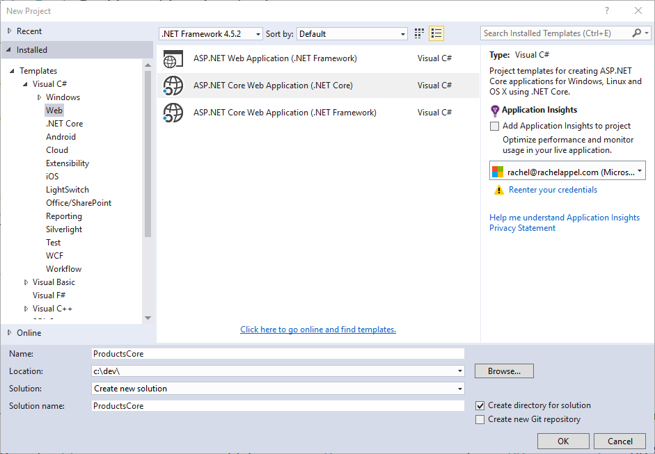
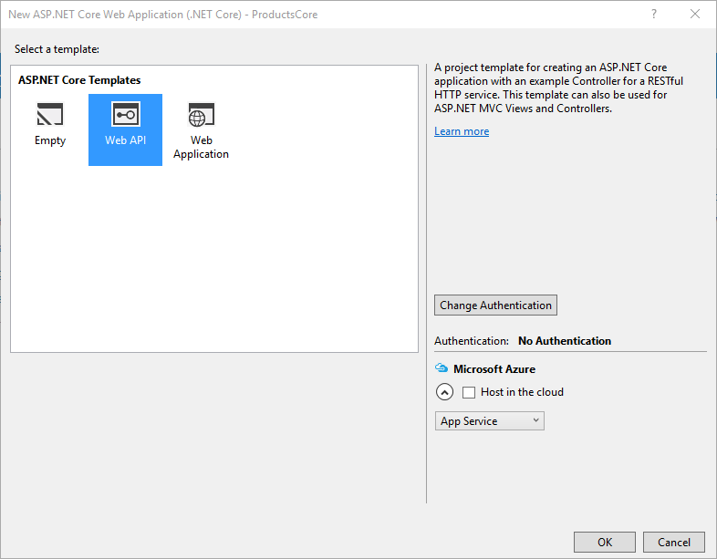

# Migrate from ASP.NET Web API to ASP.NET Core

By [Steve Smith](https://ardalis.com/) and [Scott Addie](https://scottaddie.com)

Web APIs are HTTP services that reach a broad range of clients, including browsers and mobile devices. ASP.NET Core MVC includes support for building Web APIs providing a single, consistent way of building web applications. In this article, we demonstrate the steps required to migrate a Web API implementation from ASP.NET Web API to ASP.NET Core MVC.

[View or download sample code](https://github.com/aspnet/Docs/tree/master/aspnetcore/migration/webapi/sample) ([how to download](xref:tutorials/index#how-to-download-a-sample))

## Review ASP.NET Web API project

This article uses the sample project, *ProductsApp*, created in the article [Getting Started with ASP.NET Web API 2](/aspnet/web-api/overview/getting-started-with-aspnet-web-api/tutorial-your-first-web-api) as its starting point. In that project, a simple ASP.NET Web API  project is configured as follows.

In *Global.asax.cs*, a call is made to `WebApiConfig.Register`:

[!code-csharp[](../migration/webapi/sample/ProductsApp/Global.asax.cs?highlight=14)]

`WebApiConfig` is defined in *App_Start*, and has just one static `Register` method:

[!code-csharp[](../migration/webapi/sample/ProductsApp/App_Start/WebApiConfig.cs?highlight=15,16,17,18,19,20)]

This class configures [attribute routing](/aspnet/web-api/overview/web-api-routing-and-actions/attribute-routing-in-web-api-2), although it's not actually being used in the project. It also configures the routing table, which is used by ASP.NET Web API. In this case, ASP.NET Web API will expect URLs to match the format */api/{controller}/{id}*, with *{id}* being optional.

The *ProductsApp* project includes just one simple controller, which inherits from `ApiController` and exposes two methods:

[!code-csharp[](../migration/webapi/sample/ProductsApp/Controllers/ProductsController.cs?highlight=19,24)]

Finally, the model, *Product*, used by the *ProductsApp*, is a simple class:

[!code-csharp[](webapi/sample/ProductsApp/Models/Product.cs)]

Now that we have a simple project from which to start, we can demonstrate how to migrate this Web API project to ASP.NET Core MVC.

## Create the Destination Project

Using Visual Studio, create a new, empty solution, and name it *WebAPIMigration*. Add the existing *ProductsApp* project to it, then, add a new ASP.NET Core Web Application Project to the solution. Name the new project *ProductsCore*.



Next, choose the Web API project template. We will migrate the *ProductsApp* contents to this new project.



Delete the `Project_Readme.html` file from the new project. Your solution should now look like this:


## Migrate Configuration

ASP.NET Core no longer uses *Global.asax*, *web.config*, or *App_Start* folders. Instead, all startup tasks are done in *Startup.cs* in the root of the project (see [Application Startup](../fundamentals/startup.md)). In ASP.NET Core MVC, attribute-based routing is now included by default when `UseMvc()` is called; and, this is the recommended approach for configuring Web API routes (and is how the Web API starter project handles routing).

[!code-csharp[](../migration/webapi/sample/ProductsCore/Startup.cs?highlight=31)]

Assuming you want to use attribute routing in your project going forward, no additional configuration is needed. Simply apply the attributes as needed to your controllers and actions, as is done in the sample `ValuesController` class that's included in the Web API starter project:

[!code-csharp[](../migration/webapi/sample/ProductsCore/Controllers/ValuesController.cs?highlight=9,13,20,27,33,39)]

Note the presence of *[controller]* on line 8. Attribute-based routing now supports certain tokens, such as *[controller]* and *[action]*. These tokens are replaced at runtime with the name of the controller or action, respectively, to which the attribute has been applied. This serves to reduce the number of magic strings in the project, and it ensures the routes will be kept synchronized with their corresponding controllers and actions when automatic rename refactorings are applied.

To migrate the Products API controller, we must first copy *ProductsController* to the new project. Then simply include the route attribute on the controller:

```csharp
[Route("api/[controller]")]
```

You also need to add the `[HttpGet]` attribute to the two methods, since they both should be called via HTTP Get. Include the expectation of an "id" parameter in the attribute for `GetProduct()`:

```csharp
// /api/products
[HttpGet]
...

// /api/products/1
[HttpGet("{id}")]
```

At this point, routing is configured correctly; however, we can't yet test it. Additional changes must be made before *ProductsController* will compile.

## Migrate Models and Controllers

The last step in the migration process for this simple Web API project is to copy over the Controllers and any Models they use. In this case, simply copy *Controllers/ProductsController.cs* from the original project to the new one. Then, copy the entire Models folder from the original project to the new one. Adjust the namespaces to match the new project name (*ProductsCore*).  At this point, you can build the application, and you will find a number of compilation errors. These should generally fall into the following categories:

* *ApiController* does not exist

* *System.Web.Http* namespace does not exist

* *IHttpActionResult* does not exist

Fortunately, these are all very easy to correct:

* Change *ApiController* to *Controller* (you may need to add *using Microsoft.AspNetCore.Mvc*)

* Delete any using statement referring to *System.Web.Http*

* Change any method returning *IHttpActionResult* to return a *IActionResult*

Once these changes have been made and unused using statements removed, the migrated *ProductsController* class looks like this:

[!code-csharp[](../migration/webapi/sample/ProductsCore/Controllers/ProductsController.cs?highlight=1,2,6,8,9,27)]

You should now be able to run the migrated project and browse to */api/products*; and, you should see the full list of 3 products. Browse to */api/products/1* and you should see the first product.

## ASP.NET 4.x Web API 2 compatibility shim

A useful tool when migrating ASP.NET Web API projects to ASP.NET Core is the [Microsoft.AspNetCore.Mvc.WebApiCompatShim](https://www.nuget.org/packages/Microsoft.AspNetCore.Mvc.WebApiCompatShim) library. The compatibility shim extends ASP.NET Core to allow a number of different Web API 2 conventions to be used. The sample ported previously in this document is basic enough that the compatibility shim was not necessary. For larger projects, using the compatibility shim can be useful for temporarily bridging the API gap between ASP.NET Core and ASP.NET Web API 2.

The Web API compatibility shim is meant to be used as a temporary measure to facilitate migrating large Web API projects to ASP.NET Core. Over time, projects should be updated to use ASP.NET Core patterns instead of relying on the compatibility shim.

Compatibility features included in `Microsoft.AspNetCore.Mvc.WebApiCompatShim` include:

* Adds an `ApiController` type so that controllers' base types don't need to be updated.
* Enables Web API-style model binding. ASP.NET Core MVC model binding functions similarly to MVC 5, by default. The compatibility shim changes model binding to be more similar to Web API 2 model binding conventions. For example, complex types are automatically bound from the request body.
* Extends model binding so that controller actions can take parameters of type `HttpRequestMessage`.
* Adds message formatters allowing actions to return results of type `HttpResponseMessage`.
* Adds additional response methods that Web API 2 actions may have used to serve responses:
  * HttpResponseMessage generators:
    * `CreateResponse<T>`
    * `CreateErrorResponse`
  * Action result methods:
    * `BadRequestErrorMessageResult`
    * `ExceptionResult`
    * `InternalServerErrorResult`
    * `InvalidModelStateResult`
    * `NegotiatedContentResult`
    * `ResponseMessageResult`
* Adds an instance of `IContentNegotiator` to the app's DI container and makes content negotiation-related types from [Microsoft.AspNet.WebApi.Client](https://www.nuget.org/packages/Microsoft.AspNet.WebApi.Client/) available. This includes types like `DefaultContentNegotiator`, `MediaTypeFormatter`, etc.

To use the compatibility shim, you need to:

* Install the [Microsoft.AspNetCore.Mvc.WebApiCompatShim](https://www.nuget.org/packages/Microsoft.AspNetCore.Mvc.WebApiCompatShim) NuGet package.
* Register the compatibility shim's services with the app's DI container by calling `services.AddMvc().AddWebApiConventions()` in the app's `Startup.ConfigureServices` method.
* Define Web API-specific routes using `MapWebApiRoute` on the `IRouteBuilder` in the app's `IApplicationBuilder.UseMvc` call.

## Summary

Migrating a simple ASP.NET Web API project to ASP.NET Core MVC is fairly straightforward, thanks to the built-in support for Web APIs in ASP.NET Core MVC. The main pieces every ASP.NET Web API project will need to migrate are routes, controllers, and models, along with updates to the types used by  controllers and actions.
