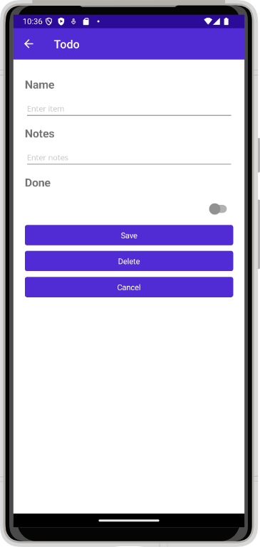
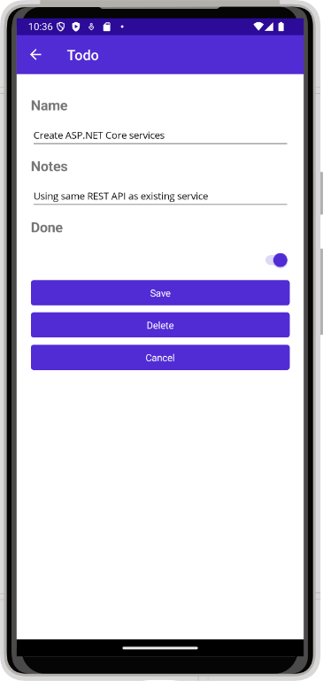
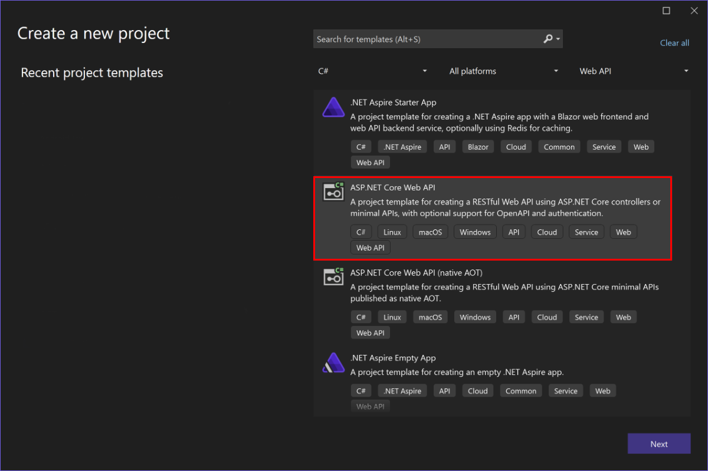

# Create backend services for native mobile apps with ASP.NET Core

By [James Montemagno](https://twitter.com/JamesMontemagno)

Mobile apps can communicate with ASP.NET Core backend services. For instructions on connecting local web services from iOS simulators and Android emulators, see [Connect to local web services from Android emulators and iOS simulators](/dotnet/maui/data-cloud/local-web-services).

[View or download sample backend services code](https://github.com/dotnet/maui-samples/tree/main/9.0/WebServices/TodoREST)

## The sample native mobile app

This tutorial demonstrates how to create backend services using ASP.NET Core to support native mobile apps. It uses a [.NET MAUI app](/samples/dotnet/maui-samples/webservices-rest/) as its native client. The sample includes an ASP.NET Core Web API services project, which this article shows how to build.


### Features

The [TodoREST app](https://github.com/dotnet/maui-samples/tree/main/9.0/WebServices/TodoREST) supports listing, adding, deleting, and updating todo items. Each item has an ID, a name, notes, and a property indicating whether it's been done yet.

In the previous example, The main view of the items lists each item's name and indicates if it's done with a checkmark.

Tapping the `+` icon navigates to the add item page:



Tapping an item on the main page navigates to an edit page where the item's name, notes, and done settings can be modified, or the item can be deleted:



To test it out yourself against the ASP.NET Core app created in the next section, if you host it online, update the app's [`RestUrl`](https://github.com/dotnet/maui-samples/blob/52607dc4ebf19a51ce59694b57e704b67600f69b/9.0/WebServices/TodoREST/TodoREST/Constants.cs#L6) constant. Otherwise, the app will communicate with the ASP.NET Core app that's hosted locally on your machine.

Android emulators don't run on the local machine and use a loopback IP (10.0.2.2) to communicate with the local machine. Use .NET MAUI's [DeviceInfo](/dotnet/maui/platform-integration/device/information) class to detect the operating system the app is running on to use the correct URL.

Navigate to the [`TodoREST`](https://github.com/dotnet/maui-samples/tree/main/9.0/WebServices/TodoREST) project and open the [`Constants.cs`](https://github.com/dotnet/maui-samples/blob/main/9.0/WebServices/TodoREST/TodoREST/Constants.cs) file. The `Constants.cs` file contains the following configuration.

:::code language="csharp" source="~/../maui-samples/9.0/WebServices/TodoREST/TodoREST/Constants.cs" highlight="10":::

You can optionally deploy the web service to a cloud service such as Azure and update the `RestUrl`.

## Creating the ASP.NET Core Project

Create a new ASP.NET Core Web Application in Visual Studio. Choose the Web API template. Name the project *TodoAPI*.



The app should respond to all requests made over HTTPS to port 5001.

> [!NOTE]
> Run the app directly, rather than behind IIS Express. IIS Express ignores non-local requests by default. Run [dotnet run](/dotnet/core/tools/dotnet-run) from a command prompt, or choose the app name profile from the Debug Target dropdown in the Visual Studio toolbar.

Add a model class to represent todo items. Mark required fields with the `[Required]` attribute:

:::code language="csharp" source="~/../maui-samples/9.0/WebServices/TodoREST/TodoAPI/Models/TodoItem.cs":::

API methods require defining to work with data. Use the same `ITodoRepository` interface the sample uses:

:::code language="csharp" source="~/../maui-samples/9.0/WebServices/TodoREST/TodoAPI/Interfaces/ITodoRepository.cs":::

For this sample, the repository implementation just uses a private collection of items:

:::code language="csharp" source="~/../maui-samples/9.0/WebServices/TodoREST/TodoAPI/Services/TodoRepository.cs":::

Configure the implementation in `Program.cs`:

:::code language="csharp" source="~/../maui-samples/9.0/WebServices/TodoREST/TodoAPI/Program.cs" highlight="5":::

## Creating the Controller

Add a new controller to the project, [TodoItemsController](https://github.com/dotnet/maui-samples/blob/main/9.0/WebServices/TodoREST/TodoAPI/Controllers/TodoItemsController.cs). It should inherit from <xref:Microsoft.AspNetCore.Mvc.ControllerBase>. Add a `Route` attribute to indicate that the controller handles requests made to paths starting with `api/todoitems`. The `[controller]` token in the route is replaced by the name of the controller (omitting the `Controller` suffix), and is especially helpful for global routes. Learn more about [routing](../fundamentals/routing.md).

The controller requires an `ITodoRepository` to function; request an instance of this type through the controller's constructor. At runtime, this instance is provided using the framework's support for [dependency injection](../fundamentals/dependency-injection.md).

:::code language="csharp" source="~/../maui-samples/9.0/WebServices/TodoREST/TodoAPI/Controllers/TodoItemsController.cs" id="snippetDI":::

This API supports four different HTTP verbs to perform CRUD (Create, Read, Update, Delete) operations on the data source. The simplest of these is the Read operation, which corresponds to an HTTP `GET` request.

## Test the API using curl

You can test the API method using a variety of tools. For this tutorial the following open source command-line tools are used:

* [curl](https://curl.se/): Transfers data using various protocols including HTTP and HTTPS. curl is used in this tutorial to call the API using HTTP methods `GET`, `POST`, `PUT`, and `DELETE`.
* [jq](https://jqlang.github.io/jq/download/): A JSON processor used in this tutorial to format JSON data so that it's easy to read from the API response.

### Install curl and jq

# [macOS](#tab/macos)

curl is preinstalled on macOS and is used directly within the macOS Terminal application. For more information on installing curl, see [the Official curl website](https://curl.se/download.html).

jq can be installed from Homebrew from the terminal:

Install Homebrew, if not already installed, with the following command:

```Bash
/bin/bash -c "$(curl -fsSL https://raw.githubusercontent.com/Homebrew/install/HEAD/install.sh)"
```

Follow the instructions presented by the installer.

Install jq using Homebrew with the following command:

```Bash
brew install jq
```

For more information on Homebrew and jq installation, see [Homebrew](https://brew.sh) and [jq](https://jqlang.github.io/jq/download/).

# [Windows](#tab/windows)

curl is installed with Windows 10, version 1802 or higher. For more information on installing curl, see [the Official curl website](https://curl.se/download.html).

Install jq with the following command in PowerShell or the Command Prompt:

```powershell
winget install jqlang.jq
```

The `jq` command is available once the PowerShell or Command Prompt is closed and restarted.

For more details on jq installation, see [jq](https://jqlang.github.io/jq/download).

---

### Reading items

Requesting a list of items is done with a GET request to the `List` method. The `[HttpGet]` attribute on the `List` method indicates that this action should only handle GET requests. The route for this action is the route specified on the controller. You don't necessarily need to use the action name as part of the route. You just need to ensure each action has a unique and unambiguous route. Routing attributes can be applied at both the controller and method levels to build up specific routes.

:::code language="csharp" source="~/../maui-samples/9.0/WebServices/TodoREST/TodoAPI/Controllers/TodoItemsController.cs" id="snippet":::

# [macOS](#tab/macos)

In the terminal, call the following curl command:

  ```Bash
  curl -v -X GET 'https://localhost:5001/api/todoitems/' | jq
  ```

# [Windows](#tab/windows)

> [!NOTE]
> Windows PowerShell 5.1 recognizes `curl` as an alias to `Invoke-WebRequst`.  To use `curl.exe` instead,  type the `&` operator followed by the full path to `curl.exe`. Find the full path to `curl.exe` by typing `where curl` in the Command Prompt.
>For example, if the full path to `curl.exe` is `C:\Windows\System32\curl.exe`.  Then instead of typing the command `curl --help`, use `& 'C:\Windows\System32\curl.exe' --help`.
>PowerShell 7 uses `curl` as the command for `curl.exe` and so a full path is not required.

In PowerShell, call the following curl command:

  ```powershell
  curl -v -X GET 'https://localhost:5001/api/todoitems/' | jq
  ```

---

The previous curl command includes the following components:

* `-v`: Activates verbose mode, providing detailed information about the HTTP response and is useful for API testing and troubleshooting.
* `-X GET`: Specifies the use of the HTTP `GET` method for the request. While curl can often infer the intended HTTP method, this option makes it explicit.
* `'https://localhost:5001/api/todoitems/'`: This is the request’s target URL. In this instance, it’s a REST API endpoint.
* `| jq`: This segment isn’t related to curl directly. The pipe `|` is a shell operator that takes the output from the command on its left and “pipes” it to the command on its right. `jq` is a command-line JSON processor. While not required, `jq` makes the returned JSON data easier to read.

The `List` method returns a 200 OK response code and all of the Todo items, serialized as JSON:

```output
[
  {
    "id": "6bb8a868-dba1-4f1a-93b7-24ebce87e243",
    "name": "Learn app development",
    "notes": "Take Microsoft Learn Courses",
    "done": true
  },
  {
    "id": "b94afb54-a1cb-4313-8af3-b7511551b33b",
    "name": "Develop apps",
    "notes": "Use Visual Studio and Visual Studio Code",
    "done": false
  },
  {
    "id": "ecfa6f80-3671-4911-aabe-63cc442c1ecf",
    "name": "Publish apps",
    "notes": "All app stores",
    "done": false
  }
]
```

### Creating items

By convention, creating new data items is mapped to the HTTP `POST` verb. The `Create` method has an `[HttpPost]` attribute applied to it and accepts a `TodoItem` instance. Since the `item` argument is passed in the body of the POST, this parameter specifies the `[FromBody]` attribute.

Inside the method, the item is checked for validity and prior existence in the data store, and if no issues occur, it's added using the repository. Checking `ModelState.IsValid` performs [model validation](../mvc/models/validation.md), and should be done in every API method that accepts user input.

:::code language="csharp" source="~/../maui-samples/9.0/WebServices/TodoREST/TodoAPI/Controllers/TodoItemsController.cs" id="snippetCreate":::

The sample uses an `enum` containing error codes that are passed to the mobile client:

:::code language="csharp" source="~/../maui-samples/9.0/WebServices/TodoREST/TodoAPI/Controllers/TodoItemsController.cs" id="snippetErrorCode":::

In the terminal, test adding new items by calling the following curl command using the `POST` verb and providing the new object in JSON format in the Body of the request.

# [macOS](#tab/macos)

```Bash
curl -v -X POST 'https://localhost:5001/api/todoitems/' \
--header 'Content-Type: application/json' \
--data '{
  "id": "aaaabbbb-0000-cccc-1111-dddd2222eeee",
  "name": "A Test Item",
  "notes": "asdf",
  "done": false
}' | jq
```

# [Windows](#tab/windows)

```powershell
curl -v -X POST 'https://localhost:5001/api/todoitems/' `
--header 'Content-Type: application/json' `
--data '{
  "id": "aaaabbbb-0000-cccc-1111-dddd2222eeee",
  "name": "A Test Item",
  "notes": "asdf",
  "done": false
}' | jq
```

---

The previous curl command includes the following options:

* `--header 'Content-Type: application/json'`: Sets the `Content-Type` header to `application/json`, indicating that the request body contains JSON data.
* `--data '{...}'`: Sends the specified data in the request body.

The method returns the newly created item in the response.

### Updating items

Modifying records is achieved using HTTP `PUT` requests. Other than this change, the `Edit` method is almost identical to `Create`. If the record isn't found, the `Edit` action returns a `NotFound` (404) response.

:::code language="csharp" source="~/../maui-samples/9.0/WebServices/TodoREST/TodoAPI/Controllers/TodoItemsController.cs" id="snippetEdit":::

To test with curl, change the verb to `PUT`. Specify the updated object data in the Body of the request.

# [macOS](#tab/macos)

```Bash
curl -v -X PUT 'https://localhost:5001/api/todoitems/' \
--header 'Content-Type: application/json' \
--data '{
  "id": "aaaabbbb-0000-cccc-1111-dddd2222eeee",
  "name": "A Test Item",
  "notes": "asdf",
  "done": true
}' | jq
```
# [Windows](#tab/windows)

```powershell
curl -v -X PUT 'https://localhost:5001/api/todoitems/' `
--header 'Content-Type: application/json' `
--data '{
  "id": "aaaabbbb-0000-cccc-1111-dddd2222eeee",
  "name": "A Test Item",
  "notes": "asdf",
  "done": true
}' | jq
```

---

This method returns a `NoContent` (204) response when successful, for consistency with the pre-existing API.

### Deleting items

Deleting records is accomplished by making `DELETE` requests to the service, and passing the ID of the item to be deleted. As with updates, requests for items that don't exist receive `NotFound` responses. Otherwise, a successful request returns a `NoContent` (204) response.

:::code language="csharp" source="~/../maui-samples/9.0/WebServices/TodoREST/TodoAPI/Controllers/TodoItemsController.cs" id="snippetDelete":::

Test with curl by changing the HTTP verb to `DELETE` and appending the ID of the data object to delete at the end of the URL. Nothing is required in the Body of the request.

# [macOS](#tab/macos)

```Bash
curl -v -X DELETE 'https://localhost:5001/api/todoitems/6bb8b868-dba1-4f1a-93b7-24ebce87e243'
```
# [Windows](#tab/windows)

```powershell
curl -v -X DELETE 'https://localhost:5001/api/todoitems/6bb8b868-dba1-4f1a-93b7-24ebce87e243'
```

---

## Prevent over-posting

Currently the sample app exposes the entire `TodoItem` object. Production apps typically limit the data that's input and returned using a subset of the model. There are multiple reasons behind this and security is a major one. The subset of a model is usually referred to as a Data Transfer Object (DTO), input model, or view model. **DTO** is used in this article.

A DTO may be used to:

* Prevent over-posting.
* Hide properties that clients aren't supposed to view.
* Omit some properties to reduce payload size.
* Flatten object graphs that contain nested objects. Flattened object graphs can be more convenient for clients.

To demonstrate the DTO approach, see [Prevent over-posting](xref:tutorials/first-web-api#prevent-over-posting)

## Common Web API conventions

As you develop the backend services for your app, you'll want to come up with a consistent set of conventions or policies for handling cross-cutting concerns. For example, in the service shown previously, requests for specific records that weren't found received a `NotFound` response, rather than a `BadRequest` response. Similarly, commands made to this service that passed in model bound types always checked `ModelState.IsValid` and returned a `BadRequest` for invalid model types.

Once you've identified a common policy for your APIs, you can usually encapsulate it in a [filter](../mvc/controllers/filters.md). Learn more about [how to encapsulate common API policies in ASP.NET Core MVC applications](/archive/msdn-magazine/2016/august/asp-net-core-real-world-asp-net-core-mvc-filters).

## See also

* [.NET MAUI: Consume a REST-based web service](/dotnet/maui/data-cloud/rest/)
* [Consume REST web services in .NET MAUI apps](/training/modules/consume-rest-services-maui/)
* [Create a web API with ASP.NET Core controllers](/training/modules/build-web-api-aspnet-core/)
