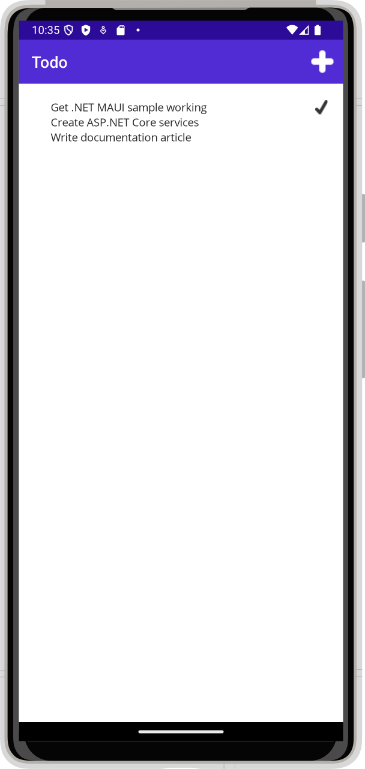

# Create backend services for native mobile apps with ASP.NET Core

By [James Montemagno](https://twitter.com/JamesMontemagno)

Mobile apps can communicate with ASP.NET Core backend services. For instructions on connecting local web services from iOS simulators and Android emulators, see [Connect to Local Web Services from iOS Simulators and Android Emulators](/xamarin/cross-platform/deploy-test/connect-to-local-web-services).

[View or download sample backend services code](https://github.com/xamarin/xamarin-forms-samples/tree/main/WebServices/TodoREST)

## The Sample Native Mobile App

This tutorial demonstrates how to create backend services using ASP.NET Core to support native mobile apps. It uses the [Xamarin.Forms TodoRest app](/xamarin/xamarin-forms/data-cloud/consuming/rest) as its native client, which includes separate native clients for Android, iOS, and Windows. You can follow the linked tutorial to create the native app (and install the necessary free Xamarin tools), as well as download the Xamarin sample solution. The Xamarin sample includes an ASP.NET Core Web API services project, which this article's ASP.NET Core app replaces (with no changes required by the client).

### Features

The [TodoREST app](https://github.com/xamarin/xamarin-forms-samples/tree/main/WebServices/TodoREST) supports listing, adding, deleting, and updating To-Do items. Each item has an ID, a Name, Notes, and a property indicating whether it's been Done yet.

The main view of the items, as shown above, lists each item's name and indicates if it's done with a checkmark.

Tapping the `+` icon opens an add item dialog:

Tapping an item on the main list screen opens up an edit dialog where the item's Name, Notes, and Done settings can be modified, or the item can be deleted:

To test it out yourself against the ASP.NET Core app created in the next section running on your computer, update the app's [`RestUrl`](https://github.com/xamarin/xamarin-forms-samples/blob/main/WebServices/TodoREST/TodoREST/Constants.cs#L13) constant.

Android emulators do not run on the local machine and use a loopback IP (10.0.2.2) to communicate with the local machine. Leverage [Xamarin.Essentials DeviceInfo](/xamarin/essentials/device-information/) to detect what operating the system is running to use the correct URL.

Navigate to the [`TodoREST`](https://github.com/xamarin/xamarin-forms-samples/tree/main/WebServices/TodoREST/TodoREST) project and open the [`Constants.cs`](https://github.com/xamarin/xamarin-forms-samples/blob/main/WebServices/TodoREST/TodoREST/Constants.cs) file. The `Constants.cs` file contains the following configuration.

:::code language="csharp" source="~/../xamarin-forms-samples/WebServices/TodoREST/TodoREST/Constants.cs" highlight="13":::

You can optionally deploy the web service to a cloud service such as Azure and update the `RestUrl`.

## Creating the ASP.NET Core Project

Create a new ASP.NET Core Web Application in Visual Studio. Choose the Web API template. Name the project *TodoAPI*.

The app should respond to all requests made to port 5000 including clear-text http traffic for our mobile client. Update `Startup.cs` so <xref:Microsoft.AspNetCore.Builder.HttpsPolicyBuilderExtensions.UseHttpsRedirection%2A> doesn't run in development:

:::code language="csharp" source="~/../xamarin-forms-samples/WebServices/TodoREST/TodoAPI/TodoAPI/Startup.cs" id="snippet" highlight="7-11":::

> [!NOTE]
> Run the app directly, rather than behind IIS Express. IIS Express ignores non-local requests by default. Run [dotnet run](/dotnet/core/tools/dotnet-run) from a command prompt, or choose the app name profile from the Debug Target dropdown in the Visual Studio toolbar.

Add a model class to represent To-Do items. Mark required fields with the `[Required]` attribute:

:::code language="csharp" source="~/../xamarin-forms-samples/WebServices/TodoREST/TodoAPI/TodoAPI/Models/TodoItem.cs":::

The API methods require some way to work with data. Use the same `ITodoRepository` interface the original Xamarin sample uses:

:::code language="csharp" source="~/../xamarin-forms-samples/WebServices/TodoREST/TodoAPI/TodoAPI/Interfaces/ITodoRepository.cs":::

For this sample, the implementation just uses a private collection of items:

:::code language="csharp" source="~/../xamarin-forms-samples/WebServices/TodoREST/TodoAPI/TodoAPI/Services/TodoRepository.cs":::

Configure the implementation in `Startup.cs`:

:::code language="csharp" source="~/../xamarin-forms-samples/WebServices/TodoREST/TodoAPI/TodoAPI/Startup.cs" id="snippet2" highlight="3":::

## Creating the Controller

Add a new controller to the project, [TodoItemsController](https://github.com/xamarin/xamarin-forms-samples/tree/main/WebServices/TodoREST/TodoAPI/TodoAPI/Controllers/TodoItemsController.cs). It should inherit from <xref:Microsoft.AspNetCore.Mvc.ControllerBase>. Add a `Route` attribute to indicate that the controller will handle requests made to paths starting with `api/todoitems`. The `[controller]` token in the route is replaced by the name of the controller (omitting the `Controller` suffix), and is especially helpful for global routes. Learn more about [routing](../fundamentals/routing.md).

The controller requires an `ITodoRepository` to function; request an instance of this type through the controller's constructor. At runtime, this instance will be provided using the framework's support for [dependency injection](../fundamentals/dependency-injection.md).

:::code language="csharp" source="~/../xamarin-forms-samples/WebServices/TodoREST/TodoAPI/TodoAPI/Controllers/TodoItemsController.cs" id="snippetDI":::

This API supports four different HTTP verbs to perform CRUD (Create, Read, Update, Delete) operations on the data source. The simplest of these is the Read operation, which corresponds to an HTTP GET request.

### Reading Items

Requesting a list of items is done with a GET request to the `List` method. The `[HttpGet]` attribute on the `List` method indicates that this action should only handle GET requests. The route for this action is the route specified on the controller. You don't necessarily need to use the action name as part of the route. You just need to ensure each action has a unique and unambiguous route. Routing attributes can be applied at both the controller and method levels to build up specific routes.

:::code language="csharp" source="~/../xamarin-forms-samples/WebServices/TodoREST/TodoAPI/TodoAPI/Controllers/TodoItemsController.cs" id="snippet":::

The `List` method returns a 200 OK response code and all of the Todo items, serialized as JSON.

You can test your new API method using a variety of tools, such as [Postman](https://www.getpostman.com/docs/), shown here:

### Creating Items

By convention, creating new data items is mapped to the HTTP POST verb. The `Create` method has an `[HttpPost]` attribute applied to it and accepts a `TodoItem` instance. Since the `item` argument is passed in the body of the POST, this parameter specifies the `[FromBody]` attribute.

Inside the method, the item is checked for validity and prior existence in the data store, and if no issues occur, it's added using the repository. Checking `ModelState.IsValid` performs [model validation](../mvc/models/validation.md), and should be done in every API method that accepts user input.

:::code language="csharp" source="~/../xamarin-forms-samples/WebServices/TodoREST/TodoAPI/TodoAPI/Controllers/TodoItemsController.cs" id="snippetCreate":::

The sample uses an `enum` containing error codes that are passed to the mobile client:

:::code language="csharp" source="~/../xamarin-forms-samples/WebServices/TodoREST/TodoAPI/TodoAPI/Controllers/TodoItemsController.cs" id="snippetErrorCode":::

Test adding new items using Postman by choosing the POST verb providing the new object in JSON format in the Body of the request. You should also add a request header specifying a `Content-Type` of `application/json`.

The method returns the newly created item in the response.

### Updating Items

Modifying records is done using HTTP PUT requests. Other than this change, the `Edit` method is almost identical to `Create`. Note that if the record isn't found, the `Edit` action will return a `NotFound` (404) response.

:::code language="csharp" source="~/../xamarin-forms-samples/WebServices/TodoREST/TodoAPI/TodoAPI/Controllers/TodoItemsController.cs" id="snippetEdit":::

To test with Postman, change the verb to PUT. Specify the updated object data in the Body of the request.

This method returns a `NoContent` (204) response when successful, for consistency with the pre-existing API.

### Deleting Items

Deleting records is accomplished by making DELETE requests to the service, and passing the ID of the item to be deleted. As with updates, requests for items that don't exist will receive `NotFound` responses. Otherwise, a successful request will get a `NoContent` (204) response.

:::code language="csharp" source="~/../xamarin-forms-samples/WebServices/TodoREST/TodoAPI/TodoAPI/Controllers/TodoItemsController.cs" id="snippetDelete":::

Note that when testing the delete functionality, nothing is required in the Body of the request.

## Prevent over-posting

Currently the sample app exposes the entire `TodoItem` object. Production apps typically limit the data that's input and returned using a subset of the model. There are multiple reasons behind this and security is a major one. The subset of a model is usually referred to as a Data Transfer Object (DTO), input model, or view model. **DTO** is used in this article.

A DTO may be used to:

* Prevent over-posting.
* Hide properties that clients are not supposed to view.
* Omit some properties in order to reduce payload size.
* Flatten object graphs that contain nested objects. Flattened object graphs can be more convenient for clients.

To demonstrate the DTO approach, see [Prevent over-posting](xref:tutorials/first-web-api#prevent-over-posting)

## Common Web API Conventions

As you develop the backend services for your app, you will want to come up with a consistent set of conventions or policies for handling cross-cutting concerns. For example, in the service shown above, requests for specific records that weren't found received a `NotFound` response, rather than a `BadRequest` response. Similarly, commands made to this service that passed in model bound types always checked `ModelState.IsValid` and returned a `BadRequest` for invalid model types.

Once you've identified a common policy for your APIs, you can usually encapsulate it in a [filter](../mvc/controllers/filters.md). Learn more about [how to encapsulate common API policies in ASP.NET Core MVC applications](/archive/msdn-magazine/2016/august/asp-net-core-real-world-asp-net-core-mvc-filters).

## Additional resources

- [Xamarin.Forms: Web Service Authentication](/xamarin/xamarin-forms/data-cloud/authentication/)
- [Xamarin.Forms: Consume a RESTful Web Service](/xamarin/xamarin-forms/data-cloud/web-services/rest)
- [Consume REST web services in Xamarin Apps](/training/modules/consume-rest-services/)
- [Create a web API with ASP.NET Core](/training/modules/build-web-api-aspnet-core/)
