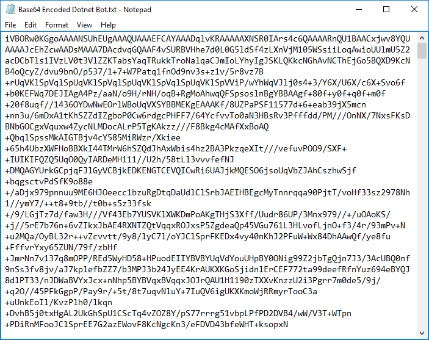
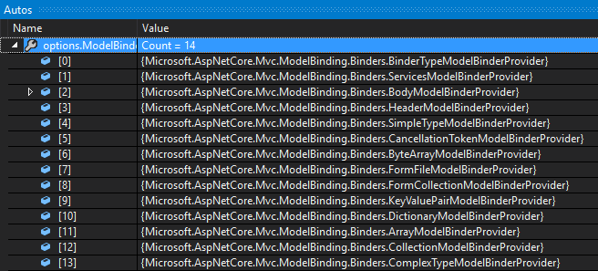

# Custom Model Binding

By [Steve Smith](https://ardalis.com/)

Model binding allows controller actions to work directly with model types (passed in as method arguments), rather than HTTP requests. Mapping between incoming request data and application models is handled by model binders. Developers can extend the built-in model binding functionality by implementing custom model binders (though typically, you don't need to write your own provider).

[View or download sample from GitHub](https://github.com/aspnet/Docs/tree/master/aspnetcore/mvc/advanced/custom-model-binding/)

## Default model binder limitations

The default model binders support most of the common .NET Core data types and should meet most developers` needs. They expect to bind text-based input from the request directly to model types. You might need to transform the input prior to binding it. For example, when you have a key that can be used to look up model data. You can use a custom model binder to fetch data based on the key.

## Model binding review

Model binding uses specific definitions for the types it operates on. A *simple type* is converted from a single string in the input. A *complex type* is converted from multiple input values. The framework determines the difference based on the existence of a `TypeConverter`. We recommended you create a type converter if you have a simple `string` -> `SomeType` mapping that doesn't require external resources.

Before creating your own custom model binder, it's worth reviewing how existing model binders are implemented. Consider the [ByteArrayModelBinder](https://docs.microsoft.com/aspnet/core/api/microsoft.aspnetcore.mvc.modelbinding.binders.bytearraymodelbinder) which can be used to convert base64-encoded strings into byte arrays. The byte arrays are often stored as files or database BLOB fields.

### Working with the ByteArrayModelBinder

Base64-encoded strings can be used to represent binary data. For example, the following image can be encoded as a string.


A small portion of the encoded string is shown in the following image:



Follow the instructions in the [sample's README](https://github.com/aspnet/Docs/blob/master/aspnetcore/mvc/advanced/custom-model-binding/sample/CustomModelBindingSample/README.md) to convert the base64-encoded string into a file.

ASP.NET Core MVC can take a base64-encoded strings and use a `ByteArrayModelBinder` to convert it into a byte array. The [ByteArrayModelBinderProvider](https://docs.microsoft.com/aspnet/core/api/microsoft.aspnetcore.mvc.modelbinding.binders.bytearraymodelbinderprovider) which implements [IModelBinderProvider](https://docs.microsoft.com/aspnet/core/api/microsoft.aspnetcore.mvc.modelbinding.imodelbinderprovider) maps `byte[]` arguments to `ByteArrayModelBinder`:

```csharp
public IModelBinder GetBinder(ModelBinderProviderContext context)
{
    if (context == null)
    {
        throw new ArgumentNullException(nameof(context));
    }

    if (context.Metadata.ModelType == typeof(byte[]))
    {
        return new ByteArrayModelBinder();
    }

    return null;
}
```

When creating your own custom model binder, you can implement your own `IModelBinderProvider` type, or use the [ModelBinderAttribute](https://docs.microsoft.com/aspnet/core/api/microsoft.aspnetcore.mvc.modelbinderattribute).

The following example shows how to use `ByteArrayModelBinder` to convert a base64-encoded string to a `byte[]` and save the result to a file:

[!code-csharp[Main](custom-model-binding/sample/CustomModelBindingSample/Controllers/ImageController.cs?name=post1&highlight=3)]

You can POST a base64-encoded string to this api method using a tool like [Postman](https://www.getpostman.com/):


As long as the binder can bind request data to appropriately named properties or arguments, model binding will succeed. The following example shows how to use `ByteArrayModelBinder` with a view model:

[!code-csharp[Main](custom-model-binding/sample/CustomModelBindingSample/Controllers/ImageController.cs?name=post2&highlight=2)]

## Custom model binder sample

In this section we'll implement a custom model binder that:

- Converts incoming request data into strongly typed key arguments.
- Uses Entity Framework Core to fetch the associated entity.
- Passes the associated entity as an argument to the action method.

The following sample uses the `ModelBinder` attribute on the `Author` model:

[!code-csharp[Main](custom-model-binding/sample/CustomModelBindingSample/Data/Author.cs?highlight=10)]

In the preceding code, the `ModelBinder` attribute specifies the type of `IModelBinder` that should be used to bind `Author` action parameters. 

The `AuthorEntityBinder` is used to bind an `Author` parameter by fetching the entity from a data source using Entity Framework Core and an `authorId`:

[!code-csharp[Main](custom-model-binding/sample/CustomModelBindingSample/Binders/AuthorEntityBinder.cs?name=demo)]

The following code shows how to use the `AuthorEntityBinder` in an action method:

[!code-csharp[Main](custom-model-binding/sample/CustomModelBindingSample/Controllers/BoundAuthorsController.cs?name=demo2&highlight=2)]

The `ModelBinder` attribute can be used to apply the `AuthorEntityBinder` to parameters that do not use default conventions:

[!code-csharp[Main](custom-model-binding/sample/CustomModelBindingSample/Controllers/BoundAuthorsController.cs?name=demo1&highlight=2)]

In this example, since the name of the argument is not the default `authorId`, it's specified on the parameter using `ModelBinder` attribute. Note that both the controller and action method are simplified compared to looking up the entity in the action method. The logic to fetch the author using Entity Framework Core is moved to the model binder. This can be considerable simplification when you have several methods that bind to the author model, and can help you to follow the [DRY principle](http://deviq.com/don-t-repeat-yourself/).

You can apply the `ModelBinder` attribute to individual model properties (such as on a viewmodel) or to action method parameters to specify a certain model binder or model name for just that type or action.

### Implementing a ModelBinderProvider

Instead of applying an attribute, you can implement `IModelBinderProvider`. This is how the built-in framework binders are implemented. When you specify the type your binder operates on, you specify the type of argument it produces, **not** the input your binder accepts. The following binder provider works with the `AuthorEntityBinder`. When it's added to MVC's collection of providers, you don't need to use the `ModelBinder` attribute on `Author` or `Author` typed parameters.

[!code-csharp[Main](custom-model-binding/sample/CustomModelBindingSample/Binders/AuthorEntityBinderProvider.cs?highlight=17-20)]

> Note:
> The preceding code returns a `BinderTypeModelBinder`. `BinderTypeModelBinder` acts as a factory for model binders and provides dependency injection (DI). The `AuthorEntityBinder` requires DI to access EF Core. Use `BinderTypeModelBinder` if your model binder requires services from DI.

To use a custom model binder provider, add it in `ConfigureServices`:

[!code-csharp[Main](custom-model-binding/sample/CustomModelBindingSample/Startup.cs?name=callout&highlight=5-9)]

When evaluating model binders, the collection of providers is examined in order. The first provider that returns a binder is used.

The following image shows the default model binders from the debugger.



Adding your provider to the end of the collection may result in a built-in model binder being called before your custom binder has a chance. In this example, the custom provider is added to the beginning of the collection to ensure it is used for `Author` action arguments.

[!code-csharp[Main](custom-model-binding/sample/CustomModelBindingSample/Startup.cs?name=callout&highlight=5-9)]

## Recommendations and best practices

Custom model binders:
- Should not attempt to set status codes or return results (for example, 404 Not Found). If model binding fails, an [action filter](xref:mvc/controllers/filters) or logic within the action method itself should handle the failure.
- Are most useful for eliminating repetitive code and cross-cutting concerns from action methods.
- Typically should not be used to convert a string into a custom type, a [`TypeConverter`](https://docs.microsoft.com//dotnet/api/system.componentmodel.typeconverter) is usually a better option.
