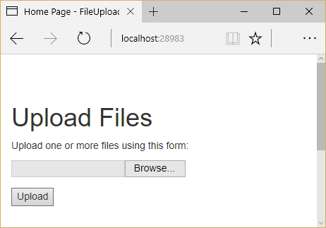

# File uploads in ASP.NET Core

By [Steve Smith](https://ardalis.com/)

ASP.NET MVC actions support uploading of one or more files using simple model binding for smaller files or streaming for larger files.

[View or download sample from GitHub](https://github.com/aspnet/Docs/tree/master/aspnetcore/mvc/models/file-uploads/sample/FileUploadSample)

## Uploading small files with model binding

To upload small files, you can use a multi-part HTML form or construct a POST request using JavaScript. An example form using Razor, which supports multiple uploaded files, is shown below:

```html
<form method="post" enctype="multipart/form-data" asp-controller="UploadFiles" asp-action="Index">
    <div class="form-group">
        <div class="col-md-10">
            <p>Upload one or more files using this form:</p>
            <input type="file" name="files" multiple />
        </div>
    </div>
    <div class="form-group">
        <div class="col-md-10">
            <input type="submit" value="Upload" />
        </div>
    </div>
</form>
```

In order to support file uploads, HTML forms must specify an `enctype` of `multipart/form-data`. The `files` input element shown above supports uploading multiple files. Omit the `multiple` attribute on this input element to allow just a single file to be uploaded. The above markup renders in a browser as:



The individual files uploaded to the server can be accessed through [Model Binding](xref:mvc/models/model-binding) using the [IFormFile](https://docs.microsoft.com/aspnet/core/api/microsoft.aspnetcore.http.iformfile) interface. `IFormFile` has the following structure:

```csharp
public interface IFormFile
{
    string ContentType { get; }
    string ContentDisposition { get; }
    IHeaderDictionary Headers { get; }
    long Length { get; }
    string Name { get; }
    string FileName { get; }
    Stream OpenReadStream();
    void CopyTo(Stream target);
    Task CopyToAsync(Stream target, CancellationToken cancellationToken = null);
}
```

> [!WARNING]
> Don't rely on or trust the `FileName` property without validation. The `FileName` property should only be used for display purposes.

When uploading files using model binding and the `IFormFile` interface, the action method can accept either a single `IFormFile` or an `IEnumerable<IFormFile>` (or `List<IFormFile>`) representing several files. The following example loops through one or more uploaded files, saves them to the local file system, and returns the total number and size of files uploaded.

[!INCLUDE [GetTempFileName](../../includes/GetTempFileName.md)]

[!code-csharp[Main](file-uploads/sample/FileUploadSample/Controllers/UploadFilesController.cs?name=snippet1)]

Files uploaded using the `IFormFile` technique are buffered in memory or on disk on the web server before being processed. Inside the action method, the `IFormFile` contents are accessible as a stream. In addition to the local file system, files can be streamed to [Azure Blob storage](https://azure.microsoft.com/documentation/articles/vs-storage-aspnet5-getting-started-blobs/) or [Entity Framework](https://docs.microsoft.com/ef/core/index).

To store binary file data in a database using Entity Framework, define a property of type `byte[]` on the entity:

```csharp
public class ApplicationUser : IdentityUser
{
    public byte[] AvatarImage { get; set; }
}
```

Specify a viewmodel property of type `IFormFile`:

```csharp
public class RegisterViewModel
{
    // other properties omitted

    public IFormFile AvatarImage { get; set; }
}
```

> [!NOTE]
> `IFormFile` can be used directly as an action method parameter or as a viewmodel property, as shown above.

Copy the `IFormFile` to a stream and save it to the byte array:

```csharp
// POST: /Account/Register
[HttpPost]
[AllowAnonymous]
[ValidateAntiForgeryToken]
public async Task<IActionResult> Register(RegisterViewModel model)
{
    ViewData["ReturnUrl"] = returnUrl;
    if  (ModelState.IsValid)
    {
        var user = new ApplicationUser {
          UserName = model.Email,
          Email = model.Email
        };
        using (var memoryStream = new MemoryStream())
        {
            await model.AvatarImage.CopyToAsync(memoryStream);
            user.AvatarImage = memoryStream.ToArray();
        }
    // additional logic omitted
    
    // Don't rely on or trust the model.AvatarImage.FileName property 
    // without validation.
}
```

> [!NOTE]
> Use caution when storing binary data in relational databases, as it can adversely impact performance.

## Uploading large files with streaming

If the size or frequency of file uploads is causing resource problems for the app, consider streaming the file upload rather than buffering it in its entirety, as the model binding approach shown above does. While using `IFormFile` and model binding is a much simpler solution, streaming requires a number of steps to implement properly.

> [!NOTE]
> Any single buffered file exceeding 64KB will be moved from RAM to a temp file on disk on the server. The resources (disk, RAM) used by file uploads depend on the number and size of concurrent file uploads. Streaming is not so much about perf, it's about scale. If you try to buffer too many uploads, your site will crash when it runs out of memory or disk space.

The following example demonstrates using JavaScript/Angular to stream to a controller action. The file's antiforgery token is generated using a custom filter attribute and passed in HTTP headers instead of in the request body. Because the action method processes the uploaded data directly, model binding is disabled by another filter. Within the action, the form's contents are read using a `MultipartReader`, which reads each individual `MultipartSection`, processing the file or storing the contents as appropriate. Once all sections have been read, the action performs its own model binding.

The initial action loads the form and saves an antiforgery token in a cookie (via the `GenerateAntiforgeryTokenCookieForAjax` attribute):

```csharp
[HttpGet]
[GenerateAntiforgeryTokenCookieForAjax]
public IActionResult Index()
{
    return View();
}
```

The attribute uses ASP.NET Core's built-in [Antiforgery](xref:security/anti-request-forgery) support to set a cookie with a request token:

[!code-csharp[Main](file-uploads/sample/FileUploadSample/Filters/GenerateAntiforgeryTokenCookieForAjaxAttribute.cs?name=snippet1)]

Angular automatically passes an antiforgery token in a request header named `X-XSRF-TOKEN`. The ASP.NET Core MVC app is configured to refer to this header in its configuration in *Startup.cs*:

[!code-csharp[Main](file-uploads/sample/FileUploadSample/Startup.cs?name=snippet1)]

The `DisableFormValueModelBinding` attribute, shown below, is used to disable model binding for the `Upload` action method.

[!code-csharp[Main](file-uploads/sample/FileUploadSample/Filters/DisableFormValueModelBindingAttribute.cs?name=snippet1)]

Since model binding is disabled, the `Upload` action method doesn't accept parameters. It works directly with the `Request` property of `ControllerBase`. A `MultipartReader` is used to read each section. The file is saved with a GUID filename and the key/value data is stored in a `KeyValueAccumulator`. Once all sections have been read, the contents of the `KeyValueAccumulator` are used to bind the form data to a model type.

The complete `Upload` method is shown below:

[!INCLUDE [GetTempFileName](../../includes/GetTempFileName.md)]

[!code-csharp[Main](file-uploads/sample/FileUploadSample/Controllers/StreamingController.cs?name=snippet1)]

## Troubleshooting

Below are some common problems encountered when working with uploading files and their possible solutions.

### Unexpected Not Found error with IIS

The following error indicates your file upload exceeds the server's configured `maxAllowedContentLength`:

```
HTTP 404.13 - Not Found
The request filtering module is configured to deny a request that exceeds the request content length.
```

The default setting is `30000000`, which is approximately 28.6MB. The value can be customized by editing *web.config*:

```xml
<system.webServer>
  <security>
    <requestFiltering>
      <!-- This will handle requests up to 50MB -->
      <requestLimits maxAllowedContentLength="52428800" />
    </requestFiltering>
  </security>
</system.webServer>
```

This setting only applies to IIS. The behavior doesn't occur by default when hosting on Kestrel. For more information, see [Request Limits \<requestLimits\>](https://docs.microsoft.com/iis/configuration/system.webServer/security/requestFiltering/requestLimits/).

### Null Reference Exception with IFormFile

If your controller is accepting uploaded files using `IFormFile` but you find that the value is always null, confirm that your HTML form is specifying an `enctype` value of `multipart/form-data`. If this attribute is not set on the `<form>` element, the file upload will not occur and any bound `IFormFile` arguments will be null.
