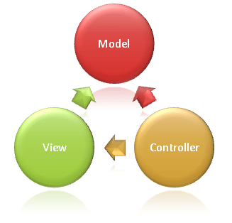

# Overview of ASP.NET Core MVC

By [Steve Smith](https://ardalis.com/)

ASP.NET Core MVC is a rich framework for building web apps and APIs using the Model-View-Controller design pattern.

## MVC pattern

The Model-View-Controller (MVC) architectural pattern separates an application into three main groups of components: Models, Views, and Controllers. This pattern helps to achieve [separation of concerns](/dotnet/standard/modern-web-apps-azure-architecture/architectural-principles#separation-of-concerns). Using this pattern, user requests are routed to a Controller which is responsible for working with the Model to perform user actions and/or retrieve results of queries. The Controller chooses the View to display to the user, and provides it with any Model data it requires.

The following diagram shows the three main components and which ones reference the others:



This delineation of responsibilities helps you scale the application in terms of complexity because it's easier to code, debug, and test something (model, view, or controller) that has a single job. It's more difficult to update, test, and debug code that has dependencies spread across two or more of these three areas. For example, user interface logic tends to change more frequently than business logic. If presentation code and business logic are combined in a single object, an object containing business logic must be modified every time the user interface is changed. This often introduces errors and requires the retesting of business logic after every minimal user interface change.

> [!NOTE]
> Both the view and the controller depend on the model. However, the model depends on neither the view nor the controller. This is one of the key benefits of the separation. This separation allows the model to be built and tested independent of the visual presentation.

### Model Responsibilities

The Model in an MVC application represents the state of the application and any business logic or operations that should be performed by it. Business logic should be encapsulated in the model, along with any implementation logic for persisting the state of the application. Strongly-typed views typically use ViewModel types designed to contain the data to display on that view. The controller creates and populates these ViewModel instances from the model.

### View Responsibilities

Views are responsible for presenting content through the user interface. They use the [Razor view engine](#razor-view-engine) to embed .NET code in HTML markup. There should be minimal logic within views, and any logic in them should relate to presenting content. If you find the need to perform a great deal of logic in view files in order to display data from a complex model, consider using a [View Component](views/view-components.md), ViewModel, or view template to simplify the view.

### Controller Responsibilities

Controllers are the components that handle user interaction, work with the model, and ultimately select a view to render. In an MVC application, the view only displays information; the controller handles and responds to user input and interaction. In the MVC pattern, the controller is the initial entry point, and is responsible for selecting which model types to work with and which view to render (hence its name - it controls how the app responds to a given request).

> [!NOTE]
> Controllers shouldn't be overly complicated by too many responsibilities. To keep controller logic from becoming overly complex, push business logic out of the controller and into the domain model.

>[!TIP]
> If you find that your controller actions frequently perform the same kinds of actions, move these common actions into [filters](#filters).

## ASP.NET Core MVC

The ASP.NET Core MVC framework is a lightweight, open source, highly testable presentation framework optimized for use with ASP.NET Core.

ASP.NET Core MVC provides a patterns-based way to build dynamic websites that enables a clean separation of concerns. It gives you full control over markup, supports TDD-friendly development and uses the latest web standards.

## Routing

ASP.NET Core MVC is built on top of [ASP.NET Core's routing](../fundamentals/routing.md), a powerful URL-mapping component that lets you build applications that have comprehensible and searchable URLs. This enables you to define your application's URL naming patterns that work well for search engine optimization (SEO) and for link generation, without regard for how the files on your web server are organized. You can define your routes using a convenient route template syntax that supports route value constraints, defaults and optional values.

*Convention-based routing* enables you to globally define the URL formats that your application accepts and how each of those formats maps to a specific action method on a given controller. When an incoming request is received, the routing engine parses the URL and matches it to one of the defined URL formats, and then calls the associated controller's action method.

```csharp
routes.MapRoute(name: "Default", template: "{controller=Home}/{action=Index}/{id?}");
```

*Attribute routing* enables you to specify routing information by decorating your controllers and actions with attributes that define your application's routes. This means that your route definitions are placed next to the controller and action with which they're associated.

```csharp
[Route("api/[controller]")]
public class ProductsController : Controller
{
    [HttpGet("{id}")]
    public IActionResult GetProduct(int id)
    {
      ...
    }
}
```

## Model binding

ASP.NET Core MVC [model binding](models/model-binding.md) converts client request data  (form values, route data, query string parameters, HTTP headers) into objects that the controller can handle. As a result, your controller logic doesn't have to do the work of figuring out the incoming request data; it simply has the data as parameters to its action methods.

```csharp
public async Task<IActionResult> Login(LoginViewModel model, string returnUrl = null) { ... }
```

## Model validation

ASP.NET Core MVC supports [validation](models/validation.md) by decorating your model object with data annotation validation attributes. The validation attributes are checked on the client side before values are posted to the server, as well as on the server before the controller action is called.

```csharp
using System.ComponentModel.DataAnnotations;
public class LoginViewModel
{
    [Required]
    [EmailAddress]
    public string Email { get; set; }

    [Required]
    [DataType(DataType.Password)]
    public string Password { get; set; }

    [Display(Name = "Remember me?")]
    public bool RememberMe { get; set; }
}
```

A controller action:

```csharp
public async Task<IActionResult> Login(LoginViewModel model, string returnUrl = null)
{
    if (ModelState.IsValid)
    {
      // work with the model
    }
    // At this point, something failed, redisplay form
    return View(model);
}
```

The framework handles validating request data both on the client and on the server. Validation logic specified on model types is added to the rendered views as unobtrusive annotations and is enforced in the browser with [jQuery Validation](https://jqueryvalidation.org/).

## Dependency injection

ASP.NET Core has built-in support for [dependency injection (DI)](../fundamentals/dependency-injection.md). In ASP.NET Core MVC, [controllers](controllers/dependency-injection.md) can request needed services through their constructors, allowing them to follow the [Explicit Dependencies Principle](/dotnet/standard/modern-web-apps-azure-architecture/architectural-principles#explicit-dependencies).

Your app can also use [dependency injection in view files](views/dependency-injection.md), using the `@inject` directive:

```cshtml
@inject SomeService ServiceName

<!DOCTYPE html>
<html lang="en">
<head>
    <title>@ServiceName.GetTitle</title>
</head>
<body>
    <h1>@ServiceName.GetTitle</h1>
</body>
</html>
```

## Filters

[Filters](controllers/filters.md) help developers encapsulate cross-cutting concerns, like exception handling or authorization. Filters enable running custom pre- and post-processing logic for action methods, and can be configured to run at certain points within the execution pipeline for a given request. Filters can be applied to controllers or actions as attributes (or can be run globally). Several filters (such as `Authorize`) are included in the framework. `[Authorize]` is the attribute that is used to create MVC authorization filters.

```csharp
[Authorize]
public class AccountController : Controller
```

## Areas

[Areas](controllers/areas.md) provide a way to partition a large ASP.NET Core MVC Web app into smaller functional groupings. An area is an MVC structure inside an application. In an MVC project, logical components like Model, Controller, and View are kept in different folders, and MVC uses naming conventions to create the relationship between these components. For a large app, it may be advantageous to partition the app into separate high level areas of functionality. For instance, an e-commerce app with multiple business units, such as checkout, billing, and search etc. Each of these units have their own logical component views, controllers, and models.

## Web APIs

In addition to being a great platform for building web sites, ASP.NET Core MVC has great support for building Web APIs. You can build services that reach a broad range of clients including browsers and mobile devices.

The framework includes support for HTTP content-negotiation with built-in support to [format data](xref:web-api/advanced/formatting) as JSON or XML. Write [custom formatters](xref:web-api/advanced/custom-formatters) to add support for your own formats.

Use link generation to enable support for hypermedia. Easily enable support for [cross-origin resource sharing (CORS)](https://www.w3.org/TR/cors/) so that your Web APIs can be shared across multiple Web applications.

## Testability

The framework's use of interfaces and dependency injection make it well-suited to unit testing, and the framework includes features (like a TestHost and InMemory provider for Entity Framework) that make [integration tests](xref:test/integration-tests) quick and easy as well. Learn more about [how to test controller logic](controllers/testing.md).

## Razor view engine

[ASP.NET Core MVC views](views/overview.md) use the [Razor view engine](views/razor.md) to render views. Razor is a compact, expressive and fluid template markup language for defining views using embedded C# code. Razor is used to dynamically generate web content on the server. You can cleanly mix server code with client side content and code.

```cshtml
<ul>
    @for (int i = 0; i < 5; i++) {
        <li>List item @i</li>
    }
</ul>
```

Using the Razor view engine you can define [layouts](views/layout.md), [partial views](views/partial.md) and replaceable sections.

## Strongly typed views

Razor views in MVC can be strongly typed based on your model. Controllers can pass a strongly typed model to views enabling your views to have type checking and IntelliSense support.

For example, the following view renders a model of type `IEnumerable<Product>`:

```cshtml
@model IEnumerable<Product>
<ul>
    @foreach (Product p in Model)
    {
        <li>@p.Name</li>
    }
</ul>
```

## Tag Helpers

[Tag Helpers](views/tag-helpers/intro.md) enable server side code to participate in creating and rendering HTML elements in Razor files. You can use tag helpers to define custom tags (for example, `<environment>`) or to modify the behavior of existing tags (for example, `<label>`). Tag Helpers bind to specific elements based on the element name and its attributes. They provide the benefits of server-side rendering while still preserving an HTML editing experience.

There are many built-in Tag Helpers for common tasks - such as creating forms, links, loading assets and more - and even more available in public GitHub repositories and as NuGet packages. Tag Helpers are authored in C#, and they target HTML elements based on element name, attribute name, or parent tag. For example, the built-in LinkTagHelper can be used to create a link to the `Login` action of the `AccountsController`:

```cshtml
<p>
    Thank you for confirming your email.
    Please <a asp-controller="Account" asp-action="Login">Click here to Log in</a>.
</p>
```

The `EnvironmentTagHelper` can be used to include different scripts in your views (for example, raw or minified) based on the runtime environment, such as Development, Staging, or Production:

```cshtml
<environment names="Development">
    <script src="~/lib/jquery/dist/jquery.js"></script>
</environment>
<environment names="Staging,Production">
    <script src="https://ajax.aspnetcdn.com/ajax/jquery/jquery-2.1.4.min.js"
            asp-fallback-src="~/lib/jquery/dist/jquery.min.js"
            asp-fallback-test="window.jQuery">
    </script>
</environment>
```

Tag Helpers provide an HTML-friendly development experience and a rich IntelliSense environment for creating HTML and Razor markup. Most of the built-in Tag Helpers target existing HTML elements and provide server-side attributes for the element.

## View Components

[View Components](views/view-components.md) allow you to package rendering logic and reuse it throughout the application. They're similar to [partial views](views/partial.md), but with associated logic.

## Compatibility version

The <xref:Microsoft.Extensions.DependencyInjection.MvcCoreMvcBuilderExtensions.SetCompatibilityVersion*> method allows an app to opt-in or opt-out of potentially breaking behavior changes introduced in ASP.NET Core MVC 2.1 or later.

For more information, see <xref:mvc/compatibility-version>.

## Additional resources

* [MyTested.AspNetCore.Mvc - Fluent Testing Library for ASP.NET Core MVC](https://github.com/ivaylokenov/MyTested.AspNetCore.Mvc): Strongly-typed unit testing library, providing a fluent interface for testing MVC and web API apps. (*Not maintained or supported by Microsoft.*)
* <xref:blazor/components/prerendering-and-integration>
* <xref:fundamentals/dependency-injection>
