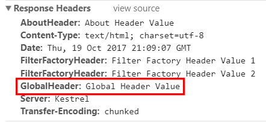
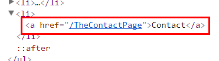
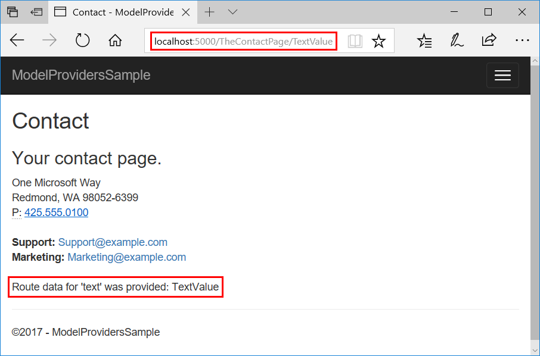
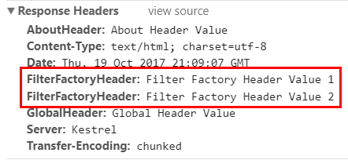
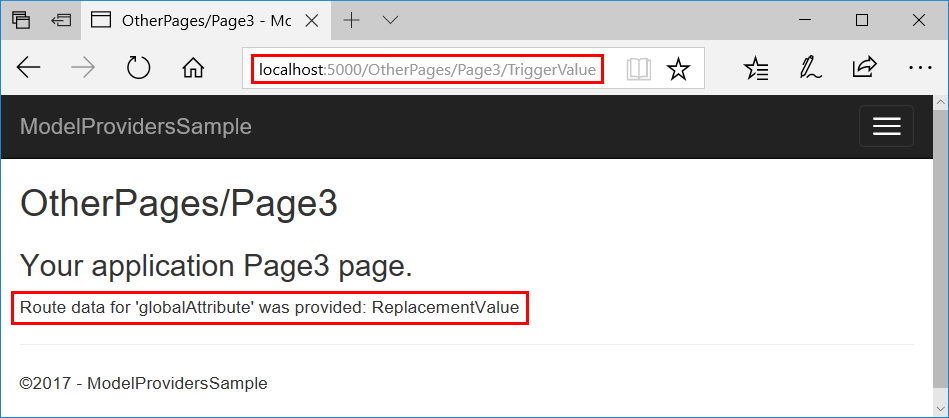

# Razor Pages route and app convention features in ASP.NET Core

By [Luke Latham](https://github.com/guardrex)

Learn how to use page route and app model provider convention features to control page routing, discovery, and processing in Razor Pages apps. When you need to configure custom page routes for individual pages, configure routing to pages with the [AddPageRoute convention](#configure-a-page-route) described later in this topic.

Use the [sample app](https://github.com/aspnet/Docs/tree/master/aspnetcore/mvc/razor-pages/razor-pages-convention-features/sample) ([how to download](xref:tutorials/index#how-to-download-a-sample)) to explore the features described in this topic.

| Features | The sample demonstrates ... |
| -------- | --------------------------- |
| [Route and app model conventions](#add-route-and-app-model-conventions)  Conventions.Add<ul><li>IPageRouteModelConvention</li><li>IPageApplicationModelConvention</li></ul> | Adding a route template and header to an app's pages. |
| [Page route action conventions](#page-route-action-conventions)<ul><li>AddFolderRouteModelConvention</li><li>AddPageRouteModelConvention</li><li>AddPageRoute</li></ul> | Adding a route template to pages in a folder and to a single page. |
| [Page model action conventions](#page-model-action-conventions)<ul><li>AddFolderApplicationModelConvention</li><li>AddPageApplicationModelConvention</li><li>ConfigureFilter (filter class, lambda expression, or filter factory)</li></ul> | Adding a header to pages in a folder, adding a header to a single page, and configuring a [filter factory](xref:mvc/controllers/filters#ifilterfactory) to add a header to an app's pages. |
| [Default page app model provider](#replace-the-default-page-app-model-provider) | Replacing the default page model provider to change the conventions for handler naming. |

## Add route and app model conventions

Add a delegate for [IPageConvention](/dotnet/api/microsoft.aspnetcore.mvc.applicationmodels.ipageconvention) to add route and app model conventions that apply to Razor Pages.

**Add a route model convention to all pages**

Use [Conventions](/dotnet/api/microsoft.aspnetcore.mvc.razorpages.razorpagesoptions.conventions) to create and add an [IPageRouteModelConvention](/dotnet/api/microsoft.aspnetcore.mvc.applicationmodels.ipageroutemodelconvention) to the collection of [IPageConvention](/dotnet/api/microsoft.aspnetcore.mvc.applicationmodels.ipageconvention) instances that are applied during route and page model construction.

The sample app adds a `{globalTemplate?}` route template to all of the pages in the app:

[!code-csharp[Main](razor-pages-convention-features/sample/Conventions/GlobalTemplatePageRouteModelConvention.cs?name=snippet1)]

> [!NOTE]
> The `Order` property for the `AttributeRouteModel` is set to `0` (zero). This ensures that this template is given priority for the first route data value position when a single route value is provided. For example, the sample adds an `{aboutTemplate?}` route template later in the topic. The `{aboutTemplate?}` template is given an `Order` of `1`. When the About page is requested at `/About/RouteDataValue`, "RouteDataValue" is loaded into `RouteData.Values["globalTemplate"]` (`Order = 0`) and not `RouteData.Values["aboutTemplate"]` (`Order = 1`) due to setting the `Order` property.

*Startup.cs*:

[!code-csharp[Main](razor-pages-convention-features/sample/Startup.cs?name=snippet1)]

Request the sample's About page at `localhost:5000/About/GlobalRouteValue` and inspect the result:

**Add an app model convention to all pages**

Use [Conventions](/dotnet/api/microsoft.aspnetcore.mvc.razorpages.razorpagesoptions.conventions) to create and add an [IPageApplicationModelConvention](/dotnet/api/microsoft.aspnetcore.mvc.applicationmodels.ipageapplicationmodelconvention) to the collection of [IPageConvention](/dotnet/api/microsoft.aspnetcore.mvc.applicationmodels.ipageconvention) instances that are applied during route and page model construction.

To demonstrate this and other conventions later in the topic, the sample app includes an `AddHeaderAttribute` class. The class constructor accepts a `name` string and a `values` string array. These values are used in its `OnResultExecuting` method to set a response header. The full class is shown in the [Page model action conventions](#page-model-action-conventions) section later in the topic.

The sample app uses the `AddHeaderAttribute` class to add a header, `GlobalHeader`, to all of the pages in the app:

[!code-csharp[Main](razor-pages-convention-features/sample/Conventions/GlobalHeaderPageApplicationModelConvention.cs?name=snippet1)]

*Startup.cs*:

[!code-csharp[Main](razor-pages-convention-features/sample/Startup.cs?name=snippet2)]

Request the sample's About page at `localhost:5000/About` and inspect the headers to view the result:

## Page route action conventions

The default route model provider that derives from [IPageRouteModelProvider](/dotnet/api/microsoft.aspnetcore.mvc.applicationmodels.ipageroutemodelprovider) invokes conventions which are designed to provide extensibility points for configuring page routes.

**Folder route model convention**

Use [AddFolderRouteModelConvention](/dotnet/api/microsoft.aspnetcore.mvc.applicationmodels.pageconventioncollection.addfolderroutemodelconvention) to create and add an [IPageRouteModelConvention](/dotnet/api/microsoft.aspnetcore.mvc.applicationmodels.ipageroutemodelconvention) that invokes an action on the [PageRouteModel](/dotnet/api/microsoft.aspnetcore.mvc.applicationmodels.pageroutemodel) for all of the pages under the specified folder.

The sample app uses `AddFolderRouteModelConvention` to add an `{otherPagesTemplate?}` route template to the pages in the *OtherPages* folder:

[!code-csharp[Main](razor-pages-convention-features/sample/Startup.cs?name=snippet3)]

> [!NOTE]
> The `Order` property for the `AttributeRouteModel` is set to `1`. This ensures that the template for `{globalTemplate?}` (set earlier in the topic) is given priority for the first route data value position when a single route value is provided. If the Page1 page is requested at `/OtherPages/Page1/RouteDataValue`, "RouteDataValue" is loaded into `RouteData.Values["globalTemplate"]` (`Order = 0`) and not `RouteData.Values["otherPagesTemplate"]` (`Order = 1`) due to setting the `Order` property.

Request the sample's Page1 page at `localhost:5000/OtherPages/Page1/GlobalRouteValue/OtherPagesRouteValue` and inspect the result:

**Page route model convention**

Use [AddPageRouteModelConvention](/dotnet/api/microsoft.aspnetcore.mvc.applicationmodels.pageconventioncollection.addpageroutemodelconvention) to create and add an [IPageRouteModelConvention](/dotnet/api/microsoft.aspnetcore.mvc.applicationmodels.ipageroutemodelconvention) that invokes an action on the [PageRouteModel](/dotnet/api/microsoft.aspnetcore.mvc.applicationmodels.pageroutemodel) for the page with the specified name.

The sample app uses `AddPageRouteModelConvention` to add an `{aboutTemplate?}` route template to the About page:

[!code-csharp[Main](razor-pages-convention-features/sample/Startup.cs?name=snippet4)]

> [!NOTE]
> The `Order` property for the `AttributeRouteModel` is set to `1`. This ensures that the template for `{globalTemplate?}` (set earlier in the topic) is given priority for the first route data value position when a single route value is provided. If the About page is requested at `/About/RouteDataValue`, "RouteDataValue" is loaded into `RouteData.Values["globalTemplate"]` (`Order = 0`) and not `RouteData.Values["aboutTemplate"]` (`Order = 1`) due to setting the `Order` property.

Request the sample's About page at `localhost:5000/About/GlobalRouteValue/AboutRouteValue` and inspect the result:

## Configure a page route

Use [AddPageRoute](/dotnet/api/microsoft.extensions.dependencyinjection.pageconventioncollectionextensions.addpageroute) to configure a route to a page at the specified page path. Generated links to the page use your specified route. `AddPageRoute` uses `AddPageRouteModelConvention` to establish the route.

The sample app creates a route to `/TheContactPage` for *Contact.cshtml*:

[!code-csharp[Main](razor-pages-convention-features/sample/Startup.cs?name=snippet5)]

The Contact page can also be reached at `/Contact` via its default route.

The sample app's custom route to the Contact page allows for an optional `text` route segment (`{text?}`). The page also includes this optional segment in its `@page` directive in case the visitor accesses the page at its `/Contact` route:

[!code-cshtml[Main](razor-pages-convention-features/sample/Pages/Contact.cshtml?highlight=1)]

Note that the URL generated for the **Contact** link in the rendered page reflects the updated route:

Visit the Contact page at either its ordinary route, `/Contact`, or the custom route, `/TheContactPage`. If you supply an additional `text` route segment, the page shows the HTML-encoded segment that you provide:

## Page model action conventions

The default page model provider that implements [IPageApplicationModelProvider](/dotnet/api/microsoft.aspnetcore.mvc.applicationmodels.ipageapplicationmodelprovider) invokes conventions which are designed to provide extensibility points for configuring page models. These conventions are useful when building and modifying page discovery and processing features.

For the examples in this section, the sample app uses an `AddHeaderAttribute` class, which is a [ResultFilterAttribute](/dotnet/api/microsoft.aspnetcore.mvc.filters.resultfilterattribute), that applies a response header:

[!code-csharp[Main](razor-pages-convention-features/sample/Filters/AddHeader.cs?name=snippet1)]

Using conventions, the sample demonstrates how to apply the attribute to all of the pages in a folder and to a single page.

**Folder app model convention**

Use [AddFolderApplicationModelConvention](/dotnet/api/microsoft.aspnetcore.mvc.applicationmodels.pageconventioncollection.addfolderapplicationmodelconvention) to create and add an [IPageApplicationModelConvention](/dotnet/api/microsoft.aspnetcore.mvc.applicationmodels.ipageapplicationmodelconvention) that invokes an action on [PageApplicationModel](/dotnet/api/microsoft.aspnetcore.mvc.applicationmodels.pageapplicationmodel) instances for all pages under the specified folder.

The sample demonstrates the use of `AddFolderApplicationModelConvention` by adding a header, `OtherPagesHeader`, to the pages inside the *OtherPages* folder of the app:

[!code-csharp[Main](razor-pages-convention-features/sample/Startup.cs?name=snippet6)]

Request the sample's Page1 page at `localhost:5000/OtherPages/Page1` and inspect the headers to view the result:

**Page app model convention**

Use [AddPageApplicationModelConvention](/dotnet/api/microsoft.aspnetcore.mvc.applicationmodels.pageconventioncollection.addpageapplicationmodelconvention) to create and add an [IPageApplicationModelConvention](/dotnet/api/microsoft.aspnetcore.mvc.applicationmodels.ipageapplicationmodelconvention) that invokes an action on the [PageApplicationModel](/dotnet/api/microsoft.aspnetcore.mvc.applicationmodels.pageapplicationmodel) for the page with the speciifed name.

The sample demonstrates the use of `AddPageApplicationModelConvention` by adding a header, `AboutHeader`, to the About page:

[!code-csharp[Main](razor-pages-convention-features/sample/Startup.cs?name=snippet7)]

Request the sample's About page at `localhost:5000/About` and inspect the headers to view the result:

**Configure a filter**

[ConfigureFilter](/dotnet/api/microsoft.extensions.dependencyinjection.pageconventioncollectionextensions.configurefilter) configures the specified filter to apply. You can implement a filter class, but the sample app shows how to implement a filter in a lambda expression, which is implemented behind-the-scenes as a factory that returns a filter:

[!code-csharp[Main](razor-pages-convention-features/sample/Startup.cs?name=snippet8)]

The page app model is used to check the relative path for segments that lead to the Page2 page in the *OtherPages* folder. If the condition passes, a header is added. If not, the `EmptyFilter` is applied.

`EmptyFilter` is an [Action filter](xref:mvc/controllers/filters#action-filters). Since Action filters are ignored by Razor Pages, the `EmptyFilter` no-ops as intended if the path doesn't contain `OtherPages/Page2`.

Request the sample's Page2 page at `localhost:5000/OtherPages/Page2` and inspect the headers to view the result:

**Configure a filter factory**

[ConfigureFilter](/dotnet/api/microsoft.extensions.dependencyinjection.pageconventioncollectionextensions.configurefilter?view=aspnetcore-2.0#Microsoft_Extensions_DependencyInjection_PageConventionCollectionExtensions_ConfigureFilter_Microsoft_AspNetCore_Mvc_ApplicationModels_PageConventionCollection_System_Func_Microsoft_AspNetCore_Mvc_ApplicationModels_PageApplicationModel_Microsoft_AspNetCore_Mvc_Filters_IFilterMetadata__) configures the specified factory to apply [filters](xref:mvc/controllers/filters) to all Razor Pages.

The sample app provides an example of using a [filter factory](xref:mvc/controllers/filters#ifilterfactory) by adding a header, `FilterFactoryHeader`, with two values to the app's pages:

[!code-csharp[Main](razor-pages-convention-features/sample/Startup.cs?name=snippet9)]

*AddHeaderWithFactory.cs*:

[!code-csharp[Main](razor-pages-convention-features/sample/Factories/AddHeaderWithFactory.cs?name=snippet1)]

Request the sample's About page at `localhost:5000/About` and inspect the headers to view the result:

## Replace the default page app model provider

Razor Pages uses the `IPageApplicationModelProvider` interface to create a [DefaultPageApplicationModelProvider](/dotnet/api/microsoft.aspnetcore.mvc.razorpages.internal.defaultpageapplicationmodelprovider). You can inherit from the default model provider to provide your own implementation logic for handler discovery and processing. The default implementation ([reference source](https://github.com/aspnet/Mvc/blob/rel/2.0.1/src/Microsoft.AspNetCore.Mvc.RazorPages/Internal/DefaultPageApplicationModelProvider.cs)) establishes conventions for *unnamed* and *named* handler naming, which is described below.

**Default unnamed handler methods**

Handler methods for HTTP verbs ("unnamed" handler methods) follow a convention: `On<HTTP verb>[Async]` (appending `Async` is optional but recommended for async methods).

| Unnamed handler method     | Operation                      |
| -------------------------- | ------------------------------ |
| `OnGet`/`OnGetAsync`       | Initialize the page state.     |
| `OnPost`/`OnPostAsync`     | Handle POST requests.          |
| `OnDelete`/`OnDeleteAsync` | Handle DELETE requests&#8224;. |
| `OnPut`/`OnPutAsync`       | Handle PUT requests&#8224;.    |
| `OnPatch`/`OnPatchAsync`   | Handle PATCH requests&#8224;.  |

&#8224;Used for making API calls to the page.

**Default named handler methods**

Handler methods provided by the developer ("named" handler methods) follow a similar convention. The handler name appears after the HTTP verb or between the HTTP verb and `Async`: `On<HTTP verb><handler name>[Async]` (appending `Async` is optional but recommended for async methods). For example, methods that process messages might take the naming shown in the table below.

| Example named handler method             | Example operation        |
| ---------------------------------------- | ------------------------ |
| `OnGetMessage`/`OnGetMessageAsync`       | Obtain a message.        |
| `OnPostMessage`/`OnPostMessageAsync`     | POST a message.          |
| `OnDeleteMessage`/`OnDeleteMessageAsync` | DELETE a message&#8224;. |
| `OnPutMessage`/`OnPutMessageAsync`       | PUT a message&#8224;.    |
| `OnPatchMessage`/`OnPatchMessageAsync`   | PATCH a message&#8224;.  |

&#8224;Used for making API calls to the page.

**Customize handler method names**

Assume that you prefer to change the way unnamed and named handler methods are named. An alternative naming scheme is to avoid starting the method names with "On" and use the first word segment to determine the HTTP verb. You can make other changes, such as converting the verbs for DELETE, PUT, and PATCH to POST. Such a scheme provides the method names shown in the following table.

| Handler method                       | Operation                      |
| ------------------------------------ | ------------------------------ |
| `Get`                                | Initialize the page state.     |
| `Post`/`PostAsync`                   | Handle POST requests.          |
| `Delete`/`DeleteAsync`               | Handle DELETE requests&#8224;. |
| `Put`/`PutAsync`                     | Handle PUT requests&#8224;.    |
| `Patch`/`PatchAsync`                 | Handle PATCH requests&#8224;.  |
| `GetMessage`                         | Obtain a message.              |
| `PostMessage`/`PostMessageAsync`     | POST a message.                |
| `DeleteMessage`/`DeleteMessageAsync` | POST a message to delete.      |
| `PutMessage`/`PutMessageAsync`       | POST a message to put.         |
| `PatchMessage`/`PatchMessageAsync`   | POST a message to patch.       |

&#8224;Used for making API calls to the page.

To establish this scheme, inherit from the `DefaultPageApplicationModelProvider` class and override the [CreateHandlerModel](/dotnet/api/microsoft.aspnetcore.mvc.razorpages.internal.defaultpageapplicationmodelprovider.createhandlermodel) method to supply custom logic for resolving [PageModel](/dotnet/api/microsoft.aspnetcore.mvc.razorpages.pagemodel) handler names. The sample app shows you how this is done in its `CustomPageApplicationModelProvider` class:

[!code-csharp[Main](razor-pages-convention-features/sample/CustomPageApplicationModelProvider.cs?name=snippet1&highlight=1-2,45-46,64-68,78-85,87,92,106)]

Highlights of the class include:

* The class inherits from `DefaultPageApplicationModelProvider`.
* The `TryParseHandlerMethod` processes a handler to determine the HTTP verb (`httpMethod`) and named handler name (`handlerName`) when creating the `PageHandlerModel`.
  * An `Async` postfix is ignored, if present.
  * Casing is used to parse the HTTP verb from the method name.
  * When the method name (without `Async`) is equal to the HTTP verb name, there's no named handler. The `handlerName` is set to `null`, and the method name is `Get`, `Post`, `Delete`, `Put`, or `Patch`.
  * When the method name (without `Async`) is longer than the HTTP verb name, there's a named handler. The `handlerName` is set to `<method name (less 'Async', if present)>`. For example, both "GetMessage" and "GetMessageAsync" yield a handler name of "GetMessage".
  * DELETE, PUT, and PATCH HTTP verbs are converted to POST.

Register the `CustomPageApplicationModelProvider` in the `Startup` class:

[!code-csharp[Main](razor-pages-convention-features/sample/Startup.cs?name=snippet10)]

The code-behind file *Index.cshtml.cs* shows how the ordinary handler method naming conventions are changed for pages in the app. The ordinary "On" prefix naming used with Razor Pages is removed. The method that initializes the page state is now named `Get`. You can see this convention used throughout the app if you open any code-behind file for any of the pages.

Each of the other methods start with the HTTP verb that describes its processing. The two methods that start with `Delete` would normally be treated as DELETE HTTP verbs, but the logic in `TryParseHandlerMethod` explicitly sets the verb to POST for both handlers.

Note that `Async` is optional between `DeleteAllMessages` and `DeleteMessageAsync`. They're both asynchronous methods, but you can choose to use the `Async` postfix or not; we recommend that you do. `DeleteAllMessages` is used here for demonstration purposes, but we recommend that you name such a method `DeleteAllMessagesAsync`. It doesn't affect the processing of the sample's implementation, but using the `Async` postfix calls out the fact that it's an asynchronous method.

[!code-csharp[Main](razor-pages-convention-features/sample/Pages/Index.cshtml.cs?name=snippet1&highlight=1,6,16,29)]

Note the handler names provided in *Index.cshtml* match the `DeleteAllMessages` and `DeleteMessageAsync` handler methods:

[!code-cshtml[Main](razor-pages-convention-features/sample/Pages/Index.cshtml?range=29-60&highlight=7-8,24-25)]

`Async` in the handler method name `DeleteMessageAsync` is factored out by the `TryParseHandlerMethod` for handler matching of POST request to method. The `asp-page-handler` name of `DeleteMessage` is matched to the handler method `DeleteMessageAsync`.

## MVC Filters and the Page filter (IPageFilter)

MVC [Action filters](xref:mvc/controllers/filters#action-filters) are ignored by Razor Pages, since Razor Pages use handler methods. Other types of MVC filters are available for you to use: [Authorization](xref:mvc/controllers/filters#authorization-filters), [Exception](xref:mvc/controllers/filters#exception-filters), [Resource](xref:mvc/controllers/filters#resource-filters), and [Result](xref:mvc/controllers/filters#result-filters). For more information, see the [Filters](xref:mvc/controllers/filters) topic.

The Page filter ([IPageFilter](/dotnet/api/microsoft.aspnetcore.mvc.filters.ipagefilter)) is a filter that applies to Razor Pages. It surrounds the execution of a page handler method. It allows you to process custom code at stages of page handler method execution. Here's an example from the sample app:

[!code-csharp[Main](razor-pages-convention-features/sample/Filters/ReplaceRouteValueFilterAttribute.cs?name=snippet1)]

This filter checks for a `globalTemplate` route value of "TriggerValue" and swaps in "ReplacementValue".

The `ReplaceRouteValueFilter` attribute can be applied directly to a `PageModel` in code-behind:

[!code-csharp[Main](razor-pages-convention-features/sample/Pages/OtherPages/Page3.cshtml.cs?range=10-12&highlight=1)]

Request the Page3 page from the sample app with at `localhost:5000/OtherPages/Page3/TriggerValue`. Notice how the filter replaces the route value:

