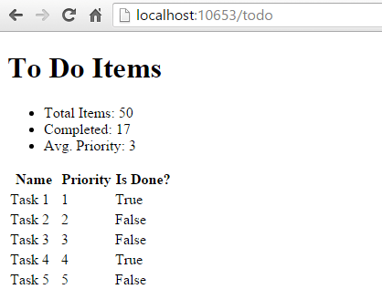
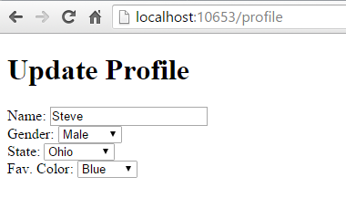
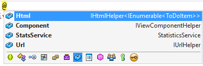

# Dependency injection into views in ASP.NET Core

:::moniker range=">= aspnetcore-6.0"

ASP.NET Core supports [dependency injection](xref:fundamentals/dependency-injection) into views. This can be useful for view-specific services, such as localization or data required only for populating view elements. Most of the data views display should be passed in from the controller.

[View or download sample code](https://github.com/dotnet/AspNetCore.Docs/tree/main/aspnetcore/mvc/views/dependency-injection/6.0sample) ([how to download](xref:index#how-to-download-a-sample))

## Configuration injection

The values in settings files, such as `appsettings.json` and `appsettings.Development.json`, can be injected into a view. Consider the `appsettings.Development.json` from the [sample code](https://github.com/dotnet/AspNetCore.Docs/tree/main/aspnetcore/mvc/views/dependency-injection/6.0sample):

[!code-json[](~/mvc/views/dependency-injection/6.0sample/WebViewInject/appsettings.Development.json?highlight=8-11)]

The following markup displays the configuration value in a Razor Pages view:

[!code-cshtml[](~/mvc/views/dependency-injection/6.0sample/WebViewInject/Pages/Privacy.cshtml?highlight=3,4,13)]

The following markup displays the configuration value in a MVC view:

[!code-cshtml[](~/mvc/views/dependency-injection/6.0sample/WebViewInject/Views/Home/Privacy.cshtml?highlight=1-2,11)]

For more information, see <xref:fundamentals/configuration/index>

## Service injection

A service can be injected into a view using the `@inject` directive.

[!code-cshtml[](~/mvc/views/dependency-injection/6.0sample/WebViewInject/Views/ToDo/Index.cshtml?highlight=4,5,15,16,17)]

This view displays a list of `ToDoItem` instances, along with a summary showing overall statistics. The summary is populated from the injected `StatisticsService`. This service is registered for dependency injection in `ConfigureServices` in `Program.cs`:

[!code-csharp[](~/mvc/views/dependency-injection/6.0sample/WebViewInject/Program.cs?highlight=11,12)]

The `StatisticsService` performs some calculations on the set of `ToDoItem` instances, which it accesses via a repository:

[!code-csharp[](~/mvc/views/dependency-injection/6.0sample/WebViewInject/Models/Services/StatisticsService.cs?highlight=15,20,25)]

The sample repository uses an in-memory collection. An in-memory implementation shouldn't be used for large, remotely accessed data sets.

The sample displays data from the model bound to the view and the service injected into the view:



## Populating Lookup Data

View injection can be useful to populate options in UI elements, such as dropdown lists. Consider a user profile form that includes options for specifying gender, state, and other preferences. Rendering such a form using a standard approach might require the controller or Razor Page to:

* Request data access services for each of the sets of options.
* Populate a model or `ViewBag` with each set of options to be bound.

An alternative approach injects services directly into the view to obtain the options. This minimizes the amount of code required by the controller or razor Page, moving this view element construction logic into the view itself. The controller action or Razor Page to display a profile editing form only needs to pass the form the profile instance:

[!code-csharp[](~/mvc/views/dependency-injection/6.0sample/WebViewInject/Controllers/ProfileController.cs)]

The HTML form used to update the preferences includes dropdown lists for three of the properties:



These lists are populated by a service that has been injected into the view:

[!code-cshtml[](~/mvc/views/dependency-injection/6.0sample/WebViewInject/Views/Profile/Index.cshtml?highlight=4,16,17,21,22,26,27)]

The `ProfileOptionsService` is a UI-level service designed to provide just the data needed for this form:

[!code-csharp[](~/mvc/views/dependency-injection/6.0sample/WebViewInject/Models/Services/ProfileOptionsService.cs)]

Note an unregistered type throws an exception at runtime because the service provider is internally queried via <xref:Microsoft.Extensions.DependencyInjection.ServiceProviderServiceExtensions.GetRequiredService%2A>.

## Overriding Services

In addition to injecting new services, this technique can be used to override previously injected services on a page. The figure below shows all of the fields available on the page used in the first example:



The default fields include `Html`, `Component`, and `Url`. To replace the default HTML Helpers with a custom version, use `@inject`:

[!code-cshtml[](~/mvc/views/dependency-injection/6.0sample/WebViewInject/Views/Helper/Index.cshtml?highlight=3,11)]

## See Also

* Simon Timms Blog: [Getting Lookup Data Into Your View](https://blog.simontimms.com/2015/06/09/getting-lookup-data-into-you-view/)

:::moniker-end

:::moniker range="< aspnetcore-6.0"

ASP.NET Core supports [dependency injection](xref:fundamentals/dependency-injection) into views. This can be useful for view-specific services, such as localization or data required only for populating view elements. You should try to maintain [separation of concerns](/dotnet/standard/modern-web-apps-azure-architecture/architectural-principles#separation-of-concerns) between your controllers and views. Most of the data your views display should be passed in from the controller.

[View or download sample code](https://github.com/dotnet/AspNetCore.Docs/tree/main/aspnetcore/mvc/views/dependency-injection/sample) ([how to download](xref:index#how-to-download-a-sample))

## Configuration injection

`appsettings.json` values can be injected directly into a view.

Example of an `appsettings.json` file:

```json
{
   "root": {
      "parent": {
         "child": "myvalue"
      }
   }
}
```

The syntax for `@inject`:
   `@inject <type> <name>`

An example using `@inject`:

```csharp
@using Microsoft.Extensions.Configuration
@inject IConfiguration Configuration
@{
   string myValue = Configuration["root:parent:child"];
   ...
}
```

## Service injection

A service can be injected into a view using the `@inject` directive. You can think of `@inject` as adding a property to the view, and populating the property using DI.

[!code-cshtml[](../../mvc/views/dependency-injection/sample/src/ViewInjectSample/Views/ToDo/Index.cshtml?highlight=4,5,15,16,17)]

This view displays a list of `ToDoItem` instances, along with a summary showing overall statistics. The summary is populated from the injected `StatisticsService`. This service is registered for dependency injection in `ConfigureServices` in `Startup.cs`:

[!code-csharp[](../../mvc/views/dependency-injection/sample/src/ViewInjectSample/Startup.cs?highlight=6,7&range=15-22)]

The `StatisticsService` performs some calculations on the set of `ToDoItem` instances, which it accesses via a repository:

[!code-csharp[](../../mvc/views/dependency-injection/sample/src/ViewInjectSample/Model/Services/StatisticsService.cs?highlight=15,20,25)]

The sample repository uses an in-memory collection. The implementation shown above (which operates on all of the data in memory) isn't recommended for large, remotely accessed data sets.

The sample displays data from the model bound to the view and the service injected into the view:


## Populating Lookup Data

View injection can be useful to populate options in UI elements, such as dropdown lists. Consider a user profile form that includes options for specifying gender, state, and other preferences. Rendering such a form using a standard MVC approach would require the controller to request data access services for each of these sets of options, and then populate a model or `ViewBag` with each set of options to be bound.

An alternative approach injects services directly into the view to obtain the options. This minimizes the amount of code required by the controller, moving this view element construction logic into the view itself. The controller action to display a profile editing form only needs to pass the form the profile instance:

[!code-csharp[](../../mvc/views/dependency-injection/sample/src/ViewInjectSample/Controllers/ProfileController.cs?highlight=9,19)]

The HTML form used to update these preferences includes dropdown lists for three of the properties:


These lists are populated by a service that has been injected into the view:

[!code-cshtml[](../../mvc/views/dependency-injection/sample/src/ViewInjectSample/Views/Profile/Index.cshtml?highlight=4,16,17,21,22,26,27)]

The `ProfileOptionsService` is a UI-level service designed to provide just the data needed for this form:

[!code-csharp[](../../mvc/views/dependency-injection/sample/src/ViewInjectSample/Model/Services/ProfileOptionsService.cs?highlight=7,13,24)]

> [!IMPORTANT]
> Don't forget to register types you request through dependency injection in `Startup.ConfigureServices`. An unregistered type throws an exception at runtime because the service provider is internally queried via <xref:Microsoft.Extensions.DependencyInjection.ServiceProviderServiceExtensions.GetRequiredService%2A>.

## Overriding Services

In addition to injecting new services, this technique can also be used to override previously injected services on a page. The figure below shows all of the fields available on the page used in the first example:


As you can see, the default fields include `Html`, `Component`, and `Url` (as well as the `StatsService` that we injected). If for instance you wanted to replace the default HTML Helpers with your own, you could easily do so using `@inject`:

[!code-cshtml[](../../mvc/views/dependency-injection/sample/src/ViewInjectSample/Views/Helper/Index.cshtml?highlight=3,11)]

If you want to extend existing services, you can simply use this technique while inheriting from or wrapping the existing implementation with your own.

## See Also

* Simon Timms Blog: [Getting Lookup Data Into Your View](https://blog.simontimms.com/2015/06/09/getting-lookup-data-into-you-view/)

:::moniker-end