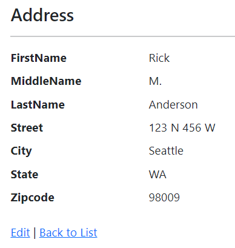
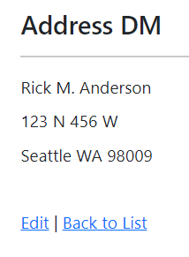

# Display and Editor templates in ASP.NET Core

By [Alexander Wicht](https://github.com/Ducki/)

Display and Editor templates specify the user interface layout of custom types. Consider the following `Address` model:

[!code-csharp]

A project that [scaffolds](xref:tutorials/razor-pages/model#scaffold-the-movie-model) the `Address` model displays the `Address` in the following form:

A web site could use a Display Template to show the `Address` in standard format:

Display and Editor templates can also reduce code duplication and maintenance costs. Consider a web site that displays the `Address` model on 20 different pages. If the `Address` model changes, the 20 pages will all need to be updated. If a Display Template is used for the `Address` model, only the Display Template needs to be updated. For example, the `Address` model might be updated to include the country or region.

[Tag Helpers](xref:mvc/views/tag-helpers/intro) provide an alternative way that enables server-side code to participate in creating and rendering HTML elements in Razor files. For more information, see [Tag Helpers compared to HTML Helpers](xref:mvc/views/tag-helpers/intro#tag-helpers-compared-to-html-helpers).

## Display templates

`DisplayTemplates` customize the display of model fields or create a layer of abstraction between the model values and their display.

A `DisplayTemplate` is a [Razor](xref:mvc/views/razor) file placed in the`DisplayTemplates`folder:

* For Razor Pages apps, in the `Pages/Shared/DisplayTemplates` folder.
* For MVC apps, in the `Views/Shared/DisplayTemplates` folder or the `Views/ControllerName/DisplayTemplates` folder. Display templates in the `Views/Shared/DisplayTemplates` are used by all controllers in the app. Display templates in the `Views/ControllerName/DisplayTemplates` folder are resolved only by the `ControllerName` controller.

By convention, the `DisplayTemplate` file is named after the type to be displayed. The `Address.cshtml` template used in this sample:

[!code-cshtml]

The view engine automatically looks for a file in the `DisplayTemplates` folder that matches the name of the type. If it doesn't find a matching template, it falls back to the built in templates.

The following code shows the Details view of the scaffolded project:

[!code-cshtml]

The following code shows the Details view using the Address Display Template:

[!code-cshtml]

To reference a template whose name doesn't match the type name, use the `templateName` parameter in the <xref:Microsoft.AspNetCore.Mvc.Rendering.HtmlHelperDisplayExtensions.DisplayFor%2A> method. For example, the following markup displays the `Address` model with the `AddressShort` template:

[!code-cshtml]

Use one of the available [DisplayFor overloads](xref:Microsoft.AspNetCore.Mvc.Rendering.HtmlHelperDisplayExtensions.DisplayFor*#overloads) that expose the `additionalViewData` parameter to pass additional view data that is merged into the [View Data Dictionary](xref:mvc/views/overview#viewdata) instance created for the template.

## Editor templates

Editor templates are used in form controls when the model is edited or updated.

An `EditorTemplate` is a [Razor](xref:mvc/views/razor) file placed in the`EditorTemplates` folder:

* For Razor Pages apps, in the `Pages/Shared/EditorTemplates` folder.
* For MVC apps, in the `Views/Shared/EditorTemplates` folder or the `Views/ControllerName/EditorTemplates` folder.

The following markup shows the `Pages/Shared/EditorTemplates/Address.cshtml` used in the sample:

[!code-cshtml]

The following markup shows the *Edit.cshtml* page which uses the `Pages/Shared/EditorTemplates/Address.cshtml` template:

[!code-cshtml]

## Additional resources

* [View or download sample code](https://github.com/dotnet/AspNetCore.Docs/tree/main/aspnetcore/mvc/views/display-templates/sample) ([how to download](xref:index#how-to-download-a-sample))
* [Tag Helpers](xref:mvc/views/tag-helpers/intro)
* [Tag Helpers compared to HTML Helpers](xref:mvc/views/tag-helpers/intro#tag-helpers-compared-to-html-helpers)
