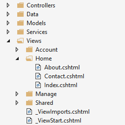
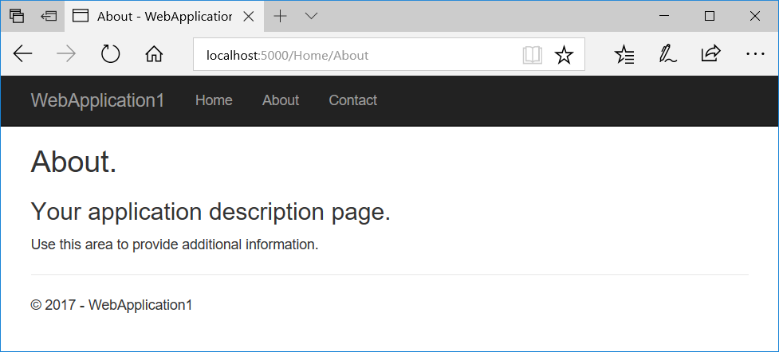

# Views in ASP.NET Core MVC

By [Steve Smith](https://ardalis.com/) and [Dave Brock](https://twitter.com/daveabrock)

This document explains views used in ASP.NET Core MVC applications. For information on Razor Pages, see <xref:razor-pages/index>.

In the Model-View-Controller (MVC) pattern, the *view* handles the app's data presentation and user interaction. A view is an HTML template with embedded [Razor markup](xref:mvc/views/razor). Razor markup is code that interacts with HTML markup to produce a webpage that's sent to the client.

In ASP.NET Core MVC, views are `.cshtml` files that use the [C# programming language](/dotnet/csharp/) in Razor markup. Usually, view files are grouped into folders named for each of the app's [controllers](xref:mvc/controllers/actions). The folders are stored in a `Views` folder at the root of the app:



The `Home` controller is represented by a `Home` folder inside the `Views` folder. The `Home` folder contains the views for the `About`, `Contact`, and `Index` (homepage) webpages. When a user requests one of these three webpages, controller actions in the `Home` controller determine which of the three views is used to build and return a webpage to the user.

Use [layouts](xref:mvc/views/layout) to provide consistent webpage sections and reduce code repetition. Layouts often contain the header, navigation and menu elements, and the footer. The header and footer usually contain boilerplate markup for many metadata elements and links to script and style assets. Layouts help you avoid this boilerplate markup in your views.

[Partial views](xref:mvc/views/partial) reduce code duplication by managing reusable parts of views. For example, a partial view is useful for an author biography on a blog website that appears in several views. An author biography is ordinary view content and doesn't require code to execute in order to produce the content for the webpage. Author biography content is available to the view by model binding alone, so using a partial view for this type of content is ideal.

[View components](xref:mvc/views/view-components) are similar to partial views in that they allow you to reduce repetitive code, but they're appropriate for view content that requires code to run on the server in order to render the webpage. View components are useful when the rendered content requires database interaction, such as for a website shopping cart. View components aren't limited to model binding in order to produce webpage output.

## Benefits of using views

Views help to establish [separation of concerns](/dotnet/standard/modern-web-apps-azure-architecture/architectural-principles#separation-of-concerns) within an MVC app by separating the user interface markup from other parts of the app. Following SoC design makes your app modular, which provides several benefits:

* The app is easier to maintain because it's better organized. Views are generally grouped by app feature. This makes it easier to find related views when working on a feature.
* The parts of the app are loosely coupled. You can build and update the app's views separately from the business logic and data access components. You can modify the views of the app without necessarily having to update other parts of the app.
* It's easier to test the user interface parts of the app because the views are separate units.
* Due to better organization, it's less likely that you'll accidentally repeat sections of the user interface.

## Creating a view

Views that are specific to a controller are created in the `Views/[ControllerName]` folder. Views that are shared among controllers are placed in the `Views/Shared` folder. To create a view, add a new file and give it the same name as its associated controller action with the `.cshtml` file extension. To create a view that corresponds with the `About` action in the `Home` controller, create an `About.cshtml` file in the `Views/Home` folder:

[!code-cshtml[](../../common/samples/WebApplication1/Views/Home/About.cshtml)]

[Razor markup](xref:mvc/views/razor) starts with the `@` symbol. Run C# statements by placing C# code within [Razor code blocks](xref:mvc/views/razor#razor-code-blocks) set off by curly braces (`{ ... }`). For example, see the assignment of "About" to `ViewData["Title"]` shown above. You can display values within HTML by simply referencing the value with the `@` symbol. See the contents of the `<h2>` and `<h3>` elements above.

The view content shown above is only part of the entire webpage that's rendered to the user. The rest of the page's layout and other common aspects of the view are specified in other view files. To learn more, see the [Layout topic](xref:mvc/views/layout).

## How controllers specify views

Views are typically returned from actions as a <xref:Microsoft.AspNetCore.Mvc.ViewResult>, which is a type of <xref:Microsoft.AspNetCore.Mvc.ActionResult>. Your action method can create and return a `ViewResult` directly, but that isn't commonly done. Since most controllers inherit from <xref:Microsoft.AspNetCore.Mvc.Controller>, you simply use the `View` helper method to return the `ViewResult`:

`HomeController.cs`:

[!code-csharp[](../../common/samples/WebApplication1/Controllers/HomeController.cs?highlight=5&range=16-21)]

When this action returns, the `About.cshtml` view shown in the last section is rendered as the following webpage:



The `View` helper method has several overloads. You can optionally specify:

* An explicit view to return:

  ```csharp
  return View("Orders");
  ```

* A [model](xref:mvc/models/model-binding) to pass to the view:

  ```csharp
  return View(Orders);
  ```

* Both a view and a model:

  ```csharp
  return View("Orders", Orders);
  ```

### View discovery

When an action returns a view, a process called *view discovery* takes place. This process determines which view file is used based on the view name. 

The default behavior of the `View` method (`return View();`) is to return a view with the same name as the action method from which it's called. For example, the `About` `ActionResult` method name of the controller is used to search for a view file named `About.cshtml`. First, the runtime looks in the `Views/[ControllerName]` folder for the view. If it doesn't find a matching view there, it searches the `Shared` folder for the view.

It doesn't matter if you implicitly return the `ViewResult` with `return View();` or explicitly pass the view name to the `View` method with `return View("<ViewName>");`. In both cases, view discovery searches for a matching view file in this order:

   1. `Views/\[ControllerName]/\[ViewName].cshtml`
   1. `Views/Shared/\[ViewName].cshtml`

A view file path can be provided instead of a view name. If using an absolute path starting at the app root (optionally starting with "/" or "~/"), the `.cshtml` extension must be specified:

```csharp
return View("Views/Home/About.cshtml");
```

You can also use a relative path to specify views in different directories without the `.cshtml` extension. Inside the `HomeController`, you can return the `Index` view of your `Manage` views with a relative path:

```csharp
return View("../Manage/Index");
```

Similarly, you can indicate the current controller-specific directory with the "./" prefix:

```csharp
return View("./About");
```

[Partial views](xref:mvc/views/partial) and [view components](xref:mvc/views/view-components) use similar (but not identical) discovery mechanisms.

You can customize the default convention for how views are located within the app by using a custom <xref:Microsoft.AspNetCore.Mvc.Razor.IViewLocationExpander>.

View discovery relies on finding view files by file name. If the underlying file system is case sensitive, view names are probably case sensitive. For compatibility across operating systems, match case between controller and action names and associated view folders and file names. If you encounter an error that a view file can't be found while working with a case-sensitive file system, confirm that the casing matches between the requested view file and the actual view file name.

Follow the best practice of organizing the file structure for your views to reflect the relationships among controllers, actions, and views for maintainability and clarity.

## Pass data to views

Pass data to views using several approaches:

* Strongly typed data: viewmodel
* Weakly typed data
  * `ViewData` (`ViewDataAttribute`)
  * `ViewBag`

### Strongly-typed data (viewmodel)

The most robust approach is to specify a [model](xref:mvc/models/model-binding) type in the view. This model is commonly referred to as a *viewmodel*. You pass an instance of the viewmodel type to the view from the action.

Using a viewmodel to pass data to a view allows the view to take advantage of *strong* type checking. *Strong typing* (or *strongly typed*) means that every variable and constant has an explicitly defined type (for example, `string`, `int`, or `DateTime`). The validity of types used in a view is checked at compile time.

[Visual Studio](https://visualstudio.microsoft.com) and [Visual Studio Code](https://code.visualstudio.com/) list strongly typed class members using a feature called [IntelliSense](/visualstudio/ide/using-intellisense). When you want to see the properties of a viewmodel, type the variable name for the viewmodel followed by a period (`.`). This helps you write code faster with fewer errors.

Specify a model using the `@model` directive. Use the model with `@Model`:

```cshtml
@model WebApplication1.ViewModels.Address

<h2>Contact</h2>
<address>
    @Model.Street<br>
    @Model.City, @Model.State @Model.PostalCode<br>
    <abbr title="Phone">P:</abbr> 425.555.0100
</address>
```

To provide the model to the view, the controller passes it as a parameter:

```csharp
public IActionResult Contact()
{
    ViewData["Message"] = "Your contact page.";

    var viewModel = new Address()
    {
        Name = "Microsoft",
        Street = "One Microsoft Way",
        City = "Redmond",
        State = "WA",
        PostalCode = "98052-6399"
    };

    return View(viewModel);
}
```

There are no restrictions on the model types that you can provide to a view. We recommend using Plain Old CLR Object (POCO) viewmodels with little or no behavior (methods) defined. Usually, viewmodel classes are either stored in the `Models` folder or a separate `ViewModels` folder at the root of the app. The `Address` viewmodel used in the example above is a POCO viewmodel stored in a file named `Address.cs`:

```csharp
namespace WebApplication1.ViewModels
{
    public class Address
    {
        public string Name { get; set; }
        public string Street { get; set; }
        public string City { get; set; }
        public string State { get; set; }
        public string PostalCode { get; set; }
    }
}
```

Nothing prevents you from using the same classes for both your viewmodel types and your business model types. However, using separate models allows your views to vary independently from the business logic and data access parts of your app. Separation of models and viewmodels also offers security benefits when models use [model binding](xref:mvc/models/model-binding) and [validation](xref:mvc/models/validation) for data sent to the app by the user.

<a name="VD_VB"></a>

### Weakly typed data (`ViewData`, `[ViewData]` attribute, and `ViewBag`)

`ViewBag` *isn't available by default for use in Razor Pages* `PageModel` *classes.*

In addition to strongly typed views, views have access to a *weakly typed* (also called *loosely typed*) collection of data. Unlike strong types, *weak types* (or *loose types*) means that you don't explicitly declare the type of data you're using. You can use the collection of weakly typed data for passing small amounts of data in and out of controllers and views.

| Passing data between a ...                        | Example                                                                     |
| ------------------------------------------------- | --------------------------------------------------------------------------- |
| Controller and a view                             | Populating a dropdown list with data.                                       |
| View and a [layout view](xref:mvc/views/layout)   | Setting the `<title>` element content in the layout view from a view file.  |
| [Partial view](xref:mvc/views/partial) and a view | A widget that displays data based on the webpage that the user requested.   |

This collection can be referenced through either the `ViewData` or `ViewBag` properties on controllers and views. The `ViewData` property is a dictionary of weakly typed objects. The `ViewBag` property is a wrapper around `ViewData` that provides dynamic properties for the underlying `ViewData` collection. Note: Key lookups are case-insensitive for both `ViewData` and `ViewBag`.

`ViewData` and `ViewBag` are dynamically resolved at runtime. Since they don't offer compile-time type checking, both are generally more error-prone than using a viewmodel. For that reason, some developers prefer to minimally or never use `ViewData` and `ViewBag`.

<a name="VD"></a>

#### `ViewData`

`ViewData` is a <xref:Microsoft.AspNetCore.Mvc.ViewFeatures.ViewDataDictionary> object accessed through `string` keys. String data can be stored and used directly without the need for a cast, but you must cast other `ViewData` object values to specific types when you extract them. You can use `ViewData` to pass data from controllers to views and within views, including [partial views](xref:mvc/views/partial) and [layouts](xref:mvc/views/layout).

The following is an example that sets values for a greeting and an address using `ViewData` in an action:

```csharp
public IActionResult SomeAction()
{
    ViewData["Greeting"] = "Hello";
    ViewData["Address"]  = new Address()
    {
        Name = "Steve",
        Street = "123 Main St",
        City = "Hudson",
        State = "OH",
        PostalCode = "44236"
    };

    return View();
}
```

Work with the data in a view:

```cshtml
@{
    // Since Address isn't a string, it requires a cast.
    var address = ViewData["Address"] as Address;
}

@ViewData["Greeting"] World!

<address>
    @address.Name<br>
    @address.Street<br>
    @address.City, @address.State @address.PostalCode
</address>
```

#### `[ViewData]` attribute

Another approach that uses the <xref:Microsoft.AspNetCore.Mvc.ViewFeatures.ViewDataDictionary> is <xref:Microsoft.AspNetCore.Mvc.ViewDataAttribute>. Properties on controllers or Razor Page models marked with the `[ViewData]` attribute have their values stored and loaded from the dictionary.

In the following example, the Home controller contains a `Title` property marked with `[ViewData]`. The `About` method sets the title for the About view:

```csharp
public class HomeController : Controller
{
    [ViewData]
    public string Title { get; set; }

    public IActionResult About()
    {
        Title = "About Us";
        ViewData["Message"] = "Your application description page.";

        return View();
    }
}
```

In the layout, the title is read from the ViewData dictionary:

```cshtml
<!DOCTYPE html>
<html lang="en">
<head>
    <title>@ViewData["Title"] - WebApplication</title>
    ...
```

#### `ViewBag`

`ViewBag` *isn't available by default for use in Razor Pages* `PageModel` *classes.*

`ViewBag` is a `Microsoft.AspNetCore.Mvc.ViewFeatures.Internal.DynamicViewData` object that provides dynamic access to the objects stored in `ViewData`. `ViewBag` can be more convenient to work with, since it doesn't require casting. The following example shows how to use `ViewBag` with the same result as using `ViewData` above:

```csharp
public IActionResult SomeAction()
{
    ViewBag.Greeting = "Hello";
    ViewBag.Address  = new Address()
    {
        Name = "Steve",
        Street = "123 Main St",
        City = "Hudson",
        State = "OH",
        PostalCode = "44236"
    };

    return View();
}
```

```cshtml
@ViewBag.Greeting World!

<address>
    @ViewBag.Address.Name<br>
    @ViewBag.Address.Street<br>
    @ViewBag.Address.City, @ViewBag.Address.State @ViewBag.Address.PostalCode
</address>
```

#### Using `ViewData` and `ViewBag` simultaneously

`ViewBag` *isn't available by default for use in Razor Pages* `PageModel` *classes.*

Since `ViewData` and `ViewBag` refer to the same underlying `ViewData` collection, you can use both `ViewData` and `ViewBag` and mix and match between them when reading and writing values.

Set the title using `ViewBag` and the description using `ViewData` at the top of an `About.cshtml` view:

```cshtml
@{
    Layout = "/Views/Shared/_Layout.cshtml";
    ViewBag.Title = "About Contoso";
    ViewData["Description"] = "Let us tell you about Contoso's philosophy and mission.";
}
```

Read the properties but reverse the use of `ViewData` and `ViewBag`. In the `_Layout.cshtml` file, obtain the title using `ViewData` and obtain the description using `ViewBag`:

```cshtml
<!DOCTYPE html>
<html lang="en">
<head>
    <title>@ViewData["Title"]</title>
    <meta name="description" content="@ViewBag.Description">
    ...
```

Remember that strings don't require a cast for `ViewData`. You can use `@ViewData["Title"]` without casting.

Using both `ViewData` and `ViewBag` at the same time works, as does mixing and matching reading and writing the properties. The following markup is rendered:

```html
<!DOCTYPE html>
<html lang="en">
<head>
    <title>About Contoso</title>
    <meta name="description" content="Let us tell you about Contoso's philosophy and mission.">
    ...
```

#### Summary of the differences between `ViewData` and `ViewBag`

`ViewBag` *isn't available by default for use in Razor Pages* `PageModel` *classes.*

* `ViewData`
  * Derives from <xref:Microsoft.AspNetCore.Mvc.ViewFeatures.ViewDataDictionary>, so it has dictionary properties that can be useful, such as `ContainsKey`, `Add`, `Remove`, and `Clear`.
  * Keys in the dictionary are strings, so whitespace is allowed. Example: `ViewData["Some Key With Whitespace"]`
  * Any type other than a `string` must be cast in the view to use `ViewData`.
* `ViewBag`
  * Derives from `Microsoft.AspNetCore.Mvc.ViewFeatures.Internal.DynamicViewData`, so it allows the creation of dynamic properties using dot notation (`@ViewBag.SomeKey = <value or object>`), and no casting is required. The syntax of `ViewBag` makes it quicker to add to controllers and views.
  * Simpler to check for null values. Example: `@ViewBag.Person?.Name`

#### When to use `ViewData` or `ViewBag`

Both `ViewData` and `ViewBag` are equally valid approaches for passing small amounts of data among controllers and views. The choice of which one to use is based on preference. You can mix and match `ViewData` and `ViewBag` objects, however, the code is easier to read and maintain with one approach used consistently. Both approaches are dynamically resolved at runtime and thus prone to causing runtime errors. Some development teams avoid them.

### Dynamic views

Views that don't declare a model type using `@model` but that have a model instance passed to them (for example, `return View(Address);`) can reference the instance's properties dynamically:

```cshtml
<address>
    @Model.Street<br>
    @Model.City, @Model.State @Model.PostalCode<br>
    <abbr title="Phone">P:</abbr> 425.555.0100
</address>
```

This feature offers flexibility but doesn't offer compilation protection or IntelliSense. If the property doesn't exist, webpage generation fails at runtime.

## More view features

[Tag Helpers](xref:mvc/views/tag-helpers/intro) make it easy to add server-side behavior to existing HTML tags. Using Tag Helpers avoids the need to write custom code or helpers within your views. Tag helpers are applied as attributes to HTML elements and are ignored by editors that can't process them. This allows you to edit and render view markup in a variety of tools.

Generating custom HTML markup can be achieved with many built-in HTML Helpers. More complex user interface logic can be handled by [View Components](xref:mvc/views/view-components). View components provide the same SoC that controllers and views offer. They can eliminate the need for actions and views that deal with data used by common user interface elements.

Like many other aspects of ASP.NET Core, views support [dependency injection](xref:fundamentals/dependency-injection), allowing services to be [injected into views](xref:mvc/views/dependency-injection).

:::moniker range=">= aspnetcore-6.0"

## CSS isolation

[!INCLUDE[](~/includes/css-isolation.md)]

:::moniker-end
