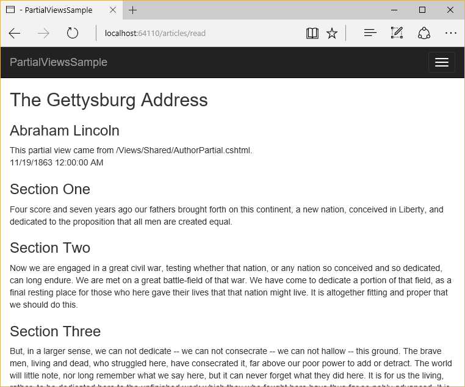

# Partial Views

By [Steve Smith](https://ardalis.com/), [Maher JENDOUBI](https://twitter.com/maherjend), and [Rick Anderson](https://twitter.com/RickAndMSFT)

ASP.NET Core MVC supports partial views, which are useful when you have reusable parts of web pages you want to share between different views.

[View or download sample code](https://github.com/aspnet/Docs/tree/master/aspnetcore/mvc/views/partial/sample)

## What are Partial Views?

A partial view is a view that is rendered within another view. The HTML output generated by executing the partial view is rendered into the calling (or parent) view. Like views, partial views use the *.cshtml* file extension.

## When Should I Use Partial Views?

Partial views are an effective way of breaking up large views into smaller components. They can reduce duplication of view content and allow view elements to be reused. Common layout elements should be specified in [_Layout.cshtml](layout.md). Non-layout reusable content can be encapsulated into partial views.

If you have a complex page made up of several logical pieces, it can be helpful to work with each piece as its own partial view. Each piece of the page can be viewed in isolation from the rest of the page, and the view for the page itself becomes much simpler since it only contains the overall page structure and calls to render the partial views.

Tip: Follow the [Don't Repeat Yourself Principle](http://deviq.com/don-t-repeat-yourself/) in your views.

## Declaring Partial Views

Partial views are created like any other view: you create a *.cshtml* file within the *Views* folder. There is no semantic difference between a partial view and a regular view - they are just rendered differently. You can have a view that is returned directly from a controller's `ViewResult`, and the same view can be used as a partial view. The main difference between how a view and a partial view are rendered is that partial views do not run *_ViewStart.cshtml* (while views do - learn more about *_ViewStart.cshtml* in [Layout](layout.md)).

## Referencing a Partial View

From within a view page, there are several ways in which you can render a partial view. The simplest is to use `Html.Partial`, which returns an `IHtmlString` and can be referenced by prefixing the call with `@`:

[!code-html[Main](partial/sample/src/PartialViewsSample/Views/Home/About.cshtml?range=9)]

The `PartialAsync` method is available for partial views containing asynchronous code (although code in views is generally discouraged):

[!code-html[Main](partial/sample/src/PartialViewsSample/Views/Home/About.cshtml?range=8)]

You can render a partial view with `RenderPartial`. This method doesn't return a result; it streams the rendered output directly to the response. Because it doesn't return a result, it must be called within a Razor code block (you can also call `RenderPartialAsync` if necessary):

[!code-html[Main](partial/sample/src/PartialViewsSample/Views/Home/About.cshtml?range=10-12)]

Because it streams the result directly, `RenderPartial` and `RenderPartialAsync` may perform better in some scenarios. However, in most cases it's recommended you use `Partial` and `PartialAsync`.

> [!NOTE]
> If your views need to execute code, the recommended pattern is to use a [view component](view-components.md) instead of a partial view.

### Partial View Discovery

When referencing a partial view, you can refer to its location in several ways:

```text
// Uses a view in current folder with this name
// If none is found, searches the Shared folder
@Html.Partial("ViewName")

// A view with this name must be in the same folder
@Html.Partial("ViewName.cshtml")

// Locate the view based on the application root
// Paths that start with "/" or "~/" refer to the application root
@Html.Partial("~/Views/Folder/ViewName.cshtml")
@Html.Partial("/Views/Folder/ViewName.cshtml")

// Locate the view using relative paths
@Html.Partial("../Account/LoginPartial.cshtml")
```

You can have different partial views with the same name in different view folders. When referencing the views by name (without file extension), views in each folder will use the partial view in the same folder with them. You can also specify a default partial view to use, placing it in the *Shared* folder. The shared partial view will be used by any views that don't have their own version of the partial view. You can have a default partial view (in *Shared*), which is overridden by a partial view with the same name in the same folder as the parent view.

Partial views can be *chained*. That is, a partial view can call another partial view (as long as you don't create a loop). Within each view or partial view, relative paths are always relative to that view, not the root or parent view.

> [!NOTE]
> If you declare a [Razor](razor.md) `section` in a partial view, it will not be visible to its parent(s); it will be limited to the partial view.

## Accessing Data From Partial Views

When a partial view is instantiated, it gets a copy of the parent view's `ViewData` dictionary. Updates made to the data within the partial view are not persisted to the parent view. `ViewData` changed in a partial view is lost when the partial view returns.

You can pass an instance of `ViewDataDictionary` to the partial view:

```csharp
@Html.Partial("PartialName", customViewData)
   ```

You can also pass a model into a partial view. This can be the page's view model, or some portion of it, or a custom object. You can pass a model to `Partial`,`PartialAsync`, `RenderPartial`, or `RenderPartialAsync`:

```csharp
@Html.Partial("PartialName", viewModel)
   ```

You can pass an instance of `ViewDataDictionary` and a view model to a partial view:

[!code-html[Main](partial/sample/src/PartialViewsSample/Views/Articles/Read.cshtml?range=15-16)]

The markup below shows the *Views/Articles/Read.cshtml* view which contains two partial views. The second partial view passes in a model and `ViewData` to the partial view. You can pass new `ViewData` dictionary while retaining the existing `ViewData` if you use the constructor overload of the `ViewDataDictionary` highlighted below:

[!code-html[Main](partial/sample/src/PartialViewsSample/Views/Articles/Read.cshtml)]

*Views/Shared/AuthorPartial*:

[!code-html[Main](partial/sample/src/PartialViewsSample/Views/Shared/AuthorPartial.cshtml)]

The *ArticleSection* partial:

[!code-html[Main](partial/sample/src/PartialViewsSample/Views/Articles/ArticleSection.cshtml)]

At runtime, the partials are rendered into the parent view, which itself is rendered within the shared *_Layout.cshtml*


