# Tag Helpers in ASP.NET Core

By [Rick Anderson](https://twitter.com/RickAndMSFT)

## What are Tag Helpers

Tag Helpers enable server-side code to participate in creating and rendering HTML elements in Razor files. For example, the built-in `ImageTagHelper` can append a version number to the image name. Whenever the image changes, the server generates a new unique version for the image, so clients are guaranteed to get the current image (instead of a stale cached image). There are many built-in Tag Helpers for common tasks - such as creating forms, links, loading assets and more - and even more available in public GitHub repositories and as NuGet packages. Tag Helpers are authored in C#, and they target HTML elements based on element name, attribute name, or parent tag. For example, the built-in `LabelTagHelper` can target the HTML `<label>` element when the
`LabelTagHelper` attributes are applied. If you're familiar with [HTML Helpers](https://stephenwalther.com/archive/2009/03/03/chapter-6-understanding-html-helpers), Tag Helpers reduce the explicit transitions between HTML and C# in Razor views. In many cases, HTML Helpers provide an alternative approach to a specific Tag Helper, but it's important to recognize that Tag Helpers don't replace HTML Helpers and there's not a Tag Helper for each HTML Helper. [Tag Helpers compared to HTML Helpers](#tag-helpers-compared-to-html-helpers) explains the differences in more detail.

Tag Helpers aren't supported in Razor components. For more information, see <xref:blazor/components/index#tag-helpers-arent-supported-in-components>.

## What Tag Helpers provide

**An HTML-friendly development experience**

   For the most part, Razor markup using Tag Helpers looks like standard HTML. Front-end designers conversant with HTML/CSS/JavaScript can edit Razor without learning C# Razor syntax.

**A rich IntelliSense environment for creating HTML and Razor markup**

   This is in sharp contrast to HTML Helpers, the previous approach to server-side creation of markup in Razor views. [Tag Helpers compared to HTML Helpers](#tag-helpers-compared-to-html-helpers) explains the differences in more detail. [IntelliSense support for Tag Helpers](#intellisense-support-for-tag-helpers) explains the IntelliSense environment. Even developers experienced with Razor C# syntax are more productive using Tag Helpers than writing C# Razor markup.

**A way to make you more productive and able to produce more robust, reliable, and maintainable code using information only available on the server**

   For example, historically the mantra on updating images was to change the name of the image when you change the image. Images should be aggressively cached for performance reasons, and unless you change the name of an image, you risk clients getting a stale copy. Historically, after an image was edited, the name had to be changed and each reference to the image in the web app needed to be updated. Not only is this very labor intensive, it's also error prone (you could miss a reference, accidentally enter the wrong string, etc.) The built-in `ImageTagHelper` can do this for you automatically. The `ImageTagHelper` can append a version number to the image name, so whenever the image changes, the server automatically generates a new unique version for the image. Clients are guaranteed to get the current image. This robustness and labor savings comes essentially free by using the `ImageTagHelper`.

Most built-in Tag Helpers target standard HTML elements and provide server-side attributes for the element. For example, the `<input>` element used in many views in the *Views/Account* folder contains the `asp-for` attribute. This attribute extracts the name of the specified model property into the rendered HTML. Consider a Razor view with the following model:

```csharp
public class Movie
{
    public int ID { get; set; }
    public string Title { get; set; }
    public DateTime ReleaseDate { get; set; }
    public string Genre { get; set; }
    public decimal Price { get; set; }
}
```

The following Razor markup:

```cshtml
<label asp-for="Movie.Title"></label>
```

Generates the following HTML:

```html
<label for="Movie_Title">Title</label>
```

The `asp-for` attribute is made available by the `For` property in the <xref:Microsoft.AspNetCore.Mvc.TagHelpers.LabelTagHelper>. See [Author Tag Helpers](xref:mvc/views/tag-helpers/authoring) for more information.

## Managing Tag Helper scope

Tag Helpers scope is controlled by a combination of `@addTagHelper`, `@removeTagHelper`, and the "!" opt-out character.

<a name="add-helper-label"></a>

### `@addTagHelper` makes Tag Helpers available

If you create a new ASP.NET Core web app named *AuthoringTagHelpers*, the following `Views/_ViewImports.cshtml` file will be added to your project:

[!code-cshtml[](../../../mvc/views/tag-helpers/authoring/sample/AuthoringTagHelpers/src/AuthoringTagHelpers/Views/_ViewImportsCopy.cshtml?highlight=2&range=2-3)]

The `@addTagHelper` directive makes Tag Helpers available to the view. In this case, the view file is `Pages/_ViewImports.cshtml`, which by default is inherited by all files in the *Pages* folder and subfolders; making Tag Helpers available. The code above uses the wildcard syntax ("\*") to specify that all Tag Helpers in the specified assembly (*Microsoft.AspNetCore.Mvc.TagHelpers*) will be available to every view file in the *Views* directory or subdirectory. The first parameter after `@addTagHelper` specifies the Tag Helpers to load (we are using "\*" for all Tag Helpers), and the second parameter "Microsoft.AspNetCore.Mvc.TagHelpers" specifies the assembly containing the Tag Helpers. *Microsoft.AspNetCore.Mvc.TagHelpers* is the assembly for the built-in ASP.NET Core Tag Helpers.

To expose all of the Tag Helpers in this project (which creates an assembly named *AuthoringTagHelpers*), you would use the following:

[!code-cshtml[](../../../mvc/views/tag-helpers/authoring/sample/AuthoringTagHelpers/src/AuthoringTagHelpers/Views/_ViewImportsCopy.cshtml?highlight=3)]

If your project contains an `EmailTagHelper` with the default namespace (`AuthoringTagHelpers.TagHelpers.EmailTagHelper`), you can provide the fully qualified name (FQN) of the Tag Helper:

```cshtml
@using AuthoringTagHelpers
@addTagHelper *, Microsoft.AspNetCore.Mvc.TagHelpers
@addTagHelper AuthoringTagHelpers.TagHelpers.EmailTagHelper, AuthoringTagHelpers
```

To add a Tag Helper to a view using an FQN, you first add the FQN (`AuthoringTagHelpers.TagHelpers.EmailTagHelper`), and then the assembly name (*AuthoringTagHelpers*). Most developers prefer to use the  "\*" wildcard syntax. The wildcard syntax allows you to insert the wildcard character "\*" as the suffix in an FQN. For example, any of the following directives will bring in the `EmailTagHelper`:

```cshtml
@addTagHelper AuthoringTagHelpers.TagHelpers.E*, AuthoringTagHelpers
@addTagHelper AuthoringTagHelpers.TagHelpers.Email*, AuthoringTagHelpers
```

As mentioned previously, adding the `@addTagHelper` directive to the `Views/_ViewImports.cshtml` file makes the Tag Helper available to all view files in the *Views* directory and subdirectories. You can use the `@addTagHelper` directive in specific view files if you want to opt-in to exposing the Tag Helper to only those views.

<a name="remove-razor-directives-label"></a>

### `@removeTagHelper` removes Tag Helpers

The `@removeTagHelper` has the same two parameters as `@addTagHelper`, and it removes a Tag Helper that was previously added. For example, `@removeTagHelper` applied to a specific view removes the specified Tag Helper from the view. Using `@removeTagHelper` in a `Views/Folder/_ViewImports.cshtml` file removes the specified Tag Helper from all of the views in *Folder*.

### Controlling Tag Helper scope with the `_ViewImports.cshtml` file

You can add a `_ViewImports.cshtml` to any view folder, and the view engine applies the directives from both that file and the `Views/_ViewImports.cshtml` file. If you added an empty `Views/Home/_ViewImports.cshtml` file for the *Home* views, there would be no change because the `_ViewImports.cshtml` file is additive. Any `@addTagHelper` directives you add to the `Views/Home/_ViewImports.cshtml` file (that are not in the default `Views/_ViewImports.cshtml` file) would expose those Tag Helpers to views only in the *Home* folder.

<a name="opt-out"></a>

### Opting out of individual elements

You can disable a Tag Helper at the element level with the Tag Helper opt-out character ("!"). For example, `Email` validation is disabled in the `<span>` with the Tag Helper opt-out character:

```cshtml
<!span asp-validation-for="Email" class="text-danger"></!span>
```

You must apply the Tag Helper opt-out character to the opening and closing tag. (The Visual Studio editor automatically adds the opt-out character to the closing tag when you add one to the opening tag). After you add the opt-out character, the element and Tag Helper attributes are no longer displayed in a distinctive font.

<a name="prefix-razor-directives-label"></a>

### Using `@tagHelperPrefix` to make Tag Helper usage explicit

The `@tagHelperPrefix` directive allows you to specify a tag prefix string to enable Tag Helper support and to make Tag Helper usage explicit. For example, you could add the following markup to the `Views/_ViewImports.cshtml` file:

```cshtml
@tagHelperPrefix th:
```

In the code image below, the Tag Helper prefix is set to `th:`, so only those elements using the prefix `th:` support Tag Helpers (Tag Helper-enabled elements have a distinctive font). The `<label>` and `<input>` elements have the Tag Helper prefix and are Tag Helper-enabled, while the `<span>` element doesn't.

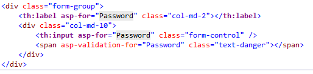

The same hierarchy rules that apply to `@addTagHelper` also apply to `@tagHelperPrefix`.

## Self-closing Tag Helpers

Many Tag Helpers can't be used as self-closing tags. Some Tag Helpers are designed to be self-closing tags. Using a Tag Helper that was not designed to be self-closing suppresses the rendered output. Self-closing a Tag Helper results in a self-closing tag in the rendered output. For more information, see [this note](xref:mvc/views/tag-helpers/authoring#self-closing) in [Authoring Tag Helpers](xref:mvc/views/tag-helpers/authoring).

## C# in Tag Helpers attribute/declaration

Tag Helpers do not allow C# in the element's attribute or tag declaration area. For example, the following code is not valid:

```cshtml
<input asp-for="LastName"  
       @(Model?.LicenseId == null ? "disabled" : string.Empty) />
```

The preceding code can be written as:

```cshtml
<input asp-for="LastName" 
       disabled="@(Model?.LicenseId == null)" />
```

Normally, the `@` operator inserts a textual representation of an expression into the rendered HTML markup. However, when an expression evaluates to logical `false`, the framework removes the attribute instead. In the preceding example, the `disabled` attribute is removed if `Model` or `LicenseId` is `null`.

## Tag helper initializers

While attributes can be used to configure individual instances of tag helpers, <xref:Microsoft.AspNetCore.Mvc.Razor.ITagHelperInitializer%601> can be used to configure all tag helper instances of a specific kind. Consider the following example of a tag helper initializer that configures the `asp-append-version` attribute or `AppendVersion` property for all `ScriptTagHelper`s in the app:

```csharp
public class AppendVersionTagHelperInitializer : ITagHelperInitializer<ScriptTagHelper>
{
    public void Initialize(ScriptTagHelper helper, ViewContext context)
    {
        helper.AppendVersion = true;
    }
}
```

To use the initializer, configure it by registering it as part of the application's startup:

```csharp
builder.Services.AddSingleton
    <ITagHelperInitializer<ScriptTagHelper>, AppendVersionTagHelperInitializer>();
```

## IntelliSense support for Tag Helpers


Consider writing an HTML `<label>` element. As soon as you enter `<l` in the Visual Studio editor, IntelliSense displays matching elements:

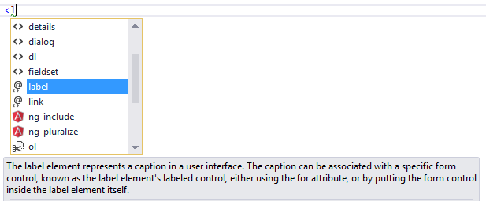

Not only do you get HTML help, but also the icon (the "@" symbol with "<>" under it).

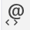

The icon identifies the element as targeted by Tag Helpers. Pure HTML elements (such as the `fieldset`) display the "<>" icon.

A pure HTML `<label>` tag displays the HTML tag (with the default Visual Studio color theme) in a brown font, the attributes in red, and the attribute values in blue.

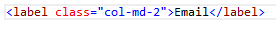

After you enter `<label`, IntelliSense lists the available HTML/CSS attributes and the Tag Helper-targeted attributes:

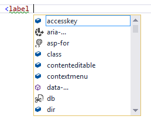

IntelliSense statement completion allows you to enter the tab key to complete the statement with the selected value:

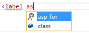

As soon as a Tag Helper attribute is entered, the tag and attribute fonts change. Using the default Visual Studio "Blue" or "Light" color theme, the font is bold purple. If you're using the "Dark" theme the font is bold teal. The images in this document were taken using the default theme.

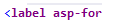

You can enter the Visual Studio *CompleteWord* shortcut (Ctrl +spacebar is the [default](/visualstudio/ide/default-keyboard-shortcuts-in-visual-studio)) inside the double quotes (""), and you are now in C#, just like you would be in a C# class. IntelliSense displays all the methods and properties on the page model. The methods and properties are available because the property type is `ModelExpression`. In the image below, I'm editing the `Register` view, so the `RegisterViewModel` is available.

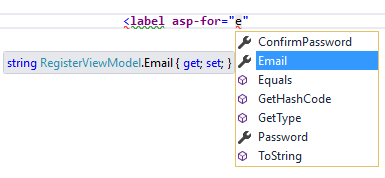

IntelliSense lists the properties and methods available to the model on the page. The rich IntelliSense environment helps you select the CSS class:

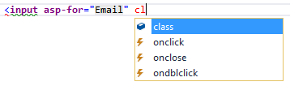

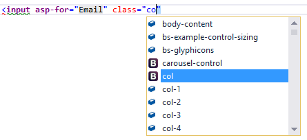

## Tag Helpers compared to HTML Helpers

Tag Helpers attach to HTML elements in Razor views, while [HTML Helpers](https://stephenwalther.com/archive/2009/03/03/chapter-6-understanding-html-helpers) are invoked as methods interspersed with HTML in Razor views. Consider the following Razor markup, which creates an HTML label with the CSS class "caption":

```cshtml
@Html.Label("FirstName", "First Name:", new {@class="caption"})
```

The at (`@`) symbol tells Razor this is the start of code. The next two parameters ("FirstName" and "First Name:") are strings, so [IntelliSense](/visualstudio/ide/using-intellisense) can't help. The last argument:

```cshtml
new {@class="caption"}
```

Is an anonymous object used to represent attributes. Because `class` is a reserved keyword in C#, you use the `@` symbol to force C# to interpret `@class=` as a symbol (property name). To a front-end designer (someone familiar with HTML/CSS/JavaScript and other client technologies but not familiar with C# and Razor), most of the line is foreign. The entire line must be authored with no help from IntelliSense.

Using the `LabelTagHelper`, the same markup can be written as:

```cshtml
<label class="caption" asp-for="FirstName"></label>
```

With the Tag Helper version, as soon as you enter `<l` in the Visual Studio editor, IntelliSense displays matching elements:


IntelliSense helps you write the entire line.

The following code image shows the Form portion of the `Views/Account/Register.cshtml` Razor view generated from the ASP.NET 4.5.x MVC template included with Visual Studio.

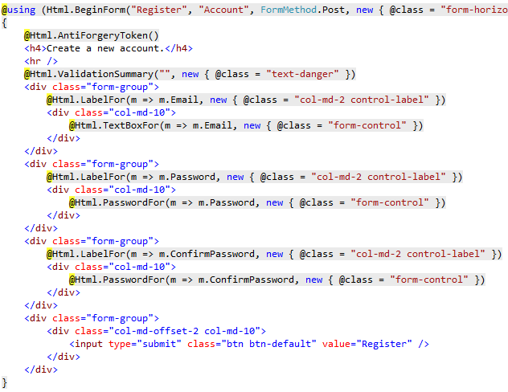

The Visual Studio editor displays C# code with a grey background. For example, the `AntiForgeryToken` HTML Helper:

```cshtml
@Html.AntiForgeryToken()
```

is displayed with a grey background. Most of the markup in the Register view is C#. Compare that to the equivalent approach using Tag Helpers:

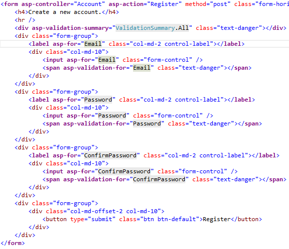

The markup is much cleaner and easier to read, edit, and maintain than the HTML Helpers approach. The C# code is reduced to the minimum that the server needs to know about. The Visual Studio editor displays markup targeted by a Tag Helper in a distinctive font.

Consider the *Email* group:

[!code-cshtml[](intro/sample/Register.cshtml?range=12-18)]

Each of the "asp-" attributes has a value of "Email", but "Email" isn't a string. In this context, "Email" is the C# model expression property for the `RegisterViewModel`.

The Visual Studio editor helps you write **all** of the markup in the Tag Helper approach of the register form, while Visual Studio provides no help for most of the code in the HTML Helpers approach. [IntelliSense support for Tag Helpers](#intellisense-support-for-tag-helpers) goes into detail on working with Tag Helpers in the Visual Studio editor.

## Tag Helpers compared to Web Server Controls

* Tag Helpers don't own the element they're associated with; they simply participate in the rendering of the element and content. ASP.NET Web Server Controls are declared and invoked on a page.

* ASP.NET Web Server Controls have a non-trivial lifecycle that can make developing and debugging difficult.

* Web Server controls allow you to add functionality to the client Document Object Model (DOM) elements by using a client control. Tag Helpers have no DOM.

* Web Server controls include automatic browser detection. Tag Helpers have no knowledge of the browser.

* Multiple Tag Helpers can act on the same element (see [Avoiding Tag Helper conflicts](xref:mvc/views/tag-helpers/authoring#avoid-tag-helper-conflicts)) while you typically can't compose Web Server controls.

* Tag Helpers can modify the tag and content of HTML elements that they're scoped to, but don't directly modify anything else on a page. Web Server controls have a less specific scope and can perform actions that affect other parts of your page; enabling unintended side effects.

* Web Server controls use type converters to convert strings into objects. With Tag Helpers, you work natively in C#, so you don't need to do type conversion.

* Web Server controls use <xref:System.ComponentModel?displayProperty=fullName> to implement the run-time and design-time behavior of components and controls. `System.ComponentModel` includes the base classes and interfaces for implementing attributes and type converters, binding to data sources, and licensing components. Contrast that to Tag Helpers, which typically derive from `TagHelper`, and the `TagHelper` base class exposes only two methods, `Process` and `ProcessAsync`.

## Customizing the Tag Helper element font

You can customize the font and colorization from **Tools** > **Options** > **Environment** > **Fonts and Colors**:

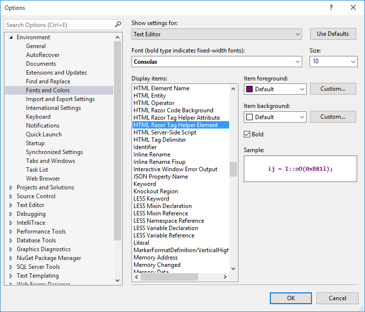

[!INCLUDE[](~/includes/built-in-TH.md)]

## Additional resources

* [Author Tag Helpers](xref:mvc/views/tag-helpers/authoring)
* [Working with Forms](xref:mvc/views/working-with-forms)
* [TagHelperSamples on GitHub](https://github.com/dpaquette/TagHelperSamples) contains Tag Helper samples for working with [Bootstrap](https://getbootstrap.com/).
