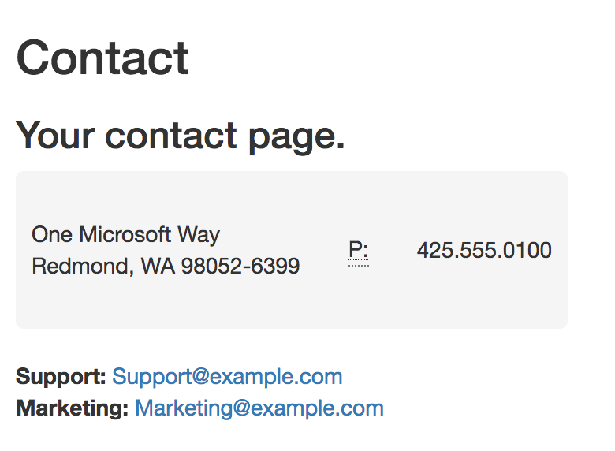
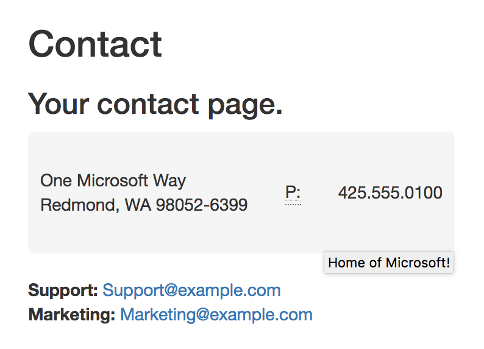
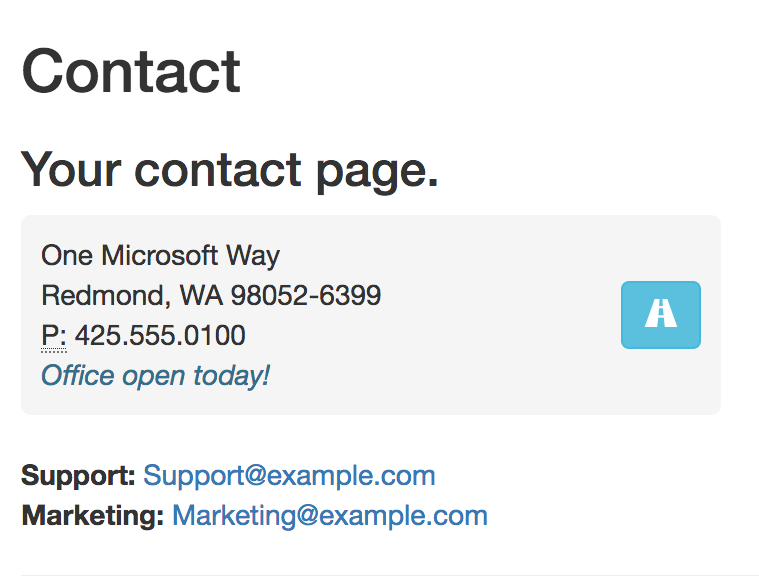

# Tag Helper Components in ASP.NET Core

By [Fiyaz Bin Hasan](https://github.com/fiyazbinhasan) and [Scott Addie](https://twitter.com/Scott_Addie)

## Overview

In theory, a Tag Helper Component is a regular Tag Helper. The main difference is a Tag Helper Component allows you to conditionally modify or add HTML elements from server-side code. ASP.NET Core ships with two built-in Tag Helper Components: `head` and `body`. They can be used in both MVC and Razor Pages. The following code is for the built-in `head` Tag Helper Component:

```csharp
[HtmlTargetElement("head")]
[EditorBrowsable(EditorBrowsableState.Never)]
public class HeadTagHelper : TagHelperComponentTagHelper
{
	public HeadTagHelper(ITagHelperComponentManager manager, ILoggerFactory loggerFactory)
            : base(manager, loggerFactory)
	{
	}
}
```

* A custom Tag Helper Component class inherits from the `TagHelperComponentTagHelper` base class.
* With `[HtmlTargetElement]` attribute, you can target any HTML element by passing the element name as a parameter.
* The `[EditorBrowsable]` attribute determines whether to display a type's information in IntelliSense. This attribute is optional.
* `ITagHelperComponentMananger` manages a collection of Tag Helper Components used throughout the app.

The `head` and `body` Tag Helper Components are declared in the `Microsoft.AspNetCore.Mvc.TagHelpers` namespace along with the other Tag Helpers. In a MVC or Razor Pages app, all built-in Tag Helpers are imported with the following `@addTagHelper` directive in the *_ViewImports.cshtml* file:

[!code-cshtml[](th-components/sample/RazorPagesSample/Pages/_ViewImports.cshtml?name=snippet_AddTagHelperDirective)]

## Use cases

### `head` Tag Helper Component

A typical usage of `<head>` element is to define page-wide markup styles with the `<style>` element. The following code dynamically adds styles in the `<head>` element using the `head` Tag Helper Component.

[!code-csharp[](th-components/sample/RazorPagesSample/TagHelpers/StyleTagHelperComponent.cs?name=snippet_StyleTagHelperComponentClass)]

In the preceding code:

* `StyleTagHelperComponent` implements `ITagHelperComponent`. The abstraction allows the class to be initialized with a `TagHelperContext`. It ensures it can use Tag Helper Components to add or modify HTML elements.
* If you have multiple usages of Tag Helper Components in an app, `Order` defines the order in which the Components are rendered.
* `ProcessAsync` checks for a `TagName` inside the running context that matches the `head` element. If matched, it appends the content of the `_style` field with the `output` of the `<head>` element.



### `body` Tag Helper Component

Similarly, you can use the `body` Tag Helper Component to inject JavaScript scripts inside your `<body>` element. The following code demonstrates such example:

[!code-csharp[](th-components/sample/RazorPagesSample/TagHelpers/ScriptTagHelperComponent.cs?name=snippet_ScriptTagHelperComponentClass)]

You can use separate HTML files to store your `<script>` and `<style>` elements. It makes the code cleaner and more maintainable. The preceding code reads the contents of *AddressToolTipScript.html* and appends it with the Tag Helper output. The *AddressToolTipScript.html* file includes the following markup:

[!code-html[](th-components/sample/RazorPagesSample/Files/AddressToolTipScript.html)]

The preceding code dynamically adds a Bootstrap tooltip menu on a `<address>` element with an attached attribute of `printable`. The effect is visible when a mouse pointer hovers over the element.



## Dependency injection

Implemented Tag Helper Component classes must be registered with the dependency injection (DI) system if you're not managing the instances with `ITagHelperComponentManager`. The following `Startup.ConfigureServices` code registers both the `StyleTagHelperComponent` and `ScriptTagHelperComponent` with a transient lifetime.

[!code-csharp[](th-components/sample/RazorPagesSample/Startup.cs?name=snippet_ConfigureServices&highlight=11-12)]

## Custom Tag Helper Components

You can build your own custom Tag Helper Component, following the same technique used for the built-in `head` and `body` Tag Helpers. The following code creates a custom Tag Helper Component that targets the `<address>` HTML element:

*AddressTagHelperComponentTagHelper.cs*

[!code-csharp[](th-components/sample/RazorPagesSample/TagHelpers/AddressTagHelperComponentTagHelper.cs?name=snippet_AddressTagHelperComponentTagHelperClass)]

You can use the custom `address` Tag Helper Component to inject HTML elements as follows:

```csharp
public class AddressTagHelperComponent : ITagHelperComponent
{
	string _printableButton = "<button type='button' class='btn btn-info' onclick=\"window.open('https://www.google.com/maps/place/Microsoft+Way,+Redmond,+WA+98052,+USA/@47.6414942,-122.1327809,17z/')\">" +
		                        "<span class='glyphicon glyphicon-road' aria-hidden='true'></span>" +
		                      "</button>";

	public int Order => 3;

	public void Init(TagHelperContext context) { }

	public async Task ProcessAsync(TagHelperContext context, TagHelperOutput output)
    {
		if (string.Equals(context.TagName, "address", StringComparison.OrdinalIgnoreCase) && output.Attributes.ContainsName("printable"))
        {
			var content = await output.GetChildContentAsync();
			output.Content.SetHtmlContent($"<div>{content.GetContent()}</div>{_printableButton}");
        }
    }
}
```

In the preceding code, `ProcessAsync` checks for equality of the `TagName` and the `address` element. If matched, it injects HTML markup to `<address>` elements with an attribute of `printable`.

## Manage Components with `ITagHelperComponentManager`

You can register the `AddressTagHelperComponent` with the DI system like the other ones. However, you can also initialize and add the component directly from the Razor markup. `ITagHelperComponentManager` is used to add or remove Tag Helper Components from the app. The following code demonstrates this example:

[!code-cshtml[](th-components/sample/RazorPagesSample/Pages/Contact.cshtml?name=snippet_ITagHelperComponentManager)]

In the preceding code:

* `manager` is an instance of the view injected `ITagHelperComponentManager`.
* `manager.Components.Add` adds the component to the app's Tag Helper Component collection.

This technique is useful for controlling the injected `markup` and `order` of the component execution directly from a Razor view.

`AddressTagHelperComponent` is modified to accommodate a constructor that accepts the `markup` and `order` parameters:

```csharp
private readonly string _markup;
private readonly int _order;

public AddressTagHelperComponent(string markup = "", int order = 1)
{
	_markup = markup;
	_order = order;
}
```

The provided `markup` parameter is used in `ProcessAsync` as follows:

```csharp
public async Task ProcessAsync(TagHelperContext context, TagHelperOutput output)
{
	if (string.Equals(context.TagName, "address", StringComparison.OrdinalIgnoreCase) && output.Attributes.ContainsName("printable"))
    {
		var content = await output.GetChildContentAsync();
		output.Content.SetHtmlContent($"<div>{content.GetContent()}<br/>{_markup}</div>{_printableButton}");
    }
}
```


