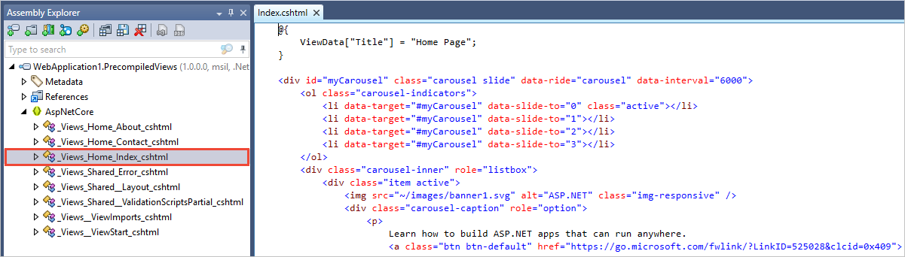

# Razor file compilation in ASP.NET Core

By [Rick Anderson](https://twitter.com/RickAndMSFT)

::: moniker range="= aspnetcore-1.1"

A Razor file is compiled at runtime, when the associated MVC view is invoked. Build-time Razor file publishing is unsupported. Razor files can optionally be compiled at publish time and deployed with the app&mdash;using the precompilation tool.

::: moniker-end

::: moniker range="= aspnetcore-2.0"

A Razor file is compiled at runtime, when the associated Razor Page or MVC view is invoked. Build-time Razor file publishing is unsupported. Razor files can optionally be compiled at publish time and deployed with the app&mdash;using the precompilation tool.

::: moniker-end

::: moniker range=">= aspnetcore-2.1 <= aspnetcore-2.2"

A Razor file is compiled at runtime, when the associated Razor Page or MVC view is invoked. Razor files are compiled at both build and publish time using the [Razor SDK](xref:razor-pages/sdk).

::: moniker-end

::: moniker range=">= aspnetcore-3.0"

Razor files with a *.cshtml* extension are compiled at both build and publish time using the [Razor SDK](xref:razor-pages/sdk). Runtime compilation may be optionally enabled by configuring your application.

::: moniker-end

## Razor compilation

::: moniker range=">= aspnetcore-3.0"

Build- and publish-time compilation of Razor files is enabled by default by the Razor SDK. When enabled, runtime compilation complements build-time compilation, allowing Razor files to be updated if they are edited.

::: moniker-end

::: moniker range=">= aspnetcore-2.1 <= aspnetcore-2.2"

Build- and publish-time compilation of Razor files is enabled by default by the Razor SDK. Editing Razor files after they're updated is supported at build time. By default, only the compiled *Views.dll* and no *.cshtml* files or references assemblies required to compile Razor files are deployed with your app.

> [!IMPORTANT]
> The precompilation tool has been deprecated, and will be removed in ASP.NET Core 3.0. We recommend migrating to [Razor Sdk](xref:razor-pages/sdk).
>
> The Razor SDK is effective only when no precompilation-specific properties are set in the project file. For instance, setting the *.csproj* file's `MvcRazorCompileOnPublish` property to `true` disables the Razor SDK.

::: moniker-end

::: moniker range="= aspnetcore-2.0"

If your project targets .NET Framework, install the [Microsoft.AspNetCore.Mvc.Razor.ViewCompilation](https://www.nuget.org/packages/Microsoft.AspNetCore.Mvc.Razor.ViewCompilation/) NuGet package:

[!code-xml[](view-compilation/sample/DotNetFrameworkProject.csproj?name=snippet_ViewCompilationPackage)]

If your project targets .NET Core, no changes are necessary.

The ASP.NET Core 2.x project templates implicitly set the `MvcRazorCompileOnPublish` property to `true` by default. Consequently, this element can be safely removed from the *.csproj* file.

> [!IMPORTANT]
> The precompilation tool has been deprecated, and will be removed in ASP.NET Core 3.0. We recommend migrating to [Razor Sdk](xref:razor-pages/sdk).
>
> Razor file precompilation is unavailable when performing a [self-contained deployment (SCD)](/dotnet/core/deploying/#self-contained-deployments-scd) in ASP.NET Core 2.0.

::: moniker-end

::: moniker range="= aspnetcore-1.1"

Set the `MvcRazorCompileOnPublish` property to `true`, and install the [Microsoft.AspNetCore.Mvc.Razor.ViewCompilation](https://www.nuget.org/packages/Microsoft.AspNetCore.Mvc.Razor.ViewCompilation/) NuGet package. The following *.csproj* sample highlights these settings:

[!code-xml[](view-compilation/sample/MvcRazorCompileOnPublish.csproj?highlight=4,10)]

::: moniker-end

::: moniker range="<= aspnetcore-2.0"

Prepare the app for a [framework-dependent deployment](/dotnet/core/deploying/#framework-dependent-deployments-fdd) with the [.NET Core CLI publish command](/dotnet/core/tools/dotnet-publish). For example, execute the following command at the project root:

```dotnetcli
dotnet publish -c Release
```

A *\<project_name>.PrecompiledViews.dll* file, containing the compiled Razor files, is produced when precompilation succeeds. For example, the screenshot below depicts the contents of *Index.cshtml* within *WebApplication1.PrecompiledViews.dll*:



::: moniker-end

## Runtime compilation

::: moniker range="= aspnetcore-2.1"

Build-time compilation is supplemented by runtime compilation of Razor files. ASP.NET Core MVC will recompile Razor files when the contents of a *.cshtml* file change.

::: moniker-end

::: moniker range="= aspnetcore-2.2"

Build-time compilation is supplemented by runtime compilation of Razor files. The <xref:Microsoft.AspNetCore.Mvc.Razor.RazorViewEngineOptions> <xref:Microsoft.AspNetCore.Mvc.Razor.RazorViewEngineOptions.AllowRecompilingViewsOnFileChange> gets or sets a value that determines if Razor files (Razor views and Razor Pages) are recompiled and updated if files change on disk.

The default value is `true` for:

* If the app's compatibility version is set to <xref:Microsoft.AspNetCore.Mvc.CompatibilityVersion.Version_2_1> or earlier
* If the app's compatibility version is set to <xref:Microsoft.AspNetCore.Mvc.CompatibilityVersion.Version_2_2> or later and the app is in the Development environment <xref:Microsoft.AspNetCore.Hosting.HostingEnvironmentExtensions.IsDevelopment*>. In other words, Razor files wouldn't recompile in non-Development environment unless <xref:Microsoft.AspNetCore.Mvc.Razor.RazorViewEngineOptions.AllowRecompilingViewsOnFileChange> is explicitly set.

For guidance and examples of setting the app's compatibility version, see <xref:mvc/compatibility-version>.

::: moniker-end

::: moniker range=">= aspnetcore-3.0"

To enable runtime compilation for all environments and configuration modes:

1. Install the [Microsoft.AspNetCore.Mvc.Razor.RuntimeCompilation](https://www.nuget.org/packages/Microsoft.AspNetCore.Mvc.Razor.RuntimeCompilation/) NuGet package.

1. Update the project's `Startup.ConfigureServices` method to include a call to `AddRazorRuntimeCompilation`. For example:

    ```csharp
    public void ConfigureServices(IServiceCollection services)
    {
        services.AddRazorPages()
            .AddRazorRuntimeCompilation();

        // code omitted for brevity
    }
    ```

### Conditionally enable runtime compilation

Runtime compilation can be enabled such that it's only available for local development. Conditionally enabling in this manner ensures that the published output:

* Uses compiled views.
* Is smaller in size.
* Doesn't enable file watchers in production.

To enable runtime compilation based on the environment and configuration mode:

1. Conditionally reference the [Microsoft.AspNetCore.Mvc.Razor.RuntimeCompilation](https://www.nuget.org/packages/Microsoft.AspNetCore.Mvc.Razor.RuntimeCompilation/) package based on the active `Configuration` value:

    ```xml
    <PackageReference Include="Microsoft.AspNetCore.Mvc.Razor.RuntimeCompilation" Version="3.1.0" Condition="'$(Configuration)' == 'Debug'" />
    ```

1. Update the project's `Startup.ConfigureServices` method to include a call to `AddRazorRuntimeCompilation`. Conditionally execute `AddRazorRuntimeCompilation` such that it only runs in Debug mode when the `ASPNETCORE_ENVIRONMENT` variable is set to `Development`:

    ```csharp
    public IWebHostEnvironment Env { get; set; }

    public void ConfigureServices(IServiceCollection services)
    {
        IMvcBuilder builder = services.AddRazorPages();

    #if DEBUG
        if (Env.IsDevelopment())
        {
            builder.AddRazorRuntimeCompilation();
        }
    #endif

        // code omitted for brevity
    }
    ```

::: moniker-end

## Additional resources

::: moniker range="= aspnetcore-1.1"

* <xref:mvc/views/overview>

::: moniker-end

::: moniker range="= aspnetcore-2.0"

* <xref:razor-pages/index>
* <xref:mvc/views/overview>

::: moniker-end

::: moniker range=">= aspnetcore-2.1"

* <xref:razor-pages/index>
* <xref:mvc/views/overview>
* <xref:razor-pages/sdk>

::: moniker-end
