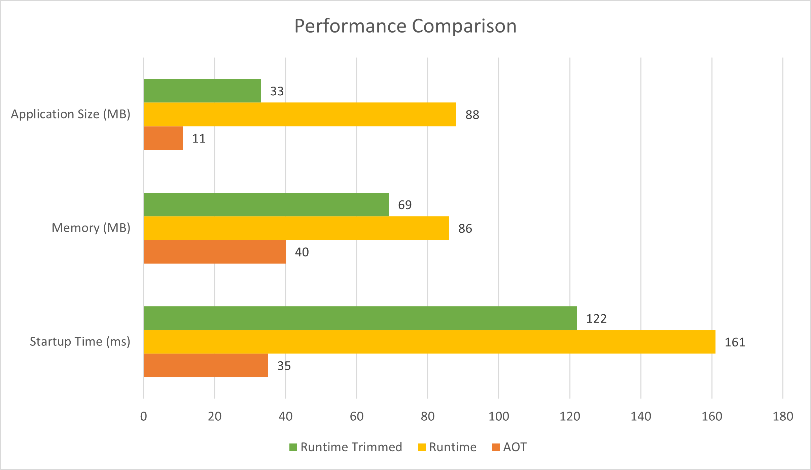

# ASP.NET Core support for .NET native AOT.

ASP.NET Core 8.0 introduces support for [.NET native ahead-of-time (AOT)](/dotnet/core/deploying/native-aot/). Not all ASP.NET Core features are compatible with native AOT at this time. 

* How to get started.
* The benefits and potential drawbacks.
ASP.NET Core 8.0 introduces support for [.NET native ahead-of-time (AOT)](/dotnet/core/deploying/native-aot/). Not all ASP.NET Core features are compatible with native AOT at this time. This article shows:

* How to get started.
* The benefits and potential drawbacks.
* The limitations and compatibility.

## Getting started with .NET native AOT deployment in ASP.NET Core

Native AOT is a publishing option. AOT compilation happens when the app is published. A project opted into Native AOT publishing still uses JIT for F5 debugging, dotnet run, or dotnet build. There are some observable differences:
* Some run time features that aren't compatible with Native AOT are disabled and throw exceptions at run time.
* A source analyzer is enabled to highlight code that isn't compatible with Native AOT. At publish time, the entire app, including NuGet packages, are analyzed for compatibility again.

Native AOT analysis includes all of the app's code and the libraries the app depends on. Review Native AOT warnings and take corrective steps. It's a good idea to test publishing apps frequently to discover issues early in the development lifecycle.

To help developers get started deploying with .NET native AOT in ASP.NET Core, use the:

* AOT API template which includes customizations to remove unsupported components from the app.
* ```dotnet new``` command to create a new ASP.NET Core API app that is configured to work with .NET native AOT:

```
$ dotnet new api -aot -o MyFirstAotWebApi && cd MyFirstAotWebApi
The template "ASP.NET Core API" was created successfully.

Processing post-creation actions...
Restoring C:\Code\Demos\MyFirstAotWebApi\MyFirstAotWebApi.csproj:
  Determining projects to restore...
  Restored C:\Code\Demos\MyFirstAotWebApi\MyFirstAotWebApi.csproj (in 302 ms).
Restore succeeded.
```

Use the following command to verify an app can but published using .NET native AOT:

```
PS> dotnet publish
MSBuild version 17.<version> for .NET
  Determining projects to restore...
  Restored C:\Code\Demos\MyFirstAotWebApi\MyFirstAotWebApi.csproj (in 241 ms).
C:\Code\dotnet\aspnetcore\.dotnet\sdk\8.0.<version>\Sdks\Microsoft.NET.Sdk\targets\Microsoft.NET.RuntimeIde
ntifierInference.targets(287,5): message NETSDK1057: You are using a preview version of .NET. See: https://aka.ms/dotne
t-support-policy [C:\Code\Demos\MyFirstAotWebApi\MyFirstAotWebApi.csproj]
  MyFirstAotWebApi -> C:\Code\Demos\MyFirstAotWebApi\bin\Release\net8.0\win-x64\MyFirstAotWebApi.dll
  Generating native code
  MyFirstAotWebApi -> C:\Code\Demos\MyFirstAotWebApi\bin\Release\net8.0\win-x64\publish\
```

Note: The preceding output my differ from what you see depending on the version of  .NET 8 used.
Review the contents of output directory:

```
$ dir bin\Release\net8.0\win-x64\publish

    Directory: C:\Code\Demos\MyFirstAotWebApi\bin\Release\net8.0\win-x64\publish

Mode                 LastWriteTime         Length Name
----                 -------------         ------ ----
-a---          30/03/2023  1:41 PM        9480704 MyFirstAotWebApi.exe
-a---          30/03/2023  1:41 PM       43044864 MyFirstAotWebApi.pdb
```

The executable that is produced can be executed on a machine without the runtime installed. When launched it should behave as expected:

```
$ .\bin\Release\net8.0\win-x64\publish\MyFirstAotWebApi.exe
info: Microsoft.Hosting.Lifetime[14]
      Now listening on: http://localhost:5000
info: Microsoft.Hosting.Lifetime[0]
      Application started. Press Ctrl+C to shut down.
info: Microsoft.Hosting.Lifetime[0]
      Hosting environment: Production
info: Microsoft.Hosting.Lifetime[0]
      Content root path: C:\Code\Demos\MyFirstAotWebApi
```

The `Program.cs` source file contains some changes for publishing to .NET native AOT. A significant difference is that `Microsoft.AspNetCore.Builder.WebApplication.CreateSlimBuilder` is used to create the web application builder.  The `CreateSlimBuilder` method initializes the <xref:Microsoft.AspNetCore.Builder.WebApplicationBuilder> with the minimal ASP.NET Core features necessary to run an application.
<!-- Update the preceding with the following when the .NET 8 API is published :
<xref:Microsoft.AspNetCore.Builder.WebApplication.CreateBuilderSlim%2A>
-->

```csharp
var builder = WebApplication.CreateSlimBuilder(args);
```

Because this template uses JSON to serialize responses, we need to explicitly provide a `JsonSerializerContext` which specifies the custom types that we need to serialize so that the JSON source generator knows what to produce code for.

```csharp
builder.Services.ConfigureHttpJsonOptions(options =>
{
    options.SerializerOptions.AddContext<AppJsonSerializerContext>();
});

// Other code trimmed for brevity.

[JsonSerializable(typeof(Todo[]))]
internal partial class AppJsonSerializerContext : JsonSerializerContext
{

}
```

Because unused code is trimmed during publishing for Native AOT, the application cannot use unbounded reflection at runtime. Source generators are used to produce code to avoid the need for reflection. In some cases source generators produce code optimized for AOT even when a generator is not strictly required. To view source code that is generated based on the code in ```Program.cs``` modify the ```MyFirstAotWebApi.csproj``` to include the ```<EmitCompilerGeneratedFiles>true</EmitCompilerGeneratedFiles>``` property. Example:

```xml
<Project Sdk="Microsoft.NET.Sdk.Web">

  <PropertyGroup>
    <!-- Other properties ommitted for brevity -->
    <EmitCompilerGeneratedFiles>true</EmitCompilerGeneratedFiles>
  </PropertyGroup>

</Project>
```

With the project file updated, run the `dotnet build` command (`publish` isn't necessary to view generated code). In the built output file there will be a `obj/Debug/net8.0/generated/` directory which contains all the generated files for the project.

When `dotnet publish` is run, the project source files and generated source files are compiled as normal and then outputted assemblies are passed into an native IL compiler which produces the native executable which contains the native machine code to run the application.


## Benefits of using .NET native AOT with ASP.NET Core

Using the .NET native AOT deployment model provides the following benefits:

* **Minimize disk footprint**: When publishing using native AOT a single executable is produced containing just the code from external dependencies that is used to support the program. Reduced executable size can lead to:
  * Smaller container images, for example in containerized deployment scenarios.
  * Reduce deployment time from smaller images.
* **Reduced startup time**: Native AOT applications can show reduced start-up times. Reduced start-up means:
  * The app is ready to service requests quicker.
  * Improved deployment where container orchestrators need manage transition from one version of the app to another.
* **Reduce memory demand**: Native AOT apps can have reduced memory demands depending on the work being performed by the app. Reduced memory consumption can lead to greater deployment density and improved scalability.

We ran the template application in our benchmarking lab to see what the differences were in terms of application size, memory use, and CPU and observed the following results:



You can see that native AOT has a dramatically lower application size on disk and memory utilization is also lower for our template scenario. Startup time is also significantly reduced. 🚀

## ASP.NET Core and Native AOT Supportability

Not all features in ASP.NET Core are currently compatible with .NET native AOT. The following table summarizes ASP.NET Core feature compatibility with .NET native AOT:

| Feature | Fully Supported | Partially Supported | Not Supported |
| - | - | - | - |
| gRPC | <span aria-hidden="true">✔️</span><span class="visually-hidden">Fully supported</span> | | |
| Minimal APIs | | <span aria-hidden="true">✔️</span><span class="visually-hidden">Partially supported</span> | |
| MVC | | | <span aria-hidden="true">❌</span><span class="visually-hidden">Not supported</span> |
| Blazor Server | | |<span aria-hidden="true">❌</span><span class="visually-hidden">Not supported</span> |
| SignalR | | | <span aria-hidden="true">❌</span><span class="visually-hidden">Not supported</span> |
| Authentication | | | <span aria-hidden="true">❌</span><span class="visually-hidden">Not supported</span> (JWT soon) |
| CORS | <span aria-hidden="true">✔️</span><span class="visually-hidden">Fully supported</span> | | |
| HealthChecks | <span aria-hidden="true">✔️</span><span class="visually-hidden">Fully supported</span> | | |
| HttpLogging | <span aria-hidden="true">✔️</span><span class="visually-hidden">Fully supported</span> | | |
| Localization | | |<span aria-hidden="true">❌</span><span class="visually-hidden">Not supported</span> |
| OutputCaching | <span aria-hidden="true">✔️</span><span class="visually-hidden">Fully supported</span> | | |
| RateLimiting | <span aria-hidden="true">✔️</span><span class="visually-hidden">Fully supported</span> | | |
| RequestDecompression | <span aria-hidden="true">✔️</span><span class="visually-hidden">Fully supported</span> | | |
| ResponseCaching | <span aria-hidden="true">✔️</span><span class="visually-hidden">Fully supported</span> | | |
| ResponseCompression | <span aria-hidden="true">✔️</span><span class="visually-hidden">Fully supported</span> | | |
| Rewrite | <span aria-hidden="true">✔️</span><span class="visually-hidden">Fully supported</span> | | |
| Session | | |<span aria-hidden="true">❌</span><span class="visually-hidden">Not supported</span> |
| Spa | | |<span aria-hidden="true">❌</span><span class="visually-hidden">Not supported</span> |
| StaticFiles | <span aria-hidden="true">✔️</span><span class="visually-hidden">Fully supported</span> | | |
| WebSockets | <span aria-hidden="true">✔️</span><span class="visually-hidden">Fully supported</span> | | |

It is important to test application functionality thoroughly when moving to a native AOT deployment model to ensure that functionality observed during developmnet (using the runtime) is preserved in the native executable. When building your application, keep an eye out for AOT warnings. An application that produces AOT warnings during publishing is not guaranteed to work correctly. If you don't get any AOT warnings at publish time, you should be confident that your application will work consistently after publishing for AOT as it did during your F5 / `dotnet run` develoment workflow.

For more information on AOT warnings and how to address them see; [Introduction to AOT warnings](/dotnet/core/deploying/native-aot/fixing-warnings).

## Known issues

We are keeping track of a number of known issues with native AOT support in ASP.NET Core in [a GitHub issue](https://github.com/dotnet/core/issues/8288).
:::moniker-end
