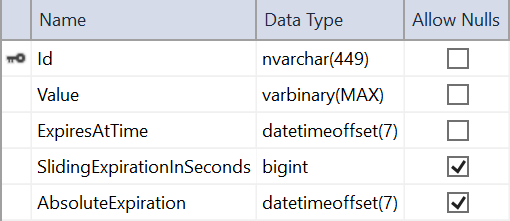

# Distributed caching in ASP.NET Core

By [Mohsin Nasir](https://github.com/mohsinnasir) and [smandia](https://github.com/smandia)

:::moniker range=">= aspnetcore-6.0"

A distributed cache is a cache shared by multiple app servers, typically maintained as an external service to the app servers that access it. A distributed cache can improve the performance and scalability of an ASP.NET Core app, especially when the app is hosted by a cloud service or a server farm.

A distributed cache has several advantages over other caching scenarios where cached data is stored on individual app servers.

When cached data is distributed, the data:

* Is *coherent* (consistent) across requests to multiple servers.
* Survives server restarts and app deployments.
* Doesn't use local memory.

Distributed cache configuration is implementation specific. This article describes how to configure SQL Server and Redis distributed caches. Third party implementations are also available, such as [NCache](http://www.alachisoft.com/ncache/aspnet-core-idistributedcache-ncache.html) ([NCache on GitHub](https://github.com/Alachisoft/NCache)). Regardless of which implementation is selected, the app interacts with the cache using the <xref:Microsoft.Extensions.Caching.Distributed.IDistributedCache> interface.

[View or download sample code](https://github.com/dotnet/AspNetCore.Docs/tree/main/aspnetcore/performance/caching/distributed/samples/) ([how to download](xref:index#how-to-download-a-sample))

## Prerequisites

To use a SQL Server distributed cache, add a package reference to the [Microsoft.Extensions.Caching.SqlServer](https://www.nuget.org/packages/Microsoft.Extensions.Caching.SqlServer) package.

To use a Redis distributed cache, add a package reference to the [Microsoft.Extensions.Caching.StackExchangeRedis](https://www.nuget.org/packages/Microsoft.Extensions.Caching.StackExchangeRedis) package.

To use NCache distributed cache, add a package reference to the [NCache.Microsoft.Extensions.Caching.OpenSource](https://www.nuget.org/packages/NCache.Microsoft.Extensions.Caching.OpenSource) package.

## IDistributedCache interface

The <xref:Microsoft.Extensions.Caching.Distributed.IDistributedCache> interface provides the following methods to manipulate items in the distributed cache implementation:

* <xref:Microsoft.Extensions.Caching.Distributed.IDistributedCache.Get*>, <xref:Microsoft.Extensions.Caching.Distributed.IDistributedCache.GetAsync*>: Accepts a string key and retrieves a cached item as a `byte[]` array if found in the cache.
* <xref:Microsoft.Extensions.Caching.Distributed.IDistributedCache.Set*>, <xref:Microsoft.Extensions.Caching.Distributed.IDistributedCache.SetAsync*>: Adds an item (as `byte[]` array) to the cache using a string key.
* <xref:Microsoft.Extensions.Caching.Distributed.IDistributedCache.Refresh*>, <xref:Microsoft.Extensions.Caching.Distributed.IDistributedCache.RefreshAsync*>: Refreshes an item in the cache based on its key, resetting its sliding expiration timeout (if any).
* <xref:Microsoft.Extensions.Caching.Distributed.IDistributedCache.Remove*>, <xref:Microsoft.Extensions.Caching.Distributed.IDistributedCache.RemoveAsync*>: Removes a cache item based on its string key.

## Establish distributed caching services

Register an implementation of <xref:Microsoft.Extensions.Caching.Distributed.IDistributedCache> in `Program.cs`. Framework-provided implementations described in this topic include:

* [Distributed Memory Cache](#distributed-memory-cache)
* [Distributed SQL Server cache](#distributed-sql-server-cache)
* [Distributed Redis cache](#distributed-redis-cache)
* [Distributed NCache cache](#distributed-ncache-cache)

### Distributed Memory Cache

The Distributed Memory Cache (<xref:Microsoft.Extensions.DependencyInjection.MemoryCacheServiceCollectionExtensions.AddDistributedMemoryCache*>) is a framework-provided implementation of <xref:Microsoft.Extensions.Caching.Distributed.IDistributedCache> that stores items in memory. The Distributed Memory Cache isn't an actual distributed cache. Cached items are stored by the app instance on the server where the app is running.

The Distributed Memory Cache is a useful implementation:

* In development and testing scenarios.
* When a single server is used in production and memory consumption isn't an issue. Implementing the Distributed Memory Cache abstracts cached data storage. It allows for implementing a true distributed caching solution in the future if multiple nodes or fault tolerance become necessary.

The sample app makes use of the Distributed Memory Cache when the app is run in the Development environment in `Program.cs`:

[!code-csharp[](distributed/samples/6.x/DistCacheSample/Program.cs?name=snippet_AddDistributedMemoryCache)]

### Distributed SQL Server Cache

The Distributed SQL Server Cache implementation (<xref:Microsoft.Extensions.DependencyInjection.SqlServerCachingServicesExtensions.AddDistributedSqlServerCache*>) allows the distributed cache to use a SQL Server database as its backing store. To create a SQL Server cached item table in a SQL Server instance, you can use the `sql-cache` tool. The tool creates a table with the name and schema that you specify.

Create a table in SQL Server by running the `sql-cache create` command. Provide the SQL Server instance (`Data Source`), database (`Initial Catalog`), schema (for example, `dbo`), and table name (for example, `TestCache`):

```dotnetcli
dotnet sql-cache create "Data Source=(localdb)\MSSQLLocalDB;Initial Catalog=DistCache;Integrated Security=True;" dbo TestCache
```

A message is logged to indicate that the tool was successful:

```console
Table and index were created successfully.
```

The table created by the `sql-cache` tool has the following schema:



> [!NOTE]
> An app should manipulate cache values using an instance of <xref:Microsoft.Extensions.Caching.Distributed.IDistributedCache>, not a <xref:Microsoft.Extensions.Caching.SqlServer.SqlServerCache>.

The sample app implements <xref:Microsoft.Extensions.Caching.SqlServer.SqlServerCache> in a non-Development environment in `Program.cs`:

[!code-csharp[](distributed/samples/6.x/DistCacheSample/Program.cs?name=snippet_AddDistributedSqlServerCache)]

> [!NOTE]
> A <xref:Microsoft.Extensions.Caching.SqlServer.SqlServerCacheOptions.ConnectionString*> (and optionally, <xref:Microsoft.Extensions.Caching.SqlServer.SqlServerCacheOptions.SchemaName*> and <xref:Microsoft.Extensions.Caching.SqlServer.SqlServerCacheOptions.TableName*>) are typically stored outside of source control (for example, stored by the [Secret Manager](xref:security/app-secrets) or in `appsettings.json`/`appsettings.{Environment}.json` files). The connection string may contain credentials that should be kept out of source control systems.

### Distributed Redis Cache

[Redis](https://redis.io/) is an open source in-memory data store, which is often used as a distributed cache.  You can configure an [Azure Redis Cache](https://azure.microsoft.com/services/cache/) for an Azure-hosted ASP.NET Core app, and use an Azure Redis Cache for local development.

An app configures the cache implementation using a <xref:Microsoft.Extensions.Caching.StackExchangeRedis.RedisCache> instance (<xref:Microsoft.Extensions.DependencyInjection.StackExchangeRedisCacheServiceCollectionExtensions.AddStackExchangeRedisCache*>).

  1. Create an Azure Cache for Redis.
  1. Copy the Primary connection string (StackExchange.Redis) to [Configuration](xref:fundamentals/configuration/index).
     * Local development: Save the connection string with [Secret Manager](xref:security/app-secrets#secret-manager).
     * Azure: Save the connection string in the App Service Configuration or another secure store.

The following code enables the Azure Cache for Redis:

[!code-csharp[](distributed/samples/6.x/DistCacheSample/Program.cs?name=snippet_AddStackExchangeRedisCache)]

The preceding code assumes the Primary connection string (StackExchange.Redis) was saved in configuration with the key name `MyRedisConStr`.

For more information, see [Azure Cache for Redis](/azure/azure-cache-for-redis/cache-overview).

See [this GitHub issue](https://github.com/dotnet/AspNetCore.Docs/issues/19542) for a discussion on alternative approaches to a local Redis cache.

### Distributed NCache Cache

[NCache](https://github.com/Alachisoft/NCache) is an open source in-memory distributed cache developed natively in .NET and .NET Core. NCache works both locally and configured as a distributed cache cluster for an ASP.NET Core app running in Azure or on other hosting platforms.

To install and configure NCache on your local machine, see [Getting Started Guide for Windows (.NET and .NET Core)](https://www.alachisoft.com/resources/docs/ncache/getting-started-guide-windows/).

To configure NCache:

1. Install [NCache open source NuGet](https://www.nuget.org/packages/Alachisoft.NCache.OpenSource.SDK/).
1. Configure the cache cluster in [client.ncconf](https://www.alachisoft.com/resources/docs/ncache/admin-guide/client-config.html).
1. Add the following code to `Program.cs`:

[!code-csharp[](distributed/samples/6.x/DistCacheSample/Program.cs?name=snippet_AddNCache_Cache)]

## Use the distributed cache

To use the <xref:Microsoft.Extensions.Caching.Distributed.IDistributedCache> interface, request an instance of <xref:Microsoft.Extensions.Caching.Distributed.IDistributedCache> in the app. The instance is provided by [dependency injection (DI)](xref:fundamentals/dependency-injection).

When the sample app starts, <xref:Microsoft.Extensions.Caching.Distributed.IDistributedCache> is injected into `Program.cs`. The current time is cached using <xref:Microsoft.Extensions.Hosting.IHostApplicationLifetime> (for more information, see [Generic Host: IHostApplicationLifetime](xref:fundamentals/host/generic-host#ihostapplicationlifetime)):

[!code-csharp[](distributed/samples/6.x/DistCacheSample/Program.cs?name=snippet_Configure)]

The sample app injects <xref:Microsoft.Extensions.Caching.Distributed.IDistributedCache> into the `IndexModel` for use by the Index page.

Each time the Index page is loaded, the cache is checked for the cached time in `OnGetAsync`. If the cached time hasn't expired, the time is displayed. If 20 seconds have elapsed since the last time the cached time was accessed (the last time this page was loaded), the page displays *Cached Time Expired*.

Immediately update the cached time to the current time by selecting the **Reset Cached Time** button. The button triggers the `OnPostResetCachedTime` handler method.

[!code-csharp[](distributed/samples/6.x/DistCacheSample/Pages/Index.cshtml.cs?name=snippet_IndexModel&highlight=7,14-20,25-29)]

> There's  ***no*** need to use a Singleton or Scoped lifetime for <xref:Microsoft.Extensions.Caching.Distributed.IDistributedCache> instances with the built-in implementations.
>
> You can also create an <xref:Microsoft.Extensions.Caching.Distributed.IDistributedCache> instance wherever you might need one instead of using DI, but creating an instance in code can make your code harder to test and violates the [Explicit Dependencies Principle](/dotnet/standard/modern-web-apps-azure-architecture/architectural-principles#explicit-dependencies).

## Recommendations

When deciding which implementation of <xref:Microsoft.Extensions.Caching.Distributed.IDistributedCache> is best for your app, consider the following:

* Existing infrastructure
* Performance requirements
* Cost
* Team experience

Caching solutions usually rely on in-memory storage to provide fast retrieval of cached data, but memory is a limited resource and costly to expand. Only store commonly used data in a cache.

Generally, a Redis cache provides higher throughput and lower latency than a SQL Server cache. However, benchmarking is usually required to determine the performance characteristics of caching strategies.

When SQL Server is used as a distributed cache backing store, use of the same database for the cache and the app's ordinary data storage and retrieval can negatively impact the performance of both. We recommend using a dedicated SQL Server instance for the distributed cache backing store.

## Additional resources

* [Redis Cache on Azure](/azure/azure-cache-for-redis/)
* [SQL Database on Azure](/azure/sql-database/)
* [ASP.NET Core IDistributedCache Provider for NCache in Web Farms](http://www.alachisoft.com/ncache/aspnet-core-idistributedcache-ncache.html) ([NCache on GitHub](https://github.com/Alachisoft/NCache))
* <xref:performance/caching/memory>
* <xref:fundamentals/change-tokens>
* <xref:performance/caching/response>
* <xref:performance/caching/middleware>
* <xref:mvc/views/tag-helpers/builtin-th/cache-tag-helper>
* <xref:mvc/views/tag-helpers/builtin-th/distributed-cache-tag-helper>
* <xref:host-and-deploy/web-farm>

:::moniker-end

:::moniker range="< aspnetcore-6.0"

A distributed cache is a cache shared by multiple app servers, typically maintained as an external service to the app servers that access it. A distributed cache can improve the performance and scalability of an ASP.NET Core app, especially when the app is hosted by a cloud service or a server farm.

A distributed cache has several advantages over other caching scenarios where cached data is stored on individual app servers.

When cached data is distributed, the data:

* Is *coherent* (consistent) across requests to multiple servers.
* Survives server restarts and app deployments.
* Doesn't use local memory.

Distributed cache configuration is implementation specific. This article describes how to configure SQL Server and Redis distributed caches. Third party implementations are also available, such as [NCache](http://www.alachisoft.com/ncache/aspnet-core-idistributedcache-ncache.html) ([NCache on GitHub](https://github.com/Alachisoft/NCache)). Regardless of which implementation is selected, the app interacts with the cache using the <xref:Microsoft.Extensions.Caching.Distributed.IDistributedCache> interface.

[View or download sample code](https://github.com/dotnet/AspNetCore.Docs/tree/main/aspnetcore/performance/caching/distributed/samples/) ([how to download](xref:index#how-to-download-a-sample))

## Prerequisites

To use a SQL Server distributed cache, add a package reference to the [Microsoft.Extensions.Caching.SqlServer](https://www.nuget.org/packages/Microsoft.Extensions.Caching.SqlServer) package.

To use a Redis distributed cache, add a package reference to the [Microsoft.Extensions.Caching.StackExchangeRedis](https://www.nuget.org/packages/Microsoft.Extensions.Caching.StackExchangeRedis) package.

To use NCache distributed cache, add a package reference to the [NCache.Microsoft.Extensions.Caching.OpenSource](https://www.nuget.org/packages/NCache.Microsoft.Extensions.Caching.OpenSource) package.

## IDistributedCache interface

The <xref:Microsoft.Extensions.Caching.Distributed.IDistributedCache> interface provides the following methods to manipulate items in the distributed cache implementation:

* <xref:Microsoft.Extensions.Caching.Distributed.IDistributedCache.Get*>, <xref:Microsoft.Extensions.Caching.Distributed.IDistributedCache.GetAsync*>: Accepts a string key and retrieves a cached item as a `byte[]` array if found in the cache.
* <xref:Microsoft.Extensions.Caching.Distributed.IDistributedCache.Set*>, <xref:Microsoft.Extensions.Caching.Distributed.IDistributedCache.SetAsync*>: Adds an item (as `byte[]` array) to the cache using a string key.
* <xref:Microsoft.Extensions.Caching.Distributed.IDistributedCache.Refresh*>, <xref:Microsoft.Extensions.Caching.Distributed.IDistributedCache.RefreshAsync*>: Refreshes an item in the cache based on its key, resetting its sliding expiration timeout (if any).
* <xref:Microsoft.Extensions.Caching.Distributed.IDistributedCache.Remove*>, <xref:Microsoft.Extensions.Caching.Distributed.IDistributedCache.RemoveAsync*>: Removes a cache item based on its string key.

## Establish distributed caching services

Register an implementation of <xref:Microsoft.Extensions.Caching.Distributed.IDistributedCache> in `Startup.ConfigureServices`. Framework-provided implementations described in this topic include:

* [Distributed Memory Cache](#distributed-memory-cache)
* [Distributed SQL Server cache](#distributed-sql-server-cache)
* [Distributed Redis cache](#distributed-redis-cache)
* [Distributed NCache cache](#distributed-ncache-cache)

### Distributed Memory Cache

The Distributed Memory Cache (<xref:Microsoft.Extensions.DependencyInjection.MemoryCacheServiceCollectionExtensions.AddDistributedMemoryCache*>) is a framework-provided implementation of <xref:Microsoft.Extensions.Caching.Distributed.IDistributedCache> that stores items in memory. The Distributed Memory Cache isn't an actual distributed cache. Cached items are stored by the app instance on the server where the app is running.

The Distributed Memory Cache is a useful implementation:

* In development and testing scenarios.
* When a single server is used in production and memory consumption isn't an issue. Implementing the Distributed Memory Cache abstracts cached data storage. It allows for implementing a true distributed caching solution in the future if multiple nodes or fault tolerance become necessary.

The sample app makes use of the Distributed Memory Cache when the app is run in the Development environment in `Startup.ConfigureServices`:

[!code-csharp[](distributed/samples/3.x/DistCacheSample/Startup.cs?name=snippet_AddDistributedMemoryCache)]

### Distributed SQL Server Cache

The Distributed SQL Server Cache implementation (<xref:Microsoft.Extensions.DependencyInjection.SqlServerCachingServicesExtensions.AddDistributedSqlServerCache*>) allows the distributed cache to use a SQL Server database as its backing store. To create a SQL Server cached item table in a SQL Server instance, you can use the `sql-cache` tool. The tool creates a table with the name and schema that you specify.

Create a table in SQL Server by running the `sql-cache create` command. Provide the SQL Server instance (`Data Source`), database (`Initial Catalog`), schema (for example, `dbo`), and table name (for example, `TestCache`):

```dotnetcli
dotnet sql-cache create "Data Source=(localdb)\MSSQLLocalDB;Initial Catalog=DistCache;Integrated Security=True;" dbo TestCache
```

A message is logged to indicate that the tool was successful:

```console
Table and index were created successfully.
```

The table created by the `sql-cache` tool has the following schema:


> [!NOTE]
> An app should manipulate cache values using an instance of <xref:Microsoft.Extensions.Caching.Distributed.IDistributedCache>, not a <xref:Microsoft.Extensions.Caching.SqlServer.SqlServerCache>.

The sample app implements <xref:Microsoft.Extensions.Caching.SqlServer.SqlServerCache> in a non-Development environment in `Startup.ConfigureServices`:

[!code-csharp[](distributed/samples/3.x/DistCacheSample/Startup.cs?name=snippet_AddDistributedSqlServerCache)]

> [!NOTE]
> A <xref:Microsoft.Extensions.Caching.SqlServer.SqlServerCacheOptions.ConnectionString*> (and optionally, <xref:Microsoft.Extensions.Caching.SqlServer.SqlServerCacheOptions.SchemaName*> and <xref:Microsoft.Extensions.Caching.SqlServer.SqlServerCacheOptions.TableName*>) are typically stored outside of source control (for example, stored by the [Secret Manager](xref:security/app-secrets) or in `appsettings.json`/`appsettings.{Environment}.json` files). The connection string may contain credentials that should be kept out of source control systems.

### Distributed Redis Cache

[Redis](https://redis.io/) is an open source in-memory data store, which is often used as a distributed cache.  You can configure an [Azure Redis Cache](https://azure.microsoft.com/services/cache/) for an Azure-hosted ASP.NET Core app, and use an Azure Redis Cache for local development.

An app configures the cache implementation using a <xref:Microsoft.Extensions.Caching.StackExchangeRedis.RedisCache> instance (<xref:Microsoft.Extensions.DependencyInjection.StackExchangeRedisCacheServiceCollectionExtensions.AddStackExchangeRedisCache*>).

  1. Create an Azure Cache for Redis.
  1. Copy the Primary connection string (StackExchange.Redis) to [Configuration](xref:fundamentals/configuration/index).
     * Local development: Save the connection string with [Secret Manager](xref:security/app-secrets#secret-manager).
     * Azure: Save the connection string in the App Service Configuration or another secure store.

The following code enables the Azure Cache for Redis:

[!code-csharp[](distributed/samples/5.x/DistCacheSample/StartupRedis.cs?name=snippet_AddStackExchangeRedisCache&highlight=10-14)]

The preceding code assumes the Primary connection string (StackExchange.Redis) was saved in configuration with the key name `MyRedisConStr`.

For more information, see [Azure Cache for Redis](/azure/azure-cache-for-redis/cache-overview).

See [this GitHub issue](https://github.com/dotnet/AspNetCore.Docs/issues/19542) for a discussion on alternative approaches to a local Redis cache.

### Distributed NCache Cache

[NCache](https://github.com/Alachisoft/NCache) is an open source in-memory distributed cache developed natively in .NET and .NET Core. NCache works both locally and configured as a distributed cache cluster for an ASP.NET Core app running in Azure or on other hosting platforms.

To install and configure NCache on your local machine, see [Getting Started Guide for Windows (.NET and .NET Core)](https://www.alachisoft.com/resources/docs/ncache/getting-started-guide-windows/).

To configure NCache:

1. Install [NCache open source NuGet](https://www.nuget.org/packages/Alachisoft.NCache.OpenSource.SDK/).
1. Configure the cache cluster in [client.ncconf](https://www.alachisoft.com/resources/docs/ncache/admin-guide/client-config.html).
1. Add the following code to `Startup.ConfigureServices`:

   ```csharp
   services.AddNCacheDistributedCache(configuration =>    
   {        
       configuration.CacheName = "demoClusteredCache";
       configuration.EnableLogs = true;
       configuration.ExceptionsEnabled = true;
   });
   ```

## Use the distributed cache

To use the <xref:Microsoft.Extensions.Caching.Distributed.IDistributedCache> interface, request an instance of <xref:Microsoft.Extensions.Caching.Distributed.IDistributedCache> from any constructor in the app. The instance is provided by [dependency injection (DI)](xref:fundamentals/dependency-injection).

When the sample app starts, <xref:Microsoft.Extensions.Caching.Distributed.IDistributedCache> is injected into `Startup.Configure`. The current time is cached using <xref:Microsoft.Extensions.Hosting.IHostApplicationLifetime> (for more information, see [Generic Host: IHostApplicationLifetime](xref:fundamentals/host/generic-host#ihostapplicationlifetime)):

[!code-csharp[](distributed/samples/3.x/DistCacheSample/Startup.cs?name=snippet_Configure&highlight=10)]

The sample app injects <xref:Microsoft.Extensions.Caching.Distributed.IDistributedCache> into the `IndexModel` for use by the Index page.

Each time the Index page is loaded, the cache is checked for the cached time in `OnGetAsync`. If the cached time hasn't expired, the time is displayed. If 20 seconds have elapsed since the last time the cached time was accessed (the last time this page was loaded), the page displays *Cached Time Expired*.

Immediately update the cached time to the current time by selecting the **Reset Cached Time** button. The button triggers the `OnPostResetCachedTime` handler method.

[!code-csharp[](distributed/samples/3.x/DistCacheSample/Pages/Index.cshtml.cs?name=snippet_IndexModel&highlight=7,14-20,25-29)]

> [!NOTE]
> There's no need to use a Singleton or Scoped lifetime for <xref:Microsoft.Extensions.Caching.Distributed.IDistributedCache> instances  (at least for the built-in implementations).
>
> You can also create an <xref:Microsoft.Extensions.Caching.Distributed.IDistributedCache> instance wherever you might need one instead of using DI, but creating an instance in code can make your code harder to test and violates the [Explicit Dependencies Principle](/dotnet/standard/modern-web-apps-azure-architecture/architectural-principles#explicit-dependencies).

## Recommendations

When deciding which implementation of <xref:Microsoft.Extensions.Caching.Distributed.IDistributedCache> is best for your app, consider the following:

* Existing infrastructure
* Performance requirements
* Cost
* Team experience

Caching solutions usually rely on in-memory storage to provide fast retrieval of cached data, but memory is a limited resource and costly to expand. Only store commonly used data in a cache.

Generally, a Redis cache provides higher throughput and lower latency than a SQL Server cache. However, benchmarking is usually required to determine the performance characteristics of caching strategies.

When SQL Server is used as a distributed cache backing store, use of the same database for the cache and the app's ordinary data storage and retrieval can negatively impact the performance of both. We recommend using a dedicated SQL Server instance for the distributed cache backing store.

## Additional resources

* [Redis Cache on Azure](/azure/azure-cache-for-redis/)
* [SQL Database on Azure](/azure/sql-database/)
* [ASP.NET Core IDistributedCache Provider for NCache in Web Farms](http://www.alachisoft.com/ncache/aspnet-core-idistributedcache-ncache.html) ([NCache on GitHub](https://github.com/Alachisoft/NCache))
* <xref:performance/caching/memory>
* <xref:fundamentals/change-tokens>
* <xref:performance/caching/response>
* <xref:performance/caching/middleware>
* <xref:mvc/views/tag-helpers/builtin-th/cache-tag-helper>
* <xref:mvc/views/tag-helpers/builtin-th/distributed-cache-tag-helper>
* <xref:host-and-deploy/web-farm>

:::moniker-end
