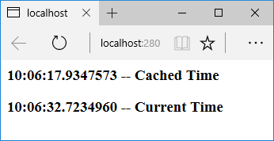

# Cache in-memory in ASP.NET Core

::: moniker range=">= aspnetcore-3.0"

By [Rick Anderson](https://twitter.com/RickAndMSFT), [John Luo](https://github.com/JunTaoLuo), and [Steve Smith](https://ardalis.com/)

[View or download sample code](https://github.com/dotnet/AspNetCore.Docs/tree/master/aspnetcore/performance/caching/memory/3.0sample) ([how to download](xref:index#how-to-download-a-sample))

## Caching basics

Caching can significantly improve the performance and scalability of an app by reducing the work required to generate content. Caching works best with data that changes infrequently **and** is expensive to generate. Caching makes a copy of data that can be returned much faster than from the source. Apps should be written and tested to **never** depend on cached data.

ASP.NET Core supports several different caches. The simplest cache is based on the [IMemoryCache](/dotnet/api/microsoft.extensions.caching.memory.imemorycache). `IMemoryCache` represents a cache stored in the memory of the web server. Apps running on a server farm (multiple servers) should ensure sessions are sticky when using the in-memory cache. Sticky sessions ensure that subsequent requests from a client all go to the same server. For example, Azure Web apps use [Application Request Routing](https://www.iis.net/learn/extensions/planning-for-arr) (ARR) to route all subsequent requests to the same server.

Non-sticky sessions in a web farm require a [distributed cache](distributed.md) to avoid cache consistency problems. For some apps, a distributed cache can support higher scale-out than an in-memory cache. Using a distributed cache offloads the cache memory to an external process.

The in-memory cache can store any object. The distributed cache interface is limited to `byte[]`. The in-memory and distributed cache store cache items as key-value pairs.

## System.Runtime.Caching/MemoryCache

<xref:System.Runtime.Caching>/<xref:System.Runtime.Caching.MemoryCache> ([NuGet package](https://www.nuget.org/packages/System.Runtime.Caching/)) can be used with:

* .NET Standard 2.0 or later.
* Any [.NET implementation](/dotnet/standard/net-standard#net-implementation-support) that targets .NET Standard 2.0 or later. For example, ASP.NET Core 2.0 or later.
* .NET Framework 4.5 or later.

[Microsoft.Extensions.Caching.Memory](https://www.nuget.org/packages/Microsoft.Extensions.Caching.Memory/)/`IMemoryCache` (described in this article) is recommended over `System.Runtime.Caching`/`MemoryCache` because it's better integrated into ASP.NET Core. For example, `IMemoryCache` works natively with ASP.NET Core [dependency injection](xref:fundamentals/dependency-injection).

Use `System.Runtime.Caching`/`MemoryCache` as a compatibility bridge when porting code from ASP.NET 4.x to ASP.NET Core.

## Cache guidelines

* Code should always have a fallback option to fetch data and **not** depend on a cached value being available.
* The cache uses a scarce resource, memory. Limit cache growth:
  * Do **not** use external input as cache keys.
  * Use expirations to limit cache growth.
  * [Use SetSize, Size, and SizeLimit to limit cache size](#use-setsize-size-and-sizelimit-to-limit-cache-size). The ASP.NET Core runtime does **not** limit cache size based on memory pressure. It's up to the developer to limit cache size.

## Use IMemoryCache

> [!WARNING]
> Using a *shared* memory cache from [Dependency Injection](xref:fundamentals/dependency-injection) and calling `SetSize`, `Size`, or `SizeLimit` to limit cache size can cause the app to fail. When a size limit is set on a cache, all entries must specify a size when being added. This can lead to issues since developers may not have full control on what uses the shared cache. For example, Entity Framework Core uses the shared cache and does not specify a size. If an app sets a cache size limit and uses EF Core, the app throws an `InvalidOperationException`.
> When using `SetSize`, `Size`, or `SizeLimit` to limit cache, create a cache singleton for caching. For more information and an example, see [Use SetSize, Size, and SizeLimit to limit cache size](#use-setsize-size-and-sizelimit-to-limit-cache-size).
> A shared cache is one shared by other frameworks or libraries. For example, EF Core uses the shared cache and does not specify a size. 

In-memory caching is a *service* that's referenced from an app using [Dependency Injection](xref:fundamentals/dependency-injection). Request the `IMemoryCache` instance in the constructor:

[!code-csharp]

The following code uses [TryGetValue](/dotnet/api/microsoft.extensions.caching.memory.imemorycache.trygetvalue?view=aspnetcore-2.0#Microsoft_Extensions_Caching_Memory_IMemoryCache_TryGetValue_System_Object_System_Object__) to check if a time is in the cache. If a time isn't cached, a new entry is created and added to the cache with [Set](/dotnet/api/microsoft.extensions.caching.memory.cacheextensions.set?view=aspnetcore-2.0#Microsoft_Extensions_Caching_Memory_CacheExtensions_Set__1_Microsoft_Extensions_Caching_Memory_IMemoryCache_System_Object___0_Microsoft_Extensions_Caching_Memory_MemoryCacheEntryOptions_). The `CacheKeys` class is part of the download sample.

[!code-csharp]

[!code-csharp]

The current time and the cached time are displayed:

[!code-cshtml]

The cached `DateTime` value remains in the cache while there are requests within the timeout period.

The following code uses [GetOrCreate](/dotnet/api/microsoft.extensions.caching.memory.cacheextensions.getorcreate#Microsoft_Extensions_Caching_Memory_CacheExtensions_GetOrCreate__1_Microsoft_Extensions_Caching_Memory_IMemoryCache_System_Object_System_Func_Microsoft_Extensions_Caching_Memory_ICacheEntry___0__) and [GetOrCreateAsync](/dotnet/api/microsoft.extensions.caching.memory.cacheextensions.getorcreateasync#Microsoft_Extensions_Caching_Memory_CacheExtensions_GetOrCreateAsync__1_Microsoft_Extensions_Caching_Memory_IMemoryCache_System_Object_System_Func_Microsoft_Extensions_Caching_Memory_ICacheEntry_System_Threading_Tasks_Task___0___) to cache data.

[!code-csharp]

The following code calls [Get](/dotnet/api/microsoft.extensions.caching.memory.cacheextensions.get#Microsoft_Extensions_Caching_Memory_CacheExtensions_Get__1_Microsoft_Extensions_Caching_Memory_IMemoryCache_System_Object_) to fetch the cached time:

[!code-csharp]

The following code gets or creates a cached item with absolute expiration:

[!code-csharp]

A cached item set with a sliding expiration only is at risk of becoming stale. If it's accessed more frequently than the sliding expiration interval, the item will never expire. Combine a sliding expiration with an absolute expiration to guarantee that the item expires once its absolute expiration time passes. The absolute expiration sets an upper bound to how long the item can be cached while still allowing the item to expire earlier if it isn't requested within the sliding expiration interval. When both absolute and sliding expiration are specified, the expirations are logically ORed. If either the sliding expiration interval *or* the absolute expiration time pass, the item is evicted from the cache.

The following code gets or creates a cached item with both sliding *and* absolute expiration:

[!code-csharp]

The preceding code guarantees the data will not be cached longer than the absolute time.

<xref:Microsoft.Extensions.Caching.Memory.CacheExtensions.GetOrCreate*>, <xref:Microsoft.Extensions.Caching.Memory.CacheExtensions.GetOrCreateAsync*>, and <xref:Microsoft.Extensions.Caching.Memory.CacheExtensions.Get*> are extension methods in the <xref:Microsoft.Extensions.Caching.Memory.CacheExtensions> class. These methods extend the capability of <xref:Microsoft.Extensions.Caching.Memory.IMemoryCache>.

## MemoryCacheEntryOptions

The following sample:

* Sets a sliding expiration time. Requests that access this cached item will reset the sliding expiration clock.
* Sets the cache priority to [CacheItemPriority.NeverRemove](xref:Microsoft.Extensions.Caching.Memory.CacheItemPriority.NeverRemove).
* Sets a [PostEvictionDelegate](/dotnet/api/microsoft.extensions.caching.memory.postevictiondelegate) that will be called after the entry is evicted from the cache. The callback is run on a different thread from the code that removes the item from the cache.

[!code-csharp]

## Use SetSize, Size, and SizeLimit to limit cache size

A `MemoryCache` instance may optionally specify and enforce a size limit. The cache size limit does not have a defined unit of measure because the cache has no mechanism to measure the size of entries. If the cache size limit is set, all entries must specify size. The ASP.NET Core runtime does not limit cache size based on memory pressure. It's up to the developer to limit cache size. The size specified is in units the developer chooses.

For example:

* If the web app was primarily caching strings, each cache entry size could be the string length.
* The app could specify the size of all entries as 1, and the size limit is the count of entries.

If <xref:Microsoft.Extensions.Caching.Memory.MemoryCacheOptions.SizeLimit> isn't set, the cache grows without bound. The ASP.NET Core runtime doesn't trim the cache when system memory is low. Apps must be architected to:

* Limit cache growth.
* Call <xref:Microsoft.Extensions.Caching.Memory.MemoryCache.Compact*> or <xref:Microsoft.Extensions.Caching.Memory.MemoryCache.Remove*> when available memory is limited:

The following code creates a unitless fixed size <xref:Microsoft.Extensions.Caching.Memory.MemoryCache> accessible by [dependency injection](xref:fundamentals/dependency-injection):

[!code-csharp]

`SizeLimit` does not have units. Cached entries must specify size in whatever units they deem most appropriate if the cache size limit has been set. All users of a cache instance should use the same unit system. An entry will not be cached if the sum of the cached entry sizes exceeds the value specified by `SizeLimit`. If no cache size limit is set, the cache size set on the entry will be ignored.

The following code registers `MyMemoryCache` with the [dependency injection](xref:fundamentals/dependency-injection) container.

[!code-csharp]

`MyMemoryCache` is created as an independent memory cache for components that are aware of this size limited cache and know how to set cache entry size appropriately.

The following code uses `MyMemoryCache`:

[!code-csharp]

The size of the cache entry can be set by <xref:Microsoft.Extensions.Caching.Memory.MemoryCacheEntryOptions.Size> or the <xref:Microsoft.Extensions.Caching.Memory.MemoryCacheEntryExtensions.SetSize*> extension methods:

[!code-csharp]

### MemoryCache.Compact

`MemoryCache.Compact` attempts to remove the specified percentage of the cache in the following order:

* All expired items.
* Items by priority. Lowest priority items are removed first.
* Least recently used objects.
* Items with the earliest absolute expiration.
* Items with the earliest sliding expiration.

Pinned items with priority <xref:Microsoft.Extensions.Caching.Memory.CacheItemPriority.NeverRemove> are never removed. The following code removes a cache item and calls `Compact`:

[!code-csharp]

See [Compact source on GitHub](https://github.com/dotnet/extensions/blob/v3.0.0-preview8.19405.4/src/Caching/Memory/src/MemoryCache.cs#L382-L393) for more information.

## Cache dependencies

The following sample shows how to expire a cache entry if a dependent entry expires. A <xref:Microsoft.Extensions.Primitives.CancellationChangeToken> is added to the cached item. When `Cancel` is called on the `CancellationTokenSource`, both cache entries are evicted.

[!code-csharp]

Using a <xref:System.Threading.CancellationTokenSource> allows multiple cache entries to be evicted as a group. With the `using` pattern in the code above, cache entries created inside the `using` block will inherit triggers and expiration settings.

## Additional notes

* Expiration doesn't happen in the background. There is no timer that actively scans the cache for expired items. Any activity on the cache (`Get`, `Set`, `Remove`) can trigger a background scan for expired items. A timer on the `CancellationTokenSource` (<xref:System.Threading.CancellationTokenSource.CancelAfter*>) also removes the entry and trigger a scan for expired items. The following example uses [CancellationTokenSource(TimeSpan)](/dotnet/api/system.threading.cancellationtokensource.-ctor) for the registered token. When this token fires it removes the entry immediately and fires the eviction callbacks:

[!code-csharp]

* When using a callback to repopulate a cache item:

  * Multiple requests can find the cached key value empty because the callback hasn't completed.
  * This can result in several threads repopulating the cached item.

* When one cache entry is used to create another, the child copies the parent entry's expiration tokens and time-based expiration settings. The child isn't expired by manual removal or updating of the parent entry.

* Use <xref:Microsoft.Extensions.Caching.Memory.ICacheEntry.PostEvictionCallbacks> to set the callbacks that will be fired after the cache entry is evicted from the cache.
* For most apps, `IMemoryCache` is enabled. For example, calling `AddMvc`, `AddControllersWithViews`, `AddRazorPages`, `AddMvcCore().AddRazorViewEngine`, and many other `Add{Service}` methods in `ConfigureServices`, enables `IMemoryCache`. For apps that are not calling one of the preceding `Add{Service}` methods, it may be necessary to call <xref:Microsoft.Extensions.DependencyInjection.MemoryCacheServiceCollectionExtensions.AddMemoryCache*> in `ConfigureServices`.

## Background cache update

Use a [background service](xref:fundamentals/host/hosted-services) such as <xref:Microsoft.Extensions.Hosting.IHostedService> to update the cache. The background service can recompute the entries and then assign them to the cache only when they’re ready.

## Additional resources

* <xref:performance/caching/distributed>
* <xref:fundamentals/change-tokens>
* <xref:performance/caching/response>
* <xref:performance/caching/middleware>
* <xref:mvc/views/tag-helpers/builtin-th/cache-tag-helper>
* <xref:mvc/views/tag-helpers/builtin-th/distributed-cache-tag-helper>

::: moniker-end

::: moniker range="< aspnetcore-3.0"

<!-- This is the 2.1 version -->
By [Rick Anderson](https://twitter.com/RickAndMSFT), [John Luo](https://github.com/JunTaoLuo), and [Steve Smith](https://ardalis.com/)

[View or download sample code](https://github.com/dotnet/AspNetCore.Docs/tree/master/aspnetcore/performance/caching/memory/sample) ([how to download](xref:index#how-to-download-a-sample))

## Caching basics

Caching can significantly improve the performance and scalability of an app by reducing the work required to generate content. Caching works best with data that changes infrequently. Caching makes a copy of data that can be returned much faster than from the original source. Code should be written and tested to **never** depend on cached data.

ASP.NET Core supports several different caches. The simplest cache is based on the [IMemoryCache](/dotnet/api/microsoft.extensions.caching.memory.imemorycache), which represents a cache stored in the memory of the web server. Apps that run on a server farm (multiple servers) should ensure that sessions are sticky when using the in-memory cache. Sticky sessions ensure that later requests from a client all go to the same server. For example, Azure Web apps use [Application Request Routing](https://www.iis.net/learn/extensions/planning-for-arr) (ARR) to route all requests from a user agent to the same server.

Non-sticky sessions in a web farm require a [distributed cache](distributed.md) to avoid cache consistency problems. For some apps, a distributed cache can support higher scale-out than an in-memory cache. Using a distributed cache offloads the cache memory to an external process.

The in-memory cache can store any object. The distributed cache interface is limited to `byte[]`. The in-memory and distributed cache store cache items as key-value pairs.

## System.Runtime.Caching/MemoryCache

<xref:System.Runtime.Caching>/<xref:System.Runtime.Caching.MemoryCache> ([NuGet package](https://www.nuget.org/packages/System.Runtime.Caching/)) can be used with:

* .NET Standard 2.0 or later.
* Any [.NET implementation](/dotnet/standard/net-standard#net-implementation-support) that targets .NET Standard 2.0 or later. For example, ASP.NET Core 2.0 or later.
* .NET Framework 4.5 or later.

[Microsoft.Extensions.Caching.Memory](https://www.nuget.org/packages/Microsoft.Extensions.Caching.Memory/)/`IMemoryCache` (described in this article) is recommended over `System.Runtime.Caching`/`MemoryCache` because it's better integrated into ASP.NET Core. For example, `IMemoryCache` works natively with ASP.NET Core [dependency injection](xref:fundamentals/dependency-injection).

Use `System.Runtime.Caching`/`MemoryCache` as a compatibility bridge when porting code from ASP.NET 4.x to ASP.NET Core.

## Cache guidelines

* Code should always have a fallback option to fetch data and **not** depend on a cached value being available.
* The cache uses a scarce resource, memory. Limit cache growth:
  * Do **not** use external input as cache keys.
  * Use expirations to limit cache growth.
  * [Use SetSize, Size, and SizeLimit to limit cache size](#use-setsize-size-and-sizelimit-to-limit-cache-size). The ASP.NET Core runtime does not limit cache size based on memory pressure. It's up to the developer to limit cache size.

## Using IMemoryCache

> [!WARNING]
> Using a *shared* memory cache from [Dependency Injection](xref:fundamentals/dependency-injection) and calling `SetSize`, `Size`, or `SizeLimit` to limit cache size can cause the app to fail. When a size limit is set on a cache, all entries must specify a size when being added. This can lead to issues since developers may not have full control on what uses the shared cache. For example, Entity Framework Core uses the shared cache and does not specify a size. If an app sets a cache size limit and uses EF Core, the app throws an `InvalidOperationException`.
> When using `SetSize`, `Size`, or `SizeLimit` to limit cache, create a cache singleton for caching. For more information and an example, see [Use SetSize, Size, and SizeLimit to limit cache size](#use-setsize-size-and-sizelimit-to-limit-cache-size).

In-memory caching is a *service* that's referenced from your app using [Dependency Injection](../../fundamentals/dependency-injection.md). Call `AddMemoryCache` in `ConfigureServices`:

[!code-csharp]

Request the `IMemoryCache` instance in the constructor:

[!code-csharp]

`IMemoryCache` requires NuGet package [Microsoft.Extensions.Caching.Memory](https://www.nuget.org/packages/Microsoft.Extensions.Caching.Memory/), which is available in the [Microsoft.AspNetCore.App metapackage](xref:fundamentals/metapackage-app).

The following code uses [TryGetValue](/dotnet/api/microsoft.extensions.caching.memory.imemorycache.trygetvalue?view=aspnetcore-2.0#Microsoft_Extensions_Caching_Memory_IMemoryCache_TryGetValue_System_Object_System_Object__) to check if a time is in the cache. If a time isn't cached, a new entry is created and added to the cache with [Set](/dotnet/api/microsoft.extensions.caching.memory.cacheextensions.set?view=aspnetcore-2.0#Microsoft_Extensions_Caching_Memory_CacheExtensions_Set__1_Microsoft_Extensions_Caching_Memory_IMemoryCache_System_Object___0_Microsoft_Extensions_Caching_Memory_MemoryCacheEntryOptions_).

[!code-csharp]

[!code-csharp]

The current time and the cached time are displayed:

[!code-cshtml]

The cached `DateTime` value remains in the cache while there are requests within the timeout period. The following image shows the current time and an older time retrieved from the cache:

The following code uses [GetOrCreate](/dotnet/api/microsoft.extensions.caching.memory.cacheextensions.getorcreate#Microsoft_Extensions_Caching_Memory_CacheExtensions_GetOrCreate__1_Microsoft_Extensions_Caching_Memory_IMemoryCache_System_Object_System_Func_Microsoft_Extensions_Caching_Memory_ICacheEntry___0__) and [GetOrCreateAsync](/dotnet/api/microsoft.extensions.caching.memory.cacheextensions.getorcreateasync#Microsoft_Extensions_Caching_Memory_CacheExtensions_GetOrCreateAsync__1_Microsoft_Extensions_Caching_Memory_IMemoryCache_System_Object_System_Func_Microsoft_Extensions_Caching_Memory_ICacheEntry_System_Threading_Tasks_Task___0___) to cache data.

[!code-csharp]

The following code calls [Get](/dotnet/api/microsoft.extensions.caching.memory.cacheextensions.get#Microsoft_Extensions_Caching_Memory_CacheExtensions_Get__1_Microsoft_Extensions_Caching_Memory_IMemoryCache_System_Object_) to fetch the cached time:

[!code-csharp]

<xref:Microsoft.Extensions.Caching.Memory.CacheExtensions.GetOrCreate*> , <xref:Microsoft.Extensions.Caching.Memory.CacheExtensions.GetOrCreateAsync*>, and [Get](/dotnet/api/microsoft.extensions.caching.memory.cacheextensions.get#Microsoft_Extensions_Caching_Memory_CacheExtensions_Get__1_Microsoft_Extensions_Caching_Memory_IMemoryCache_System_Object_) are extension methods part of the [CacheExtensions](/dotnet/api/microsoft.extensions.caching.memory.cacheextensions) class that extends the capability of <xref:Microsoft.Extensions.Caching.Memory.IMemoryCache>. See [IMemoryCache methods](/dotnet/api/microsoft.extensions.caching.memory.imemorycache) and [CacheExtensions methods](/dotnet/api/microsoft.extensions.caching.memory.cacheextensions) for a description of other cache methods.

## MemoryCacheEntryOptions

The following sample:

* Sets a sliding expiration time. Requests that access this cached item will reset the sliding expiration clock.
* Sets the cache priority to `CacheItemPriority.NeverRemove`.
* Sets a [PostEvictionDelegate](/dotnet/api/microsoft.extensions.caching.memory.postevictiondelegate) that will be called after the entry is evicted from the cache. The callback is run on a different thread from the code that removes the item from the cache.

[!code-csharp]

## Use SetSize, Size, and SizeLimit to limit cache size

A `MemoryCache` instance may optionally specify and enforce a size limit. The cache size limit does not have a defined unit of measure because the cache has no mechanism to measure the size of entries. If the cache size limit is set, all entries must specify size. The ASP.NET Core runtime does not limit cache size based on memory pressure. It's up to the developer to limit cache size. The size specified is in units the developer chooses.

For example:

* If the web app was primarily caching strings, each cache entry size could be the string length.
* The app could specify the size of all entries as 1, and the size limit is the count of entries.

If <xref:Microsoft.Extensions.Caching.Memory.MemoryCacheOptions.SizeLimit> is not set, the cache grows without bound. The ASP.NET Core runtime does not trim the cache when system memory is low. Apps much be architected to:

* Limit cache growth.
* Call <xref:Microsoft.Extensions.Caching.Memory.MemoryCache.Compact*> or <xref:Microsoft.Extensions.Caching.Memory.MemoryCache.Remove*> when available memory is limited:

The following code creates a unitless fixed size <xref:Microsoft.Extensions.Caching.Memory.MemoryCache> accessible by [dependency injection](xref:fundamentals/dependency-injection):

[!code-csharp]

`SizeLimit` does not have units. Cached entries must specify size in whatever units they deem most appropriate if the cache size limit has been set. All users of a cache instance should use the same unit system. An entry will not be cached if the sum of the cached entry sizes exceeds the value specified by `SizeLimit`. If no cache size limit is set, the cache size set on the entry will be ignored.

The following code registers `MyMemoryCache` with the [dependency injection](xref:fundamentals/dependency-injection) container.

[!code-csharp]

`MyMemoryCache` is created as an independent memory cache for components that are aware of this size limited cache and know how to set cache entry size appropriately.

The following code uses `MyMemoryCache`:

[!code-csharp]

The size of the cache entry can be set by [Size](/dotnet/api/microsoft.extensions.caching.memory.memorycacheentryoptions.size?view=aspnetcore-2.1#Microsoft_Extensions_Caching_Memory_MemoryCacheEntryOptions_Size) or the [SetSize](/dotnet/api/microsoft.extensions.caching.memory.memorycacheentryextensions.setsize?view=aspnetcore-2.0#Microsoft_Extensions_Caching_Memory_MemoryCacheEntryExtensions_SetSize_Microsoft_Extensions_Caching_Memory_MemoryCacheEntryOptions_System_Int64_) extension method:

[!code-csharp]

### MemoryCache.Compact

`MemoryCache.Compact` attempts to remove the specified percentage of the cache in the following order:

* All expired items.
* Items by priority. Lowest priority items are removed first.
* Least recently used objects.
* Items with the earliest absolute expiration.
* Items with the earliest sliding expiration.

Pinned items with priority <xref:Microsoft.Extensions.Caching.Memory.CacheItemPriority.NeverRemove> are never removed.

[!code-csharp]

See [Compact source on GitHub](https://github.com/dotnet/extensions/blob/v3.0.0-preview8.19405.4/src/Caching/Memory/src/MemoryCache.cs#L382-L393) for more information.

## Cache dependencies

The following sample shows how to expire a cache entry if a dependent entry expires. A <xref:Microsoft.Extensions.Primitives.CancellationChangeToken> is added to the cached item. When `Cancel` is called on the `CancellationTokenSource`, both cache entries are evicted.

[!code-csharp]

Using a `CancellationTokenSource` allows multiple cache entries to be evicted as a group. With the `using` pattern in the code above, cache entries created inside the `using` block will inherit triggers and expiration settings.

## Additional notes

* When using a callback to repopulate a cache item:

  * Multiple requests can find the cached key value empty because the callback hasn't completed.
  * This can result in several threads repopulating the cached item.

* When one cache entry is used to create another, the child copies the parent entry's expiration tokens and time-based expiration settings. The child isn't expired by manual removal or updating of the parent entry.

* Use [PostEvictionCallbacks](/dotnet/api/microsoft.extensions.caching.memory.icacheentry.postevictioncallbacks#Microsoft_Extensions_Caching_Memory_ICacheEntry_PostEvictionCallbacks) to set the callbacks that will be fired after the cache entry is evicted from the cache.

## Background cache update

Use a [background service](xref:fundamentals/host/hosted-services) such as <xref:Microsoft.Extensions.Hosting.IHostedService> to update the cache. The background service can recompute the entries and then assign them to the cache only when they’re ready.

## Additional resources

* <xref:performance/caching/distributed>
* <xref:fundamentals/change-tokens>
* <xref:performance/caching/response>
* <xref:performance/caching/middleware>
* <xref:mvc/views/tag-helpers/builtin-th/cache-tag-helper>
* <xref:mvc/views/tag-helpers/builtin-th/distributed-cache-tag-helper>

::: moniker-end
