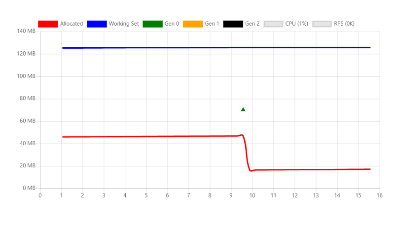
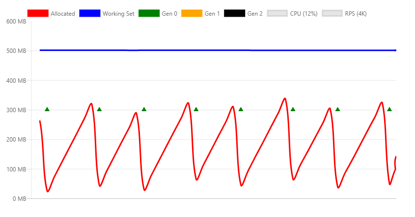
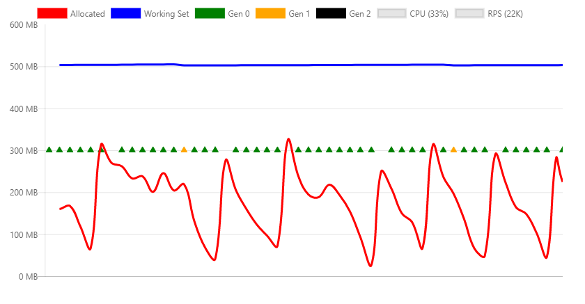
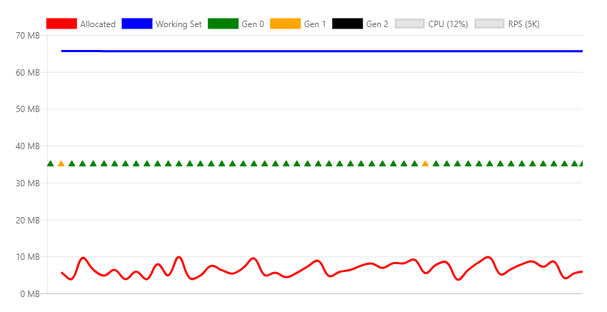
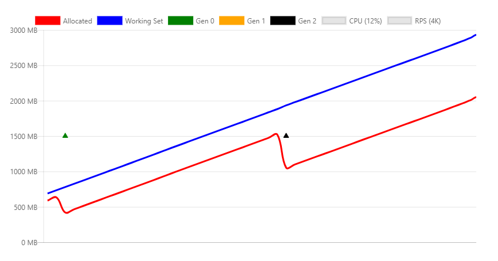
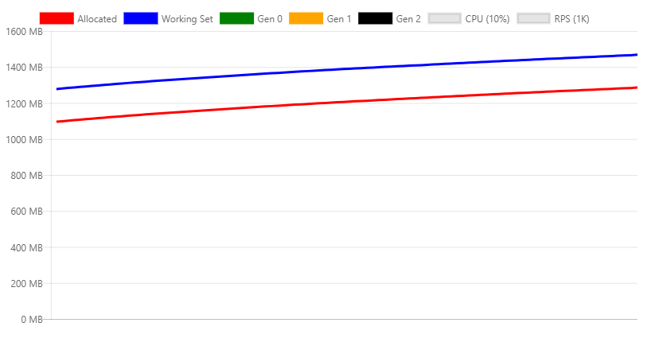
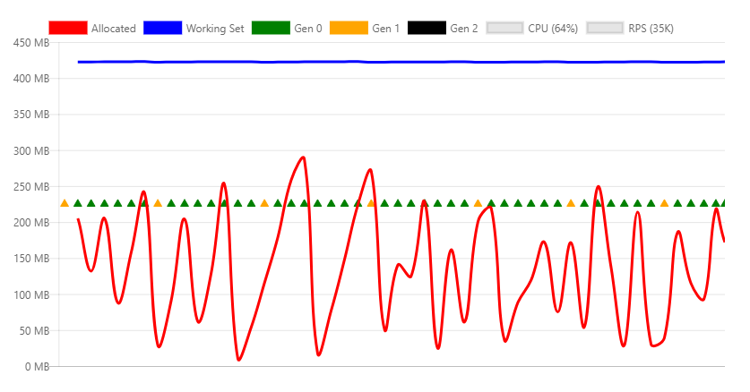
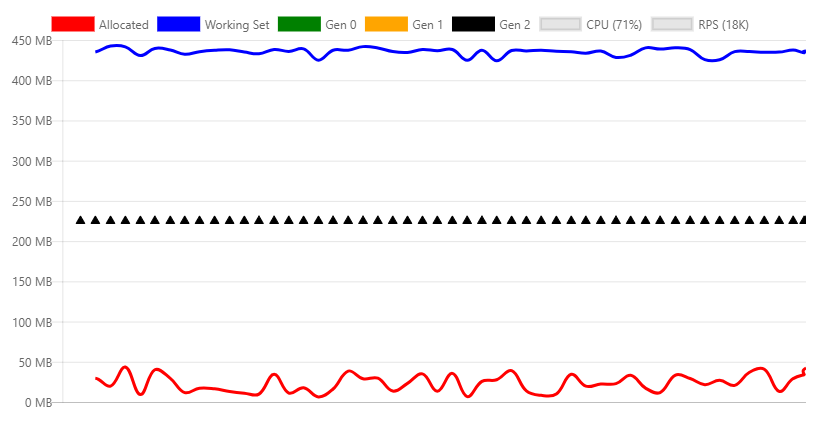
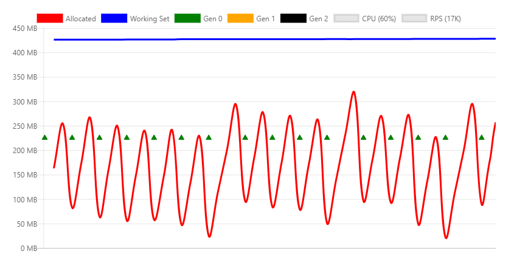
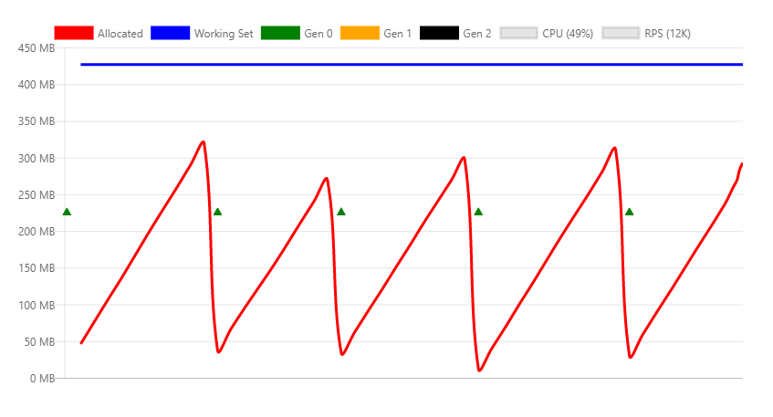

# Memory management and garbage collection (GC) in ASP.NET Core

https://docs.microsoft.com/en-us/visualstudio/profiling/memory-usage-without-debugging2

By [Sébastien Ros](https://github.com/sebastienros)

Memory management is complex, even in a managed framework like .NET. Analyzing and understanding memory issues can be challenging.

This article contains information on the resolution of multiple "Garbage collector not working" issues. Most of the problems are a result of misunderstanding of how memory consumption and release works or how memory is measured.

<!-- >
To help .NET developers better understand their applications, we need to understand how memory management works in ASP.NET Core, how to detect memory related issues, and how to prevent common mistakes.
-->

## How garbage collection (GC) works in ASP.NET Core

The GC allocates heap segments where each segment is a contiguous range of memory. Objects placed in the heap are categorized into one of 3 generations: 0, 1, or 2. The generation determines the frequency the GC attempts to release memory on managed objects that are no longer referenced by the app. Lower numbered generations are GC'd more frequently.

Objects are moved from one generation to another based on their lifetime. As objects live longer they are moved into a higher generation. As mentioned previously, higher generations are GC'd less often. Short term lived objects always remain in generation 0. For example, objects that are referenced during the life of a web request are short lived. Application level singletons generally move to generation 1 and eventually 2.

When an ASP.NET Core app starts, the GC:

* Reserves some memory for the initial heap segments.
* Commits a small portion of memory when the runtime is loaded.

The preceding memory allocations are done for performance reasons. The performance benefit comes from heap segments in contiguous memory.

**ASP.NET Core apps allocate a significant amount of memory at startup for better performance .**

### Call GC.Collect

Calling [GC.Collect](xref:System.GC.Collect*) explicitly:

* Should **not** be done by ASP.NET Core apps.
* Is useful when investigating memory leaks.
* Verifies the GC has removed all dangling objects from memory so memory can be  measured.

## Analyzing the memory usage of an app

Dedicated tools can help analyzing memory usage:

- Counting object references
- Measuring how much impact the GC has on CPU usage
- Measuring memory space used for each generation

Use the following tools to analyze memory usage:

* [Analyze memory usage without the Visual Studio debugger](https://docs.microsoft.com/en-us/visualstudio/profiling/memory-usage-without-debugging2)
* [Profile memory usage in Visual Studio](https://docs.microsoft.com/en-us/visualstudio/profiling/memory-usage)

### Detecting memory issues

**Task Manager** can be used to get an idea of how much memory an ASP.NET app is using. The **Task Manager** memory value:

* Represents the amount of memory that is used by the ASP.NET process.
* Includes the app's living objects and other memory consumers such as native memory usage.

If the **Task Manager** memory value increases indefinitely and never flattens out, the apps has a memory leak. The following sections demonstrate and explain several memory usage patterns.

## Sample display memory usage app

The [MemoryLeak sample app](https://github.com/sebastienros/memoryleak) is available on GitHub. The MemoryLeak app contains:

* A diagnostic controller that gathers real-tine memory and GC data for the app.
* An Index page that displays the memory and GC data. The Index page is refreshed every second.
* An API controller that provides various memory load patterns.

Run MemoryLeak. Allocated memory slowly increases until a GC occurs. Memory increases because the tool allocates custom object to capture data. The following image shows the MemoryLeak Index page when a Gen 0 GC occurs. The chart shows 0 RPS (Requests per second) because no API endpoints from the API controller have been called.



The chart displays two values for the memory usage:

- Allocated: the amount of memory occupied by managed objects
- Working set: the total physical memory (RAM) used by the process. The working set shown is the same value Task Manager can display.

### Transient objects

The following API creates a 10KB `String` instance and returns it to the client. On each request a new object is allocated in memory and written on the response. Strings are stored as UTF-16 characters in .NET so each char takes two bytes in memory.

```csharp
[HttpGet("bigstring")]
public ActionResult<string> GetBigString()
{
    return new String('x', 10 * 1024);
}
```

The following graph is generated with a relatively small load in to show how memory allocations are impacted by the GC.



The preceding chart shows:

* 5K RPS (Requests per second).
* Generation 0 GC collections occur about every two seconds once the allocations get above 300 MB.
* The working set is constant at approximately 500 MB.
* CPU is 12%.
* The memory consumption and release (through GC) is stable.

The following chart is taken at the max throughput that can be handled by the machine.



The preceding chart shows:

* 22 RPS
* Generation 0 GC collections occur several times per second.
* Generation 1 collections are triggered because the app allocated significantly more memory per second.
* The working set is constant at approximately 500 MB.
* CPU is 33%.
* The memory consumption and release (through GC) is stable.
* The CPU is not over-utilized, therefor the garbage collection can keep up with a high number of allocations.

#### Workstation GC vs. Server GC

The .NET Garbage Collector has two different modes:

*  **Workstation GC** : Optimized for the desktop.
*  **Server GC**. The default GC for ASP.NET Core apps. Optimized for the server.

The GC mode can be set explicitly in the project file or in the *runtimeconfig.json* file of the published app. The following markup shows setting `ServerGarbageCollection` in the project file:

```xml
<PropertyGroup>
  <ServerGarbageCollection>true</ServerGarbageCollection>
</PropertyGroup>
```

Changing `ServerGarbageCollection` in the project file requires the app to be rebuilt.

**Note:** [Server garbage collection is **not** available on machines with a single core](https://msdn.microsoft.com/en-us/library/system.runtime.gcsettings.isservergc(v=vs.110).aspx).

The following image shows the memory profile under a 5K RPS using the Workstation GC.



The differences between this chart and the server version are significant:

- The working set drops from 500MB to 70MB.
- The GC does generation 0 collections multiple times per second instead of every two seconds.
- The GC threshold went from 300MB to 10MB.

On a typical web server environment, CPU usage is more important than memory, therefore the Server GC is better. If memory utilization is high and CPU usage is relatively low, the Workstation GC might be more performant. For example, high density hosting several web apps where memory is scarce.

#### Persistent object references

The GC cannot free objects that are referenced. Objects that are referenced but no longer needed result in a memory leak. If the app frequently allocates objects and fails to free them after they are no longer needed, memory usage will increase over time.

The following API creates a 10KB `String` instance and returns it to the client. The difference with the first example is that this instance is referenced by a static member, which means it's never available for collection.

```csharp
private static ConcurrentBag<string> _staticStrings = new ConcurrentBag<string>();

[HttpGet("staticstring")]
public ActionResult<string> GetStaticString()
{
    var bigString = new String('x', 10 * 1024);
    _staticStrings.Add(bigString);
    return bigString;
}
```

The preceding code:

* Is an example of a typical memory leak.
* With frequent calls, causes app memory to increases until the process crashes with an `OutOfMemory` exception.



In the preceding image:

* Load testing the `/api/staticstring` endpoint causes a linear increase in memory.
* The GC tries to free memory as the memory pressure grows, by calling a generation 2 collection.
* The GC cannot free the leaked memory. Allocated and working set increase with time.

Some scenarios, such as caching, require object references to be held until memory pressure forces them to be released. The <xref:System.WeakReference> class can be used for this type of caching code. A `WeakReference` object is collected under memory pressures. The default implementation of <xref:Microsoft.Extensions.Caching.Memory.IMemoryCache> uses `WeakReference`.

#### Native memory

Some .NET Core objects rely on native memory. Native memory can **not** be collected by the GC. The .NET object using native memory must free it using native code.

.NET provides the <xref:System.IDisposable> interface to let developers release native memory. Even if <xref:System.IDisposable.Dispose*> is not called, correctly implemented classes call `Dispose` when the [finalizer](https://docs.microsoft.com/en-us/dotnet/csharp/programming-guide/classes-and-structs/destructors) runs.

Consider the following code:

```csharp
[HttpGet("fileprovider")]
public void GetFileProvider()
{
    var fp = new PhysicalFileProvider(TempPath);
    fp.Watch("*.*");
}
```

[PhysicaFileProvider](https://docs.microsoft.com/en-us/dotnet/api/microsoft.extensions.fileproviders.physicalfileprovider?view=dotnet-plat-ext-3.0) is a managed class, so any instance will be collected at the end of the request.

Here is the resulting memory profile while invoking this API continuously.



This chart shows an obvious issue with the implementation of this class, as it keeps increasing memory usage. This is a known problem that is being tracked in [this issue](https://github.com/aspnet/Home/issues/3110).

The same leak could be happen in user code, by one of the following:

* Not releasing the class correctly.
* Forgetting to invoke the `Dispose`method of the dependent objects which should be disposed.

#### Large objects heap

Frequent memory allocation/free cycles can fragment memory, especially when allocating large chunks of memory. Objects are allocated in contiguous blocks of memory. To mitigate fragmentation, when the GC frees memory, it will try to defragment it. This process is called **compaction**. Compaction involves moving objects. Moving big objects imposes a performance penalty. For this reason the GC creates a special memory zone for  _large_ objects, called the [large object heap](https://docs.microsoft.com/en-us/dotnet/standard/garbage-collection/large-object-heap) (LOH). Object that are greater than 85,000 bytes (approximately 83 KB) are:

* Placed on the LOH.
* Not compacted.
* Eventually released during generation 2 collections.

When the LOH is full, the GC will trigger an automatic generation 2 collection. Generation 2 collections:

* Are inherently slow on their own.
* Additionally incur the cost of triggering a collection on all other generations.

The following API that illustrates this behavior:

```csharp
[HttpGet("loh/{size=85000}")]
public int GetLOH1(int size)
{
    return new byte[size].Length;
}
```

The following chart shows the memory profile of calling the `/api/loh/84975` endpoint, under maximum load:



The following chart shows the memory profile of calling the `/api/loh/84976` endpoint, allocating *just one more byte*:



Note: The `byte[]` structure has some overhead on top of the actual bytes serialization.

Comparing the two preceding charts:

* The working set is similar for both scenarios, about 450 MB. But what we notice is that instead of having mostly generation 0 collections, we instead get generation 2 collections, which require more CPU time and directly impacts the throughput which decreases from 35K to 18K RPS, **almost halving it**.

This shows that very large objects should be avoided. As an example the **Response Caching** middleware in ASP.NET Core split the cache entries in block of a size lower than 85,000 bytes to handle this scenario.

Here are some links to the specific implementation handling this behavior 
- https://github.com/aspnet/ResponseCaching/blob/c1cb7576a0b86e32aec990c22df29c780af29ca5/src/Microsoft.AspNetCore.ResponseCaching/Streams/StreamUtilities.cs#L16
- https://github.com/aspnet/ResponseCaching/blob/c1cb7576a0b86e32aec990c22df29c780af29ca5/src/Microsoft.AspNetCore.ResponseCaching/Internal/MemoryResponseCache.cs#L55

For more information, see the [large object heap](https://docs.microsoft.com/en-us/dotnet/standard/garbage-collection/large-object-heap).

#### HttpClient

Not specifically a memory leak issue, more of a resource leak one, but this has been seen enough times in user code that it deserved to be mentioned here.

Seasoned .NET developer are used to disposing objects that implement `IDisposable`. Not doing so might result is leaked memory (see previous examples), or other native resources like database connections and file handlers.

But `HttpClient`, even though it implements `IDisposable`, should not be used then disposed on every invocation but reused instead.

Here is an API endpoint that creates and disposes a new instance on every request.

```csharp
[HttpGet("httpclient1")]
public async Task<int> GetHttpClient1(string url)
{
    using (var httpClient = new HttpClient())
    {
        var result = await httpClient.GetAsync(url);
        return (int)result.StatusCode;
    }
}
```

While putting some load on this endpoint, some error messages are logged:

```
fail: Microsoft.AspNetCore.Server.Kestrel[13]
      Connection id "0HLG70PBE1CR1", Request id "0HLG70PBE1CR1:00000031": An unhandled exception was thrown by the application.
System.Net.Http.HttpRequestException: Only one usage of each socket address (protocol/network address/port) is normally permitted ---> System.Net.Sockets.SocketException: Only one usage of each socket address (protocol/network address/port) is normally permitted
   at System.Net.Http.ConnectHelper.ConnectAsync(String host, Int32 port, CancellationToken cancellationToken)
```

What happens is that even though the `HttpClient` instances are disposed, the actual network connection will take some time to be released by the operating system. By continuously creating new connections we finally hit _ports exhaustion_ as each client connection requires its own client port.

The solution is to actually reuse the same `HttpClient` instance like this:

```csharp
private static readonly HttpClient _httpClient = new HttpClient();

[HttpGet("httpclient2")]
public async Task<int> GetHttpClient2(string url)
{
    var result = await _httpClient.GetAsync(url);
    return (int)result.StatusCode;
}
```

This instance will eventually get released when the application stops.

This shows that it's not because a resource is disposable that it needs to be disposed right away.

> Note: there are better ways to handle the lifetime of an `HttpClient` instance since ASP.NET Core 2.1 https://blogs.msdn.microsoft.com/webdev/2018/02/28/asp-net-core-2-1-preview1-introducing-httpclient-factory/

#### Object pooling

In the previous example we saw how the `HttpClient` instance can be made static and reused by all requests to prevent resource exhaustion.

A similar pattern is to use object pooling. The idea is that if an object is expensive to create, then we should reuse its instances to prevent resource allocations. A pool is a collection of pre-initialized objects that can be reserved and released across threads. Pools can define allocation rules like hard limits, predefined sizes, or growth rate.

The Nuget package `Microsoft.Extensions.ObjectPool` contains classes that help to manage such pools.

To show how beneficial it can be, let's use an API endpoint that instantiates a `byte` buffer that is filled with random numbers on each request:

```csharp
        [HttpGet("array/{size}")]
        public byte[] GetArray(int size)
        {
            var random = new Random();
            var array = new byte[size];
            random.NextBytes(array);

            return array;
        }
```

With some load we can see generation 0 collections happening around every second.



To optimize this code we can pool the `byte` buffer by using the `ArrayPool<>` class. A static instance is reused across requests. 

The special part of this scenario is that we are returning a pooled object from the API, which means we lose control of it as soon as we return from the method, and we can't release it. To solve that we need to encapsulate the pooled array in a disposable object and then register this special object with `HttpContext.Response.RegisterForDispose()`. This method will take care of calling `Dispose`on the target object so that it's only released when the HTTP request is done.

```csharp
private static ArrayPool<byte> _arrayPool = ArrayPool<byte>.Create();

private class PooledArray : IDisposable
{
    public byte[] Array { get; private set; }

    public PooledArray(int size)
    {
        Array = _arrayPool.Rent(size);
    }

    public void Dispose()
    {
        _arrayPool.Return(Array);
    }
}

[HttpGet("pooledarray/{size}")]
public byte[] GetPooledArray(int size)
{
    var pooledArray = new PooledArray(size);

    var random = new Random();
    random.NextBytes(pooledArray.Array);

    HttpContext.Response.RegisterForDispose(pooledArray);

    return pooledArray.Array;
}
```

Applying the same load as the non-pooled version results in the following chart:



You can see that the main difference is allocated bytes, and as a consequence much fewer generation 0 collections.

## Conclusion

Understanding how garbage collection works together with ASP.NET Core can be helpful to investigate memory pressure issues, and ultimately the performance of an application. 

Applying the practices explained in this article should prevent applications from showing signs of memory leaks.

### Reference Articles

To go further in the understanding of how memory management works in .NET, here are some recommended articles.

[Garbage Collection](https://docs.microsoft.com/en-us/dotnet/standard/garbage-collection/)

[Understanding different GC modes with Concurrency Visualizer](https://blogs.msdn.microsoft.com/seteplia/2017/01/05/understanding-different-gc-modes-with-concurrency-visualizer/)
