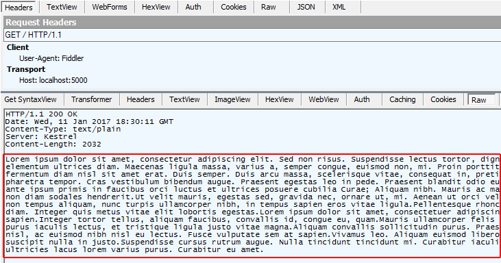
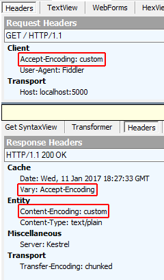
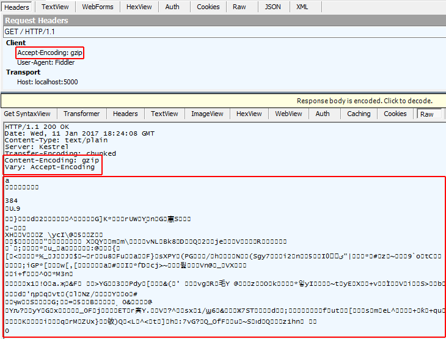

# Response compression in ASP.NET Core

::: moniker range=">= aspnetcore-3.0"

Network bandwidth is a limited resource. Reducing the size of the response usually increases the responsiveness of an app, often dramatically. One way to reduce payload sizes is to compress an app's responses.

[View or download sample code](https://github.com/dotnet/AspNetCore.Docs/tree/master/aspnetcore/performance/response-compression/samples) ([how to download](xref:index#how-to-download-a-sample))

## When to use Response Compression Middleware

Use server-based response compression technologies in IIS, Apache, or Nginx. The performance of the middleware probably won't match that of the server modules. [HTTP.sys server](xref:fundamentals/servers/httpsys) server and [Kestrel](xref:fundamentals/servers/kestrel) server don't currently offer built-in compression support.

Use Response Compression Middleware when you're:

* Unable to use the following server-based compression technologies:
  * [IIS Dynamic Compression module](https://www.iis.net/overview/reliability/dynamiccachingandcompression)
  * [Apache mod_deflate module](https://httpd.apache.org/docs/current/mod/mod_deflate.html)
  * [Nginx Compression and Decompression](https://www.nginx.com/resources/admin-guide/compression-and-decompression/)
* Hosting directly on:
  * [HTTP.sys server](xref:fundamentals/servers/httpsys) (formerly called WebListener)
  * [Kestrel server](xref:fundamentals/servers/kestrel)

## Response compression

Usually, any response not natively compressed can benefit from response compression. Responses not natively compressed typically include: CSS, JavaScript, HTML, XML, and JSON. You shouldn't compress natively compressed assets, such as PNG files. If you attempt to further compress a natively compressed response, any small additional reduction in size and transmission time will likely be overshadowed by the time it took to process the compression. Don't compress files smaller than about 150-1000 bytes (depending on the file's content and the efficiency of compression). The overhead of compressing small files may produce a compressed file larger than the uncompressed file.

When a client can process compressed content, the client must inform the server of its capabilities by sending the `Accept-Encoding` header with the request. When a server sends compressed content, it must include information in the `Content-Encoding` header on how the compressed response is encoded. Content encoding designations supported by the middleware are shown in the following table.

| `Accept-Encoding` header values | Middleware Supported | Description |
| ------------------------------- | :------------------: | ----------- |
| `br`                            | Yes (default)        | [Brotli compressed data format](https://tools.ietf.org/html/rfc7932) |
| `deflate`                       | No                   | [DEFLATE compressed data format](https://tools.ietf.org/html/rfc1951) |
| `exi`                           | No                   | [W3C Efficient XML Interchange](https://tools.ietf.org/id/draft-varga-netconf-exi-capability-00.html) |
| `gzip`                          | Yes                  | [Gzip file format](https://tools.ietf.org/html/rfc1952) |
| `identity`                      | Yes                  | "No encoding" identifier: The response must not be encoded. |
| `pack200-gzip`                  | No                   | [Network Transfer Format for Java Archives](https://jcp.org/aboutJava/communityprocess/review/jsr200/index.html) |
| `*`                             | Yes                  | Any available content encoding not explicitly requested |

For more information, see the [IANA Official Content Coding List](https://www.iana.org/assignments/http-parameters/http-parameters.xml#http-content-coding-registry).

The middleware allows you to add additional compression providers for custom `Accept-Encoding` header values. For more information, see [Custom Providers](#custom-providers) below.

The middleware is capable of reacting to quality value (qvalue, `q`) weighting when sent by the client to prioritize compression schemes. For more information, see [RFC 7231: Accept-Encoding](https://tools.ietf.org/html/rfc7231#section-5.3.4).

Compression algorithms are subject to a tradeoff between compression speed and the effectiveness of the compression. *Effectiveness* in this context refers to the size of the output after compression. The smallest size is achieved by the most *optimal* compression.

The headers involved in requesting, sending, caching, and receiving compressed content are described in the table below.

| Header             | Role |
| ------------------ | ---- |
| `Accept-Encoding`  | Sent from the client to the server to indicate the content encoding schemes acceptable to the client. |
| `Content-Encoding` | Sent from the server to the client to indicate the encoding of the content in the payload. |
| `Content-Length`   | When compression occurs, the `Content-Length` header is removed, since the body content changes when the response is compressed. |
| `Content-MD5`      | When compression occurs, the `Content-MD5` header is removed, since the body content has changed and the hash is no longer valid. |
| `Content-Type`     | Specifies the MIME type of the content. Every response should specify its `Content-Type`. The middleware checks this value to determine if the response should be compressed. The middleware specifies a set of [default MIME types](#mime-types) that it can encode, but you can replace or add MIME types. |
| `Vary`             | When sent by the server with a value of `Accept-Encoding` to clients and proxies, the `Vary` header indicates to the client or proxy that it should cache (vary) responses based on the value of the `Accept-Encoding` header of the request. The result of returning content with the `Vary: Accept-Encoding` header is that both compressed and uncompressed responses are cached separately. |

Explore the features of the Response Compression Middleware with the [sample app](https://github.com/dotnet/AspNetCore.Docs/tree/master/aspnetcore/performance/response-compression/samples). The sample illustrates:

* The compression of app responses using Gzip and custom compression providers.
* How to add a MIME type to the default list of MIME types for compression.

## Package

Response Compression Middleware is provided by the [Microsoft.AspNetCore.ResponseCompression](https://www.nuget.org/packages/Microsoft.AspNetCore.ResponseCompression/) package, which is implicitly included in ASP.NET Core apps.

## Configuration

The following code shows how to enable the Response Compression Middleware for default MIME types and compression providers ([Brotli](#brotli-compression-provider) and [Gzip](#gzip-compression-provider)):

```csharp
public class Startup
{
    public void ConfigureServices(IServiceCollection services)
    {
        services.AddResponseCompression();
    }

    public void Configure(IApplicationBuilder app, IHostingEnvironment env)
    {
        app.UseResponseCompression();
    }
}
```

Notes:

* `app.UseResponseCompression` must be called before any middleware that compresses responses. For more information, see <xref:fundamentals/middleware/index#middleware-order>.
* Use a tool such as [Fiddler](https://www.telerik.com/fiddler), [Firebug](https://getfirebug.com/), or [Postman](https://www.getpostman.com/) to set the `Accept-Encoding` request header and study the response headers, size, and body.

Submit a request to the sample app without the `Accept-Encoding` header and observe that the response is uncompressed. The `Content-Encoding` and `Vary` headers aren't present on the response.



Submit a request to the sample app with the `Accept-Encoding: br` header (Brotli compression) and observe that the response is compressed. The `Content-Encoding` and `Vary` headers are present on the response.


## Providers

### Brotli Compression Provider

Use the <xref:Microsoft.AspNetCore.ResponseCompression.BrotliCompressionProvider> to compress responses with the [Brotli compressed data format](https://tools.ietf.org/html/rfc7932).

If no compression providers are explicitly added to the <xref:Microsoft.AspNetCore.ResponseCompression.CompressionProviderCollection>:

* The Brotli Compression Provider is added by default to the array of compression providers along with the [Gzip compression provider](#gzip-compression-provider).
* Compression defaults to Brotli compression when the Brotli compressed data format is supported by the client. If Brotli isn't supported by the client, compression defaults to Gzip when the client supports Gzip compression.

```csharp
public void ConfigureServices(IServiceCollection services)
{
    services.AddResponseCompression();
}
```

The Brotli Compression Provider must be added when any compression providers are explicitly added:

[!code-csharp[](response-compression/samples/3.x/SampleApp/Startup.cs?name=snippet1&highlight=5)]

Set the compression level with <xref:Microsoft.AspNetCore.ResponseCompression.BrotliCompressionProviderOptions>. The Brotli Compression Provider defaults to the fastest compression level ([CompressionLevel.Fastest](xref:System.IO.Compression.CompressionLevel)), which might not produce the most efficient compression. If the most efficient compression is desired, configure the middleware for optimal compression.

| Compression Level | Description |
| ----------------- | ----------- |
| [CompressionLevel.Fastest](xref:System.IO.Compression.CompressionLevel) | Compression should complete as quickly as possible, even if the resulting output isn't optimally compressed. |
| [CompressionLevel.NoCompression](xref:System.IO.Compression.CompressionLevel) | No compression should be performed. |
| [CompressionLevel.Optimal](xref:System.IO.Compression.CompressionLevel) | Responses should be optimally compressed, even if the compression takes more time to complete. |

```csharp
public void ConfigureServices(IServiceCollection services)
{
    services.AddResponseCompression();

    services.Configure<BrotliCompressionProviderOptions>(options => 
    {
        options.Level = CompressionLevel.Fastest;
    });
}
```

### Gzip Compression Provider

Use the <xref:Microsoft.AspNetCore.ResponseCompression.GzipCompressionProvider> to compress responses with the [Gzip file format](https://tools.ietf.org/html/rfc1952).

If no compression providers are explicitly added to the <xref:Microsoft.AspNetCore.ResponseCompression.CompressionProviderCollection>:

* The Gzip Compression Provider is added by default to the array of compression providers along with the [Brotli Compression Provider](#brotli-compression-provider).
* Compression defaults to Brotli compression when the Brotli compressed data format is supported by the client. If Brotli isn't supported by the client, compression defaults to Gzip when the client supports Gzip compression.

```csharp
public void ConfigureServices(IServiceCollection services)
{
    services.AddResponseCompression();
}
```

The Gzip Compression Provider must be added when any compression providers are explicitly added:

[!code-csharp[](response-compression/samples/3.x/SampleApp/Startup.cs?name=snippet1&highlight=6)]

Set the compression level with <xref:Microsoft.AspNetCore.ResponseCompression.GzipCompressionProviderOptions>. The Gzip Compression Provider defaults to the fastest compression level ([CompressionLevel.Fastest](xref:System.IO.Compression.CompressionLevel)), which might not produce the most efficient compression. If the most efficient compression is desired, configure the middleware for optimal compression.

| Compression Level | Description |
| ----------------- | ----------- |
| [CompressionLevel.Fastest](xref:System.IO.Compression.CompressionLevel) | Compression should complete as quickly as possible, even if the resulting output isn't optimally compressed. |
| [CompressionLevel.NoCompression](xref:System.IO.Compression.CompressionLevel) | No compression should be performed. |
| [CompressionLevel.Optimal](xref:System.IO.Compression.CompressionLevel) | Responses should be optimally compressed, even if the compression takes more time to complete. |

```csharp
public void ConfigureServices(IServiceCollection services)
{
    services.AddResponseCompression();

    services.Configure<GzipCompressionProviderOptions>(options => 
    {
        options.Level = CompressionLevel.Fastest;
    });
}
```

### Custom providers

Create custom compression implementations with <xref:Microsoft.AspNetCore.ResponseCompression.ICompressionProvider>. The <xref:Microsoft.AspNetCore.ResponseCompression.ICompressionProvider.EncodingName*> represents the content encoding that this `ICompressionProvider` produces. The middleware uses this information to choose the provider based on the list specified in the `Accept-Encoding` header of the request.

Using the sample app, the client submits a request with the `Accept-Encoding: mycustomcompression` header. The middleware uses the custom compression implementation and returns the response with a `Content-Encoding: mycustomcompression` header. The client must be able to decompress the custom encoding in order for a custom compression implementation to work.

[!code-csharp[](response-compression/samples/3.x/SampleApp/Startup.cs?name=snippet1&highlight=7)]

[!code-csharp[](response-compression/samples/3.x/SampleApp/CustomCompressionProvider.cs?name=snippet1)]


Submit a request to the sample app with the `Accept-Encoding: mycustomcompression` header and observe the response headers. The `Vary` and `Content-Encoding` headers are present on the response. The response body (not shown) isn't compressed by the sample. There isn't a compression implementation in the `CustomCompressionProvider` class of the sample. However, the sample shows where you would implement such a compression algorithm.



## MIME types

The middleware specifies a default set of MIME types for compression:

* `application/javascript`
* `application/json`
* `application/xml`
* `text/css`
* `text/html`
* `text/json`
* `text/plain`
* `text/xml`

Replace or append MIME types with the Response Compression Middleware options. Note that wildcard MIME types, such as `text/*` aren't supported. The sample app adds a MIME type for `image/svg+xml` and compresses and serves the ASP.NET Core banner image (*banner.svg*).

[!code-csharp[](response-compression/samples/3.x/SampleApp/Startup.cs?name=snippet1&highlight=8-10)]

## Compression with secure protocol

Compressed responses over secure connections can be controlled with the `EnableForHttps` option, which is disabled by default. Using compression with dynamically generated pages can lead to security problems such as the [CRIME](https://wikipedia.org/wiki/CRIME_(security_exploit)) and [BREACH](https://wikipedia.org/wiki/BREACH_(security_exploit)) attacks.

## Adding the Vary header

When compressing responses based on the `Accept-Encoding` header, there are potentially multiple compressed versions of the response and an uncompressed version. In order to instruct client and proxy caches that multiple versions exist and should be stored, the `Vary` header is added with an `Accept-Encoding` value. In ASP.NET Core 2.0 or later, the middleware adds the `Vary` header automatically when the response is compressed.

## Middleware issue when behind an Nginx reverse proxy

When a request is proxied by Nginx, the `Accept-Encoding` header is removed. Removal of the `Accept-Encoding` header prevents the middleware from compressing the response. For more information, see [NGINX: Compression and Decompression](https://www.nginx.com/resources/admin-guide/compression-and-decompression/). This issue is tracked by [Figure out pass-through compression for Nginx (aspnet/BasicMiddleware #123)](https://github.com/aspnet/BasicMiddleware/issues/123).

## Working with IIS dynamic compression

If you have an active IIS Dynamic Compression Module configured at the server level that you would like to disable for an app, disable the module with an addition to the *web.config* file. For more information, see [Disabling IIS modules](xref:host-and-deploy/iis/modules#disabling-iis-modules).

## Troubleshooting

Use a tool like [Fiddler](https://www.telerik.com/fiddler), [Firebug](https://getfirebug.com/), or [Postman](https://www.getpostman.com/), which allow you to set the `Accept-Encoding` request header and study the response headers, size, and body. By default, Response Compression Middleware compresses responses that meet the following conditions:

* The `Accept-Encoding` header is present with a value of `br`, `gzip`, `*`, or custom encoding that matches a custom compression provider that you've established. The value must not be `identity` or have a quality value (qvalue, `q`) setting of 0 (zero).
* The MIME type (`Content-Type`) must be set and must match a MIME type configured on the <xref:Microsoft.AspNetCore.ResponseCompression.ResponseCompressionOptions>.
* The request must not include the `Content-Range` header.
* The request must use insecure protocol (http), unless secure protocol (https) is configured in the Response Compression Middleware options. *Note the danger [described above](#compression-with-secure-protocol) when enabling secure content compression.*

## Additional resources

* <xref:fundamentals/startup>
* <xref:fundamentals/middleware/index>
* [Mozilla Developer Network: Accept-Encoding](https://developer.mozilla.org/docs/Web/HTTP/Headers/Accept-Encoding)
* [RFC 7231 Section 3.1.2.1: Content Codings](https://tools.ietf.org/html/rfc7231#section-3.1.2.1)
* [RFC 7230 Section 4.2.3: Gzip Coding](https://tools.ietf.org/html/rfc7230#section-4.2.3)
* [GZIP file format specification version 4.3](https://www.ietf.org/rfc/rfc1952.txt)

::: moniker-end

::: moniker range="= aspnetcore-2.2"

Network bandwidth is a limited resource. Reducing the size of the response usually increases the responsiveness of an app, often dramatically. One way to reduce payload sizes is to compress an app's responses.

[View or download sample code](https://github.com/dotnet/AspNetCore.Docs/tree/master/aspnetcore/performance/response-compression/samples) ([how to download](xref:index#how-to-download-a-sample))

## When to use Response Compression Middleware

Use server-based response compression technologies in IIS, Apache, or Nginx. The performance of the middleware probably won't match that of the server modules. [HTTP.sys server](xref:fundamentals/servers/httpsys) server and [Kestrel](xref:fundamentals/servers/kestrel) server don't currently offer built-in compression support.

Use Response Compression Middleware when you're:

* Unable to use the following server-based compression technologies:
  * [IIS Dynamic Compression module](https://www.iis.net/overview/reliability/dynamiccachingandcompression)
  * [Apache mod_deflate module](https://httpd.apache.org/docs/current/mod/mod_deflate.html)
  * [Nginx Compression and Decompression](https://www.nginx.com/resources/admin-guide/compression-and-decompression/)
* Hosting directly on:
  * [HTTP.sys server](xref:fundamentals/servers/httpsys) (formerly called WebListener)
  * [Kestrel server](xref:fundamentals/servers/kestrel)

## Response compression

Usually, any response not natively compressed can benefit from response compression. Responses not natively compressed typically include: CSS, JavaScript, HTML, XML, and JSON. You shouldn't compress natively compressed assets, such as PNG files. If you attempt to further compress a natively compressed response, any small additional reduction in size and transmission time will likely be overshadowed by the time it took to process the compression. Don't compress files smaller than about 150-1000 bytes (depending on the file's content and the efficiency of compression). The overhead of compressing small files may produce a compressed file larger than the uncompressed file.

When a client can process compressed content, the client must inform the server of its capabilities by sending the `Accept-Encoding` header with the request. When a server sends compressed content, it must include information in the `Content-Encoding` header on how the compressed response is encoded. Content encoding designations supported by the middleware are shown in the following table.

| `Accept-Encoding` header values | Middleware Supported | Description |
| ------------------------------- | :------------------: | ----------- |
| `br`                            | Yes (default)        | [Brotli compressed data format](https://tools.ietf.org/html/rfc7932) |
| `deflate`                       | No                   | [DEFLATE compressed data format](https://tools.ietf.org/html/rfc1951) |
| `exi`                           | No                   | [W3C Efficient XML Interchange](https://tools.ietf.org/id/draft-varga-netconf-exi-capability-00.html) |
| `gzip`                          | Yes                  | [Gzip file format](https://tools.ietf.org/html/rfc1952) |
| `identity`                      | Yes                  | "No encoding" identifier: The response must not be encoded. |
| `pack200-gzip`                  | No                   | [Network Transfer Format for Java Archives](https://jcp.org/aboutJava/communityprocess/review/jsr200/index.html) |
| `*`                             | Yes                  | Any available content encoding not explicitly requested |

For more information, see the [IANA Official Content Coding List](https://www.iana.org/assignments/http-parameters/http-parameters.xml#http-content-coding-registry).

The middleware allows you to add additional compression providers for custom `Accept-Encoding` header values. For more information, see [Custom Providers](#custom-providers) below.

The middleware is capable of reacting to quality value (qvalue, `q`) weighting when sent by the client to prioritize compression schemes. For more information, see [RFC 7231: Accept-Encoding](https://tools.ietf.org/html/rfc7231#section-5.3.4).

Compression algorithms are subject to a tradeoff between compression speed and the effectiveness of the compression. *Effectiveness* in this context refers to the size of the output after compression. The smallest size is achieved by the most *optimal* compression.

The headers involved in requesting, sending, caching, and receiving compressed content are described in the table below.

| Header             | Role |
| ------------------ | ---- |
| `Accept-Encoding`  | Sent from the client to the server to indicate the content encoding schemes acceptable to the client. |
| `Content-Encoding` | Sent from the server to the client to indicate the encoding of the content in the payload. |
| `Content-Length`   | When compression occurs, the `Content-Length` header is removed, since the body content changes when the response is compressed. |
| `Content-MD5`      | When compression occurs, the `Content-MD5` header is removed, since the body content has changed and the hash is no longer valid. |
| `Content-Type`     | Specifies the MIME type of the content. Every response should specify its `Content-Type`. The middleware checks this value to determine if the response should be compressed. The middleware specifies a set of [default MIME types](#mime-types) that it can encode, but you can replace or add MIME types. |
| `Vary`             | When sent by the server with a value of `Accept-Encoding` to clients and proxies, the `Vary` header indicates to the client or proxy that it should cache (vary) responses based on the value of the `Accept-Encoding` header of the request. The result of returning content with the `Vary: Accept-Encoding` header is that both compressed and uncompressed responses are cached separately. |

Explore the features of the Response Compression Middleware with the [sample app](https://github.com/dotnet/AspNetCore.Docs/tree/master/aspnetcore/performance/response-compression/samples). The sample illustrates:

* The compression of app responses using Gzip and custom compression providers.
* How to add a MIME type to the default list of MIME types for compression.

## Package

To include the middleware in a project, add a reference to the [Microsoft.AspNetCore.App metapackage](xref:fundamentals/metapackage-app), which includes the [Microsoft.AspNetCore.ResponseCompression](https://www.nuget.org/packages/Microsoft.AspNetCore.ResponseCompression/) package.

## Configuration

The following code shows how to enable the Response Compression Middleware for default MIME types and compression providers ([Brotli](#brotli-compression-provider) and [Gzip](#gzip-compression-provider)):

```csharp
public class Startup
{
    public void ConfigureServices(IServiceCollection services)
    {
        services.AddResponseCompression();
    }

    public void Configure(IApplicationBuilder app, IHostingEnvironment env)
    {
        app.UseResponseCompression();
    }
}
```

Notes:

* `app.UseResponseCompression` must be called before any middleware that compresses responses. For more information, see <xref:fundamentals/middleware/index#middleware-order>.
* Use a tool such as [Fiddler](https://www.telerik.com/fiddler), [Firebug](https://getfirebug.com/), or [Postman](https://www.getpostman.com/) to set the `Accept-Encoding` request header and study the response headers, size, and body.

Submit a request to the sample app without the `Accept-Encoding` header and observe that the response is uncompressed. The `Content-Encoding` and `Vary` headers aren't present on the response.


Submit a request to the sample app with the `Accept-Encoding: br` header (Brotli compression) and observe that the response is compressed. The `Content-Encoding` and `Vary` headers are present on the response.


## Providers

### Brotli Compression Provider

Use the <xref:Microsoft.AspNetCore.ResponseCompression.BrotliCompressionProvider> to compress responses with the [Brotli compressed data format](https://tools.ietf.org/html/rfc7932).

If no compression providers are explicitly added to the <xref:Microsoft.AspNetCore.ResponseCompression.CompressionProviderCollection>:

* The Brotli Compression Provider is added by default to the array of compression providers along with the [Gzip compression provider](#gzip-compression-provider).
* Compression defaults to Brotli compression when the Brotli compressed data format is supported by the client. If Brotli isn't supported by the client, compression defaults to Gzip when the client supports Gzip compression.

```csharp
public void ConfigureServices(IServiceCollection services)
{
    services.AddResponseCompression();
}
```

The Brotli Compression Provider must be added when any compression providers are explicitly added:

[!code-csharp[](response-compression/samples/2.x/SampleApp/Startup.cs?name=snippet1&highlight=5)]

Set the compression level with <xref:Microsoft.AspNetCore.ResponseCompression.BrotliCompressionProviderOptions>. The Brotli Compression Provider defaults to the fastest compression level ([CompressionLevel.Fastest](xref:System.IO.Compression.CompressionLevel)), which might not produce the most efficient compression. If the most efficient compression is desired, configure the middleware for optimal compression.

| Compression Level | Description |
| ----------------- | ----------- |
| [CompressionLevel.Fastest](xref:System.IO.Compression.CompressionLevel) | Compression should complete as quickly as possible, even if the resulting output isn't optimally compressed. |
| [CompressionLevel.NoCompression](xref:System.IO.Compression.CompressionLevel) | No compression should be performed. |
| [CompressionLevel.Optimal](xref:System.IO.Compression.CompressionLevel) | Responses should be optimally compressed, even if the compression takes more time to complete. |

```csharp
public void ConfigureServices(IServiceCollection services)
{
    services.AddResponseCompression();

    services.Configure<BrotliCompressionProviderOptions>(options => 
    {
        options.Level = CompressionLevel.Fastest;
    });
}
```

### Gzip Compression Provider

Use the <xref:Microsoft.AspNetCore.ResponseCompression.GzipCompressionProvider> to compress responses with the [Gzip file format](https://tools.ietf.org/html/rfc1952).

If no compression providers are explicitly added to the <xref:Microsoft.AspNetCore.ResponseCompression.CompressionProviderCollection>:

* The Gzip Compression Provider is added by default to the array of compression providers along with the [Brotli Compression Provider](#brotli-compression-provider).
* Compression defaults to Brotli compression when the Brotli compressed data format is supported by the client. If Brotli isn't supported by the client, compression defaults to Gzip when the client supports Gzip compression.

```csharp
public void ConfigureServices(IServiceCollection services)
{
    services.AddResponseCompression();
}
```

The Gzip Compression Provider must be added when any compression providers are explicitly added:

[!code-csharp[](response-compression/samples/2.x/SampleApp/Startup.cs?name=snippet1&highlight=6)]

Set the compression level with <xref:Microsoft.AspNetCore.ResponseCompression.GzipCompressionProviderOptions>. The Gzip Compression Provider defaults to the fastest compression level ([CompressionLevel.Fastest](xref:System.IO.Compression.CompressionLevel)), which might not produce the most efficient compression. If the most efficient compression is desired, configure the middleware for optimal compression.

| Compression Level | Description |
| ----------------- | ----------- |
| [CompressionLevel.Fastest](xref:System.IO.Compression.CompressionLevel) | Compression should complete as quickly as possible, even if the resulting output isn't optimally compressed. |
| [CompressionLevel.NoCompression](xref:System.IO.Compression.CompressionLevel) | No compression should be performed. |
| [CompressionLevel.Optimal](xref:System.IO.Compression.CompressionLevel) | Responses should be optimally compressed, even if the compression takes more time to complete. |

```csharp
public void ConfigureServices(IServiceCollection services)
{
    services.AddResponseCompression();

    services.Configure<GzipCompressionProviderOptions>(options => 
    {
        options.Level = CompressionLevel.Fastest;
    });
}
```

### Custom providers

Create custom compression implementations with <xref:Microsoft.AspNetCore.ResponseCompression.ICompressionProvider>. The <xref:Microsoft.AspNetCore.ResponseCompression.ICompressionProvider.EncodingName*> represents the content encoding that this `ICompressionProvider` produces. The middleware uses this information to choose the provider based on the list specified in the `Accept-Encoding` header of the request.

Using the sample app, the client submits a request with the `Accept-Encoding: mycustomcompression` header. The middleware uses the custom compression implementation and returns the response with a `Content-Encoding: mycustomcompression` header. The client must be able to decompress the custom encoding in order for a custom compression implementation to work.

[!code-csharp[](response-compression/samples/2.x/SampleApp/Startup.cs?name=snippet1&highlight=7)]

[!code-csharp[](response-compression/samples/2.x/SampleApp/CustomCompressionProvider.cs?name=snippet1)]

Submit a request to the sample app with the `Accept-Encoding: mycustomcompression` header and observe the response headers. The `Vary` and `Content-Encoding` headers are present on the response. The response body (not shown) isn't compressed by the sample. There isn't a compression implementation in the `CustomCompressionProvider` class of the sample. However, the sample shows where you would implement such a compression algorithm.


## MIME types

The middleware specifies a default set of MIME types for compression:

* `application/javascript`
* `application/json`
* `application/xml`
* `text/css`
* `text/html`
* `text/json`
* `text/plain`
* `text/xml`

Replace or append MIME types with the Response Compression Middleware options. Note that wildcard MIME types, such as `text/*` aren't supported. The sample app adds a MIME type for `image/svg+xml` and compresses and serves the ASP.NET Core banner image (*banner.svg*).

[!code-csharp[](response-compression/samples/2.x/SampleApp/Startup.cs?name=snippet1&highlight=8-10)]

## Compression with secure protocol

Compressed responses over secure connections can be controlled with the `EnableForHttps` option, which is disabled by default. Using compression with dynamically generated pages can lead to security problems such as the [CRIME](https://wikipedia.org/wiki/CRIME_(security_exploit)) and [BREACH](https://wikipedia.org/wiki/BREACH_(security_exploit)) attacks.

## Adding the Vary header

When compressing responses based on the `Accept-Encoding` header, there are potentially multiple compressed versions of the response and an uncompressed version. In order to instruct client and proxy caches that multiple versions exist and should be stored, the `Vary` header is added with an `Accept-Encoding` value. In ASP.NET Core 2.0 or later, the middleware adds the `Vary` header automatically when the response is compressed.

## Middleware issue when behind an Nginx reverse proxy

When a request is proxied by Nginx, the `Accept-Encoding` header is removed. Removal of the `Accept-Encoding` header prevents the middleware from compressing the response. For more information, see [NGINX: Compression and Decompression](https://www.nginx.com/resources/admin-guide/compression-and-decompression/). This issue is tracked by [Figure out pass-through compression for Nginx (aspnet/BasicMiddleware #123)](https://github.com/aspnet/BasicMiddleware/issues/123).

## Working with IIS dynamic compression

If you have an active IIS Dynamic Compression Module configured at the server level that you would like to disable for an app, disable the module with an addition to the *web.config* file. For more information, see [Disabling IIS modules](xref:host-and-deploy/iis/modules#disabling-iis-modules).

## Troubleshooting

Use a tool like [Fiddler](https://www.telerik.com/fiddler), [Firebug](https://getfirebug.com/), or [Postman](https://www.getpostman.com/), which allow you to set the `Accept-Encoding` request header and study the response headers, size, and body. By default, Response Compression Middleware compresses responses that meet the following conditions:

* The `Accept-Encoding` header is present with a value of `br`, `gzip`, `*`, or custom encoding that matches a custom compression provider that you've established. The value must not be `identity` or have a quality value (qvalue, `q`) setting of 0 (zero).
* The MIME type (`Content-Type`) must be set and must match a MIME type configured on the <xref:Microsoft.AspNetCore.ResponseCompression.ResponseCompressionOptions>.
* The request must not include the `Content-Range` header.
* The request must use insecure protocol (http), unless secure protocol (https) is configured in the Response Compression Middleware options. *Note the danger [described above](#compression-with-secure-protocol) when enabling secure content compression.*

## Additional resources

* <xref:fundamentals/startup>
* <xref:fundamentals/middleware/index>
* [Mozilla Developer Network: Accept-Encoding](https://developer.mozilla.org/docs/Web/HTTP/Headers/Accept-Encoding)
* [RFC 7231 Section 3.1.2.1: Content Codings](https://tools.ietf.org/html/rfc7231#section-3.1.2.1)
* [RFC 7230 Section 4.2.3: Gzip Coding](https://tools.ietf.org/html/rfc7230#section-4.2.3)
* [GZIP file format specification version 4.3](https://www.ietf.org/rfc/rfc1952.txt)

::: moniker-end

::: moniker range="< aspnetcore-2.2"

Network bandwidth is a limited resource. Reducing the size of the response usually increases the responsiveness of an app, often dramatically. One way to reduce payload sizes is to compress an app's responses.

[View or download sample code](https://github.com/dotnet/AspNetCore.Docs/tree/master/aspnetcore/performance/response-compression/samples) ([how to download](xref:index#how-to-download-a-sample))

## When to use Response Compression Middleware

Use server-based response compression technologies in IIS, Apache, or Nginx. The performance of the middleware probably won't match that of the server modules. [HTTP.sys server](xref:fundamentals/servers/httpsys) server and [Kestrel](xref:fundamentals/servers/kestrel) server don't currently offer built-in compression support.

Use Response Compression Middleware when you're:

* Unable to use the following server-based compression technologies:
  * [IIS Dynamic Compression module](https://www.iis.net/overview/reliability/dynamiccachingandcompression)
  * [Apache mod_deflate module](https://httpd.apache.org/docs/current/mod/mod_deflate.html)
  * [Nginx Compression and Decompression](https://www.nginx.com/resources/admin-guide/compression-and-decompression/)
* Hosting directly on:
  * [HTTP.sys server](xref:fundamentals/servers/httpsys) (formerly called WebListener)
  * [Kestrel server](xref:fundamentals/servers/kestrel)

## Response compression

Usually, any response not natively compressed can benefit from response compression. Responses not natively compressed typically include: CSS, JavaScript, HTML, XML, and JSON. You shouldn't compress natively compressed assets, such as PNG files. If you attempt to further compress a natively compressed response, any small additional reduction in size and transmission time will likely be overshadowed by the time it took to process the compression. Don't compress files smaller than about 150-1000 bytes (depending on the file's content and the efficiency of compression). The overhead of compressing small files may produce a compressed file larger than the uncompressed file.

When a client can process compressed content, the client must inform the server of its capabilities by sending the `Accept-Encoding` header with the request. When a server sends compressed content, it must include information in the `Content-Encoding` header on how the compressed response is encoded. Content encoding designations supported by the middleware are shown in the following table.

| `Accept-Encoding` header values | Middleware Supported | Description |
| ------------------------------- | :------------------: | ----------- |
| `br`                            | No                   | [Brotli compressed data format](https://tools.ietf.org/html/rfc7932) |
| `deflate`                       | No                   | [DEFLATE compressed data format](https://tools.ietf.org/html/rfc1951) |
| `exi`                           | No                   | [W3C Efficient XML Interchange](https://tools.ietf.org/id/draft-varga-netconf-exi-capability-00.html) |
| `gzip`                          | Yes (default)        | [Gzip file format](https://tools.ietf.org/html/rfc1952) |
| `identity`                      | Yes                  | "No encoding" identifier: The response must not be encoded. |
| `pack200-gzip`                  | No                   | [Network Transfer Format for Java Archives](https://jcp.org/aboutJava/communityprocess/review/jsr200/index.html) |
| `*`                             | Yes                  | Any available content encoding not explicitly requested |

For more information, see the [IANA Official Content Coding List](https://www.iana.org/assignments/http-parameters/http-parameters.xml#http-content-coding-registry).

The middleware allows you to add additional compression providers for custom `Accept-Encoding` header values. For more information, see [Custom Providers](#custom-providers) below.

The middleware is capable of reacting to quality value (qvalue, `q`) weighting when sent by the client to prioritize compression schemes. For more information, see [RFC 7231: Accept-Encoding](https://tools.ietf.org/html/rfc7231#section-5.3.4).

Compression algorithms are subject to a tradeoff between compression speed and the effectiveness of the compression. *Effectiveness* in this context refers to the size of the output after compression. The smallest size is achieved by the most *optimal* compression.

The headers involved in requesting, sending, caching, and receiving compressed content are described in the table below.

| Header             | Role |
| ------------------ | ---- |
| `Accept-Encoding`  | Sent from the client to the server to indicate the content encoding schemes acceptable to the client. |
| `Content-Encoding` | Sent from the server to the client to indicate the encoding of the content in the payload. |
| `Content-Length`   | When compression occurs, the `Content-Length` header is removed, since the body content changes when the response is compressed. |
| `Content-MD5`      | When compression occurs, the `Content-MD5` header is removed, since the body content has changed and the hash is no longer valid. |
| `Content-Type`     | Specifies the MIME type of the content. Every response should specify its `Content-Type`. The middleware checks this value to determine if the response should be compressed. The middleware specifies a set of [default MIME types](#mime-types) that it can encode, but you can replace or add MIME types. |
| `Vary`             | When sent by the server with a value of `Accept-Encoding` to clients and proxies, the `Vary` header indicates to the client or proxy that it should cache (vary) responses based on the value of the `Accept-Encoding` header of the request. The result of returning content with the `Vary: Accept-Encoding` header is that both compressed and uncompressed responses are cached separately. |

Explore the features of the Response Compression Middleware with the [sample app](https://github.com/dotnet/AspNetCore.Docs/tree/master/aspnetcore/performance/response-compression/samples). The sample illustrates:

* The compression of app responses using Gzip and custom compression providers.
* How to add a MIME type to the default list of MIME types for compression.

## Package

To include the middleware in a project, add a reference to the [Microsoft.AspNetCore.App metapackage](xref:fundamentals/metapackage-app), which includes the [Microsoft.AspNetCore.ResponseCompression](https://www.nuget.org/packages/Microsoft.AspNetCore.ResponseCompression/) package.

## Configuration

The following code shows how to enable the Response Compression Middleware for default MIME types and the [Gzip Compression Provider](#gzip-compression-provider):

```csharp
public class Startup
{
    public void ConfigureServices(IServiceCollection services)
    {
        services.AddResponseCompression();
    }

    public void Configure(IApplicationBuilder app, IHostingEnvironment env)
    {
        app.UseResponseCompression();
    }
}
```

Notes:

* `app.UseResponseCompression` must be called before any middleware that compresses responses. For more information, see <xref:fundamentals/middleware/index#middleware-order>.
* Use a tool such as [Fiddler](https://www.telerik.com/fiddler), [Firebug](https://getfirebug.com/), or [Postman](https://www.getpostman.com/) to set the `Accept-Encoding` request header and study the response headers, size, and body.

Submit a request to the sample app without the `Accept-Encoding` header and observe that the response is uncompressed. The `Content-Encoding` and `Vary` headers aren't present on the response.


Submit a request to the sample app with the `Accept-Encoding: gzip` header and observe that the response is compressed. The `Content-Encoding` and `Vary` headers are present on the response.



## Providers

### Gzip Compression Provider

Use the <xref:Microsoft.AspNetCore.ResponseCompression.GzipCompressionProvider> to compress responses with the [Gzip file format](https://tools.ietf.org/html/rfc1952).

If no compression providers are explicitly added to the <xref:Microsoft.AspNetCore.ResponseCompression.CompressionProviderCollection>:

* The Gzip Compression Provider is added by default to the array of compression providers.
* Compression defaults to Gzip when the client supports Gzip compression.

```csharp
public void ConfigureServices(IServiceCollection services)
{
    services.AddResponseCompression();
}
```

The Gzip Compression Provider must be added when any compression providers are explicitly added:

[!code-csharp[](response-compression/samples/2.x/SampleApp/Startup.cs?name=snippet1&highlight=6)]

Set the compression level with <xref:Microsoft.AspNetCore.ResponseCompression.GzipCompressionProviderOptions>. The Gzip Compression Provider defaults to the fastest compression level ([CompressionLevel.Fastest](xref:System.IO.Compression.CompressionLevel)), which might not produce the most efficient compression. If the most efficient compression is desired, configure the middleware for optimal compression.

| Compression Level | Description |
| ----------------- | ----------- |
| [CompressionLevel.Fastest](xref:System.IO.Compression.CompressionLevel) | Compression should complete as quickly as possible, even if the resulting output isn't optimally compressed. |
| [CompressionLevel.NoCompression](xref:System.IO.Compression.CompressionLevel) | No compression should be performed. |
| [CompressionLevel.Optimal](xref:System.IO.Compression.CompressionLevel) | Responses should be optimally compressed, even if the compression takes more time to complete. |

```csharp
public void ConfigureServices(IServiceCollection services)
{
    services.AddResponseCompression();

    services.Configure<GzipCompressionProviderOptions>(options => 
    {
        options.Level = CompressionLevel.Fastest;
    });
}
```

### Custom providers

Create custom compression implementations with <xref:Microsoft.AspNetCore.ResponseCompression.ICompressionProvider>. The <xref:Microsoft.AspNetCore.ResponseCompression.ICompressionProvider.EncodingName*> represents the content encoding that this `ICompressionProvider` produces. The middleware uses this information to choose the provider based on the list specified in the `Accept-Encoding` header of the request.

Using the sample app, the client submits a request with the `Accept-Encoding: mycustomcompression` header. The middleware uses the custom compression implementation and returns the response with a `Content-Encoding: mycustomcompression` header. The client must be able to decompress the custom encoding in order for a custom compression implementation to work.

[!code-csharp[](response-compression/samples/2.x/SampleApp/Startup.cs?name=snippet1&highlight=7)]

[!code-csharp[](response-compression/samples/2.x/SampleApp/CustomCompressionProvider.cs?name=snippet1)]

Submit a request to the sample app with the `Accept-Encoding: mycustomcompression` header and observe the response headers. The `Vary` and `Content-Encoding` headers are present on the response. The response body (not shown) isn't compressed by the sample. There isn't a compression implementation in the `CustomCompressionProvider` class of the sample. However, the sample shows where you would implement such a compression algorithm.


## MIME types

The middleware specifies a default set of MIME types for compression:

* `application/javascript`
* `application/json`
* `application/xml`
* `text/css`
* `text/html`
* `text/json`
* `text/plain`
* `text/xml`

Replace or append MIME types with the Response Compression Middleware options. Note that wildcard MIME types, such as `text/*` aren't supported. The sample app adds a MIME type for `image/svg+xml` and compresses and serves the ASP.NET Core banner image (*banner.svg*).

[!code-csharp[](response-compression/samples/2.x/SampleApp/Startup.cs?name=snippet1&highlight=8-10)]

## Compression with secure protocol

Compressed responses over secure connections can be controlled with the `EnableForHttps` option, which is disabled by default. Using compression with dynamically generated pages can lead to security problems such as the [CRIME](https://wikipedia.org/wiki/CRIME_(security_exploit)) and [BREACH](https://wikipedia.org/wiki/BREACH_(security_exploit)) attacks.

## Adding the Vary header

When compressing responses based on the `Accept-Encoding` header, there are potentially multiple compressed versions of the response and an uncompressed version. In order to instruct client and proxy caches that multiple versions exist and should be stored, the `Vary` header is added with an `Accept-Encoding` value. In ASP.NET Core 2.0 or later, the middleware adds the `Vary` header automatically when the response is compressed.

## Middleware issue when behind an Nginx reverse proxy

When a request is proxied by Nginx, the `Accept-Encoding` header is removed. Removal of the `Accept-Encoding` header prevents the middleware from compressing the response. For more information, see [NGINX: Compression and Decompression](https://www.nginx.com/resources/admin-guide/compression-and-decompression/). This issue is tracked by [Figure out pass-through compression for Nginx (aspnet/BasicMiddleware #123)](https://github.com/aspnet/BasicMiddleware/issues/123).

## Working with IIS dynamic compression

If you have an active IIS Dynamic Compression Module configured at the server level that you would like to disable for an app, disable the module with an addition to the *web.config* file. For more information, see [Disabling IIS modules](xref:host-and-deploy/iis/modules#disabling-iis-modules).

## Troubleshooting

Use a tool like [Fiddler](https://www.telerik.com/fiddler), [Firebug](https://getfirebug.com/), or [Postman](https://www.getpostman.com/), which allow you to set the `Accept-Encoding` request header and study the response headers, size, and body. By default, Response Compression Middleware compresses responses that meet the following conditions:

* The `Accept-Encoding` header is present with a value of `gzip`, `*`, or custom encoding that matches a custom compression provider that you've established. The value must not be `identity` or have a quality value (qvalue, `q`) setting of 0 (zero).
* The MIME type (`Content-Type`) must be set and must match a MIME type configured on the <xref:Microsoft.AspNetCore.ResponseCompression.ResponseCompressionOptions>.
* The request must not include the `Content-Range` header.
* The request must use insecure protocol (http), unless secure protocol (https) is configured in the Response Compression Middleware options. *Note the danger [described above](#compression-with-secure-protocol) when enabling secure content compression.*

## Additional resources

* <xref:fundamentals/startup>
* <xref:fundamentals/middleware/index>
* [Mozilla Developer Network: Accept-Encoding](https://developer.mozilla.org/docs/Web/HTTP/Headers/Accept-Encoding)
* [RFC 7231 Section 3.1.2.1: Content Codings](https://tools.ietf.org/html/rfc7231#section-3.1.2.1)
* [RFC 7230 Section 4.2.3: Gzip Coding](https://tools.ietf.org/html/rfc7230#section-4.2.3)
* [GZIP file format specification version 4.3](https://www.ietf.org/rfc/rfc1952.txt)

::: moniker-end
