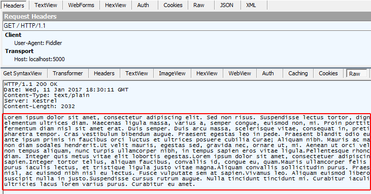
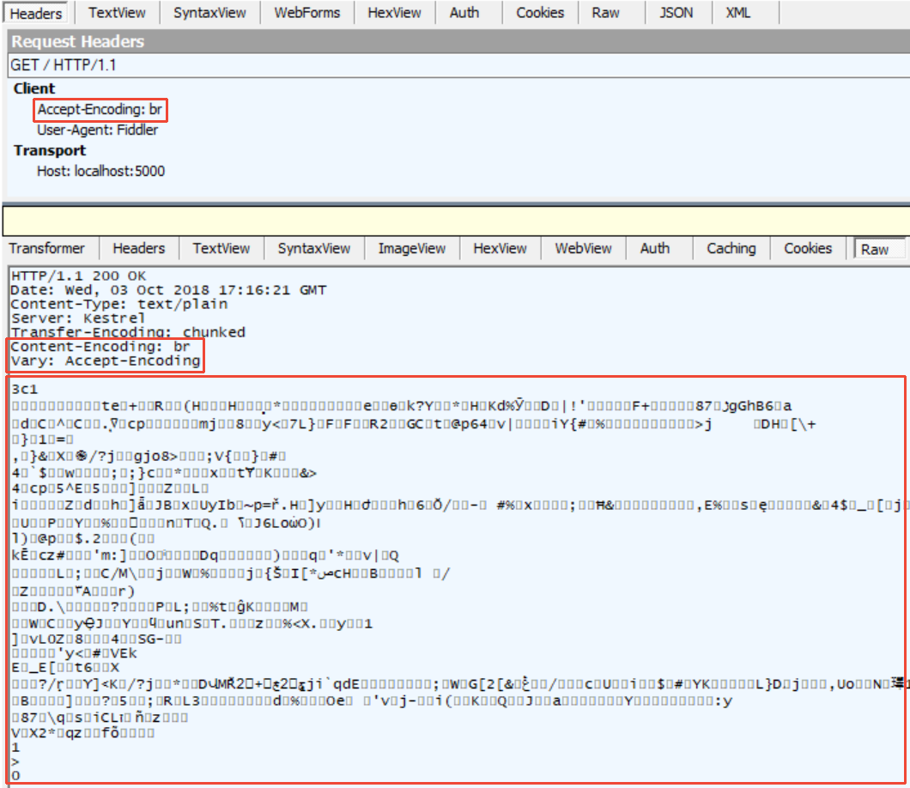
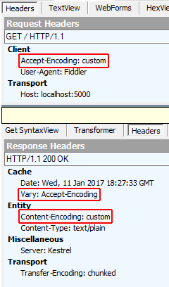

# Response compression in ASP.NET Core

:::moniker range=">= aspnetcore-6.0"

Network bandwidth is a limited resource. Reducing the size of the response usually increases the responsiveness of an app, often dramatically. One way to reduce payload size is to compress the responses from an application. This article describes how to implement response compression for your apps by using response compression middleware in ASP.NET Core.

## Explore compression with HTTPS

Compressed responses over secure connections can be controlled with the <xref:Microsoft.AspNetCore.ResponseCompression.ResponseCompressionOptions.EnableForHttps> option, which is disabled by default because of the security risk. Using compression with dynamically generated pages can expose the app to [CRIME](https://wikipedia.org/wiki/CRIME) and [BREACH](https://wikipedia.org/wiki/BREACH) attacks. CRIME and BREACH attacks can be mitigated in ASP.NET Core with antiforgery tokens. For more information, see [Prevent Cross-Site Request Forgery (XSRF/CSRF) attacks in ASP.NET Core](xref:security/anti-request-forgery). For information on mitigating BREACH attacks, see [Mitigations](http://www.breachattack.com/#mitigations) at http://www.breachattack.com/.

Even when the app disables the `EnableForHttps` property (`false`), Internet Information Services (IIS), IIS Express, and [Azure App Service](xref:host-and-deploy/azure-iis-errors-reference) can apply [Gzip](https://www.gnu.org/software/gzip/) at the IIS web server. When you review response headers, take note of the [Server](https://developer.mozilla.org/docs/Web/HTTP/Reference/Headers/Server) header value. An unexpected `content-encoding` response header value might be the result of the web server and not the ASP.NET Core app configuration.

## Determine when to use response compression middleware

Use server-based response compression technologies in IIS, Apache, or Nginx. The performance of the response compression middleware probably can't match that of the server modules. The [HTTP.sys](xref:fundamentals/servers/httpsys) server and [Kestrel](xref:fundamentals/servers/kestrel) server don't currently offer built-in compression support.

Use response compression middleware when the app is:

* Unable to use the following server-based compression technologies:
  * [IIS dynamic caching and compression](https://www.iis.net/overview/reliability/dynamiccachingandcompression)
  * [Apache mod_deflate module](https://httpd.apache.org/docs/current/mod/mod_deflate.html)
  * [Nginx compression and decompression](https://docs.nginx.com/nginx/admin-guide/web-server/compression/)

* Hosting directly on:
  * [HTTP.sys server](xref:fundamentals/servers/httpsys)
  * [Kestrel server](xref:fundamentals/servers/kestrel)

## Explore response compression

Usually, any response not natively compressed can benefit from response compression. Responses not natively compressed typically include CSS, JavaScript, HTML, XML, and JSON. Don't compress natively compressed assets, such as PNG files. When attempting to further compress a natively compressed response, any small extra reduction in size and transmission time is likely overshadowed by the time it takes to process the compression. Don't compress files smaller than about 150 - 1,000 bytes, depending on the file's content and the efficiency of compression. The overhead of compressing small files might produce a compressed file larger than the uncompressed file.

When a client can process compressed content, the client must inform the server of its capabilities by sending the [Accept-Encoding](https://developer.mozilla.org/docs/Web/HTTP/Reference/Headers/Accept-Encoding) header with the request. When a server sends compressed content, it must include information in the [Content-Encoding](https://developer.mozilla.org/docs/Web/HTTP/Reference/Headers/Content-Encoding) header regarding how the compressed response is encoded. 

The following table shows the content encoding designations for the `Accept-Encoding` header and indicates whether the response compression middleware supports the designation.

:::moniker-end

:::moniker range=">= aspnetcore-6.0 < aspnetcore-11.0"

| Designation    | Middleware    | Format | Details | 
| -------------- | :-----------: | ------ | ------- |
| `br`           | Yes (default) | Brotli Compressed Data Format | [RFC 7932](https://datatracker.ietf.org/doc/html/rfc7932) |
| `deflate`      | No            | DEFLATE Compressed Data Format | [RFC 1951](https://datatracker.ietf.org/doc/html/rfc1951) |
| `exi`          | No            | Efficient XML Interchange (EXI) | [W3C Recommendation](https://www.w3.org/TR/exi/) |
| `gzip`         | Yes           | Gzip file format | [RFC 1952](https://www.ietf.org/rfc/rfc1952.txt) |
| `identity`     | Yes           | "No encoding" - the response must not be encoded | [Troubleshoot response compression](#troubleshoot-response-compression) |
| `pack200-gzip` | No            | Network Transfer Format for Java archives | [JSR 200](https://jcp.org/aboutJava/communityprocess/review/jsr200/index.html) |
| `*` (asterisk) | Yes           | "Wildcard" - any available content encoding not explicitly requested | [Troubleshoot response compression](#troubleshoot-response-compression) |

:::moniker-end

:::moniker range=">= aspnetcore-11.0"

| Designation    | Middleware    | Format | Details | 
| -------------- | :-----------: | ------ | ------- |
| `br`           | Yes (default) | Brotli Compressed Data Format | [RFC 7932](https://datatracker.ietf.org/doc/html/rfc7932) |
| `deflate`      | No            | DEFLATE Compressed Data Format | [RFC 1951](https://datatracker.ietf.org/doc/html/rfc1951) |
| `exi`          | No            | Efficient XML Interchange (EXI) | [W3C Recommendation](https://www.w3.org/TR/exi/) |
| `gzip`         | Yes           | Gzip file format | [RFC 1952](https://www.ietf.org/rfc/rfc1952.txt) |
| `identity`     | Yes           | "No encoding" - the response must not be encoded | [Troubleshoot response compression](#troubleshoot-response-compression) |
| `pack200-gzip` | No            | Network Transfer Format for Java archives | [JSR 200](https://jcp.org/aboutJava/communityprocess/review/jsr200/index.html) |
| `zstd`         | Yes (default) | Zstandard Compressed Data Format | [RFC 8878](https://datatracker.ietf.org/doc/html/rfc8878) |
| `*` (asterisk) | Yes           | "Wildcard" - any available content encoding not explicitly requested | [Troubleshoot response compression](#troubleshoot-response-compression) |

:::moniker-end

:::moniker range=">= aspnetcore-6.0"

For more information, see the [IANA Official Content Coding List](https://www.iana.org/assignments/http-parameters/http-parameters.xml#http-content-coding-registry) for HTTP parameters.

The response compression middleware allows adding other compression providers for custom `Accept-Encoding` header values. For more information, see [Custom Providers](#custom-providers) later in this article.

The response compression middleware is capable of reacting to quality value (qvalue, `q`) weighting when sent by the client to prioritize compression schemes. For more information, see [RFC 9110: HTTP Semantics (Section 12.5.3 Accept-Encoding)](https://www.rfc-editor.org/rfc/rfc9110#field.accept-encoding).

Compression algorithms are subject to a tradeoff between compression speed and the effectiveness of the compression. *Effectiveness* in this context refers to the size of the output after compression. The smallest size is achieved by the optimal compression.

The headers involved in requesting, sending, caching, and receiving compressed content are described in the following table.

| Header             | Role | Details |
| ------------------ | ---- | ------- |
| `Accept-Encoding`  | Sent from the client to the server to indicate the content encoding schemes acceptable to the client. | [Accept-Encoding header](https://developer.mozilla.org/docs/Web/HTTP/Reference/Headers/Accept-Encoding) |
| `Content-Encoding` | Sent from the server to the client to indicate the encoding of the content in the payload. | [Content-Encoding header](https://developer.mozilla.org/docs/Web/HTTP/Reference/Headers/Content-Encoding) |
| `Content-Length`   | When compression occurs, the `Content-Length` header is removed because the body content changes when the response is compressed. | [Content-Length header](https://developer.mozilla.org/docs/Web/HTTP/Reference/Headers/Content-Length) |
| `Content-MD5`      | When compression occurs, the `Content-MD5` header is removed because the body content is changed and the hash is no longer valid. | [RFC 1864: The Content-MD5 Header Field](https://datatracker.ietf.org/doc/html/rfc1864) |
| `Content-Type`     | Specifies the [MIME type](https://developer.mozilla.org/docs/Glossary/MIME_type) of the content. Every response should specify its `Content-Type` value. The response compression middleware checks this value to determine if the response should be compressed. The response compression middleware specifies a set of [default MIME types](#review-the-mime-types) that it can encode, and they can be replaced or added. | [Content-Type header](https://developer.mozilla.org/docs/Web/HTTP/Reference/Headers/Content-Type) |
| `Vary`             | When sent by the server with a value of `Accept-Encoding` to clients and proxies, the `Vary` header indicates to the client or proxy that it should cache (vary) responses based on the value of the `Accept-Encoding` header of the request. The result of returning content with the `Vary: Accept-Encoding` header is that both compressed and uncompressed responses are cached separately. | [Vary header](https://developer.mozilla.org/docs/Web/HTTP/Reference/Headers/Vary) |

Explore the features of the response compression middleware with the [sample app](https://github.com/dotnet/AspNetCore.Docs/tree/main/aspnetcore/performance/response-compression/samples). The sample illustrates:

* Compression of app responses by using Gzip and custom compression providers.
* How to add a [MIME type](https://developer.mozilla.org/docs/Web/HTTP/Guides/MIME_types) to the default list of MIME types for compression.
* How to add a custom response compression provider.

## Configure the response compression middleware

:::moniker-end

:::moniker range=">= aspnetcore-6.0 < aspnetcore-11.0"

The following code shows how to enable the response compression middleware for default [MIME types](https://developer.mozilla.org/docs/Web/HTTP/Guides/MIME_types) and compression providers ([Brotli and Gzip](#brotli-and-gzip-compression-providers)):

:::moniker-end

:::moniker range=">= aspnetcore-11.0"

The following code shows how to enable the response compression middleware for default [MIME types](https://developer.mozilla.org/docs/Web/HTTP/Guides/MIME_types) and compression providers ([Brotli, Gzip, and Zstandard](#review-providers)):

:::moniker-end

:::moniker range=">= aspnetcore-6.0"

### Notes about response compression middleware

When you work with response compression middleware, keep in mind the following points:

* Setting the `EnableForHttps` property to `true` is a security risk. For more information, see the [Compression with HTTPS](#explore-compression-with-https) section earlier in this article.
* The [app.UseResponseCompression](xref:Microsoft.AspNetCore.Builder.ResponseCompressionBuilderExtensions.UseResponseCompression%2A) method must be called ***before*** any middleware that compresses responses. For more information, see [ASP.NET Core Middleware > Middleware order](xref:fundamentals/middleware/index#middleware-order).
* Use a tool such as [Firefox Browser - Developer edition](https://www.firefox.com/channel/desktop/developer/) to set the `Accept-Encoding` request header and examine the response headers, size, and body.

Submit a request to the sample app without the `Accept-Encoding` header and observe that the response is uncompressed. The `Content-Encoding` header isn't in the Response Headers collection.

For example, in Firefox Developer:

1. Select the network tab.
1. Right-click the request in the [Network request list](https://firefox-source-docs.mozilla.org/devtools-user/network_monitor/request_list/index.html) and select **Edit and resend**.
1. Change the `Accept-Encoding:` value from  `gzip, deflate, br` to `none`.
1. Select **Send**.

Submit a request to the sample app with a browser by using the developer tools and observe that the response is compressed. The `Content-Encoding` and `Vary` headers are present on the response.

## Review providers

:::moniker-end

:::moniker range=">= aspnetcore-6.0 < aspnetcore-11.0"

This section provides details about compression providers, including Brotli, Gzip, and custom providers.

:::moniker-end

:::moniker range=">= aspnetcore-11.0"

This section provides details about compression providers, including Brotli, Gzip, Zstandard, and custom providers.

:::moniker-end

:::moniker range=">= aspnetcore-6.0"

### Brotli and Gzip compression providers

Use the <xref:Microsoft.AspNetCore.ResponseCompression.BrotliCompressionProvider> class to compress responses with the [RFC 7932: Brotli Compressed Data Format](https://datatracker.ietf.org/doc/html/rfc7932).

If [no compression providers are explicitly added](https://github.com/dotnet/aspnetcore/blob/main/src/Middleware/ResponseCompression/src/ResponseCompressionProvider.cs#L44) to the <xref:Microsoft.AspNetCore.ResponseCompression.CompressionProviderCollection> class:

:::moniker-end

:::moniker range=">= aspnetcore-6.0 < aspnetcore-11.0"

* By default, the Brotli and Gzip compression providers are added to the array of compression providers.
* When the client supports the Brotli compressed data format, compression defaults to Brotli compression.
* If the client doesn't support Brotli, compression defaults to Gzip when the client supports Gzip compression.

:::moniker-end

:::moniker range=">= aspnetcore-11.0"

* By default, the Brotli, Gzip, and Zstandard compression providers are added to the array of compression providers.
* When the client supports the Zstandard compressed data format, compression defaults to Zstandard compression.
* If the client doesn't support Zstandard but supports Brotli, compression defaults to Brotli compression.
* If the client doesn't support Zstandard or Brotli, compression defaults to Gzip when the client supports Gzip compression.

:::moniker-end

:::moniker range=">= aspnetcore-6.0"

When a compression provider is added, other providers aren't added. For example, if the Gzip compression provider is the only provider explicitly added, no other compression providers are added.

[!INCLUDE[](~/includes/aspnetcore-repo-ref-source-links.md)]

The following code:

* Enables response compression for HTTPS requests.
* Adds the Brotli and Gzip response compression providers.

[!code-csharp[](response-compression/samples/6.x/SampleApp/Program.cs?name=snippet2&highlight=6-11)]

Set the compression level with the <xref:Microsoft.AspNetCore.ResponseCompression.BrotliCompressionProviderOptions> class and <xref:Microsoft.AspNetCore.ResponseCompression.GzipCompressionProviderOptions> class. The Brotli and Gzip compression providers default to the fastest compression level as determined by the [CompressionLevel.Fastest](xref:System.IO.Compression.CompressionLevel) enum. However, this approach might not produce the most efficient compression. If the most efficient compression is desired, configure the response compression middleware for optimal compression.

For values that indicate whether a compression operation emphasizes speed or compression size, see the [CompressionLevel Enum](/dotnet/api/system.io.compression.compressionlevel).

[!code-csharp[](response-compression/samples/6.x/SampleApp/Program.cs?name=snippet2&highlight=13-21)]

:::moniker-end

:::moniker range=">= aspnetcore-11.0"

### Zstandard compression provider

Use the <xref:Microsoft.AspNetCore.ResponseCompression.ZstandardCompressionProvider> class to compress responses with the [RFC 8878: Zstandard Compression for HTTP](https://datatracker.ietf.org/doc/html/rfc8878).

Set the compression quality with the <xref:Microsoft.AspNetCore.ResponseCompression.ZstandardCompressionProviderOptions> class. The Zstandard quality level ranges from 1 to 22, where higher values produce better compression but slower speeds. The following example sets the Zstandard compression quality:

```csharp
builder.Services.Configure<ZstandardCompressionProviderOptions>(options =>
{
    options.CompressionOptions = new ZstandardCompressionOptions
    {
        Quality = 6 // 1 to 22, higher = better compression, slower
    };
});
```

:::moniker-end

:::moniker range=">= aspnetcore-6.0"

### Custom providers

Create custom compression implementations with the <xref:Microsoft.AspNetCore.ResponseCompression.ICompressionProvider> interface. The <xref:Microsoft.AspNetCore.ResponseCompression.ICompressionProvider.EncodingName*> property represents the content encoding that this `ICompressionProvider` produces. The response compression middleware uses this information to choose the provider based on the list specified in the `Accept-Encoding` header of the request.

Requests to the sample app with the `Accept-Encoding: mycustomcompression` header return a response with a `Content-Encoding: mycustomcompression` header. The client must be able to decompress the custom encoding in order for a custom compression implementation to work.

[!code-csharp[](response-compression/samples/6.x/SampleApp/Program.cs?name=snippet_cust&highlight=9)]

[!code-csharp[](response-compression/samples/6.x/SampleApp/CustomCompressionProvider.cs)]

In the preceding code, the sample doesn't compress the response body. However, the sample shows where to implement a custom compression algorithm.

## Review the MIME types

The response compression middleware specifies a default set of MIME types for compression. Review the [source code for a complete list of supported MIME types](https://github.com/dotnet/aspnetcore/blob/main/src/Middleware/ResponseCompression/src/ResponseCompressionDefaults.cs).

[!INCLUDE[](~/includes/aspnetcore-repo-ref-source-links.md)]

Replace or append MIME types with the [ResponseCompressionOptions.MimeTypes](xref:Microsoft.AspNetCore.ResponseCompression.ResponseCompressionOptions.MimeTypes) property. Wildcard MIME types such as `text/*` aren't supported. The sample app adds a MIME type for `image/svg+xml` and compresses and serves the ASP.NET Core banner image _banner.svg_.

[!code-csharp[](response-compression/samples/6.x/SampleApp/Program.cs?name=snippet_mime&highlight=12-14)]

## Add the Vary header

When responses are compressed based on the [Accept-Encoding request header](https://developer.mozilla.org/docs/Web/HTTP/Reference/Headers/Accept-Encoding), there can be uncompressed and multiple compressed versions of the response. To instruct client and proxy caches that multiple versions exist and should be stored, the `Vary` header is added with an `Accept-Encoding` value. The response middleware [adds the 'Vary' header](https://github.com/dotnet/aspnetcore/blob/main/src/Middleware/ResponseCompression/src/ResponseCompressionBody.cs#L198-L241) in the _ResponseCompressionBody.cs_ file automatically when the response is compressed.

[!INCLUDE[](~/includes/aspnetcore-repo-ref-source-links.md)]

## Issues with Nginx reverse proxy

When Nginx proxies the request, the `Accept-Encoding` header is removed. Removal of the `Accept-Encoding` header prevents the response compression middleware from compressing the response. For more information, see [Nginx: Compression and decompression](https://docs.nginx.com/nginx/admin-guide/web-server/compression/). This issue is tracked in [GitHub dotnet/aspnetcore issue #5989](https://github.com/dotnet/aspnetcore/issues/5989) - _Figure out pass-through compression for Nginx_.

## Disable IIS dynamic compression

To disable IIS Dynamic Compression Module configured at the server level, see [Disabling IIS modules](xref:host-and-deploy/iis/modules#disabling-iis-modules).

## Troubleshoot response compression

Use a tool like [Firefox Browser - Developer edition](https://www.firefox.com/channel/desktop/developer/) that lets you set the `Accept-Encoding` request header and study the response headers, size, and body. By default, response compression middleware compresses responses that meet the following conditions:

:::moniker-end

:::moniker range=">= aspnetcore-6.0 < aspnetcore-11.0"

* The `Accept-Encoding` header is present with a value of `br`, `gzip`, `*` (asterisk), or custom encoding that matches a custom compression provider. The value must not be `identity` (no encoding) or have a quality value (qvalue, `q`) setting of 0 (zero).

:::moniker-end

:::moniker range=">= aspnetcore-11.0"

* The `Accept-Encoding` header is present with a value of `br`, `gzip`, `zstd`, `*` (asterisk), or custom encoding that matches a custom compression provider. The value must not be `identity` (no encoding) or have a quality value (qvalue, `q`) setting of 0 (zero).

:::moniker-end

:::moniker range=">= aspnetcore-6.0"

* The MIME type (`Content-Type`) must be set and must match a MIME type configured on the <xref:Microsoft.AspNetCore.ResponseCompression.ResponseCompressionOptions> class.

* The request must not include the [Content-Range header](https://developer.mozilla.org/docs/Web/HTTP/Reference/Headers/Content-Range).

* The request must use the insecure hypertext protocol (http), unless the secure hypertext protocol (https) is configured in the response compression middleware options.

   > [!IMPORTANT]
   > Review the risks associated with enabling secure content compression, as described in [Compression with HTTPS](#explore-compression-with-https) earlier in this article.

## Review the Azure deployed sample

The sample app deployed to Azure has the following _Program.cs_ file:

[!code-csharp[](response-compression/samples/6.x/SampleApp/Program.cs?name=snippet_opt)]

## Related content

* [View or download sample code](https://github.com/dotnet/AspNetCore.Docs/tree/main/aspnetcore/performance/response-compression/samples) ([how to download](xref:fundamentals/index#how-to-download-a-sample))
* [Response compression middleware source](https://github.com/dotnet/aspnetcore/tree/main/src/Middleware/ResponseCompression/src)
* [RFC 9110: HTTP Semantics (Section 8.4.1 Content Codings)](https://www.rfc-editor.org/rfc/rfc9110#name-content-codings)
* [RFC 9110: HTTP Semantics (Section 8.4.1.3 Gzip Coding)](https://www.rfc-editor.org/rfc/rfc9110#gzip.coding)
* [RFC 1952: GZIP file format specification version 4.3](https://www.ietf.org/rfc/rfc1952.txt)
* [RFC 8878: Zstandard Compression for HTTP](https://www.rfc-editor.org/rfc/rfc8878)

:::moniker-end

:::moniker range="< aspnetcore-6.0"

Network bandwidth is a limited resource. Reducing the size of the response usually increases the responsiveness of an app, often dramatically. One way to reduce payload sizes is to compress an app's responses.

[View or download sample code](https://github.com/dotnet/AspNetCore.Docs/tree/main/aspnetcore/performance/response-compression/samples) ([how to download](xref:fundamentals/index#how-to-download-a-sample))

## When to use response compression middleware

Use server-based response compression technologies in IIS, Apache, or Nginx. The performance of the middleware probably won't match that of the server modules. [HTTP.sys](xref:fundamentals/servers/httpsys) server and [Kestrel](xref:fundamentals/servers/kestrel) server don't currently offer built-in compression support.

Use response compression middleware when you're:

* Unable to use the following server-based compression technologies:
  * [IIS Dynamic Compression module](https://www.iis.net/overview/reliability/dynamiccachingandcompression)
  * [Apache mod_deflate module](https://httpd.apache.org/docs/current/mod/mod_deflate.html)
  * [Nginx Compression and Decompression](https://www.nginx.com/resources/admin-guide/compression-and-decompression/)
* Hosting directly on:
  * [HTTP.sys server](xref:fundamentals/servers/httpsys) (formerly called WebListener)
  * [Kestrel server](xref:fundamentals/servers/kestrel)

## Response compression

Usually, any response not natively compressed can benefit from response compression. Responses not natively compressed typically include: CSS, JavaScript, HTML, XML, and JSON. You shouldn't compress natively compressed assets, such as PNG files. If you attempt to further compress a natively compressed response, any small additional reduction in size and transmission time will likely be overshadowed by the time it took to process the compression. Don't compress files smaller than about 150-1000 bytes (depending on the file's content and the efficiency of compression). The overhead of compressing small files may produce a compressed file larger than the uncompressed file.

When a client can process compressed content, the client must inform the server of its capabilities by sending the `Accept-Encoding` header with the request. When a server sends compressed content, it must include information in the `Content-Encoding` header on how the compressed response is encoded. Content encoding designations supported by the middleware are shown in the following table.

| `Accept-Encoding` header values | Middleware Supported | Description |
| ------------------------------- | :------------------: | ----------- |
| `br`                            | Yes (default)        | [Brotli compressed data format](https://tools.ietf.org/html/rfc7932) |
| `deflate`                       | No                   | [DEFLATE compressed data format](https://tools.ietf.org/html/rfc1951) |
| `exi`                           | No                   | [W3C Efficient XML Interchange](https://www.w3.org/TR/exi/) |
| `gzip`                          | Yes                  | [Gzip file format](https://tools.ietf.org/html/rfc1952) |
| `identity`                      | Yes                  | "No encoding" identifier: The response must not be encoded. |
| `pack200-gzip`                  | No                   | [Network Transfer Format for Java Archives](https://jcp.org/aboutJava/communityprocess/review/jsr200/index.html) |
| `*`                             | Yes                  | Any available content encoding not explicitly requested |

For more information, see the [IANA Official Content Coding List](https://www.iana.org/assignments/http-parameters/http-parameters.xml#http-content-coding-registry).

The middleware allows you to add additional compression providers for custom `Accept-Encoding` header values. For more information, see [Custom Providers](#custom-providers) below.

The middleware is capable of reacting to quality value (qvalue, `q`) weighting when sent by the client to prioritize compression schemes. For more information, see [RFC 9110: Accept-Encoding](https://www.rfc-editor.org/rfc/rfc9110#field.accept-encoding).

Compression algorithms are subject to a tradeoff between compression speed and the effectiveness of the compression. *Effectiveness* in this context refers to the size of the output after compression. The smallest size is achieved by the most *optimal* compression.

The headers involved in requesting, sending, caching, and receiving compressed content are described in the table below.

| Header             | Role |
| ------------------ | ---- |
| `Accept-Encoding`  | Sent from the client to the server to indicate the content encoding schemes acceptable to the client. |
| `Content-Encoding` | Sent from the server to the client to indicate the encoding of the content in the payload. |
| `Content-Length`   | When compression occurs, the `Content-Length` header is removed, since the body content changes when the response is compressed. |
| `Content-MD5`      | When compression occurs, the `Content-MD5` header is removed, since the body content has changed and the hash is no longer valid. |
| `Content-Type`     | Specifies the MIME type of the content. Every response should specify its `Content-Type`. The middleware checks this value to determine if the response should be compressed. The middleware specifies a set of [default MIME types](#review-the-mime-types) that it can encode, but you can replace or add MIME types. |
| `Vary`             | When sent by the server with a value of `Accept-Encoding` to clients and proxies, the `Vary` header indicates to the client or proxy that it should cache (vary) responses based on the value of the `Accept-Encoding` header of the request. The result of returning content with the `Vary: Accept-Encoding` header is that both compressed and uncompressed responses are cached separately. |

Explore the features of the response compression middleware with the [sample app](https://github.com/dotnet/AspNetCore.Docs/tree/main/aspnetcore/performance/response-compression/samples). The sample illustrates:

* The compression of app responses using Gzip and custom compression providers.
* How to add a MIME type to the default list of MIME types for compression.

## Configuration

The following code shows how to enable the response compression middleware for default MIME types and compression providers ([Brotli](#brotli-compression-provider) and [Gzip](#gzip-compression-provider)):

```csharp
public class Startup
{
    public void ConfigureServices(IServiceCollection services)
    {
        services.AddResponseCompression();
    }

    public void Configure(IApplicationBuilder app, IHostingEnvironment env)
    {
        app.UseResponseCompression();
    }
}
```

Notes:

* `app.UseResponseCompression` must be called before any middleware that compresses responses. For more information, see <xref:fundamentals/middleware/index#middleware-order>.
* Use a tool such as [Fiddler](https://www.telerik.com/fiddler), [Firefox Browser Developer](https://www.mozilla.org/firefox/developer/) to set the `Accept-Encoding` request header and study the response headers, size, and body.

Submit a request to the sample app without the `Accept-Encoding` header and observe that the response is uncompressed. The `Content-Encoding` and `Vary` headers aren't present on the response.



Submit a request to the sample app with the `Accept-Encoding: br` header (Brotli compression) and observe that the response is compressed. The `Content-Encoding` and `Vary` headers are present on the response.



## Providers

### Brotli Compression Provider

Use the <xref:Microsoft.AspNetCore.ResponseCompression.BrotliCompressionProvider> to compress responses with the [Brotli compressed data format](https://tools.ietf.org/html/rfc7932).

If no compression providers are explicitly added to the <xref:Microsoft.AspNetCore.ResponseCompression.CompressionProviderCollection>:

* The Brotli Compression Provider is added by default to the array of compression providers along with the [Gzip compression provider](#gzip-compression-provider).
* Compression defaults to Brotli compression when the Brotli compressed data format is supported by the client. If Brotli isn't supported by the client, compression defaults to Gzip when the client supports Gzip compression.

```csharp
public void ConfigureServices(IServiceCollection services)
{
    services.AddResponseCompression();
}
```

The Brotli Compression Provider must be added when any compression providers are explicitly added:

[!code-csharp[](response-compression/samples/3.x/SampleApp/Startup.cs?name=snippet1&highlight=5)]

Set the compression level with <xref:Microsoft.AspNetCore.ResponseCompression.BrotliCompressionProviderOptions>. The Brotli Compression Provider defaults to the fastest compression level ([CompressionLevel.Fastest](xref:System.IO.Compression.CompressionLevel)), which might not produce the most efficient compression. If the most efficient compression is desired, configure the middleware for optimal compression.

| Compression Level | Description |
| ----------------- | ----------- |
| [CompressionLevel.Fastest](xref:System.IO.Compression.CompressionLevel) | Compression should complete as quickly as possible, even if the resulting output isn't optimally compressed. |
| [CompressionLevel.NoCompression](xref:System.IO.Compression.CompressionLevel) | No compression should be performed. |
| [CompressionLevel.Optimal](xref:System.IO.Compression.CompressionLevel) | Responses should be optimally compressed, even if the compression takes more time to complete. |

```csharp
public void ConfigureServices(IServiceCollection services)
{
    services.AddResponseCompression();

    services.Configure<BrotliCompressionProviderOptions>(options => 
    {
        options.Level = CompressionLevel.Fastest;
    });
}
```

### Gzip Compression Provider

Use the <xref:Microsoft.AspNetCore.ResponseCompression.GzipCompressionProvider> to compress responses with the [Gzip file format](https://tools.ietf.org/html/rfc1952).

If no compression providers are explicitly added to the <xref:Microsoft.AspNetCore.ResponseCompression.CompressionProviderCollection>:

* The Gzip Compression Provider is added by default to the array of compression providers along with the [Brotli Compression Provider](#brotli-compression-provider).
* Compression defaults to Brotli compression when the Brotli compressed data format is supported by the client. If Brotli isn't supported by the client, compression defaults to Gzip when the client supports Gzip compression.

```csharp
public void ConfigureServices(IServiceCollection services)
{
    services.AddResponseCompression();
}
```

The Gzip Compression Provider must be added when any compression providers are explicitly added:

[!code-csharp[](response-compression/samples/3.x/SampleApp/Startup.cs?name=snippet1&highlight=6)]

Set the compression level with <xref:Microsoft.AspNetCore.ResponseCompression.GzipCompressionProviderOptions>. The Gzip Compression Provider defaults to the fastest compression level ([CompressionLevel.Fastest](xref:System.IO.Compression.CompressionLevel)), which might not produce the most efficient compression. If the most efficient compression is desired, configure the middleware for optimal compression.

| Compression Level | Description |
| ----------------- | ----------- |
| [CompressionLevel.Fastest](xref:System.IO.Compression.CompressionLevel) | Compression should complete as quickly as possible, even if the resulting output isn't optimally compressed. |
| [CompressionLevel.NoCompression](xref:System.IO.Compression.CompressionLevel) | No compression should be performed. |
| [CompressionLevel.Optimal](xref:System.IO.Compression.CompressionLevel) | Responses should be optimally compressed, even if the compression takes more time to complete. |

```csharp
public void ConfigureServices(IServiceCollection services)
{
    services.AddResponseCompression();

    services.Configure<GzipCompressionProviderOptions>(options => 
    {
        options.Level = CompressionLevel.Fastest;
    });
}
```

### Custom providers

Create custom compression implementations with <xref:Microsoft.AspNetCore.ResponseCompression.ICompressionProvider>. The <xref:Microsoft.AspNetCore.ResponseCompression.ICompressionProvider.EncodingName*> represents the content encoding that this `ICompressionProvider` produces. The middleware uses this information to choose the provider based on the list specified in the `Accept-Encoding` header of the request.

Using the sample app, the client submits a request with the `Accept-Encoding: mycustomcompression` header. The middleware uses the custom compression implementation and returns the response with a `Content-Encoding: mycustomcompression` header. The client must be able to decompress the custom encoding in order for a custom compression implementation to work.

[!code-csharp[](response-compression/samples/3.x/SampleApp/Startup.cs?name=snippet1&highlight=7)]

[!code-csharp[](response-compression/samples/3.x/SampleApp/CustomCompressionProvider.cs?name=snippet1)]


Submit a request to the sample app with the `Accept-Encoding: mycustomcompression` header and observe the response headers. The `Vary` and `Content-Encoding` headers are present on the response. The response body (not shown) isn't compressed by the sample. There isn't a compression implementation in the `CustomCompressionProvider` class of the sample. However, the sample shows where you would implement such a compression algorithm.



## MIME types

The middleware specifies a default set of MIME types for compression:

* `application/javascript`
* `application/json`
* `application/xml`
* `text/css`
* `text/html`
* `text/json`
* `text/plain`
* `text/xml`

Replace or append MIME types with the response compression middleware options. Note that wildcard MIME types, such as `text/*` aren't supported. The sample app adds a MIME type for `image/svg+xml` and compresses and serves the ASP.NET Core banner image (*banner.svg*).

[!code-csharp[](response-compression/samples/3.x/SampleApp/Startup.cs?name=snippet1&highlight=8-10)]

<a name="risk"></a>

## Compression with secure protocol

Compressed responses over secure connections can be controlled with the `EnableForHttps` option, which is disabled by default. Using compression with dynamically generated pages can lead to security problems such as the [CRIME](https://wikipedia.org/wiki/CRIME_(security_exploit)) and [BREACH](https://wikipedia.org/wiki/BREACH_(security_exploit)) attacks.

## Adding the Vary header

When compressing responses based on the `Accept-Encoding` header, there are potentially multiple compressed versions of the response and an uncompressed version. In order to instruct client and proxy caches that multiple versions exist and should be stored, the `Vary` header is added with an `Accept-Encoding` value. In ASP.NET Core 2.0 or later, the middleware adds the `Vary` header automatically when the response is compressed.

## Middleware issue when behind an Nginx reverse proxy

When a request is proxied by Nginx, the `Accept-Encoding` header is removed. Removal of the `Accept-Encoding` header prevents the middleware from compressing the response. For more information, see [NGINX: Compression and Decompression](https://www.nginx.com/resources/admin-guide/compression-and-decompression/). This issue is tracked by [Figure out pass-through compression for Nginx (dotnet/aspnetcore#5989)](https://github.com/dotnet/aspnetcore/issues/5989).

## Working with IIS dynamic compression

If you have an active IIS Dynamic Compression Module configured at the server level that you would like to disable for an app, disable the module with an addition to the *web.config* file. For more information, see [Disabling IIS modules](xref:host-and-deploy/iis/modules#disabling-iis-modules).

## Troubleshooting

Use a tool like [Fiddler](https://www.telerik.com/fiddler) or [Firefox Browser Developer](https://www.mozilla.org/firefox/developer/), which allow you to set the `Accept-Encoding` request header and study the response headers, size, and body. By default, response compression middleware compresses responses that meet the following conditions:

* The `Accept-Encoding` header is present with a value of `br`, `gzip`, `*`, or custom encoding that matches a custom compression provider that you've established. The value must not be `identity` or have a quality value (qvalue, `q`) setting of 0 (zero).
* The MIME type (`Content-Type`) must be set and must match a MIME type configured on the <xref:Microsoft.AspNetCore.ResponseCompression.ResponseCompressionOptions>.
* The request must not include the `Content-Range` header.
* The request must use insecure protocol (http), unless secure protocol (https) is configured in the response compression middleware options. *Note the danger [described above](#risk) when enabling secure content compression.*

## Additional resources

* <xref:fundamentals/startup>
* <xref:fundamentals/middleware/index>
* [Mozilla Developer Network: Accept-Encoding](https://developer.mozilla.org/docs/Web/HTTP/Headers/Accept-Encoding)
* [RFC 9110 Section 8.4.1: Content Codings](https://www.rfc-editor.org/rfc/rfc9110#name-content-codings)
* [RFC 9110 Section 8.4.1.3: Gzip Coding](https://www.rfc-editor.org/rfc/rfc9110#gzip.coding)
* [GZIP file format specification version 4.3](https://www.ietf.org/rfc/rfc1952.txt)

:::moniker-end
