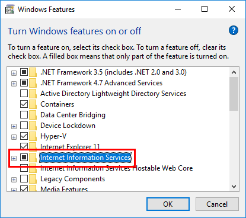
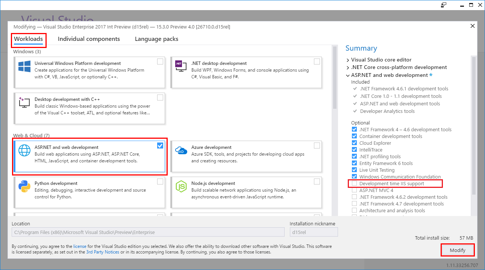

---
title: Development-time IIS support in Visual Studio for ASP.NET Core
author: shirhatti
description: Discover support for debugging ASP.NET Core applications when running behind IIS on Windows Server.
keywords: ASP.NET Core,internet information services,iis,windows server,asp.net core module,debugging
ms.author: riande
manager: wpickett
ms.date: 09/13/2017
ms.topic: article
ms.assetid: 83d98477-9d10-4a78-a54a-f325ad67d13b
ms.technology: aspnet
ms.prod: asp.net-core
uid: publishing/development-time-iis-support
---
# Development-time IIS support in Visual Studio for ASP.NET Core

By: [Sourabh Shirhatti](https://twitter.com/sshirhatti)

This article describes [Visual Studio](https://www.visualstudio.com/vs/) support for debugging ASP.NET Core applications running behind IIS on Windows Server. This topic walks you through enabling this feature and setting up your project.

## Prerequisites

* Visual Studio (2017/version 15.3 or later)
* ASP.NET and web development workload *OR* the .NET Core cross-platform development workload

## Enable IIS

Enable IIS on your system. Navigate to **Control Panel** > **Programs** > **Programs and Features** > **Turn Windows features on or off** (left side of the screen). Select the **Internet Information Services** checkbox.



If your IIS installation requires a reboot, reboot your system.

## Enable development-time IIS support

Once you've installed IIS, launch the Visual Studio installer to modify your existing Visual Studio installation. In the installer, select the **Development time IIS support** component. The component is listed as an optional component in the **Summary** panel for the **ASP.NET and web development** workload. This installs the [ASP.NET Core Module](xref:fundamentals/servers/aspnet-core-module), which is a native IIS module required to run ASP.NET Core applications.



## Configure the project

Create a new launch profile to add development-time IIS support. In Visual Studio's **Solution Explorer**, right-click the project and select **Properties**. Select the **Debug** tab. Select **IIS** from the **Launch** dropdown. Confirm that the **Launch browser** feature is enabled with the correct URL.


Alternatively, you can manually add a launch profile to your [launchSettings.json](http://json.schemastore.org/launchsettings) file in the app:

```json
{
    "iisSettings": {
        "windowsAuthentication": false,
        "anonymousAuthentication": true,
        "iis": {
            "applicationUrl": "http://localhost/WebApplication2",
            "sslPort": 0
        }
    },
    "profiles": {
        "IIS": {
            "commandName": "IIS",
            "launchBrowser": "true",
            "launchUrl": "http://localhost/WebApplication2",
            "environmentVariables": {
                "ASPNETCORE_ENVIRONMENT": "Development"
            }
        }
    }
}
```

You may be prompted to restart Visual Studio if you weren't running as an administrator. If prompted, restart Visual Studio.

Congratulations! At this point, your project is configured for development-time IIS support. 

## Additional resources

* [Host ASP.NET Core on Windows with IIS](xref:publishing/iis)
* [Introduction to ASP.NET Core Module](xref:fundamentals/servers/aspnet-core-module)
* [ASP.NET Core Module configuration reference](xref:hosting/aspnet-core-module)
