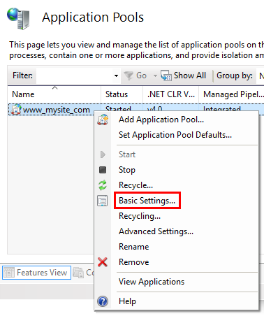

# Publishing to IIS

By [Luke Latham](https://github.com/GuardRex) and [Rick Anderson](https://twitter.com/RickAndMSFT)

## Supported operating systems

The following operating systems are supported:

* Windows 7 and newer

* Windows Server 2008 R2 and newer*

*Conceptually, the IIS configuration described in this document also applies to hosting ASP.NET Core applications on Nano Server IIS, but refer to [ASP.NET Core on Nano Server](../tutorials/nano-server.md) for specific instructions.

## IIS configuration

Enable the **Web Server (IIS)** server role and establish role services.

### Windows desktop operating systems

Navigate to **Control Panel > Programs > Programs and Features > Turn Windows features on or off** (left side of the screen). Open the group for **Internet Information Services** and **Web Management Tools**. Check the box for **IIS Management Console**. Check the box for **World Wide Web Services**. Accept the default features for **World Wide Web Services** or customize the IIS features to suit your needs.


### Windows Server operating systems

For server operating systems, use the **Add Roles and Features Wizard** via the **Manage** menu or the link in **Server Manager**. On the **Server Roles** step, check the box for **Web Server (IIS)**.


On the **Role services** step, select the IIS role services you desire or accept the default role services provided.


Proceed through the **Confirmation** step to enable the web server role and services.

<a name=unlock-handlers></a>

## Install the .NET Core Windows Server Hosting bundle

1. Install the [.NET Core Windows Server Hosting](https://aka.ms/dotnetcore_windowshosting_1_1_0) bundle on the server. The bundle will install the .NET Core Runtime, .NET Core Library, and the ASP.NET Core Module. The module creates the reverse-proxy between IIS and the Kestrel server.

2. Restart the server or execute **net stop was /y** followed by **net start w3svc** from the command-line to pickup changes to the system PATH.

For more information on the ASP.NET Core Module, including configuration of the module and setting environment variables with *web.config*, the use of *app_offline.htm* to suspend request processing, and activation of module logging, see [ASP.NET Core Module Configuration Reference](../hosting/aspnet-core-module.md).

## Application configuration

### Enabling the *IISIntegration* components

Include a dependency on the *Microsoft.AspNetCore.Server.IISIntegration* package in the application dependencies. Incorporate IIS Integration middleware into the application by adding the *.UseIISIntegration()* extension method to *WebHostBuilder()*.

<!-- literal_block {"ids": [], "names": [], "highlight_args": {}, "backrefs": [], "dupnames": [], "linenos": false, "classes": [], "xml:space": "preserve", "language": "csharp"} -->

````csharp

   var host = new WebHostBuilder()
     .UseKestrel()
     .UseContentRoot(Directory.GetCurrentDirectory())
     .UseIISIntegration()
     .UseStartup<Startup>()
     .Build();
   ````

Note that code calling *.UseIISIntegration()* does not affect code portability.

### Setting *IISOptions* for the *IISIntegration* service

To configure *IISIntegration* service options, include a service configuration for *IISOptions* in *ConfigureServices*.

<!-- literal_block {"ids": [], "names": [], "highlight_args": {}, "backrefs": [], "dupnames": [], "linenos": false, "classes": [], "xml:space": "preserve", "language": "csharp"} -->

````csharp

   services.Configure<IISOptions>(options => {
     ...
   });
   ````

| Option               | Setting|
| ----------------- | ------------ | 
| AutomaticAuthentication | If true, the authentication middleware will alter the request user arriving and respond to generic challenges. If false,the authentication middleware will only provide identity and respond to challenges when explicitly indicated by theAuthenticationScheme |
| ForwardClientCertificate | If true and the `MS-ASPNETCORE-CLIENTCERT` request header is present, the `ITLSConnectionFeature` will be populated. |
| ForwardWindowsAuthentication | If true, authentication middleware will attempt to authenticate using platform handler windows authentication. If false, authentication middleware won’t be added. |

### *publish-iis* tool

The *publish-iis* tool can be added to any .NET Core application and will configure the ASP.NET Core Module by creating or modifying the *web.config* file. The tool runs after publishing with the *dotnet publish* command or publishing with Visual Studio and will configure the *processPath* and *arguments* for you. If you're publishing a *web.config* file by including the file in your project and listing the file in the *publishOptions* section of *project.json*, the tool will not modify other IIS settings you have included in the file.

To include the *publish-iis* tool in your application, add entries to the *tools* and *scripts* sections of *project.json*.

<!-- literal_block {"ids": [], "names": [], "highlight_args": {}, "backrefs": [], "dupnames": [], "linenos": false, "classes": [], "xml:space": "preserve", "language": "none"} -->

````none

   "tools": {
     "Microsoft.AspNetCore.Server.IISIntegration.Tools": "1.0.0-preview2-final"
   },
   "scripts": {
     "postpublish": "dotnet publish-iis --publish-folder %publish:OutputPath% --framework %publish:FullTargetFramework%"
   }
   ````

## Deploy the application

1. On the target IIS server, create a folder to contain the application's published folders and files, which are described in [Directory Structure](../hosting/directory-structure.md).

2. Within the folder you created, create a *logs* folder to hold application logs (if you plan to enable logging). If you plan to deploy your application with a *logs* folder in the payload, you may skip this step.

3. Deploy the application to the folder you created on the target IIS server. MSDeploy (Web Deploy) is the recommended mechanism for deployment, but you may use any of several methods to move the application to the server (for example, Xcopy, Robocopy, or PowerShell). Visual Studio users may use the [default Visual Studio web publish script](https://github.com/aspnet/vsweb-publish/blob/master/samples/default-publish.ps1). For information on using Web Deploy, see [Publishing to IIS with Web Deploy using Visual Studio](iis-with-msdeploy.md).

>[!WARNING]
> .NET Core applications are hosted via a reverse-proxy between IIS and the Kestrel server. In order to create the reverse-proxy, the *web.config* file must be present at the content root path (typically the app base path) of the deployed application, which is the website physical path provided to IIS.Sensitive files exist on the app's physical path, including subfolders, such as *my_application.runtimeconfig.json*, *my_application.xml* (XML Documentation comments), and *my_application.deps.json*. The *web.config* file is required to create the reverse proxy to Kestrel, which prevents IIS from serving these and other sensitive files. **Therefore, it is important that the web.config file is never accidently renamed or removed from the deployment.**

## Configure the website in IIS

1. In **IIS Manager**, create a new website. Provide a **Site name** and set the **Physical path** to the application's assets folder that you created. Provide the **Binding** configuration and create the website.

2. Set the application pool to **No Managed Code**. ASP.NET Core runs in a separate process and manages the runtime.

> [!NOTE]
> If you change the default identity of the application pool from **ApplicationPoolIdentity**, verify the new identity has the required permissions to access the application's assets and database.

Open the **Add Website** window.

   

Configure the website.

   

In the **Application Pools** panel, open the **Edit Application Pool** window by right-clicking on the website's application pool and selecting **Basic Settings...** from the popup menu.

   

Set the **.NET CLR version** to **No Managed Code**.

   

Browse the website.

   

## Create a Data Protection Registry Hive

Data Protection keys used by ASP.NET applications are stored in registry hives external to the applications. To persist the keys for a given application, you must create a registry hive for the application's application pool.

For standalone IIS installations, you may use the [Data Protection Provision-AutoGenKeys.ps1 PowerShell script](https://github.com/aspnet/DataProtection/blob/dev/Provision-AutoGenKeys.ps1) for each application pool used with an ASP.NET Core application. The keys will be persisted in the registry.

In web farm scenarios, an application can be configured to use a UNC path to store its data protection key ring. By default, the data protection keys are not encrypted. You can deploy an x509 certificate to each machine to encrypt the key ring. See [Configuring Data Protection](../security/data-protection/configuration/overview.md#data-protection-configuring) for details.

>[!WARNING]
> Data Protection is used by various ASP.NET middlewares, including those used in authentication. Even if you do not specifically call any Data Protection APIs from your own code you should configure Data Protection with the deployment script or in your own code. If you do not configure data protection when using IIS by default the keys will be held in memory and discarded when your application closes or restarts. This will then, for example, invalidate any cookies written by the cookie authentication and users will have to login again.

## Configuration of sub-applications

When adding applications to an IIS Site's root application, the root application *web.config* file should include the `<handlers>` section, which adds the ASP.NET Core Module as a handler for the app. Applications added to the root application shouldn't include the `<handlers>` section. If you repeat the `<handlers>` section in a sub-application's *web.config* file, you will receive a 500.19 (Internal Server Error) referencing the faulty config file when you attempt to browse the sub-application.

## Common errors

The following is not a complete list of errors. Should you encounter an error not listed here, please leave a detailed error message in the DISQUS section below (click **Show comments** to open the DISQUS panel).

To diagnose problems with IIS deployments, study browser output, examine the server's **Application** log through **Event Viewer**, and enable module logging. The **ASP.NET Core Module** log will be found on the path provided in the *stdoutLogFile* attribute of the *<aspNetCore>* element in *web.config*. Any folders on the path provided in the attribute value must exist in the deployment. You must also set *stdoutLogEnabled="true"* to enable module logging. Applications that use the *publish-iis* tooling to create the *web.config* file will default the *stdoutLogEnabled* setting to *false*, so you must manually provide the file or modify the file in order to enable module logging.

Several of the common errors do not appear in the browser, Application Log, and ASP.NET Core Module Log until the module *startupTimeLimit* (default: 120 seconds) and *startupRetryCount* (default: 2) have passed. Therefore, wait a full six minutes before deducing that the module has failed to start a process for the application.

A quick way to determine if the application is working properly is to run the application directly on Kestrel. If the application was published as a portable app, execute *dotnet <my_app>.dll* in the deployment folder. If the application was published as a self-contained app, run the application's executable directly on the command line, *<my_app>.exe*, in the deployment folder. If Kestrel is listening on default port 5000, you should be able to browse the application at `http://localhost:5000/`. If the application responds normally at the Kestrel endpoint address, the problem is more likely related to the IIS-ASP.NET Core Module-Kestrel configuration and less likely within the application itself.

A way to determine if the IIS reverse proxy to the Kestrel server is working properly is to perform a simple static file request for a stylesheet, script, or image from the application's static assets in *wwwroot* using [Static File middleware](../fundamentals/static-files.md). If the application can serve static files but MVC Views and other endpoints are failing, the problem is less likely related to the IIS-ASP.NET Core Module-Kestrel configuration and more likely within the application itself (for example, MVC routing or 500 Internal Server Error).

In most cases, enabling application logging will assist in troubleshooting problems with application or the reverse proxy. See [Logging](../fundamentals/logging.md) for more information.

Common errors and general troubleshooting instructions:

### Installer unable to obtain VC++ Redistributable

* **Installer Exception:** Installation of the .NET Core Windows Server Hosting Bundle fails with *0x80070002 - The system cannot find the file specified*.

Troubleshooting:

* If the server does not have Internet access while installing the server hosting bundle, this exception will ensue when the installer is prevented from obtaining the *Microsoft Visual C++ 2015 Redistributable (x64)* packages online. You may obtain an installer for the packages from the [Microsoft Download Center](https://www.microsoft.com/en-us/download/details.aspx?id=53840).

### Platform conflicts with RID

* **Browser:** HTTP Error 502.5 - Process Failure

* **Application Log:** - Application Error: Faulting module: KERNELBASE.dll Exception code: 0xe0434352 Faulting module path: C:\WINDOWS\system32\KERNELBASE.dll - IIS AspNetCore Module: Failed to start process with commandline '"dotnet" .\my_application.dll' (portable app) or '"PATH\my_application.exe"' (self-contained app), ErrorCode = '0x80004005'.

* **ASP.NET Core Module Log:** Unhandled Exception: System.BadImageFormatException: Could not load file or assembly 'teststandalone.dll' or one of its dependencies. An attempt was made to load a program with an incorrect format.

Troubleshooting:

* If you published a self-contained application, confirm that you didn't set a **platform** in **buildOptions** of *project.json* that conflicts with the publishing RID. For example, do not specify a **platform** of **x86** and publish with an RID of **win81-x64** (**dotnet publish -c Release -r win81-x64**). The project will publish without warning or error but fail with the above logged exceptions on the server.

### URI endpoint wrong or stopped website

* **Browser:** ERR_CONNECTION_REFUSED

* **Application Log:** No entry

* **ASP.NET Core Module Log:** Log file not created

Troubleshooting:

* Confirm you are using the correct URI endpoint for the application. Check your bindings.

* Confirm that the IIS website is not in the *Stopped* state.

### CoreWebEngine or W3SVC server features disabled

* **OS Exception:** The IIS 7.0 CoreWebEngine and W3SVC features must be installed to use the Microsoft HTTP Platform Handler 1.x.

Troubleshooting:

* Confirm that you have enabled the proper server role and features. See [IIS Configuration](#iis-configuration).

### Incorrect website physical path or application missing

* **Browser:** 403 Forbidden: Access is denied **--OR--** 403.14 Forbidden: The Web server is configured to not list the contents of this directory.

* **Application Log:** No entry

* **ASP.NET Core Module Log:** Log file not created

Troubleshooting:

* Check the IIS website **Basic Settings** and the physical application assets folder. Confirm that the application is in the folder at the IIS website **Physical path**.

### Incorrect server role, module not installed, or incorrect permissions

* **Browser:** 500.19 Internal Server Error: The requested page cannot be accessed because the related configuration data for the page is invalid.

* **Application Log:** No entry

* **ASP.NET Core Module Log:** Log file not created

Troubleshooting:

* Confirm that you have enabled the proper server role. See [IIS Configuration](#iis-configuration).

* Check **Programs & Features** and confirm that the **Microsoft ASP.NET Core Module** has been installed. If the **Microsoft ASP.NET Core Module** is not present in the list of installed programs, install the module. See [IIS Configuration](#iis-configuration).

* Make sure that the **Application Pool Process Model Identity** is either set to **ApplicationPoolIdentity**; or if a custom identity is in use, confirm the identity has the correct permissions to access the application's assets folder.

### Hosting bundle not installed or server not restarted

* **Browser:** 502.3 Bad Gateway: There was a connection error while trying to route the request.

* **Application Log:** Process '0' failed to start. Port = PORT, Error Code = '-2147024894'.

* **ASP.NET Core Module Log:** Log file created but empty

Troubleshooting:

* You may have deployed a portable application without installing .NET Core on the server. If you are attempting to deploy a portable application and have not installed .NET Core, run the **.NET Core Windows Server Hosting Bundle Installer** on the server. See [Install the .NET Core Windows Server Hosting Bundle](#install-the-net-core-windows-server-hosting-bundle).

* You may have deployed a portable application and installed .NET Core without restarting IIS. Either restart the server or restart IIS by executing **net stop was /y** followed by **net start w3svc** from the command-line.

### Incorrect *processPath*, missing PATH variable, or *dotnet.exe* access violation

* **Browser:** HTTP Error 502.5 - Process Failure

* **Application Log:** Failed to start process with commandline '"dotnet" .\my_application.dll' (portable app) or '".\my_application_Foo.exe"' (self-contained app), ErrorCode = '0x80070002'.

* **ASP.NET Core Module Log:** Log file created but empty

Troubleshooting:

* Check the *processPath* attribute on the *<aspNetCore>* element in *web.config* to confirm that it is *dotnet* for a portable application or *.\my_application.exe* for a self-contained application.

* For a portable application, *dotnet.exe* might not be accessible via the PATH settings. Confirm that *C:\Program Files\dotnet\* exists in the System PATH settings.

* For a portable application, *dotnet.exe* might not be accessible for the user identity of the Application Pool. Confirm that the AppPool user identity has access to the *C:\Program Files\dotnet* directory.

* You may have deployed a portable application and installed .NET Core without restarting IIS. Either restart the server or restart IIS by executing **net stop was /y** followed by **net start w3svc** from the command-line.

### Incorrect *arguments* of *<aspNetCore>* element

* **Browser:** HTTP Error 502.5 - Process Failure

* **Application Log:** Failed to start process with commandline '"dotnet" .\my_application_Foo.dll', ErrorCode = '0x80004005'.

* **ASP.NET Core Module Log:** The application to execute does not exist: 'PATH\my_application_Foo.dll'

Troubleshooting:

* Examine the *arguments* attribute on the *<aspNetCore>* element in *web.config* to confirm that it is either (a) *.\my_applciation.dll* for a portable application; or (b) not present, an empty string (*arguments=""*), or a list of your application's arguments (*arguments="arg1, arg2, ..."*) for a self-contained application.

### Missing .NET Framework version

* **Browser:** 502.3 Bad Gateway: There was a connection error while trying to route the request.

* **Application Log:** Failed to start process with commandline '[IIS_WEBSITE_PHYSICAL_PATH] ', Error Code = '0x80004005'.

* **ASP.NET Core Module Log:** Missing method, file, or assembly exception. The method, file, or assembly specified in the exception is a .NET Framework method, file, or assembly.

Troubleshooting:

* Install the .NET Framework version missing from the server.

### Stopped Application Pool

* **Browser:** 503 Service Unavailable

* **Application Log:** No entry

* **ASP.NET Core Module Log:** Log file not created

Troubleshooting

* Confirm that the Application Pool is not in the *Stopped* state.

### IIS Integration middleware not implemented or *.UseUrls()* after *.UseIISIntegration()*

* **Browser:** HTTP Error 502.5 - Process Failure

* **Application Log:** Process was created with commandline '"dotnet" .\my_application.dll' (portable app) or '".\my_application.exe"' (self-contained app) but either crashed or did not reponse within given time or did not listen on the given port 'PORT', ErrorCode = '0x800705b4'

* **ASP.NET Core Module Log:** Log file created and shows normal operation.

Troubleshooting

* Confirm that you have correctly referenced the IIS Integration middleware by calling the *.UseIISIntegration()* method of the application's *WebHostBuilder()*.

* If you are using the *.UseUrls()* extension method when self-hosting with Kestrel, confirm that it is positioned before the *.UseIISIntegration()* extension method on *WebHostBuilder()*. *.UseIISIntegration()* must set the Url for the reverse-proxy when running Kestrel behind IIS and not have its value overridden by *.UseUrls()*.

### Sub-application includes a `<handlers>` section

* **Browser:** HTTP Error 500.19 - Internal Server Error

* **Application Log:** No entry

* **ASP.NET Core Module Log:** Log file created and shows normal operation for the root application. Log file not created for the sub-application.

Troubleshooting

* Confirm that the sub-application's *web.config* file doesn't include a `<handlers>` section.

### Application configuration general issue

* **Browser:** HTTP Error 502.5 - Process Failure

* **Application Log:** Failed to start process with commandline '"dotnet" .my_application.dll' (portable app) or '".my_application.exe"' (self-contained app), ErrorCode = '0x800705b4'

* **ASP.NET Core Module Log:** Log file created but empty

Troubleshooting

* This general exception indicates that the process failed to start, most likely due to an application configuration issue. Referring to [Directory Structure](../hosting/directory-structure.md), confirm that your application's deployed assets are appropriate and that your application's configuration files are present and contain the correct settings for your app and environment.

## Additional resources

* [Introduction to ASP.NET Core](../index.md)

* [The Official Microsoft IIS Site](http://www.iis.net/)

* [Microsoft TechNet Library: Windows Server](https://technet.microsoft.com/en-us/library/bb625087.aspx)
