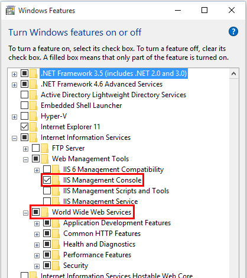
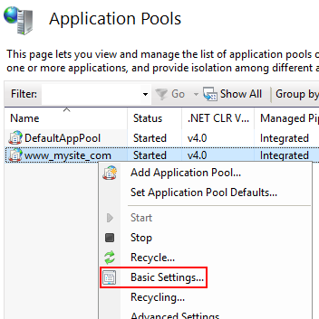
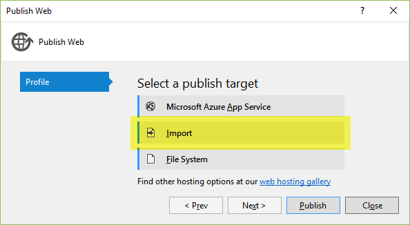

# Publishing to IIS

By [Luke Latham](https://github.com/GuardRex) and [Rick Anderson](https://twitter.com/RickAndMSFT)

## Supported operating systems

The following operating systems are supported:

* Windows 7 and newer

* Windows Server 2008 R2 and newer*

*Conceptually, the IIS configuration described in this document also applies to hosting ASP.NET Core applications on Nano Server IIS, but refer to [ASP.NET Core on Nano Server](../tutorials/nano-server.md) for specific instructions.

## IIS configuration

Enable the **Web Server (IIS)** server role and establish role services.

### Windows desktop operating systems

Navigate to **Control Panel > Programs > Programs and Features > Turn Windows features on or off** (left side of the screen). Open the group for **Internet Information Services** and **Web Management Tools**. Check the box for **IIS Management Console**. Check the box for **World Wide Web Services**. Accept the default features for **World Wide Web Services** or customize the IIS features to suit your needs.



### Windows Server operating systems

For server operating systems, use the **Add Roles and Features** wizard via the **Manage** menu or the link in **Server Manager**. On the **Server Roles** step, check the box for **Web Server (IIS)**.


On the **Role services** step, select the IIS role services you desire or accept the default role services provided.


Proceed through the **Confirmation** step to install the web server role and services. A server/IIS restart is not required after installing the Web Server (IIS) role.

## Install the .NET Core Windows Server Hosting bundle

1. Install the [.NET Core Windows Server Hosting](https://aka.ms/dotnetcore_windowshosting_1_1_0) bundle on the server. The bundle will install the .NET Core Runtime, .NET Core Library, and the [ASP.NET Core Module](../fundamentals/servers/aspnet-core-module.md). The module creates the reverse-proxy between IIS and the Kestrel server.

2. Restart the server or execute **net stop was /y** followed by **net start w3svc** from a command prompt to pick up a change to the system PATH.

> [!NOTE]
> If you only plan to host self-contained deployments and thus don't require the .NET Core runtime on the server, you have the option of only installing the ASP.NET Core Module by running the installer from an Administrator command prompt: **DotNetCore.1.1.0-WindowsHosting.exe OPT_INSTALL_LTS_REDIST=0 OPT_INSTALL_FTS_REDIST=0**

> [!NOTE]
> If you use an IIS Shared Configuration, see [ASP.NET Core Module with IIS Shared Configuration](../hosting/aspnet-core-module.md#aspnet-core-module-with-iis-shared-configuration).

For more information, see [ASP.NET Core Module overview](../fundamentals/servers/aspnet-core-module.md) and [ASP.NET Core Module Configuration Reference](../hosting/aspnet-core-module.md).

## Install Web Deploy when publishing with Visual Studio

If you intend to deploy your applications with Web Deploy in Visual Studio, install the latest version of Web Deploy on the server. To install Web Deploy, you can use the [Web Platform Installer (WebPI)](https://www.microsoft.com/web/downloads/platform.aspx) or obtain an installer directly from the [Microsoft Download Center](https://www.microsoft.com/en-us/search/result.aspx?q=webdeploy&form=dlc). The preferred method is to use WebPI. WebPI offers a standalone setup and a configuration for hosting providers.

## Application configuration

### Enabling the *IISIntegration* components

Include a dependency on the *Microsoft.AspNetCore.Server.IISIntegration* package in the application dependencies. Incorporate IIS Integration middleware into the application by adding the *.UseIISIntegration()* extension method to *WebHostBuilder()*.

```csharp
var host = new WebHostBuilder()
    .UseKestrel()
    .UseContentRoot(Directory.GetCurrentDirectory())
    .UseIISIntegration()
    .UseStartup<Startup>()
    .Build();
```

Note that code calling *.UseIISIntegration()* does not affect code portability.

### Setting *IISOptions* for the *IISIntegration* service

To configure *IISIntegration* service options, include a service configuration for *IISOptions* in *ConfigureServices*.

```csharp
services.Configure<IISOptions>(options => {
  ...
});
```

| Option | Setting|
| --- | --- | 
| AutomaticAuthentication | If true, the authentication middleware will alter the request user arriving and respond to generic challenges. If false,the authentication middleware will only provide identity and respond to challenges when explicitly indicated by theAuthenticationScheme |
| ForwardClientCertificate | If true and the `MS-ASPNETCORE-CLIENTCERT` request header is present, the `ITLSConnectionFeature` will be populated. |
| ForwardWindowsAuthentication | If true, authentication middleware will attempt to authenticate using platform handler windows authentication. If false, authentication middleware won’t be added. |

### *publish-iis* tool

The *publish-iis* tool can be added to any .NET Core application and will configure the ASP.NET Core Module by creating or modifying the *web.config* file. The tool runs after publishing with the *dotnet publish* command or publishing with Visual Studio and will configure the *processPath* and *arguments* for you. If you're publishing a *web.config* file by including the file in your project and listing the file in the *publishOptions* section of *project.json*, the tool will not modify other IIS settings you have included in the file.

To include the *publish-iis* tool in your application, add entries to the *tools* and *scripts* sections of *project.json*.

```json
"tools": {
  "Microsoft.AspNetCore.Server.IISIntegration.Tools": "1.1.0-preview4-final"
},
"scripts": {
  "postpublish": "dotnet publish-iis --publish-folder %publish:OutputPath% --framework %publish:FullTargetFramework%"
}
```

## Configure the website in IIS

1. On the target IIS server, create a folder to contain the application's published folders and files, which are described in [Directory Structure](../hosting/directory-structure.md).

2. Within the folder you created, create a *logs* folder to hold application logs (if you plan to enable logging). If you plan to deploy your application with a *logs* folder in the payload, you may skip this step.

3. In **IIS Manager**, create a new website. Provide a **Site name** and set the **Physical path** to the application's deployment folder that you created. Provide the **Binding** configuration and create the website.

4. Set the application pool to **No Managed Code**. ASP.NET Core runs in a separate process and manages the runtime.

5. Open the **Add Website** window.

   

6. Configure the website.

   

7. In the **Application Pools** panel, open the **Edit Application Pool** window by right-clicking on the website's application pool and selecting **Basic Settings...** from the popup menu.

   

8. Set the **.NET CLR version** to **No Managed Code**.

   
   
> [!NOTE]
> If you change the default identity of the application pool from **ApplicationPoolIdentity**, verify the new identity has the required permissions to access the application's folder and database.

## Deploy the application
Deploy the application to the folder you created on the target IIS server. Web Deploy is the recommended mechanism for deployment. Alternatives to Web Deploy are listed below.

### Web Deploy with Visual Studio
Create a [Publish Profile in Visual Studio](https://msdn.microsoft.com/en-us/library/dd465337(v=vs.110).aspx#Anchor_0) and click the **Publish** button to deploy your application. If your hosting provider supplies a Publish Profile or support for creating one, download their profile and import it using the Visual Studio **Publish Web** dialog.



### Web Deploy outside of Visual Studio
You can also use Web Deploy outside of Visual Studio from the command line. For more information, see [Web Deployment Tool](https://technet.microsoft.com/en-us/library/dd568996(WS.10).aspx).

### Alternatives to Web Deploy
If you don't wish to use Web Deploy or are not using Visual Studio, you may use any of several methods to move the application to the server, such as Xcopy, Robocopy, or PowerShell. Visual Studio users may use the [Publish Samples](https://github.com/aspnet/vsweb-publish/blob/master/samples/samples.md).

## Browse the website

   
>[!WARNING]
> .NET Core applications are hosted via a reverse-proxy between IIS and the Kestrel server. In order to create the reverse-proxy, the *web.config* file must be present at the content root path (typically the app base path) of the deployed application, which is the website physical path provided to IIS. Sensitive files exist on the app's physical path, including subfolders, such as *my_application.runtimeconfig.json*, *my_application.xml* (XML Documentation comments), and *my_application.deps.json*. The *web.config* file is required to create the reverse proxy to Kestrel, which prevents IIS from serving these and other sensitive files. **Therefore, it is important that the *web.config* file is never accidently renamed or removed from the deployment.**

## Create a Data Protection Registry Hive

Data Protection keys used by ASP.NET applications are stored in registry hives external to the applications. To persist the keys for a given application, you must create a registry hive for the application's application pool.

For standalone IIS installations, you may use the [Data Protection Provision-AutoGenKeys.ps1 PowerShell script](https://github.com/aspnet/DataProtection/blob/dev/Provision-AutoGenKeys.ps1) for each application pool used with an ASP.NET Core application. The keys will be persisted in the registry.

In web farm scenarios, an application can be configured to use a UNC path to store its data protection key ring. By default, the data protection keys are not encrypted. You can deploy an x509 certificate to each machine to encrypt the key ring. See [Configuring Data Protection](../security/data-protection/configuration/overview.md#data-protection-configuring) for details.

>[!WARNING]
> Data Protection is used by various ASP.NET middlewares, including those used in authentication. Even if you do not specifically call any Data Protection APIs from your own code you should configure Data Protection with the deployment script or in your own code. If you do not configure data protection when using IIS by default the keys will be held in memory and discarded when your application closes or restarts. This will then, for example, invalidate any cookies written by the cookie authentication and users will have to login again.

## Configuration of sub-applications

When adding applications to an IIS Site's root application, the root application *web.config* file should include the `<handlers>` section, which adds the ASP.NET Core Module as a handler for the app. Applications added to the root application shouldn't include the `<handlers>` section. If you repeat the `<handlers>` section in a sub-application's *web.config* file, you will receive a 500.19 (Internal Server Error) referencing the faulty config file when you attempt to browse the sub-application.

## Configuration of IIS via *web.config*

IIS configuration is still influenced by the `<system.webServer>` section of *web.config* for those IIS features that apply to a reverse proxy configuration. For example, you may have IIS configured at the server level to use dynamic compression, but you could disable that setting for an app with the `<urlCompression>` element in the app's *web.config* file. For more information, see the [configuration reference for `<system.webServer>`](https://www.iis.net/configreference/system.webserver) and the [ASP.NET Core Module Configuration Reference](../hosting/aspnet-core-module.md).

## Troubleshooting tips

To diagnose problems with IIS deployments, study browser output, examine the server's **Application** log through **Event Viewer**, and enable `stdout` logging. The **ASP.NET Core Module** log will be found on the path provided in the *stdoutLogFile* attribute of the `<aspNetCore>` element in *web.config*. Any folders on the path provided in the attribute value must exist in the deployment. You must also set *stdoutLogEnabled="true"*. Applications that use the *publish-iis* tooling to create the *web.config* file will default the *stdoutLogEnabled* setting to *false*, so you must manually provide the file or modify the file in order to enable `stdout` logging.

Several of the common errors do not appear in the browser, Application Log, and ASP.NET Core Module Log until the module *startupTimeLimit* (default: 120 seconds) and *startupRetryCount* (default: 2) have passed. Therefore, wait a full six minutes before deducing that the module has failed to start a process for the application.

One quick way to determine if the application is working properly is to run the application directly on Kestrel. If the application was published as a framework-dependent deployment, execute **dotnet my_application.dll** in the deployment folder. If the application was published as a self-contained deployment, run the application's executable directly from a command prompt, **my_application.exe**, in the deployment folder. If Kestrel is listening on default port 5000, you should be able to browse the application at `http://localhost:5000/`. If the application responds normally at the Kestrel endpoint address, the problem is more likely related to the IIS-ASP.NET Core Module-Kestrel configuration and less likely within the application itself.

One way to determine if the IIS reverse proxy to the Kestrel server is working properly is to perform a simple static file request for a stylesheet, script, or image from the application's static files in *wwwroot* using [Static File middleware](../fundamentals/static-files.md). If the application can serve static files but MVC Views and other endpoints are failing, the problem is less likely related to the IIS-ASP.NET Core Module-Kestrel configuration and more likely within the application itself (for example, MVC routing or 500 Internal Server Error).

When Kestrel starts normally behind IIS but the app won't run on the server after successfully running locally, you can temporarily add an environment variable to *web.config* to set the `ASPNETCORE_ENVIRONMENT` to `Development`. As long as you don't override the environment in app startup, this will allow the [developer exception page](../fundamentals/error-handling.md) to appear when the app is run on the server. Setting the environment variable for `ASPNETCORE_ENVIRONMENT` in this way is only recommended for staging/testing servers that are not exposed to the Internet. Be sure you remove the environment variable from the *web.config* file when finished. For information on setting environment variables via *web.config* for the reverse proxy, see [environmentVariables child element of aspNetCore](../hosting/aspnet-core-module.md#environmentvariables-child-element-of-aspnetcore).

In most cases, enabling application logging will assist in troubleshooting problems with application or the reverse proxy. See [Logging](../fundamentals/logging.md) for more information.

Our last troubleshooting tip pertains to apps that fail to run after upgrading either the .NET Core SDK on the development machine or package versions within the app. In some cases, incoherent packages may break an app when performing major upgrades. You can fix most of these issues by deleting the `bin` and `obj` folders in the project, clearing package caches at `%UserProfile%\.nuget\packages\` and `%LocalAppData%\Nuget\v3-cache`, restoring the project, and confirming that your prior deployment on the server has been completely deleted prior to re-deploying the app.

>[!TIP]
> A convenient way to clear package caches is to obtain the `NuGet.exe` tool from [NuGet.org](https://www.nuget.org/), add it to your system PATH, and execute `nuget locals all -clear` from a command prompt.

## Common errors

The following is not a complete list of errors. Should you encounter an error not listed here, please leave a detailed error message in the comments section below.

### Installer unable to obtain VC++ Redistributable

* **Installer Exception:** 0x80072efd or 0x80072f76 - Unspecified error

* **Installer Log Exception\*:** Error 0x80072efd or 0x80072f76: Failed to execute EXE package

  \*The log is located at C:\Users\\{USER}\AppData\Local\Temp\dd_DotNetCoreWinSvrHosting__{timestamp}.log.

Troubleshooting:

* If the server does not have Internet access while installing the server hosting bundle, this exception will occur when the installer is prevented from obtaining the *Microsoft Visual C++ 2015 Redistributable (x64)*. You may obtain an installer from the [Microsoft Download Center](https://www.microsoft.com/en-us/download/details.aspx?id=53840). If the installer fails, you may not receive the .NET Core runtime required to host framework-dependent deployments. If you plan to host framework-dependent deployments, confirm that the runtime is installed in Programs &amp; Features. You may obtain a runtime installer from [.NET Downloads](https://www.microsoft.com/net/download/core). After installing the runtime, restart the server or restart IIS by executing **net stop was /y** followed by **net start w3svc** from a command prompt.

### OS upgrade removed the 32-bit ASP.NET Core Module

* **Application Log:** The Module DLL **C:\WINDOWS\system32\inetsrv\aspnetcore.dll** failed to load. The data is the error.

Troubleshooting:

* Non-OS files in the **C:\Windows\SysWOW64\inetsrv** directory are not preserved during an OS upgrade. If you have the ASP.NET Core Module installed prior to an OS upgrade and then try to run any AppPool in 32-bit mode after an OS upgrade, you will encounter this issue. After an OS upgrade, repair the ASP.NET Core Module. See [Install the .NET Core Windows Server Hosting bundle](#install-the-net-core-windows-server-hosting-bundle). Select **Repair** when you run the installer.

### Platform conflicts with RID

* **Browser:** HTTP Error 502.5 - Process Failure

* **Application Log:** Application 'MACHINE/WEBROOT/APPHOST/MY_APPLICATION' with physical root 'C:\{PATH}\' failed to start process with commandline '"C:\\{PATH}\my_application.{exe|dll}" ', ErrorCode = '0x80004005 : ff.

* **ASP.NET Core Module Log:** Unhandled Exception: System.BadImageFormatException: Could not load file or assembly 'my_application.dll'. An attempt was made to load a program with an incorrect format.

Troubleshooting:

* Confirm that you didn't set a **platform** in **buildOptions** of *project.json* that conflicts with the publishing RID. For example, do not specify a **platform** of **x86** and publish with an RID of **win10-x64** (**dotnet publish -c Release -r win10-x64**). The project will publish without warning or error but fail with the above logged exceptions on the server.

### URI endpoint wrong or stopped website

* **Browser:** ERR_CONNECTION_REFUSED

* **Application Log:** No entry

* **ASP.NET Core Module Log:** Log file not created

Troubleshooting:

* Confirm you are using the correct URI endpoint for the application. Check your bindings.

* Confirm that the IIS website is not in the *Stopped* state.

### CoreWebEngine or W3SVC server features disabled

* **OS Exception:** The IIS 7.0 CoreWebEngine and W3SVC features must be installed to use the ASP.NET Core Module.

Troubleshooting:

* Confirm that you have enabled the proper server role and features. See [IIS Configuration](#iis-configuration).

### Incorrect website physical path or application missing

* **Browser:** 403 Forbidden - Access is denied **--OR--** 403.14 Forbidden - The Web server is configured to not list the contents of this directory.

* **Application Log:** No entry

* **ASP.NET Core Module Log:** Log file not created

Troubleshooting:

* Check the IIS website **Basic Settings** and the physical application folder. Confirm that the application is in the folder at the IIS website **Physical path**.

### Incorrect server role, module not installed, or incorrect permissions

* **Browser:** 500.19 Internal Server Error - The requested page cannot be accessed because the related configuration data for the page is invalid.

* **Application Log:** No entry

* **ASP.NET Core Module Log:** Log file not created

Troubleshooting:

* Confirm that you have enabled the proper server role. See [IIS Configuration](#iis-configuration).

* Check **Programs &amp; Features** and confirm that the **Microsoft ASP.NET Core Module** has been installed. If the **Microsoft ASP.NET Core Module** is not present in the list of installed programs, install the module. See [Install the .NET Core Windows Server Hosting bundle](#install-the-net-core-windows-server-hosting-bundle).

* Make sure that the **Application Pool > Process Model > Identity** is set to **ApplicationPoolIdentity** or your custom identity has the correct permissions to access the application's deployment folder.

### Incorrect *processPath*, missing PATH variable, hosting bundle not installed, server/IIS not restarted, VC++ Redistributable not installed, or *dotnet.exe* access violation

* **Browser:** HTTP Error 502.5 - Process Failure

* **Application Log:** Application 'MACHINE/WEBROOT/APPHOST/MY_APPLICATION' with physical root 'C:\\{PATH}\' failed to start process with commandline '".\my_application.exe" ', ErrorCode = '0x80070002 : 0.

* **ASP.NET Core Module Log:** Log file created but empty

Troubleshooting:

* Check the *processPath* attribute on the `<aspNetCore>` element in *web.config* to confirm that it is *dotnet* for a framework-dependent deployment or *.\my_application.exe* for a self-contained deployment.

* For a framework-dependent deployment, *dotnet.exe* might not be accessible via the PATH settings. Confirm that *C:\Program Files\dotnet\* exists in the System PATH settings.

* For a framework-dependent deployment, *dotnet.exe* might not be accessible for the user identity of the Application Pool. Confirm that the AppPool user identity has access to the *C:\Program Files\dotnet* directory. Confirm that there are no deny rules configured for the AppPool user identity on the *C:\Program Files\dotnet* and application directories.

* You may have deployed a framework-dependent deployment and installed .NET Core without restarting IIS. Either restart the server or restart IIS by executing **net stop was /y** followed by **net start w3svc** from a command prompt.

* You may have deployed a framework-dependent deployment without installing the .NET Core runtime on the server. If you are attempting to deploy a framework-dependent deployment and have not installed the .NET Core runtime, run the **.NET Core Windows Server Hosting bundle installer** on the server. See [Install the .NET Core Windows Server Hosting bundle](#install-the-net-core-windows-server-hosting-bundle). If you are attempting to install the .NET Core runtime on a server without an Internet connection, obtain the runtime from [.NET Downloads](https://www.microsoft.com/net/download/core) and run the hosting bundle installer from an administrator command prompt to only install the module using **DotNetCore.1.1.0-WindowsHosting.exe OPT_INSTALL_LTS_REDIST=0 OPT_INSTALL_FTS_REDIST=0**. Complete the installation by restarting the server or restarting IIS by executing **net stop was /y** followed by **net start w3svc** from a command prompt.

* You may have deployed a framework-dependent deployment and installed .NET Core without restarting the server/IIS. Either restart the server or restart IIS by executing **net stop was /y** followed by **net start w3svc** from a command prompt.

* You may have deployed a framework-dependent deployment and the *Microsoft Visual C++ 2015 Redistributable (x64)* is not installed on the server. You may obtain an installer from the [Microsoft Download Center](https://www.microsoft.com/en-us/download/details.aspx?id=53840).

### Incorrect *arguments* of *<aspNetCore>* element

* **Browser:** HTTP Error 502.5 - Process Failure

* **Application Log:** Application 'MACHINE/WEBROOT/APPHOST/MY_APPLICATION' with physical root 'C:\\{PATH}\' failed to start process with commandline '"dotnet" .\my_application.dll', ErrorCode = '0x80004005 : 80008081.

* **ASP.NET Core Module Log:** The application to execute does not exist: 'PATH\my_application.dll'

Troubleshooting:

* Examine the *arguments* attribute on the *<aspNetCore>* element in *web.config* to confirm that it is either (a) *.\my_applciation.dll* for a framework-dependent deployment; or (b) not present, an empty string (*arguments=""*), or a list of your application's arguments (*arguments="arg1, arg2, ..."*) for a self-contained deployment.

### Missing .NET Framework version

* **Browser:** 502.3 Bad Gateway - There was a connection error while trying to route the request.

* **Application Log:** ErrorCode = Application 'MACHINE/WEBROOT/APPHOST/MY_APPLICATION' with physical root 'C:\\{PATH}\' failed to start process with commandline '"dotnet" .\my_application.dll', ErrorCode = '0x80004005 : 80008081.

* **ASP.NET Core Module Log:** Missing method, file, or assembly exception. The method, file, or assembly specified in the exception is a .NET Framework method, file, or assembly.

Troubleshooting:

* Install the .NET Framework version missing from the server.

### Stopped Application Pool

* **Browser:** 503 Service Unavailable

* **Application Log:** No entry

* **ASP.NET Core Module Log:** Log file not created

Troubleshooting

* Confirm that the Application Pool is not in the *Stopped* state.

### IIS Integration middleware not implemented

* **Browser:** HTTP Error 502.5 - Process Failure

* **Application Log:** Application 'MACHINE/WEBROOT/APPHOST/MY_APPLICATION' with physical root 'C:\\{PATH}\' created process with commandline '"C:\\{PATH}\my_application.{exe|dll}" ' but either crashed or did not reponse or did not listen on the given port '{PORT}', ErrorCode = '0x800705b4'

* **ASP.NET Core Module Log:** Log file created and shows normal operation.

Troubleshooting

* Confirm that you have correctly referenced the IIS Integration middleware by calling the *.UseIISIntegration()* method on the application's *WebHostBuilder()*.

### Sub-application includes a `<handlers>` section

* **Browser:** HTTP Error 500.19 - Internal Server Error

* **Application Log:** No entry

* **ASP.NET Core Module Log:** Log file created and shows normal operation for the root application. Log file not created for the sub-application.

Troubleshooting

* Confirm that the sub-application's *web.config* file doesn't include a `<handlers>` section.

### Application configuration general issue

* **Browser:** HTTP Error 502.5 - Process Failure

* **Application Log:** Application 'MACHINE/WEBROOT/APPHOST/MY_APPLICATION' with physical root 'C:\\{PATH}\' created process with commandline '"C:\\{PATH}\my_application.{exe|dll}" ' but either crashed or did not reponse or did not listen on the given port '{PORT}', ErrorCode = '0x800705b4'

* **ASP.NET Core Module Log:** Log file created but empty

Troubleshooting

* This general exception indicates that the process failed to start, most likely due to an application configuration issue. Referring to [Directory Structure](../hosting/directory-structure.md), confirm that your application's deployed files and folders are appropriate and that your application's configuration files are present and contain the correct settings for your app and environment.

## Additional resources

* [Introduction to ASP.NET Core](../index.md)

* [The Official Microsoft IIS Site](http://www.iis.net/)

* [Microsoft TechNet Library: Windows Server](https://technet.microsoft.com/en-us/library/bb625087.aspx)
