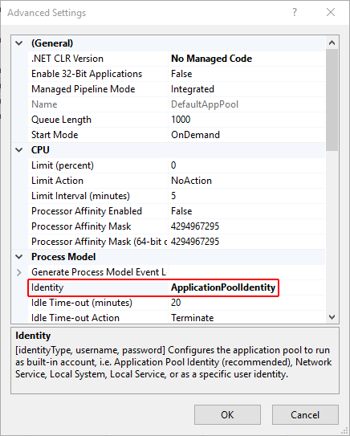
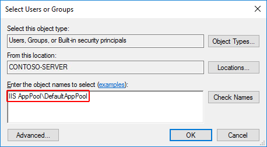
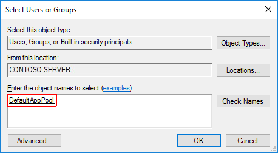

# Host ASP.NET Core on Windows with IIS

By [Luke Latham](https://github.com/guardrex) and [Rick Anderson](https://twitter.com/RickAndMSFT)

## Supported operating systems

The following operating systems are supported:

* Windows 7 and newer
* Windows Server 2008 R2 and newer&#8224;

&#8224;Conceptually, the IIS configuration described in this document also applies to hosting ASP.NET Core applications on Nano Server IIS, but refer to [ASP.NET Core with IIS on Nano Server](xref:tutorials/nano-server) for specific instructions.

[HTTP.sys server](xref:fundamentals/servers/httpsys) (formerly called [WebListener](xref:fundamentals/servers/weblistener)) won't work in a reverse-proxy configuration with IIS. You must use the [Kestrel server](xref:fundamentals/servers/kestrel).

## IIS configuration

Enable the **Web Server (IIS)** role and establish role services.

### Windows desktop operating systems

Navigate to **Control Panel** > **Programs** > **Programs and Features** > **Turn Windows features on or off** (left side of the screen). Open the group for **Internet Information Services** and **Web Management Tools**. Check the box for **IIS Management Console**. Check the box for **World Wide Web Services**. Accept the default features for **World Wide Web Services** or customize the IIS features to suit your needs.


### Windows Server operating systems

For server operating systems, use the **Add Roles and Features** wizard via the **Manage** menu or the link in **Server Manager**. On the **Server Roles** step, check the box for **Web Server (IIS)**.


On the **Role services** step, select the IIS role services you desire or accept the default role services provided.


Proceed through the **Confirmation** step to install the web server role and services. A server/IIS restart isn't required after installing the Web Server (IIS) role.

## Install the .NET Core Windows Server Hosting bundle

1. Install the [.NET Core Windows Server Hosting bundle](https://aka.ms/dotnetcore.2.0.0-windowshosting) on the hosting system. The bundle installs the .NET Core Runtime, .NET Core Library, and the [ASP.NET Core Module](xref:fundamentals/servers/aspnet-core-module). The module creates the reverse-proxy between IIS and the Kestrel server. If the system doesn't have an Internet connection, obtain and install the [Microsoft Visual C++ 2015 Redistributable](https://www.microsoft.com/download/details.aspx?id=53840) before installing the .NET Core Windows Server Hosting bundle.

2. Restart the system or execute **net stop was /y** followed by **net start w3svc** from a command prompt to pick up a change to the system PATH.

> [!NOTE]
> If you use an IIS Shared Configuration, see [ASP.NET Core Module with IIS Shared Configuration](xref:hosting/aspnet-core-module#aspnet-core-module-with-an-iis-shared-configuration).

## Install Web Deploy when publishing with Visual Studio

If you intend to deploy your applications with [Web Deploy](/iis/publish/using-web-deploy/introduction-to-web-deploy) in [Visual Studio](https://www.visualstudio.com/vs/), install the latest version of Web Deploy on the hosting system. To install Web Deploy, you can use the [Web Platform Installer (WebPI)](https://www.microsoft.com/web/downloads/platform.aspx) or obtain an installer directly from the [Microsoft Download Center](https://www.microsoft.com/download/details.aspx?id=43717). The preferred method is to use WebPI. WebPI offers a standalone setup and a configuration for hosting providers.

## Application configuration

### Enabling the IISIntegration components

# [ASP.NET Core 2.x](#tab/aspnetcore2x)

A typical *Program.cs* calls [CreateDefaultBuilder](/dotnet/api/microsoft.aspnetcore.webhost.createdefaultbuilder) to begin setting up a host. `CreateDefaultBuilder` configures [Kestrel](xref:fundamentals/servers/kestrel) as the web server and enables IIS integration by configuring the base path and port for the [ASP.NET Core Module](xref:fundamentals/servers/aspnet-core-module):

```csharp
public static IWebHost BuildWebHost(string[] args) =>
    WebHost.CreateDefaultBuilder(args)
        ...
```

# [ASP.NET Core 1.x](#tab/aspnetcore1x)

Include a dependency on the [Microsoft.AspNetCore.Server.IISIntegration](https://www.nuget.org/packages/Microsoft.AspNetCore.Server.IISIntegration/) package in your app dependencies. Incorporate IIS Integration middleware into the app by adding the *UseIISIntegration* extension method to *WebHostBuilder*:

```csharp
var host = new WebHostBuilder()
    .UseKestrel()
    .UseIISIntegration()
    ...
```

Both `UseKestrel` and `UseIISIntegration` are required. Code calling *UseIISIntegration* doesn't affect code portability. If the app isn't run behind IIS (for example, the app is run directly on Kestrel), `UseIISIntegration` no-ops.

---

For more information on hosting, see [Hosting in ASP.NET Core](xref:fundamentals/hosting).

### IIS options

To configure *IISIntegration* service options, include a service configuration for *IISOptions* in *ConfigureServices*:

```csharp
services.Configure<IISOptions>(options => 
{
    ...
});
```

| Option                         | Default | Setting |
| ------------------------------ | ------- | ------- |
| `AutomaticAuthentication`      | `true`  | If `true`, the authentication middleware sets the `HttpContext.User` and responds to generic challenges. If `false`, the authentication middleware only provides an identity (`HttpContext.User`) and responds to challenges when explicitly requested by the `AuthenticationScheme`. Windows Authentication must be enabled in IIS for `AutomaticAuthentication` to function. |
| `AuthenticationDisplayName`    | `null`  | Sets the display name shown to users on login pages. |
| `ForwardClientCertificate`     | `true`  | If `true` and the `MS-ASPNETCORE-CLIENTCERT` request header is present, the `HttpContext.Connection.ClientCertificate` is populated. |

### web.config

The *web.config* file configures the ASP.NET Core Module and provides other IIS configuration. Creating, transforming, and publishing *web.config* is handled by `Microsoft.NET.Sdk.Web`, which is included when you set your project's SDK at the top of your project (*.csproj*) file, `<Project Sdk="Microsoft.NET.Sdk.Web">`. To prevent the MSBuild target from transforming your *web.config* file, add the **\<IsTransformWebConfigDisabled>** property to your project file with a setting of `true`:

```xml
<PropertyGroup>
  <IsTransformWebConfigDisabled>true</IsTransformWebConfigDisabled>
</PropertyGroup>
```

If you don't have a *web.config* file in the project when you publish with *dotnet publish* or with Visual Studio publish, the file is created for you in [published output](xref:hosting/directory-structure). If you have a *web.config* file in your project, it's transformed with the correct *processPath* and *arguments* to configure the [ASP.NET Core Module](xref:fundamentals/servers/aspnet-core-module) and moved to published output. The transformation doesn't touch IIS configuration settings that you've included in the file.

## Create the IIS Website

1. On the target IIS system, create a folder to contain the app's published folders and files, which are described in [Directory Structure](xref:hosting/directory-structure).

2. Within the folder you created, create a *logs* folder to hold stdout logs (if you plan to enable logging to troubleshoot start-up issues). If you plan to deploy your application with a *logs* folder in the payload, you may skip this step. There's an [open issue to create the folder automatically](https://github.com/aspnet/AspNetCoreModule/issues/30). If you would like MSBuild to create the *log* folder for you, add the following `Target` to your project file:

   ```xml
   <Target Name="CreateLogsFolder" AfterTargets="AfterPublish">
     <MakeDir Directories="$(PublishDir)logs" Condition="!Exists('$(PublishDir)logs')" />
     <MakeDir Directories="$(PublishUrl)logs" Condition="!Exists('$(PublishUrl)logs')" />
   </Target>
   ```

3. In **IIS Manager**, create a new website. Provide a **Site name** and set the **Physical path** to the app's deployment folder that you created. Provide the **Binding** configuration and create the website.

4. Set the application pool to **No Managed Code**. ASP.NET Core runs in a separate process and manages the runtime.

5. Open the **Add Website** window.

   

6. Configure the website.

   

7. In the **Application Pools** panel, open the **Edit Application Pool** window by right-clicking on the website's app pool and selecting **Basic Settings...** from the popup menu.

   

8. Set the **.NET CLR version** to **No Managed Code**.

   
     
    Note: Setting the **.NET CLR version** to **No Managed Code** is optional. ASP.NET Core doesn't rely on loading the desktop CLR.

9. Confirm the process model identity has the proper permissions.

   If you change the default identity of the app pool (**Process Model** > **Identity**) from **ApplicationPoolIdentity** to another identity, verify that the new identity has the required permissions to access the app's folder, database, and other required resources.
   
## Deploy the application
Deploy the application to the folder you created on the target IIS system. [Web Deploy](/iis/publish/using-web-deploy/introduction-to-web-deploy) is the recommended mechanism for deployment. Alternatives to Web Deploy are listed below.

Confirm that the published app for deployment isn't running. Files in the *publish* folder are locked when the app is running. Deployment can't occur because locked files can't be copied.

### Web Deploy with Visual Studio
See [Create publish profiles for Visual Studio and MSBuild, to deploy ASP.NET Core apps](xref:publishing/web-publishing-vs#publish-profiles) topic to learn how to create a publish profile for use with Web Deploy. If your hosting provider supplies a Publish Profile or support for creating one, download their profile and import it using the Visual Studio **Publish** dialog.


### Web Deploy outside of Visual Studio
You can also use [Web Deploy](/iis/publish/using-web-deploy/introduction-to-web-deploy) outside of Visual Studio from the command line. For more information, see [Web Deployment Tool](/iis/publish/using-web-deploy/use-the-web-deployment-tool).

### Alternatives to Web Deploy
If you don't wish to use Web Deploy or are not using Visual Studio, you may use any of several methods to move the application to the hosting system, such as Xcopy, Robocopy, or PowerShell. Visual Studio users may use the [Publish Samples](https://github.com/aspnet/vsweb-publish/blob/master/samples/samples.md).

## Browse the website

   
> [!WARNING]
> .NET Core apps are hosted via a reverse-proxy between IIS and the Kestrel server. In order to create the reverse-proxy, the *web.config* file must be present at the content root path (typically the app base path) of the deployed application, which is the website physical path provided to IIS. Sensitive files exist on the app's physical path, including subfolders, such as *my_application.runtimeconfig.json*, *my_application.xml* (XML Documentation comments), and *my_application.deps.json*. The *web.config* file is required to create the reverse proxy to Kestrel, which prevents IIS from serving these and other sensitive files. **Therefore, it's important that the *web.config* file isn't accidently renamed or removed from the deployment.**

## Data protection

An ASP.NET Core application stores the keyring in memory under the following conditions:

* A website is hosted behind IIS.
* The Data Protection stack hasn't been configured to store the keyring in a persistent store.

If the keyring is stored in memory when the app restarts:

* All forms authentication tokens are invalidated. 
* Users are required to login again on their next request. 
* Any data you protected with the keyring are no longer protected.

> [!WARNING]
> Data Protection is used by several ASP.NET middlewares, including those used in authentication. Even if you don't call Data Protection APIs from your own code, you should configure Data Protection with a deployment script or in your code. If you don't configure data protection, by default the keys are held in memory and discarded when your app restarts. Restarting invalidates cookies written by the cookie authentication middleware and users must login again.

To configure Data Protection under IIS, you must use one of the following approaches:

* Run a [powershell script](https://github.com/aspnet/DataProtection/blob/dev/Provision-AutoGenKeys.ps1) to create suitable registry entries (For example, `.\Provision-AutoGenKeys.ps1 DefaultAppPool`). This stores keys in the registry, protected using DPAPI with a machine-wide key.
* Configure the IIS Application Pool to load the user profile. This setting is in the **Process Model** section under the **Advanced Settings** for the application pool. Set **Load User Profile** to `True`. This stores keys under the user profile directory and protects them using DPAPI with a key specific to the user account used for the app pool.
* Adjust your app code to [use the file system as a key ring store](xref:security/data-protection/configuration/overview). Use an X509 certificate to protect the keyring and ensure it's a trusted certificate. If it's a self signed certificate, you must place it in the Trusted Root store.

When using IIS in a web farm:

* Use a file share that all machines can access.
* Deploy an X509 certificate to each machine. Configure [data protection in code](https://docs.microsoft.com/aspnet/core/security/data-protection/configuration/overview).

### 1. Create a Data Protection Registry Hive

Data Protection keys used by ASP.NET applications are stored in registry hives external to the applications. To persist the keys for a given application, you must create a registry hive for the app's application pool.

For standalone IIS installations, you may use the [Data Protection Provision-AutoGenKeys.ps1 PowerShell script](https://github.com/aspnet/DataProtection/blob/dev/Provision-AutoGenKeys.ps1) for each app pool used with an ASP.NET Core app. This script creates a special registry key in the HKLM registry that is ACLed only to the worker process account. Keys are encrypted at rest using DPAPI.

In web farm scenarios, an app can be configured to use a UNC path to store its data protection keyring. By default, the data protection keys are not encrypted. You should ensure that the file permissions for such a share are limited to the Windows account the app runs as. In addition, you may choose to protect keys at rest using an X509 certificate. You may wish to consider a mechanism to allow users to upload certificates: Place certificates into the user's trusted certificate store and ensure they're available on all machines where the user's app runs. See [Configuring Data Protection](xref:security/data-protection/configuration/overview) for details.

### 2. Configure the IIS Application Pool to load the user profile

This setting is in the **Process Model** section under the **Advanced Settings** for the app pool. Set Load User Profile to `True`. This stores keys under the user profile directory and protects them using DPAPI with a key specific to the user account used for the app pool.

### 3. Machine-wide policy for data protection

The data protection system has limited support for setting a default [machine-wide policy](xref:security/data-protection/configuration/machine-wide-policy) for all apps that consume the Data Protection APIs. See the [data protection](xref:security/data-protection/index) documentation for more details.

## Configuration of sub-applications

Sub applications added under the root application shouldn't include the ASP.NET Core Module as a handler. If you add the module as a handler in a sub-application's *web.config* file, you receive a 500.19 (Internal Server Error) referencing the faulty config file when you attempt to browse the sub-app. The following example shows the contents of a published *web.config* file for an ASP.NET Core sub-app:

```xml
<?xml version="1.0" encoding="utf-8"?>
<configuration>
  <system.webServer>
    <aspNetCore processPath="dotnet" 
      arguments=".\MyApp.dll" 
      stdoutLogEnabled="false" 
      stdoutLogFile=".\logs\stdout" />
  </system.webServer>
</configuration>
```

If you intend to host a non-ASP.NET Core sub-app underneath an ASP.NET Core app, you must explicitly remove the inherited handler in the sub-app *web.config* file:

```xml
<?xml version="1.0" encoding="utf-8"?>
<configuration>
  <system.webServer>
    <handlers>
      <remove name="aspNetCore"/>
    </handlers>
    <aspNetCore processPath="dotnet" 
      arguments=".\MyApp.dll" 
      stdoutLogEnabled="false" 
      stdoutLogFile=".\logs\stdout" />
  </system.webServer>
</configuration>
```

For more information on configuring the ASP.NET Core Module with the *web.config* file, see the [Introduction to ASP.NET Core Module](xref:fundamentals/servers/aspnet-core-module) topic and the [ASP.NET Core Module configuration reference](xref:hosting/aspnet-core-module).

## Configuration of IIS with web.config

IIS configuration is still influenced by the `<system.webServer>` section of *web.config* for those IIS features that apply to a reverse proxy configuration. For example, you may have IIS configured at the system level to use dynamic compression, but you could disable that setting for an app with the `<urlCompression>` element in the app's *web.config* file. For more information, see the [configuration reference for `<system.webServer>`](https://docs.microsoft.com/iis/configuration/system.webServer/), [ASP.NET Core Module Configuration Reference](xref:hosting/aspnet-core-module) and [Using IIS Modules with ASP.NET Core](xref:hosting/iis-modules). If you need to set environment variables for individual apps running in isolated Application Pools (supported on IIS 10.0+), see the *AppCmd.exe command* section of the [Environment Variables \<environmentVariables>](/iis/configuration/system.applicationHost/applicationPools/add/environmentVariables/#appcmdexe) topic in the IIS reference documentation.

## Configuration sections of web.config

Unlike .NET Framework applications that are configured with the `<system.web>`, `<appSettings>`, `<connectionStrings>`, and `<location>` elements in *web.config*, ASP.NET Core apps are configured using other configuration providers. For more information, see [Configuration](xref:fundamentals/configuration).

## Application Pools

When hosting multiple websites on a single system, you should isolate the apps from each other by running each app in its own application pool. The IIS **Add Website** dialog defaults to this behavior. When you provide a **Site name**, the text is automatically transferred to the **Application pool** textbox. A new application pool is created using the site name when you add the website.

## Application Pool Identity

An application pool identity account allows you to run an application under a unique account without having to create and manage domains or local accounts. On IIS 8.0+, the IIS Admin Worker Process (WAS) creates a virtual account with the name of the new application pool and runs the app pool's worker processes under this account by default. In the IIS Management Console under **Advanced Settings** for your app pool, ensure that the **Identity** is set to use **ApplicationPoolIdentity** as shown in the image below.



The IIS management process creates a secure identifier with the name of the app pool in the Windows Security System. Resources can be secured by using this identity; however, this identity isn't a real user account and won't show up in the Windows User Management Console.

If you need to grant the IIS worker process elevated access to your app, you must modify the Access Control List (ACL) for the directory containing your application.

1. Open Windows Explorer and navigate to the directory.

2. Right click on the directory and click **Properties**.

3. Under the **Security** tab, click the **Edit** button and then the **Add** button.

4. Click the **Locations** button and make sure you select your system.

5. Enter **IIS AppPool\DefaultAppPool** in **Enter the object names to select** textbox.

  

6. Click the **Check Names** button and then click **OK**.

  

You can also do this via a command prompt using **ICACLS** tool:

```console
ICACLS C:\sites\MyWebApp /grant "IIS AppPool\DefaultAppPool":F
```

## Troubleshooting tips

To diagnose problems with IIS deployments:

* Study browser output.
* Examine the system's **Application** log through **Event Viewer**.
* Enable `stdout` logging. The **ASP.NET Core Module** log is found on the path provided in the *stdoutLogFile* attribute of the `<aspNetCore>` element in *web.config*. Any folders on the path provided in the attribute value must exist in the deployment. You must also set *stdoutLogEnabled="true"*. Apps that use the the `Microsoft.NET.Sdk.Web` SDK to create the *web.config* file default the *stdoutLogEnabled* setting to *false*, so you must manually provide the *web.config* file or modify the file in order to enable `stdout` logging.

Several of the common errors don't appear in the browser, Application Log, and ASP.NET Core Module Log until the module *startupTimeLimit* (default: 120 seconds) and *startupRetryCount* (default: 2) have passed. Therefore, wait a full six minutes before deducing that the module has failed to start a process for the app.

One quick way to determine if the app is working properly is to run the app directly on Kestrel. If the app was published as a framework-dependent deployment (FDD), execute `dotnet my_application.dll` in the deployment folder, which is the IIS physical path to the app. If the app was published as a self-contained deployment (SCD), run the app's executable directly from a command prompt, `my_application.exe`, in the deployment folder. If Kestrel is listening on default port 5000, you should be able to browse the app at `http://localhost:5000/`. If the app responds normally at the Kestrel endpoint address, the problem is more likely related to the IIS-ASP.NET Core Module-Kestrel configuration and less likely within the app itself.

One way to determine if the IIS reverse proxy to the Kestrel server is working properly is to perform a simple static file request for a stylesheet, script, or image from the app's static files in *wwwroot* using [Static File middleware](xref:fundamentals/static-files). If the app can serve static files but MVC Views and other endpoints are failing, the problem is less likely related to the IIS-ASP.NET Core Module-Kestrel configuration and more likely within the app itself (for example, MVC routing or 500 Internal Server Error).

When Kestrel starts normally behind IIS but the app won't run on the system after successfully running locally, you can temporarily add an environment variable to *web.config* to set the `ASPNETCORE_ENVIRONMENT` to `Development`. As long as you don't override the environment in app startup, this allows the [developer exception page](xref:fundamentals/error-handling) to appear when the app is run on the system. Setting the environment variable for `ASPNETCORE_ENVIRONMENT` in this way is only recommended for staging/testing systems that aren't exposed to the Internet. Be sure you remove the environment variable from the *web.config* file when finished. For information on setting environment variables via *web.config* for the reverse proxy, see [environmentVariables child element of aspNetCore](xref:hosting/aspnet-core-module#setting-environment-variables).

In most cases, enabling application logging assists in troubleshooting problems with the app or the reverse proxy. See [Logging](xref:fundamentals/logging) for more information.

Our last troubleshooting tip pertains to apps that fail to run after upgrading either the .NET Core SDK on the development machine or package versions within the app. In some cases, incoherent packages may break an app when performing major upgrades. You can fix most of these issues by deleting the `bin` and `obj` folders in the project, clearing package caches at `%UserProfile%\.nuget\packages\` and `%LocalAppData%\Nuget\v3-cache`, restoring the project, and confirming that your prior deployment on the system has been completely deleted prior to re-deploying the app.

> [!TIP]
> A convenient way to clear package caches is to obtain the *NuGet.exe* tool from [NuGet.org](https://www.nuget.org/), add it to your system PATH, and execute `nuget locals all -clear` from a command prompt. You can also execute the `dotnet nuget locals all --clear` command from a command prompt without obtaining *NuGet.exe*.

## Common errors

The following isn't a complete list of errors. Should you encounter an error not listed here, please leave a detailed error message in the comments section below.

### Installer unable to obtain VC++ Redistributable

* **Installer Exception:** 0x80072efd or 0x80072f76 - Unspecified error

* **Installer Log Exception&#8224;:** Error 0x80072efd or 0x80072f76: Failed to execute EXE package

  &#8224;The log is located at C:\Users\\{USER}\AppData\Local\Temp\dd_DotNetCoreWinSvrHosting__{timestamp}.log.

Troubleshooting:

* If the system doesn't have Internet access while installing the server hosting bundle, this exception occurs when the installer is prevented from obtaining the *Microsoft Visual C++ 2015 Redistributable*. You may obtain an installer from the [Microsoft Download Center](https://www.microsoft.com/download/details.aspx?id=53840). If the installer fails, you may not receive the .NET Core runtime required to host a framework-dependent deployment (FDD). If you plan to host an FDD, confirm that the runtime is installed in Programs &amp; Features. You may obtain a runtime installer from [.NET Downloads](https://www.microsoft.com/net/download/core). After installing the runtime, restart the system or restart IIS by executing **net stop was /y** followed by **net start w3svc** from a command prompt.

### OS upgrade removed the 32-bit ASP.NET Core Module

* **Application Log:** The Module DLL **C:\WINDOWS\system32\inetsrv\aspnetcore.dll** failed to load. The data is the error.

Troubleshooting:

* Non-OS files in the **C:\Windows\SysWOW64\inetsrv** directory aren't preserved during an OS upgrade. If you have the ASP.NET Core Module installed prior to an OS upgrade and then try to run any AppPool in 32-bit mode after an OS upgrade, you encounter this issue. After an OS upgrade, repair the ASP.NET Core Module. See [Install the .NET Core Windows Server Hosting bundle](#install-the-net-core-windows-server-hosting-bundle). Select **Repair** when you run the installer.

### Platform conflicts with RID

* **Browser:** HTTP Error 502.5 - Process Failure

* **Application Log:** Application 'MACHINE/WEBROOT/APPHOST/MY_APPLICATION' with physical root 'C:\{PATH}\' failed to start process with commandline '"C:\\{PATH}\my_application.{exe|dll}" ', ErrorCode = '0x80004005 : ff.

* **ASP.NET Core Module Log:** Unhandled Exception: System.BadImageFormatException: Could not load file or assembly 'my_application.dll'. An attempt was made to load a program with an incorrect format.

Troubleshooting:

* Confirm that the application runs locally on Kestrel. A process failure might be the result of a problem within the application. For more information, see [Troubleshooting tips](#troubleshooting-tips).

* Confirm that you didn't set a `<PlatformTarget>` in your *.csproj* that conflicts with the RID. For example, don't specify a `<PlatformTarget>` of `x86` and publish with an RID of `win10-x64`, either by using *dotnet publish -c Release -r win10-x64* or by setting the `<RuntimeIdentifiers>` in your *.csproj* to `win10-x64`. The project publishes without warning or error but fails with the above logged exceptions on the system.

* If this exception occurs for an Azure Apps deployment when upgrading an application and deploying newer assemblies, manually delete all files from the prior deployment. Lingering incompatible assemblies can result in a `System.BadImageFormatException` exception when deploying an upgraded app.

### URI endpoint wrong or stopped website

* **Browser:** ERR_CONNECTION_REFUSED

* **Application Log:** No entry

* **ASP.NET Core Module Log:** Log file not created

Troubleshooting:

* Confirm you are using the correct URI endpoint for the application. Check your bindings.

* Confirm that the IIS website is not in the *Stopped* state.

### CoreWebEngine or W3SVC server features disabled

* **OS Exception:** The IIS 7.0 CoreWebEngine and W3SVC features must be installed to use the ASP.NET Core Module.

Troubleshooting:

* Confirm that you have enabled the proper role and features. See [IIS Configuration](#iis-configuration).

### Incorrect website physical path or application missing

* **Browser:** 403 Forbidden - Access is denied **--OR--** 403.14 Forbidden - The Web server is configured to not list the contents of this directory.

* **Application Log:** No entry

* **ASP.NET Core Module Log:** Log file not created

Troubleshooting:

* Check the IIS website **Basic Settings** and the physical application folder. Confirm that the application is in the folder at the IIS website **Physical path**.

### Incorrect role, module not installed, or incorrect permissions

* **Browser:** 500.19 Internal Server Error - The requested page cannot be accessed because the related configuration data for the page is invalid.

* **Application Log:** No entry

* **ASP.NET Core Module Log:** Log file not created

Troubleshooting:

* Confirm that you've enabled the proper role. See [IIS Configuration](#iis-configuration).

* Check **Programs &amp; Features** and confirm that the **Microsoft ASP.NET Core Module** has been installed. If the **Microsoft ASP.NET Core Module** isn't present in the list of installed programs, install the module. See [Install the .NET Core Windows Server Hosting bundle](#install-the-net-core-windows-server-hosting-bundle).

* Make sure that the **Application Pool** > **Process Model** > **Identity** is set to **ApplicationPoolIdentity** or your custom identity has the correct permissions to access the app's deployment folder.

### Incorrect processPath, missing PATH variable, hosting bundle not installed, system/IIS not restarted, VC++ Redistributable not installed, or dotnet.exe access violation

* **Browser:** HTTP Error 502.5 - Process Failure

* **Application Log:** Application 'MACHINE/WEBROOT/APPHOST/MY_APPLICATION' with physical root 'C:\\{PATH}\' failed to start process with commandline '".\my_application.exe" ', ErrorCode = '0x80070002 : 0.

* **ASP.NET Core Module Log:** Log file created but empty

Troubleshooting:

* Confirm that the application runs locally on Kestrel. A process failure might be the result of a problem within the application. For more information, see [Troubleshooting tips](#troubleshooting-tips).

* Check the *processPath* attribute on the `<aspNetCore>` element in *web.config* to confirm that it's *dotnet* for a framework-dependent deployment (FDD) or *.\my_application.exe* for a self-contained deployment (SCD).

* For an FDD, *dotnet.exe* might not be accessible via the PATH settings. Confirm that *C:\Program Files\dotnet\* exists in the System PATH settings.

* For an FDD, *dotnet.exe* might not be accessible for the user identity of the Application Pool. Confirm that the AppPool user identity has access to the *C:\Program Files\dotnet* directory. Confirm that there are no deny rules configured for the AppPool user identity on the *C:\Program Files\dotnet* and application directories.

* You may have deployed an FDD and installed .NET Core without restarting IIS. Either restart the server or restart IIS by executing **net stop was /y** followed by **net start w3svc** from a command prompt.

* You may have deployed an FDD without installing the .NET Core runtime on the hosting system. If you're attempting to deploy a FDD and haven't installed the .NET Core runtime, run the **.NET Core Windows Server Hosting bundle installer** on the system. See [Install the .NET Core Windows Server Hosting bundle](#install-the-net-core-windows-server-hosting-bundle). If you're attempting to install the .NET Core runtime on a system without an Internet connection, obtain the runtime from [.NET Downloads](https://www.microsoft.com/net/download/core) and run the hosting bundle installer to install the ASP.NET Core Module. Complete the installation by restarting the system or restarting IIS by executing **net stop was /y** followed by **net start w3svc** from a command prompt.

* You may have deployed an FDD and installed .NET Core without restarting the system/IIS. Either restart the system or restart IIS by executing **net stop was /y** followed by **net start w3svc** from a command prompt.

* You may have deployed an FDD and the *Microsoft Visual C++ 2015 Redistributable (x64)* is not installed on the system. You may obtain an installer from the [Microsoft Download Center](https://www.microsoft.com/download/details.aspx?id=53840).

### Incorrect arguments of \<aspNetCore\> element

* **Browser:** HTTP Error 502.5 - Process Failure

* **Application Log:** Application 'MACHINE/WEBROOT/APPHOST/MY_APPLICATION' with physical root 'C:\\{PATH}\' failed to start process with commandline '"dotnet" .\my_application.dll', ErrorCode = '0x80004005 : 80008081.

* **ASP.NET Core Module Log:** The application to execute does not exist: 'PATH\my_application.dll'

Troubleshooting:

* Confirm that the application runs locally on Kestrel. A process failure might be the result of a problem within the application. For more information, see [Troubleshooting tips](#troubleshooting-tips).

* Examine the *arguments* attribute on the `<aspNetCore>` element in *web.config* to confirm that it is either (a) *.\my_application.dll* for a framework-dependent deployment (FDD); or (b) not present, an empty string (*arguments=""*), or a list of your app's arguments (*arguments="arg1, arg2, ..."*) for a self-contained deployment (SCD).

### Missing .NET Framework version

* **Browser:** 502.3 Bad Gateway - There was a connection error while trying to route the request.

* **Application Log:** ErrorCode = Application 'MACHINE/WEBROOT/APPHOST/MY_APPLICATION' with physical root 'C:\\{PATH}\' failed to start process with commandline '"dotnet" .\my_application.dll', ErrorCode = '0x80004005 : 80008081.

* **ASP.NET Core Module Log:** Missing method, file, or assembly exception. The method, file, or assembly specified in the exception is a .NET Framework method, file, or assembly.

Troubleshooting:

* Install the .NET Framework version missing from the system.

* For a framework-dependent deployment (FDD), confirm that you have the correct runtime installed on the system. If you upgrade a project from 1.1 to 2.0, deploy to the hosting system, and receive this exception, ensure you install the 2.0 framework on the hosting system.

### Stopped Application Pool

* **Browser:** 503 Service Unavailable

* **Application Log:** No entry

* **ASP.NET Core Module Log:** Log file not created

Troubleshooting

* Confirm that the Application Pool is not in the *Stopped* state.

### IIS Integration middleware not implemented

* **Browser:** HTTP Error 502.5 - Process Failure

* **Application Log:** Application 'MACHINE/WEBROOT/APPHOST/MY_APPLICATION' with physical root 'C:\\{PATH}\' created process with commandline '"C:\\{PATH}\my_application.{exe|dll}" ' but either crashed or did not reponse or did not listen on the given port '{PORT}', ErrorCode = '0x800705b4'

* **ASP.NET Core Module Log:** Log file created and shows normal operation.

Troubleshooting

* Confirm that the app runs locally on Kestrel. A process failure might be the result of a problem within the app. For more information, see [Troubleshooting tips](#troubleshooting-tips).

* Confirm that you've correctly referenced the IIS Integration middleware by calling the *.UseIISIntegration()* method on the application's *WebHostBuilder()* (ASP.NET Core 1.x) or used the `CreateDefaultBuilder` method (ASP.NET Core 2.x). See [Hosting in ASP.NET Core](xref:fundamentals/hosting) for details.

### Sub-application includes a \<handlers\> section

* **Browser:** HTTP Error 500.19 - Internal Server Error

* **Application Log:** No entry

* **ASP.NET Core Module Log:** Log file created and shows normal operation for the root application. Log file not created for the sub-application.

Troubleshooting

* Confirm that the sub-app's *web.config* file doesn't include a `<handlers>` section.

### Application configuration general issue

* **Browser:** HTTP Error 502.5 - Process Failure

* **Application Log:** Application 'MACHINE/WEBROOT/APPHOST/MY_APPLICATION' with physical root 'C:\\{PATH}\' created process with commandline '"C:\\{PATH}\my_application.{exe|dll}" ' but either crashed or did not reponse or did not listen on the given port '{PORT}', ErrorCode = '0x800705b4'

* **ASP.NET Core Module Log:** Log file created but empty

Troubleshooting

* This general exception indicates that the process failed to start, most likely due to an application configuration issue. Referring to [Directory Structure](xref:hosting/directory-structure), confirm that your app's deployed files and folders are appropriate and that your app's configuration files are present and contain the correct settings for your app and environment. For more information, see [Troubleshooting tips](#troubleshooting-tips).

## Resources

* [Introduction to ASP.NET Core Module](xref:fundamentals/servers/aspnet-core-module)
* [ASP.NET Core Module configuration reference](xref:hosting/aspnet-core-module)
* [Using IIS Modules with ASP.NET Core](xref:hosting/iis-modules)
* [Introduction to ASP.NET Core](../index.md)
* [The Official Microsoft IIS Site](https://www.iis.net/)
* [Microsoft TechNet Library: Windows Server](https://docs.microsoft.com/windows-server/windows-server-versions)
