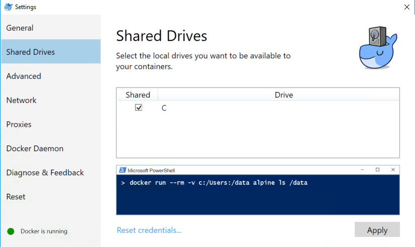
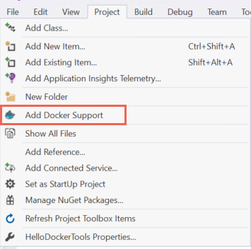
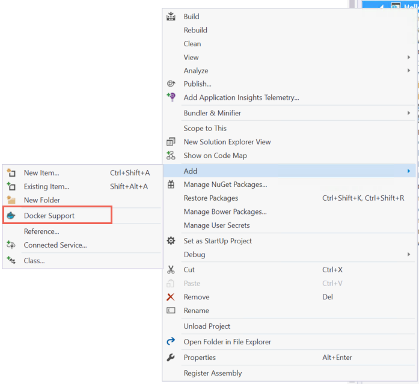

# Visual Studio Tools for Docker

[Microsoft Visual Studio 2017](https://www.visualstudio.com/) with [Docker for Windows](https://docs.docker.com/docker-for-windows/install/) supports building, debugging, and running .NET Framework and .NET Core web and console applications using Windows and Linux containers.

## Prerequisites

- [Microsoft Visual Studio 2017](https://www.visualstudio.com/) with .NET Core workload
- [Docker for Windows](https://docs.docker.com/docker-for-windows/install/)

## Installation and setup

Install [Microsoft Visual Studio 2017](https://docs.microsoft.com/visualstudio/install/install-visual-studio) with the .NET Core workload.

For Docker installation, review the information at [Docker for Windows: What to know before you install](https://docs.docker.com/docker-for-windows/install/#what-to-know-before-you-install) and install [Docker For Windows](https://docs.docker.com/docker-for-windows/install/).

A required configuration is to setup **[Shared Drives](https://docs.docker.com/docker-for-windows/#shared-drives)** in Docker for Windows. The setting is required for the volume mapping and debugging support.

Right-click the Docker icon in the System Tray, click **Settings**, and select **Shared Drives**. Select the drive where Docker will store your files and apply changes.



## Create an ASP.NET Web Application and add Docker Support

Using Visual Studio, create a new ASP.NET Core Web Application. When the application is loaded, either select **Add Docker Support** from the **Project Menu** or right-click the project from the Solution Explorer and select **Add** > **Docker Support**.

*Project Menu*



*Project Context Menu*



When you add Docker support to your project, you can choose either Windows or Linux containers. (The Docker host must be running the same container type. If you need change the container type in the running Docker instance, right-click the **Docker** icon in the System Tray, and choose **Switch to Windows containers** or **Switch to Linux containers**.) 

The following files are added to the project:

- **Dockerfile**: the Docker file for ASP.NET Core applications is based on the [microsoft/aspnetcore](https://hub.docker.com/r/microsoft/aspnetcore) image. This image includes the ASP.NET Core NuGet packages, which have been pre-jitted improving startup performance. When building .NET Core Console Applications, the Dockerfile FROM will reference the most recent [microsoft/dotnet](https://hub.docker.com/r/microsoft/dotnet) image.   
- **docker-compose.yml**: base Docker Compose file used to define the collection of images to be built and run with docker-compose build/run.   
- **docker-compose.dev.debug.yml**: additional docker-compose file with for iterative changes when your configuration is set to debug. Visual Studio will call -f docker-compose.yml -f docker-compose.dev.debug.yml to merge these together. This compose file is used by Visual Studio development tools.   
- **docker-compose.dev.release.yml**: additional Docker Compose file to debug your release definition. It will volume mount the debugger so it doesn't change the contents of the production image.  

The *docker-compose.yml* file contains the name of the image that is created when project is run. 

```
version '2'

services:
  hellodockertools:
    image:  user/hellodockertools${TAG}
    build:
      context: .
      dockerfile: Dockerfile
    ports:
      - "80"
``` 

In this example, `image: user/hellodockertools${TAG}` generates the image `user/hellodockertools:dev` when the application is run in **Debug** mode and `user/hellodockertools:latest` in **Release** mode respectively. 

You will want to change the `user` to your [Docker Hub](https://hub.docker.com/) username if you plan to push the image to the registry. For example, `spboyer/hellodockertools`, or change to your private registry URL `privateregistry.domain.com/` depending on your configuration.

### Debugging

Select **Docker** from the debug drop-down in the toolbar and use F5 to start debugging the application. 

- The *microsoft/aspnetcore* image is acquired (if not already in your cache)
- *ASPNETCORE_ENVIRONMENT* is set to Development within the container
- PORT 80 is EXPOSED and mapped to a dynamically assigned port for localhost. The port is determined by the docker host and can be queried with docker ps. 
- Your application is copied to the container
- Default browser is launched with the debugger attached to the container, using the dynamically assigned port. 

The resulting Docker image built is the *dev* image of your application with the *microsoft/aspnetcore* images as the base image.

**Note:** The dev image is empty of your app contents as Debug configurations use volume mounting to provide the iterative experience. To push an image, use the Release configuration.

```console
REPOSITORY                  TAG         IMAGE ID            CREATED         SIZE
spboyer/hellodockertools    dev         0b6e2e44b3df        4 minutes ago   268.9 MB
microsoft/aspnetcore        1.0.1       189ad4312ce7        5 days ago      268.9 MB
```

The application is running using the container, which you can see by running the `docker ps` command.

```console
CONTAINER ID        IMAGE                          COMMAND               CREATED             STATUS              PORTS                   NAMES
3f240cf686c9        spboyer/hellodockertools:dev   "tail -f /dev/null"   4 minutes ago       Up 4 minutes        0.0.0.0:32769->80/tcp   hellodockertools_hellodockertools_1
```

### Edit and Continue

Changes to static files and/or razor template files (*.cshtml*) are automatically updated without the need of a compilation step. Make the change, save, and tap refresh in the browser to view the update.  

Modifications to code files require compiling and a restart of Kestrel within the container. After making the change, use CTRL + F5 to perform the process and start the application within the container. The Docker container is not rebuilt or stopped; using `docker ps` in the command line, you can see that the original container is still running as of 10 minutes ago. 

```console
CONTAINER ID        IMAGE                          COMMAND               CREATED             STATUS              PORTS                   NAMES
3f240cf686c9        spboyer/hellodockertools:dev   "tail -f /dev/null"   10 minutes ago      Up 10 minutes       0.0.0.0:32769->80/tcp   hellodockertools_hellodockertools_1
```

### Publishing Docker images

Once you have completed the develop and debug cycle of your application, the Visual Studio Tools for Docker will help you create the production image of your application. Change the debug dropdown to **Release** and build the application. The tooling will produce the image with the `:latest` tag which you can push to your private registry or Docker Hub. 

Using the `docker images` command, you can see the list of images.

```console
REPOSITORY                 TAG                 IMAGE ID            CREATED             SIZE
spboyer/hellodockertools   latest              8184ae38ba91        5 seconds ago       278.4 MB
spboyer/hellodockertools   dev                 0b6e2e44b3df        About an hour ago   268.9 MB
microsoft/aspnetcore       1.0.1               189ad4312ce7        5 days ago          268.9 MB
```

There may be an expectation for the production or release image to be smaller in size by comparison to the **dev** image; however, through the use of the volume mapping, the debugger and application were actually being run from your local machine and not within the container. The **latest** image has packaged the entire application code needed to run the application on a host machine, therefore the delta is the size of your application code.
