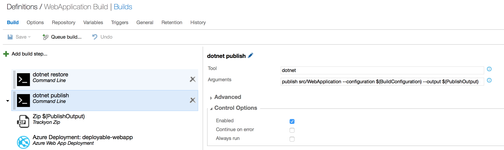
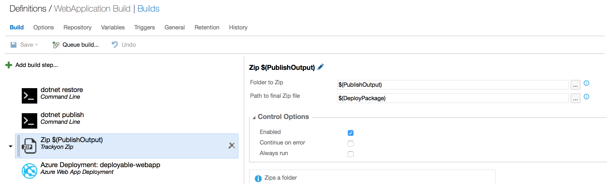
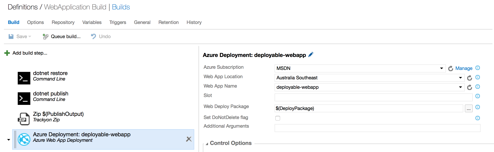

# Use VSTS to Build and Publish to an Azure Web App with Continuous Deployment

By [Damien Pontifex](https://github.com/DamienPontifex)

This tutorial shows you how to create an ASP.NET Core web app using Visual Studio and deploy it from Visual Studio to Azure App Service using continuous deployment.
   
> [!NOTE]
> To complete this tutorial, you need a Microsoft Azure account. If you don't have an account, you can [activate your MSDN subscriber benefits](http://azure.microsoft.com/pricing/member-offers/msdn-benefits-details/?WT.mc_id=A261C142F) or [sign up for a free trial](http://azure.microsoft.com/pricing/free-trial/?WT.mc_id=A261C142F). You will also need a Visual Studio Team Services account. If you don't have an account, you can [sign up for free](https://www.visualstudio.com/products/visual-studio-team-services-vs).

## Prerequisites

This tutorial assumes you already have the following:

* [ASP.NET Core](https://www.microsoft.com/net/core) (runtime and tooling). Hosted Build Pool servers in VSTS already have RC2 tooling installed.

* [Git](http://git-scm.com/downloads)

* The [Trackyon Advantage](https://marketplace.visualstudio.com/items?itemName=Trackyon.trackyonadvantage) extension installed into your team services account. This adds an available zip task for later steps.

## Setup VSTS Build

1.  Setup some build variables to make later steps clearer and easier to retain consistent paths across build steps.

    Create a variable for **PublishOutput** and set it to your desired path. We have used `$(Build.StagingDirectory)/WebApplication`

    Create a variable for **DeployPackage** and set it to the path you would like the zipped web package to be at. We have used `$(Build.StagingDirectory)/WebApplication.zip` to have it alongside our published output.

    

    > [!NOTE]
    > If you are using hosted build agents to build your ASP.NET Core application, the host will try to cache packages. As the hosted servers won't retain the cache, you can skip this step and reduce restore times by adding another variable here:  
   
    *  Name: `DOTNET_SKIP_FIRST_TIME_EXPERIENCE`  
    *  Value: `true`  

2.  Use a Command Line build step to restore packages.

    * Click **Add build step...** and choose **Utility** > **Command Line** > **Add**

    * Set the arguments for the build step as:

        * Tool: `dotnet`

        * Arguments: `restore`

    

3.  Use another Command Line build step to publish the project.

    * Click **Add build step...** and choose **Utility** > **Command Line** > **Add**

    * Set the arguments for the build step as:

        * Tool: `dotnet`

        * Arguments: `publish src/WebApplication --configuration $(BuildConfiguration) --output $(PublishOutput)`

    * Replace src/WebApplication to the path of your app to be deployed as appropriate

    

4.  Compress the published output so it can be deployed to Azure App Service. We will use the [Trackyon Advantage](https://marketplace.visualstudio.com/items?itemName=Trackyon.trackyonadvantage) task we installed to zip the contents of our published output for deployment.

    * Click **Add build step...** and choose **Utility** > **Trackyon Zip** > **Add**

    * Set the arguments for the zip build step as:

        * Folder to Zip: `$(PublishOutput)`

        * Path to final Zip file: `$(DeployPackage)`

    

5.  Use the Azure Web App Deployment build step to publish the compressed publish output to your Azure Web App. The Web Deploy Package will be the output of the contents compressed in step 4. In this case, we re-use the variable for it's path we setup earlier.

    * Click **Add build step...** and choose **Deploy** > **Azure Web App Deployment** > **Add**

    * Set the arguments for the deployment step as:

        * Azure Subscription: *<your configured azure connection>*

        * Web App Location: *<desired region>*

        * Web App Name: *<desired app service name>*

        * Web Deploy Package: `$(DeployPackage)`

## Use VSTS Release

See [Use VSTS to Build and Publish to an Azure Web App with Continuous Deployment](https://www.visualstudio.com/en-us/docs/build/get-started/aspnet-4-ci-cd-azure-automatic), which shows how to configure a continuous delivery (CD) workflow for [Azure App Service](https://azure.microsoft.com/en-us/documentation/articles/app-service-changes-existing-services/) using Visual Studio Team Services. Azure Continuous Delivery in Team Services simplifies setting up a robust deployment pipeline to publish updates for your app to Azure App Service. The pipeline can be configured from the Azure portal to build, run tests, deploy to a staging slot,  and then deploy to production.

VSTS Release management can alternatively be used to manage the release pipeline from the VSTS build. We require a small change to the build pipeline and setup of the release process.

1.  If configured, remove the Azure Web App Deployment step from the VSTS build setup in the previous section.

2.  Add a Copy and Publish Build Artifacts step to the build pipeline

    *  Click **Add build step...** and choose **Utility** > **Copy and Publish Build Artifacts** > **Add**

    *  Set the arguments for the copy and publish step as:

        *  Contents: `$(DeployPackage)`

        *  Artifact Name: `DeployPackage`

        *  Artifact Type: `Server`

3.  You will be able to create a release definition and link to the Build definition and utilise the artifacts copied from step 2 here for publishing.

## Additional Resources

* [Publishing and Deployment](index.md)

* [Team Services Build](https://www.visualstudio.com/docs/build/overview)

* [Team Services Release](https://www.visualstudio.com/en-us/docs/release/overview)
