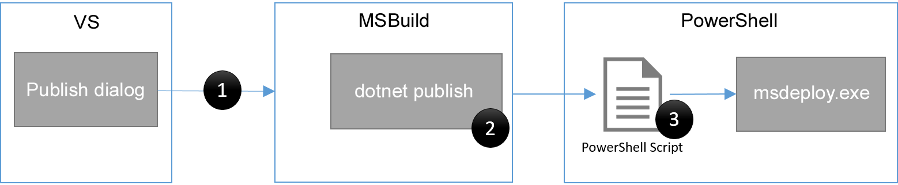

---
title: How Web Publishing In Visual Studio Works | Microsoft Docs
author: rick-anderson
description: 
keywords: ASP.NET Core,
ms.author: riande
manager: wpickett
ms.date: 10/14/2016
ms.topic: article
ms.assetid: 0377a02d-8fda-47a5-929a-24a16e1d2c93
ms.technology: aspnet
ms.prod: aspnet-core
uid: publishing/web-publishing-vs
---
# How Web Publishing In Visual Studio Works

By [Sayed Ibrahim Hashimi](https://github.com/sayedihashimi)

The web publish experience for ASP.NET Core projects has significantly changed from ASP.NET 4. This doc will provide an overview of the changes and instructions on how to customize the publish process. Unless stated otherwise, the instructions in this article are for publishing from Visual Studio. For an overview of how to publish a web app on ASP.NET Core see [Publishing and Deployment](index.md).

In ASP.NET when you publish a Visual Studio web project MSBuild is used to drive the entire process. The project file (.csproj or .vbproj) is used to gather the files that need to be published as well as perform any updates during publish (for example updating web.config). The project file contains the full list of files as well as their type. That information is used to determine the files to publish. The logic was implemented in an MSBuild .targets file. During the publish process MSBuild will call Web Deploy (msdeploy.exe) to transfer the files to the final location. To customize the publish process you would need to update the publish profile, or project file, with custom MSBuild elements.

In ASP.NET Core the publish process has been simplified, we no longer store a reference to files that the project contains. All files are included in the project by default (files can be excluded from the project or from publish by updating *project.json*). When you publish an ASP.NET Core project from Visual Studio the following happens:

   1. A publish profile is created at `Properties\PublishProfiles\profilename.pubxml`. The publish profile is an MSBuild file.

   2. A PowerShell script is created at `Properties\PublishProfiles\profilename.ps1`.

   3. `dotnet publish` is called to gather the files to publish to a temporary folder.

   4. A PowerShell script is called passing in the properties from the publish profile and the location where `dotnet publish` has placed the files to publish.

To create a publish profile in Visual Studio, right click on the project in Solution Explorer and then select Publish.

The following image shows a visualization of this process.



In the image above each black circle ● indicates an extension point, we will cover each extension point later in this document.

When you start a publish operation, the publish dialog is closed and then MSBuild is called to start the process. Visual Studio calls MSBuild to do this so that you can have parity with publishing when using Visual Studio or the command line. The MSBuild layer is pretty thin, for the most part it just calls `dotnet publish`. Let’s take a closer look at `dotnet publish`.

The `dotnet publish` command will inspect project.json and the project folder to determine the files which need to be published. It will place the files needed to run the application in a single folder ready to be transferred to the final destination.

After `dotnet publish` has completed, the PowerShell script for the publish profile is called. Now that we have briefly discussed how publishing works at a high level let’s take a look at the structure of the PowerShell script created for publishing.

When you create a publish profile in Visual Studio for an ASP.NET Core project a PowerShell script is created that has the following structure.

```powershell
[cmdletbinding(SupportsShouldProcess=$true)]
   param($publishProperties=@{}, $packOutput,$pubProfilePath, $nugetUrl)

   $publishModuleVersion = '1.0.2-beta2'

   # functions to bootstrap the process when Visual Studio is not installed
   # have been removed to simplify this doc

   try{
       if (!(Enable-PublishModule)){
           Enable-PackageDownloader
           Enable-NuGetModule -name 'publish-module' -version $publishModuleVersion -nugetUrl $nugetUrl
       }

       'Calling Publish-AspNet' | Write-Verbose
       # call Publish-AspNet to perform the publish operation
       Publish-AspNet -publishProperties $publishProperties -packOutput $packOutput -pubProfilePath $pubProfilePath
   }
   catch{
       "An error occurred during publish.n{0}" -f $_.Exception.Message | Write-Error
   }
   ```

In the above snippet some functions have been removed for readability. Those functions are used to bootstrap the script in the case that it’s executed from a machine which doesn’t have Visual Studio installed. The script contains the following important elements:

   1. Script parameters
   2. Publish module version
   3. Call to Publish-AspNet

The parameters of the script define the contract between Visual Studio and the PowerShell script. You should not change the declared parameters because Visual Studio depends on those. You can add additional parameters, but they must be added at the end.

The publish module version, denoted by `$publishModuleVersion`, defines the version of the web publish module that will be used. Valid version numbers can be found from published versions of the [publish-module NuGet package](https://www.nuget.org/packages/publish-module) on nuget.org. Once you create a publish profile the script definition is locked to a particular version of the publish-module package. If you need to update the version of the script you can delete the .ps1 file and then publish again in Visual Studio to get a new script created.

The call to Publish-AspNet moves the files from your local machine to the final destination. Publish-AspNet will be passed all the properties defined in the .pubxml file, even custom properties. For Web Deploy publish, msdeploy.exe will be called to publish the files to the destination. Publish-AspNet is passed the same parameters as the original script. You can get more info on the parameters for Publish-AspNet use Get-Help Publish-AspNet. If you get an error that the publish-module is not loaded, you can load it with

```none
Import-Module “${env:ProgramFiles(x86)}\Microsoft Visual Studio 14.0\Common7\IDE\Extensions\Microsoft\Web Tools\Publish\Scripts\1.0.1\publish-module.psm1"
   ```

from a machine which has Visual Studio installed. Now let’s move on to discuss how to customize the publish process.

How to customize publishing In the previous section we saw the visualization of the publish process. The image is shown again to make this easier to follow.


The image above shows the three main extension points, you’re most likely to use is #3.

1.  Customize the call to `dotnet publish`

    Most developers will not need to customize this extension point. Visual Studio starts the publish process by calling an MSBuild target. This target will take care of initializing the environment and calling `dotnet publish` to layout the files. If you need to customize that call in a way that is not enabled by the publish dialog then you can use MSBuild elements in either the project file (.xproj file) or the publish profile (.pubxml file). We won’t get into details of how to do that here as it’s an advanced scenario that few will need to extend.

2.  Customize `dotnet publish`

    As stated previously `dotnet publish` is a command-line utility that can be used to help publish your ASP.NET Core application. This is a cross platform command-line utility (that is, you can use it on Windows, Mac or Linux) and does not require Visual Studio. If you are working on a team in which some developers are not using Visual Studio, then you may want to script building and publishing. When `dotnet publish` is executed it can be configured to execute custom commands before or after execution. The commands will be listed in project.json in the scripts section.
    
    The supported scripts for publish are prepublish and postpublish. The ASP.NET Core Web Application template uses the prepublish step by default. The relevant snippet from *project.json* is shown below.
    
    ```javascript
    "scripts": {
      "prepublish": [ "npm install", "bower install", "gulp clean", "gulp min" ]
    }
    ```
    
    Here multiple comma separated calls are declared.
    
    When Visual Studio is used the prepublish and postpublish steps are executed as a part of the call to `dotnet publish`. The postpublish script from *project.json* is executed before the files are published to the remote destination because that takes place immediately after `dotnet publish` completes.  In the next step we cover customizing the PowerShell script to control what happens to the files after they reach the target destination.

3.  Customize the publish profile PowerShell Script

After creating a publish profile in Visual Studio the PowerShell script `Properties\PublishProfiles\ProfileName.ps1` is created. The script does the following:

   1. Runs  `dotnet publish`, which will package the web project into a temporary folder to prepare it for the next phase of publishing.

   2. The profile PowerShell script is directly invoked. The publish properties and the path to the temporary folder are passed in as parameters. Note, the temporary folder will be deleted on each publish.

As mentioned previously the most important line in the default publish script is the call to `Publish-AspNet`. The call to Publish-AspNet:

   * Takes the contents of the folder at $packOutput, which contains the results of `dotnet publish`, and publishes it to the destination.

   * The publish properties are passed in the script parameter `$publishProperties`.

   * `$publishProperties` is a PowerShell hashtable which contains all the properties declared in the profile .pubxml file. It also includes values for file text replacements or files to exclude. For more info on the values for `$publishProperties` use `Get-Help publish-aspnet –Examples`.

To customize this process, you can edit the PowerShell script directly. To perform an action before publish starts, add the action before the call to `Publish-AspNet`. To have an action performed after publish, add the appropriate calls after Publish-AspNet. When Publish-AspNet is called the contents of the $packOutput directory are published to the destination. For example, if you need add a file to the publish process, just copy it to the correct location in `$packOutput` before `Publish-AspNet` is called. The snippet below shows how to do that.

```powershell
# copy files from image repo to the wwwroot\external-images folder
   $externalImagesSourcePath = 'C:\resources\external-images'
   $externalImagesDestPath = (Join-Path "$packOutput\wwwroot" 'external-images')
   if(-not (Test-Path $externalImagesDestPath)){
     New-Item -Path $externalImagesDestPath -ItemType Directory
   }

   Get-ChildItem $externalImagesSourcePath -File | Copy-Item -Destination $externalImagesDestPath

   'Calling Publish-AspNet' | Write-Verbose
   # call Publish-AspNet to perform the publish operation
   Publish-AspNet -publishProperties $publishProperties -packOutput $packOutput -pubProfilePath $pubProfilePath
   ```

In this snippet external images are copied from `c:\resources\external-images to $packOutput\wwwroot\external-images`. Before starting the copy operation the script ensures that the destination folder exists. Since the copy operation takes place before the call to `Publish-AspNet` the new files will be included in the published content. To perform actions after the files have reached the destination then you can place those commands after the call to `Publish-AspNet`.

You are free to customize, or even completely replace, the Publish-AspNet script provided. As previously mentioned, you will need to preserve the parameter declaration, but the rest is up to you.
